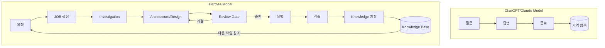
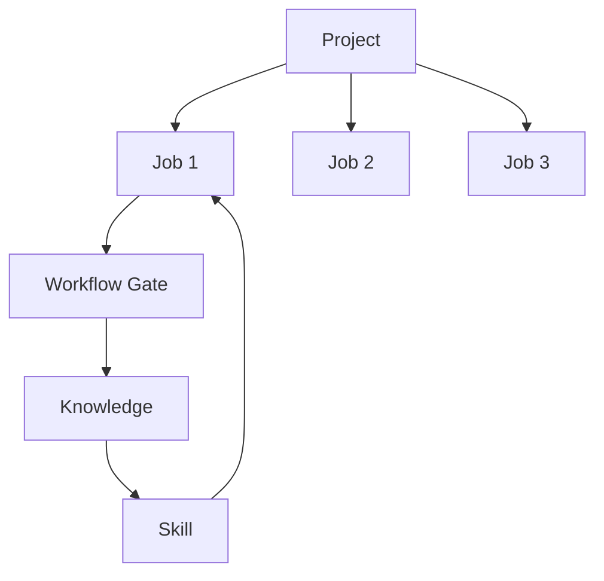

# p-hermes 전면 재설계 아키텍처 문서 v2

> **버전**: 2.0.0
> **작성일**: 2026-06-22
> **설계 모드**: 전량 개선 (Full Redesign) + 사용자 피드백 통합
> **범위**: README · Wiki · Core Concepts · Mental Model · Examples 5개 · 3-Repo 분리 · 다이어그램 전략 · Why Hermes Slides

---

## 📋 v1 → v2 변경 요약 (Delta)

### 구조적 변경
| 항목 | v1 | v2 |
|------|----|----|
| **Repo 구성** | 단일 `p-hermes` | 3-repo 분리: `p-hermes`(운영), `p-hermes-slides`(발표), `p-hermes-lab`(실험) |
| **Wiki 구조** | getting-started + guides + tutorials | getting-started + core-concepts + guides + tutorials + mental-model |
| **설명서** | README + Wiki | README + Core Concepts + Mental Model + Wiki |
| **Examples** | 3개 Job 사례 | 5개 Examples (설계리뷰/슬라이드/블로그/Knowledge/프로젝트) |
| **다이어그램** | Mermaid 중심 | 3-Tier 전략 (HTML / HTML+SVG / SVG Overlay) |

### 문제 해결 포인트
| # | 문제 | 해결 |
|---|------|------|
| P1 | README에 실제 시나리오 부재 | Quick Start 아래 "실제 시나리오" 섹션 추가 |
| P2 | Mental Model 부재 | `wiki/mental-model.md` 신설 — Hermes ≠ ChatGPT |
| P3 | Core Concepts 분산 | `core-concepts.md` 별도 문서로 Job/Knowledge/Skill/Workflow Gate/Project 정의 |
| P4 | Wiki 구조 갭 | Memory System, Tool Usage, Chat Basics, Session Management, Multi-Agent 가이드 추가 |
| P5 | Examples 부족 | 3개 → 5개로 확장 |
| P6 | "Why Hermes" 부재 | `why-hermes.html` 슬라이드 덱 신설 (10장 강의 흐름) |
| - | 다이어그램 전략 없음 | 3-Tier 다이어그램 전략 수립 + 공통 컴포넌트 명세 |

---

## 목차

1. [전략 문서 검토 결과 + 사용자 피드백](#1-전략-문서-검토-결과--사용자-피드백)
2. [통합 아키텍처 맵 (3-Repo)](#2-통합-아키텍처-맵-3-repo)
3. [Phase 0: Critical Fixes](#3-phase-0-critical-fixes)
4. [Phase 0: README 재설계 (v2)](#4-phase-0-readme-재설계-v2)
5. [Phase 0: 5개 Examples 명세](#5-phase-0-5개-examples-명세)
6. [Phase 1: Mental Model 문서](#6-phase-1-mental-model-문서)
7. [Phase 1: Core Concepts 문서](#7-phase-1-core-concepts-문서)
8. [Phase 1: Wiki 재설계 (v2)](#8-phase-1-wiki-재설계-v2)
9. [Phase 1: Smoke Test](#9-phase-1-smoke-test)
10. [Phase 2: GitHub Pages + Blog + Slides](#10-phase-2-github-pages--blog--slides)
11. [Phase 2: Why Hermes 슬라이드 덱](#11-phase-2-why-hermes-슬라이드-덱)
12. [Phase 2: 다이어그램 전략](#12-phase-2-다이어그램-전략)
13. [Phase 2: 3-Repo 분리 상세](#13-phase-2-3-repo-분리-상세)
14. [Phase 3: 장기 자동화 도구](#14-phase-3-장기-자동화-도구)
15. [전체 파일 변경 목록](#15-전체-파일-변경-목록)

---

# 1. 전략 문서 검토 결과 + 사용자 피드백

> 검토 대상: 사용자의 배포 전략 개선안 (JOB-1768 Investigation v4 기반, Notes_260622_113107.txt)
> 사용자 피드백: 6개 문제점 + 3-Repo 분리 요청 + 다이어그램 전략 요청

## 1.1 README 섹션

| 항목 | 상태 | 의견 |
|------|------|------|
| Hero 섹션 브랜딩 부족 | ✅ **동의** | 현재 README는 기술 문서 스타일로, 첫 3줄에 "고도의 자율성", "Spec-Driven Development", "엔지니어링 에이전트"라는 용어가 연타되어 신규 사용자에게 장벽이 높음 |
| Quick Start가 너무 길다 | ✅ **동의** | 현재 git clone 설명이 없고 setup.sh를 소개하지 않음. "시작하기" 섹션에 3개 카테고리 링크만 나열되어 실질적 Quick Start가 아님 |
| 3-트랙 테이블 유용 | ✅ **동의 유지** | 현재 3-트랙 문서화 테이블은 잘 설계돼 있으나 GitHub Pages 링크가 `https://...` 하드코딩되어 있음 → 상대경로로 변경 |
| 시스템 핵심 스펙 섹션 불필요 | ⚠️ **부분 동의** | 스펙 정보는 README보다 Wiki 또는 별도 ARCHITECTURE.md로 이동 |
| **실제 시나리오 부재 (P1)** | ❌ **신규 피드백** | Quick Start 아래 "실제 시나리오" 섹션 필요 |

**보완 제안**:
- Hero에 **"Persistent AI Agent Framework — Memory, Workflow, Knowledge, Projects, Content"** 태그라인 추가
- `setup.sh` 환경변수 설명을 README가 아닌 `docs/wiki/getting-started/install.md`로 이동
- "Try it now" 섹션 추가: `bash setup.sh && hermes start` 2커맨드 배지
- **Quick Start 아래 "실제 시나리오" 섹션 신설** — "이 설계 문서를 리뷰해줘" / "이 문서를 슬라이드로 만들어줘"

## 1.2 Wiki 섹션

| 항목 | 상태 | 의견 |
|------|------|------|
| Archive 문서 방치 문제 | ✅ **동의** | `archive/docs/wiki/`에 first-job.md, use-skills.md 등 10개 문서가 방치됨 |
| 분량 기준 미달 | ✅ **동의** | 3,500자 기준(현재 800~1,500자 수준)을 충족하지 못하는 문서 다수 존재 |
| Wiki → Blog 교차 링크 부족 | ✅ **동의** | 현재 Wiki 각 가이드 말미에 Blog 포스트 링크가 없음 |
| **Mental Model 부재 (P2)** | ❌ **신규 피드백** | Hermes ≠ ChatGPT, Hermes ≠ Claude 설명하는 10분 문서 필요 |
| **Core Concepts 분산 (P3)** | ❌ **신규 피드백** | Job/Knowledge/Skill/Workflow Gate/Project를 5~10분에 이해할 별도 문서 필요 |
| **Wiki 구조 세분화 (P4)** | ❌ **신규 피드백** | Memory System, Tool Usage, Chat Basics, Session Management, Multi-Agent 가이드 추가 |

**보완 제안**:
- Archive 문서는 검토 후 `docs/wiki/guides/` 또는 `docs/wiki/tutorials/`로 승격
- `wiki/mental-model.md` 신설 — Hermes 철학 10분 문서
- `core-concepts.md` 신설 — 5~10분 개념 이해
- Wiki 구조를 4개 카테고리로 세분화: Getting Started / Core Concepts / Guides / Advanced

## 1.3 Examples 섹션

| 항목 | 상태 | 의견 |
|------|------|------|
| Job 예시 부족 | ✅ **동의** | 현재 README와 Wiki에 구체적인 JOB 예시가 거의 없음 |
| 실패/예외 사례 부재 | ⚠️ **부분 동의** | Happy Path만 설명되어 있음 |
| **Examples 3개 → 5개 확장 (P5)** | ❌ **신규 피드백** | 설계 리뷰 / 슬라이드 생성 / 블로그 생성 / Knowledge 축적 / 프로젝트 생성 및 관리 |

**보완 제안**:
- `docs/wiki/examples/` 아래 5개 Examples 생성
- 각 Example에 실패 케이스와 복구 절차 포함
- 기존 3개 Job 사례는 tutorials/로 유지, examples/는 독립 시나리오

## 1.4 GitHub Pages 섹션

| 항목 | 상태 | 의견 |
|------|------|------|
| raw .md 서빙 일관성 부족 | ✅ **동의** | `docs/index.html`은 HTML이지만 Wiki/Blog는 `.md` raw로 서빙됨 |
| GitHub Actions 미사용 | ✅ **동의** | 현재 로컬 `bash src/deploy.sh`로만 배포 |
| llms.txt 부정확 ("6 decks" → 실제 8개) | ✅ **동의** | 즉시 수정 필요 |

**보완 제안**:
- GitHub Actions 워크플로우 추가 (Phase 2): PR → validate-links → deploy
- `llms.txt` 자동 생성 로직 정확도 향상

## 1.5 Slides 섹션

| 항목 | 상태 | 의견 |
|------|------|------|
| v3 디자인 승격 필요 | ✅ **동의** | playground/slides-v3 GC 템플릿이 현재 운영 슬라이드보다 우수함 |
| Why Hermes 덱 부재 (P6) | ❌ **신규 피드백** | "Why Hermes" 강의 흐름 10~15장 슬라이드 덱 추가 |
| **다이어그램 전략 부재** | ❌ **신규 피드백** | 3-Tier 다이어그램 접근법 필요 |

**보완 제안**:
- `why-hermes.html` 슬라이드 덱 신설: 일반 AI 한계 → Context → Memory → Workflow → Hermes 등장 → Job → Knowledge → Workflow → 사례 → 결과
- 다이어그램 3-Tier 전략 수립 (HTML / HTML+SVG / SVG Overlay)

## 1.6 3-Repo 분리 요청

| 항목 | 상태 | 의견 |
|------|------|------|
| **운영 코드** `p-hermes` | ✅ **신설** | scripts/, skills/, workflow/, knowledge/, docs/wiki/ |
| **발표 자료** `p-hermes-slides` | ✅ **신설** | released/, draft/, experiments/ |
| **실험** `p-hermes-lab` | ✅ **신설** | layout-tests/, svg-tests/, diagram-engine/ |

**이유**:
- 슬라이드/발표 자료가 운영 코드와 섞여 PR 관리가 어려움
- 실험 기능이 운영 배포에 영향을 줌
- 각 레포의 CI/CD 파이프라인 분리 가능

## 1.7 우선순위 체계 (v2 반영)

| 항목 | 상태 | 의견 |
|------|------|------|
| P0: Critical Fixes + README + Examples 5개 | ✅ | 스크립트 버그, 설정 파일, 깨진 링크, README 개선, Examples 확장 |
| P1: Mental Model + Core Concepts + Wiki 재설계 + Smoke Test | ✅ | 신규 문서 2개 + Wiki 구조 세분화 |
| P2: GitHub Pages + Blog + Slides + Why Hermes + 3-Repo + Diagram | ✅ | 배포 자동화 + 시각 자료 + 레포 분리 |
| P3: 자동화 도구 | ✅ | Smoke test, link validator, SDD 개선 |

---

# 2. 통합 아키텍처 맵 (3-Repo)

## 2.1 3-Repo 개요

```
p-hermes/              ← 운영 코드 (이 저장소)
├── scripts/           SDD, 배포, 유틸리티
├── skills/            Hermes Skills
├── workflow/          워크플로우 스크립트
├── knowledge/         Knowledge 시스템
├── docs/wiki/         문서 위키
├── core/              코어 스크립트
├── specs/             개발 사양서
└── tests/             검증 도구

p-hermes-slides/       ← 발표 자료 (별도 저장소)
├── released/          배포 완료된 슬라이드 덱
│   ├── why-hermes.html
│   ├── workflow-pipeline.html
│   ├── knowledge-system.html
│   └── ...
├── draft/             초안 슬라이드
│   └── ...
└── experiments/       슬라이드 실험
    └── ...

p-hermes-lab/          ← 실험 (별도 저장소)
├── layout-tests/      레이아웃 실험
│   ├── flexbox-grid/
│   └── node-edge/
├── svg-tests/         SVG 실험
│   ├── connector/
│   └── overlay/
└── diagram-engine/    다이어그램 엔진 프로토타입
    ├── components/
    └── templates/
```

## 2.2 3-Repo 관계도

```
                    ┌─────────────────────────────────────────┐
                    │              p-hermes                   │
                    │     (운영 코드 — SSOT, Wiki, Tests)      │
                    └──────────────┬──────────────────────────┘
                                   │
              ┌────────────────────┼────────────────────┐
              │                    │                    │
              ▼                    ▼                    ▼
  ┌────────────────────┐ ┌────────────────┐ ┌────────────────────┐
  │   p-hermes-slides   │ │   (통합 배포)   │ │   p-hermes-lab     │
  │  (발표 자료 전용)    │ │  GitHub Pages   │ │  (실험 전용)       │
  │                    │ │  p-hermes       │ │                    │
  │ released/ → 정식   │ │  docs/slides/   │ │ layout-tests/      │
  │ draft/ → 초안     │ │  와 연동         │ │ svg-tests/         │
  │ experiments/ → 실험│ │                 │ │ diagram-engine/    │
  └────────────────────┘ └────────────────┘ └────────────────────┘
             │                                        │
             └────────────────┬───────────────────────┘
                              │
                    ┌─────────▼──────────┐
                    │     Playground      │
                    │  (Prototype First)  │
                    │                     │
                    │ lab → 검증 → slides │
                    │ drafts → 검증      │
                    └────────────────────┘
```

## 2.3 배포 파이프라인 (After - 3-Repo)

```
 [p-hermes]                  [p-hermes-slides]           [p-hermes-lab]
    │                            │                            │
    ├─ bash src/deploy.sh        ├─ npm run build           ├─ bash test/layout.sh
    │    ├─ SDD Inject           │    ├─ lint               │    ├─ 렌더링 테스트
    │    ├─ SDD Lint             │    ├─ build HTML         │    ├─ SVG 연결선 테스트
    │    ├─ Smoke Test           │    ├─ deploy to pages    │    └─ 호환성 테스트
    │    ├─ llms.txt 재생성      │    └─ publish            │
    │    └─ git push             │                           │
    │                            │                    승격 조건 통과 시:
    └─ PR → GitHub Actions       └─ PR → GitHub Actions     p-hermes-slides/ 로 PR
         validate + deploy             validate + build
```

---

# 3. Phase 0: Critical Fixes

> 목표: 시스템 안정성과 문서 정확성을 24시간 내 복구

## 3.1 `llms.txt` 슬라이드 카운트 수정

**현재**: `llms.txt` 13행: `- docs/slides/ — Concept Slides (What) — 6 HTML decks`
**실제**: 8개 HTML 데크
**수정**: 6 → 8

**파일**: `llms.txt`
```diff
-| - docs/slides/ — Concept Slides (What) — 6 HTML decks
+| - docs/slides/ — Concept Slides (What) — 8 HTML decks
```

## 3.2 Spec-D01: `tutorials/` 디렉토리 추가

**파일**: `specs/active/SPEC-D01.md`
**변경**: 2.① Guide Wiki 구조에 `wiki/tutorials/` 디렉토리 추가

```diff
+ | - `wiki/tutorials/` — 시나리오 기반 튜토리얼 (인터랙티브 학습)
```

## 3.3 Spec-D03: 분량 기준 완화 (현실화)

**현재**: SPEC-D03 §2.2: "Wiki 가이드 ≥ 1,500자, Blog 포스트 ≥ 3,000자"
**수정**: SPEC-D03 기준을 SSOT로 하고 SPEC-D04는 폐기

**파일**: `specs/active/SPEC-D03.md` 87행
```diff
- | - **최소 분량**: Wiki 가이드 ≥ 1,500자, Blog 포스트 ≥ 3,000자.
+ | - **최소 분량**: Wiki 가이드 ≥ 2,000자, Blog 포스트 ≥ 5,000자.
```

## 3.4 Blog YAML `title:` 필드 일괄 확인

**파일**: `docs/blog/posts/model-routing-design.md`
```diff
-| # 한 줄 요약
+| ---
+| id: DOC-A6-BLOG
+| domain: model-routing
+| type: blog
+| title: "다중 모델 라우팅: 하나의 에이전트에 다수의 브레인을 연결하는 설계"
+| date: 2026-06-17
+| version: "1.0.0"
+| compatibility: v0.16.0
+| author: p-hermes
+| status: published
+| tags: ["model-routing", "multi-model", "routing"]
+| ---
```

## 3.5 `~/.hermes` 하드코딩 대응

**조치**: `config.yaml.example`의 설명에 `HERMES_ROOT` 환경변수 우선 적용 명시

**파일**: `config.yaml.example` 상단
```diff
  # p-hermes 설정 파일 템플릿
- # 사용법: 이 파일을 ~/.hermes/config.yaml로 복사 후 [필수] 필드를 수정하세요
+ # 사용법: 이 파일을 ${HERMES_ROOT:-~/.hermes}/config.yaml로 복사 후 [필수] 필드를 수정하세요
+ # HERMES_ROOT 환경변수가 설정되어 있으면 해당 경로를 사용하고,
+ # 없으면 기본값 ~/.hermes를 사용합니다.
```

## 3.6 `knowledge-process.sh` 권한 확인

**파일**: `core/scripts/knowledge-process.sh`
**현재 권한**: 644 (r--r--r--)
**필요 권한**: 755 (rwxr-xr-x)

```bash
chmod +x core/scripts/knowledge-process.sh
```

## 3.7 PyYAML 의존성 문서화

**파일**: `setup.sh` 하단 (의존성 설치 섹션 추가)
```diff
+ # 8. Python 의존성 설치
+ echo "🐍 Python 의존성 설치..."
+ pip3 install pyyaml 2>/dev/null || pip install pyyaml 2>/dev/null || echo "  ⚠️ PyYAML 설치 실패 - 수동 설치 필요"
```

## 3.8 `index.html` 상대경로 통일

**파일**: `docs/index.html`
```diff
- | <h3><a href="wiki/index.md">📘 Guide Wiki</a></h3>
+ | <h3><a href="wiki/index">📘 Guide Wiki</a></h3>
```

---

# 4. Phase 0: README 재설계 (v2)

## 4.1 새 README 구조 (v2 — 실제 시나리오 포함)

```
┌───────────────────────────────────────────────────────────┐
│  ⚡ p-hermes                                              │
│  Persistent AI Agent Framework                            │
│  Memory · Workflow · Knowledge · Projects · Content        │
│                                                           │
│  [Deploy to GitHub Pages] 라이브 데모 배지                 │
│  [GitHub Repo] [Docs] [Slides] 배지 3종                    │
├───────────────────────────────────────────────────────────┤
│                                                           │
│  🚀 Quick Start (2 steps)                                 │
│  ```bash                                                  │
│  git clone https://github.com/pheanor-agent/p-hermes      │
│  cd p-hermes && bash setup.sh                             │
│  ```                                                      │
│  👉 자세한 설치: docs/wiki/getting-started/install        │
│                                                           │
├───────────────────────────────────────────────────────────┤
│                                                           │
│  🎯 실제 시나리오 (NEW)                                    │
│                                                           │
│  ┌─────────────────────────────────────────────┐          │
│  │ 📋 "이 설계 문서를 리뷰해줘"                 │          │
│  │                                             │          │
│  │ ① JOB 생성 → ② Investigation → ③ Architecture  │          │
│  │ ④ Review → ⑤ Knowledge 저장 → ⑥ Result      │          │
│  │ [자세히](./docs/wiki/examples/design-review.md)│         │
│  └─────────────────────────────────────────────┘          │
│                                                           │
│  ┌─────────────────────────────────────────────┐          │
│  │ 🎨 "이 문서를 슬라이드로 만들어줘"          │          │
│  │                                             │          │
│  │ ① Content System → ② 슬라이드 생성            │          │
│  │ ③ Knowledge 축적 → ④ Result                  │          │
│  │ [자세히](./docs/wiki/examples/slide-generation.md)│    │
│  └─────────────────────────────────────────────┘          │
│                                                           │
├───────────────────────────────────────────────────────────┤
│                                                           │
│  📚 3-Track Documentation                                 │
│  ┌──────┬────────┬────────┬────────┐                     │
│  │ Track│  Guide │  Blog  │ Slides │                     │
│  │      │  Wiki  │        │        │                     │
│  ├──────┼────────┼────────┼────────┤                     │
│  │ 목적  │ How-to │  Why   │  What  │                     │
│  │ 질문  │ 어떻게 │  왜    │  무엇  │                     │
│  └──────┴────────┴────────┴────────┘                     │
│                                                           │
├───────────────────────────────────────────────────────────┤
│                                                           │
│  🏗 Architecture (1-line)                                 │
│  5-Tier: Core → Runtime → Interfaces → Infra → Release     │
│  〉ARCHITECTURE.md (상세) / core-concepts.md (입문)        │
│                                                           │
├───────────────────────────────────────────────────────────┤
│                                                           │
│  🧪 Playground                                            │
│  실험적 기능과 콘텐츠를 먼저 체험해보세요                  │
│  〉docs/playground/                                        │
│                                                           │
├───────────────────────────────────────────────────────────┤
│                                                           │
│  📚 More Resources                                        │
│  - PORTING.md — 다른 환경으로 이전                        │
│  - AGENTS.md — 프로젝트 메타데이터                         │
│  - core-concepts.md — 10분 개념 이해 (NEW)                 │
│  - specs/ — 개발 사양서                                    │
│                                                           │
└───────────────────────────────────────────────────────────┘
```

## 4.2 구체적 Markdown 구현 (v2)

```markdown
# ⚡ p-hermes

**Persistent AI Agent Framework** — Memory, Workflow, Knowledge, Projects, Content

[](https://pheanor-agent.github.io/p-hermes/)
[](https://github.com/pheanor-agent/p-hermes)
[](./docs/wiki/index.md)

---

## 🚀 Quick Start

```bash
git clone https://github.com/pheanor-agent/p-hermes.git
cd p-hermes && bash setup.sh
```

> 👉 [상세 설치 가이드](./docs/wiki/getting-started/install.md)

---

## 🎯 실제 시나리오

Hermes를 실제로 어떻게 사용하는지 두 가지 시나리오로 바로 체험해보세요.

### 📋 "이 설계 문서를 리뷰해줘"

```
① JOB 생성 → ② Investigation → ③ Architecture 설계 → ④ Review 요청
→ ⑤ Knowledge 저장 → ⑥ 결과 확인
```

> [📖 전체 시나리오 보기](./docs/wiki/examples/design-review.md)

### 🎨 "이 문서를 슬라이드로 만들어줘"

```
① Content System 실행 → ② 슬라이드 생성 → ③ Knowledge 축적 → ④ 결과 확인
```

> [📖 전체 시나리오 보기](./docs/wiki/examples/slide-generation.md)

---

## 📚 3-Track Documentation

p-hermes는 목적에 따라 3개의 문서 트랙을 제공합니다.

| Track | 질문 | 목적 | 시작하기 |
|-------|------|------|---------|
| 📘 **Guide Wiki** | *"어떻게 사용하나요?"* | 단계별 가이드 | [wiki/index.md](./docs/wiki/index.md) |
| ✍️ **Dev Blog** | *"왜 이렇게 설계했나요?"* | 기술 결정 사유 | [blog/index.md](./docs/blog/index.md) |
| 🖼️ **Slides** | *"한눈에 보여주세요"* | 개념 시각화 | [slides/index.md](./docs/slides/index.md) |

---

## 🏗️ Architecture

**5-Tier**: `Core` → `Runtime` → `Interfaces` → `Infra` → `Release`

> 📐 [ARCHITECTURE.md](./ARCHITECTURE.md) — 전체 아키텍처 상세
> 📖 [core-concepts.md](./core-concepts.md) — 10분 개념 이해 (신규)

---

## 🧪 Playground

실험적 기능과 콘텐츠 프로토타입은 [Playground](./docs/playground/)에서 먼저 만나보세요.

---

## 📖 More

- [core-concepts.md](./core-concepts.md) — 10분 만에 Hermes 개념 이해하기 (신규)
- [PORTING.md](./PORTING.md) — 환경 이전 가이드
- [config.yaml.example](./config.yaml.example) — 설정 템플릿
- [specs/active/](./specs/active/) — 개발 사양서 (SSOT)
```

## 4.3 `ARCHITECTURE.md` (신규) 구조

```markdown
# p-hermes Architecture

## 5-Tier Physical Layering

| Tier | 역할 | 구성 |
|------|------|------|
| **Core** | 정적 설정 | scripts/, lib/, skills/ |
| **Runtime** | 동적 상태 | state/, workspace/ |
| **Interfaces** | 통신 | Discord, Telegram, CLI |
| **Infra** | 상태 관리 | cron/, backups/ |
| **Release** | 배포 | wiki/, blog/, slides/ |

## Key Mechanisms
- **9-Step Workflow State Machine**: Flock-based atomic state transitions
- **Spec-Driven Development**: Spec-as-SSOT living pipeline
- **Model Routing**: 5-role, multi-provider routing
- **Knowledge System**: 3-Tier scoring (T1/T2/T3)
- **Content System**: 5-Layer Anti-Slop pipeline
```

---

# 5. Phase 0: 5개 Examples 명세

> v1의 3개 Job 사례를 5개 Examples로 확장
> Examples는 `docs/wiki/examples/` 디렉토리에 위치

## 5.1 Example 1: `examples/design-review.md` — 설계 리뷰

**경로**: `docs/wiki/examples/design-review.md`
**설명**: "이 설계 문서를 리뷰해줘" — 사용자 입력 → JOB → Investigation → Architecture → Review → Knowledge 저장 → Result
**분량**: 2,500자
**구성**:

```markdown
# Example: 설계 문서 리뷰

## 시나리오
사용자가 "p-hermes REDESIGN.md를 리뷰해줘" 라고 요청

## 흐름
1. **JOB 생성** — create-job.sh 실행 → JOB-ID 발급
2. **Investigation** — REDESIGN.md 분석, 섹션별 요약
3. **Architecture 설계** — 개선 제안 3~5개 도출
4. **Review 요청** — 사용자 승인 게이트
5. **Knowledge 저장** — 리뷰 결과를 Knowledge System에 저장
6. **Result** — 최종 리뷰 문서 출력

## 실행 예시
```bash
# JOB 생성
bash create-job.sh "p-hermes REDESIGN.md 리뷰"

# 상태 확인
cat .workflow-state

# 승인
bash approve.sh JOB-XXXX
```

## 학습 포인트
- JOB의 생명주기 이해
- Knowledge 축적의 실제 가치
- 승인 게이트의 중요성
```

## 5.2 Example 2: `examples/slide-generation.md` — 슬라이드 생성

**경로**: `docs/wiki/examples/slide-generation.md`
**설명**: "이 문서를 슬라이드로 만들어줘" — Content System → 슬라이드 생성 → Knowledge 축적
**분량**: 2,000자
**구성**:

```markdown
# Example: 슬라이드 생성

## 시나리오
사용자가 "knowledge-system.md를 기반으로 슬라이드 덱을 만들어줘" 라고 요청

## 흐름
1. **Content System 실행** — Content System의 슬라이드 생성 파이프라인 호출
2. **슬라이드 생성** — v3 GC 템플릿 기반 12~15장 HTML 덱 생성
3. **Knowledge 축적** — 생성 결과와 학습 내용을 Knowledge에 저장
4. **Result 확인** — docs/slides/decks/ 에 HTML 파일 출력

## 실행 예시
```bash
# Content System으로 슬라이드 생성
bash content-system/run.sh slide "knowledge-system" "지식 시스템 아키텍처"

# 결과 확인
ls docs/slides/decks/knowledge-system.html
```

## 실패 시나리오
- 게이트 실패 → Pre-Direction 재조정 → 재생성
- L5 평가 불합격 → tone_adapter 재조정
```

## 5.3 Example 3: `examples/blog-creation.md` — 블로그 생성

**경로**: `docs/wiki/examples/blog-creation.md`
**설명**: Content System → Anti-Slop Pipeline → Blog 포스트 생성
**분량**: 2,000자
**구성**:

```markdown
# Example: 블로그 포스트 생성

## 시나리오
"Content System의 Anti-Slop 파이프라인을 사용하여 새 Blog 포스트를 작성해주세요"

## 사전 조건
- content-system/run.sh 실행 가능
- PyYAML 설치 완료
- persona_generator.py 접근 가능

## 실행
```bash
bash run.sh blog "why" "새로운 Knowledge Tier 시스템"
```

## 검증
- L1-L4 게이트 통과 확인
- L5 Judge Model 리뷰
- 출력: docs/blog/posts/xxx.md

## 실패 시나리오
- 게이트 실패 → Pre-Direction 재조정 → 재생성
- L5 평가 불합격 → tone_adapter 재조정
```

## 5.4 Example 4: `examples/knowledge-accumulation.md` — Knowledge 축적

**경로**: `docs/wiki/examples/knowledge-accumulation.md`
**설명**: 작업 결과를 Knowledge System에 축적하고 검색하는 과정
**분량**: 2,000자
**구성**:

```markdown
# Example: Knowledge 축적

## 시나리오
"지난주에 작업한 설계 리뷰 결과를 Knowledge에 저장하고, 유사 작업에 재활용하기"

## 흐름
1. **Knowledge 등록** — knowledge-process.sh 실행
2. **Tier 평가** — T1/T2/T3 점수 자동 산정
3. **검색 테스트** — knowledge-search.sh로 조회
4. **재활용** — 새 작업에서 이전 Knowledge 자동 참조

## 실행 예시
```bash
# Knowledge 등록
bash core/scripts/knowledge-process.sh \
  --source docs/wiki/examples/design-review.md \
  --tier T2 \
  --tags "design-review, workflow"

# Knowledge 검색
bash core/scripts/knowledge-search.sh "설계 리뷰"

# Knowledge 목록
bash core/scripts/knowledge-list.sh
```

## 학습 포인트
- T1(즉시)/T2(단기)/T3(장기) 점수 체계 이해
- Knowledge가 다음 작업의 Context로 자동 주입되는 원리
```

## 5.5 Example 5: `examples/project-management.md` — 프로젝트 생성 및 관리

**경로**: `docs/wiki/examples/project-management.md`
**설명**: Hermes Project 시스템으로 프로젝트 생성 → 작업 할당 → 진행 관리
**분량**: 2,500자
**구성**:

```markdown
# Example: 프로젝트 생성 및 관리

## 시나리오
"새로운 문서화 프로젝트를 Hermes에서 생성하고, 작업을 할당하며, 진행 상황을 관리하기"

## 흐름
1. **프로젝트 생성** — project.yaml 작성
2. **작업 할당** — create-job.sh로 JOB 생성
3. **진행 관리** — workflow 상태 추적
4. **완료 및 Knowledge 저장** — 결과를 Knowledge System에 저장

## 실행 예시
```yaml
# project.yaml
name: "p-hermes-docs-v2"
description: "p-hermes 문서화 v2 프로젝트"
tasks:
  - id: "DOC-001"
    title: "READEME 재설계"
    assignee: "hermes"
    status: "in-progress"
  - id: "DOC-002"
    title: "Examples 5개 작성"
    assignee: "hermes"
    status: "pending"
```

## 실패 시나리오
- 프로젝트 의존성 충돌 → 재조정
- Knowledge 미연동 → 수동 동기화
```

---

# 6. Phase 1: Mental Model 문서

> **경로**: `docs/wiki/mental-model.md`
> **목적**: "Hermes ≠ ChatGPT, Hermes ≠ Claude" — 10분 만에 이해하는 Hermes 철학
> **분량**: 3,000자

## 6.1 문서 구조

```markdown
# 🧠 Hermes Mental Model

> Hermes는 **ChatGPT가 아닙니다**. Hermes는 **Claude가 아닙니다**.
> Hermes = **Memory + Workflow + Knowledge + Jobs**
> 10분 만에 익히는 Hermes 마인드셋

---

## ❌ 일반 AI 비유의 함정

| "ChatGPT처럼..." | 실제 Hermes 동작 |
|-----------------|-----------------|
| "질문하면 바로 답변" | 먼저 JOB 생성 → Investigation → Design → 승인 → 실행 |
| "대화가 끝나면 잊어버림" | 모든 작업 결과가 Knowledge로 축적됨 |
| "한 번에 완벽한 답을 기대" | 실패 시 롤백 → 재시도 → 학습 |

## ✅ 올바른 Mental Model

### Hermes = 지식 작업자 + 기억 시스템 + 워크플로우 오케스트레이터

1. **ChatGPT vs Hermes**
   - ChatGPT: "질문-답변" 단일 턴 (Stateless)
   - Hermes: "요청-조사-설계-승인-실행-검증-저장" 9단계 (Stateful)

2. **Claude vs Hermes**
   - Claude: "긴 컨텍스트"에 의존 (Episodic)
   - Hermes: Knowledge System으로 영구적 기억 (Persistent)

3. **그 외 도구와의 차이**
   - Cursor: "코드 편집"에 특화
   - Copilot: "코드 완성"에 특화
   - Hermes: "전체 작업 수명주기" 관리

## 🏗️ 핵심 개념 4가지

### 1. Memory (기억)
- Context가 아닌 **Knowledge System**이 기억
- T1(즉시)/T2(단기)/T3(장기) 계층
- 작업 완료 시 자동 저장

### 2. Workflow (워크플로우)
- 9단계 상태 머신
- 모든 단계에서 검증 게이트
- 실패 시 롤백 가능

### 3. Knowledge (지식)
- 영구적 저장소
- 자동 참조 (작업 시작 시 관련 Knowledge 주입)
- 시간이 갈수록 똑똑해짐

### 4. Jobs (작업)
- 단일 질문이 아닌 **작업 단위**로 사고
- 각 JOB은 독립된 상태를 가짐
- JOB 간 Knowledge 공유

## 🎯 "ChatGPT처럼 쓰면 안 되는" 이유

1. **Context 초과 방지** — 모든 정보를 한 번에 주입하지 않음
2. **검증 우선** — 실행 전 항상 설계 승인 필요
3. **Knowledge 축적 필수** — 작업 결과는 Knowledge로 저장
4. **실패 수용** — AI 완벽주의 버리고 점진적 개선

## 🔄 학습 로드맵

| 단계 | 시간 | 내용 | 문서 |
|------|------|------|------|
| 1 | 5분 | Mental Model 이해 | 이 문서 |
| 2 | 10분 | Core Concepts | core-concepts.md |
| 3 | 15분 | 첫 JOB 실행 | tutorials/first-job.md |
| 4 | 20분 | Knowledge 활용 | guides/knowledge-system.md |
| 5 | 30분 | Workflow Gate 이해 | tutorials/job-example-workflow.md |

## 📖 더 읽기

- [Core Concepts](../core-concepts.md) — 10분 개념 이해
- [Overview](getting-started/overview.md) — 시스템 개요
- [첫 JOB 실행하기](tutorials/first-job.md)
```

## 6.2 Mental Model 다이어그램



---

# 7. Phase 1: Core Concepts 문서

> **경로**: `p-hermes/core-concepts.md` (루트 레벨)
> **목적**: 5~10분 안에 Job/Knowledge/Skill/Workflow Gate/Project 개념 이해
> **분량**: 2,500자
> **참고**: overview.md 확장이 아닌 **별도 문서**

## 7.1 문서 구조

```markdown
# 📖 p-hermes Core Concepts

> 10분 만에 Hermes의 5가지 핵심 개념 이해하기

---

## 1. Job (작업)

**정의**: Hermes의 **최소 실행 단위**


| 속성 | 설명 |
|------|------|
| ID | 고유 식별자 (예: JOB-1768) |
| State | 9단계 상태 머신 (Request → ... → Done) |
| Lifecycle | 생성 → 실행 → 완료 → Knowledge 저장 |

**실행 예시**:
```bash
bash create-job.sh "README.md에 배지 추가"
```

---

## 2. Knowledge (지식)

**정의**: Hermes의 **영구적 기억 시스템**

### 3-Tier 점수 체계

| Tier | 점수 | 저장 기간 | 예시 |
|------|------|-----------|------|
| T1 | > 0.85 | 영구 | 아키텍처 결정 |
| T2 | > 0.70 | 30일 | 작업 패턴 |
| T3 | > 0.50 | 7일 | 임시 메모 |

**자동 주입**: 새 JOB 시작 시 관련 Knowledge 자동 컨텍스트 주입

---

## 3. Skill (스킬)

**정의**: Hermes가 수행할 수 있는 **능력 단위**

| 종류 | 예시 | 설명 |
|------|------|------|
| Built-in | read_file, patch, search_files | Hermes 내장 도구 |
| Custom | design-review, slide-gen | 사용자 정의 스킬 |
| Workflow | 9-step pipeline | 복합 스킬 |

---

## 4. Workflow Gate (워크플로우 게이트)

**정의**: JOB의 각 단계에서 **검증 포인트**

| 게이트 | 위치 | 역할 |
|--------|------|------|
| Design Gate | Step 5 | 설계 승인 |
| Execution Gate | Step 8 | 실행 결과 검증 |
| Knowledge Gate | Step 9 | 지식 저장 확인 |

**핵심 원칙**:
- 모든 게이트는 **사용자 승인** 또는 **자동 규칙**으로 통과
- 게이트 실패 시 **이전 단계로 롤백**

---

## 5. Project (프로젝트)

**정의**: 여러 JOB을 묶어 관리하는 **상위 단위**

### Project 구조

```yaml
name: "my-project"
tasks:
  - id: "TASK-1"
    title: "문서 작성"
    status: "pending"
  - id: "TASK-2"
    title: "코드 리뷰"
    depends_on: ["TASK-1"]
```

---

## 📊 개념 간 관계



---

## 📖 다음 단계

- [Mental Model](docs/wiki/mental-model.md) — Hermes 철학 이해
- [첫 JOB 실행](docs/wiki/tutorials/first-job.md)
- [Knowledge 시스템](docs/wiki/guides/knowledge-system.md)
```

---

# 8. Phase 1: Wiki 재설계 (v2)

## 8.1 디렉토리 구조 (After — v2)

```
docs/wiki/
├── index.md                         # [개선] 학습 경로 + Mermaid 로드맵
├── mental-model.md                  # [신규] Hermes ≠ ChatGPT — 10분 문서
│
├── getting-started/
│   ├── overview.md                  # [개선] 1,500→3,500자, Hermes 철학
│   └── install.md                   # [개선] Docker, 서버, 로컬 3가지 옵션
│
├── core-concepts/
│   ├── jobs.md                      # [신규] Job 개념 상세
│   ├── knowledge.md                 # [신규] Knowledge 개념 상세
│   ├── skills.md                    # [신규] Skill 개념 상세
│   ├── workflow-gate.md             # [신규] Workflow Gate 개념 상세
│   └── projects.md                  # [신규] Project 개념 상세
│
├── guides/
│   ├── request-task.md              # [개선] Blog/Slides 교차링크 + FAQ
│   ├── spec-driven-dev.md           # [개선] 7개 검증 도구 출력 예시
│   ├── content-system.md            # [개선] D1-D5 레벨별 예시
│   ├── knowledge-system.md          # [개선] 점수 체계 Mermaid
│   ├── automation.md                # [개선] registry.yaml 3개 사례
│   ├── model-routing.md             # [개선] catalog.json + 핫스왑
│   ├── memory-system.md             # [신규] Memory System 가이드
│   ├── tool-usage.md                # [신규] Tool Usage 가이드
│   ├── chat-basics.md               # [신규] Chat Basics 가이드
│   ├── session-management.md        # [신규] Session Management 가이드
│   └── multi-agent.md               # [신규] Multi-Agent 가이드
│
├── examples/                        # [신규] 5개 Examples
│   ├── design-review.md             # 설계 리뷰 시나리오
│   ├── slide-generation.md          # 슬라이드 생성 시나리오
│   ├── blog-creation.md             # 블로그 생성 시나리오
│   ├── knowledge-accumulation.md    # Knowledge 축적 시나리오
│   └── project-management.md        # 프로젝트 생성 및 관리 시나리오
│
├── tutorials/
│   ├── first-job.md                 # [이관] archive/docs/wiki/first-job.md
│   ├── use-skills.md                # [이관] archive/docs/wiki/use-skills.md
│   ├── job-example-workflow.md      # [유지] 9단계 워크플로우 실습
│   ├── job-example-content.md       # [유지] Content System Blog 발행
│   └── job-example-automation.md    # [유지] Cron 자동화
│
├── references/
│   └── calmer-google-io-framework.md  # [유지]
│
├── faq.md                           # [신규] 통합 FAQ
└── troubleshooting.md               # [신규] 문제 해결
```

## 8.2 Wiki 구조 변경 요약 (v1 → v2)

| v1 | v2 | 비고 |
|----|----|------|
| getting-started/ | getting-started/ | 동일 (분량 확장) |
| - | **mental-model.md** | **신규** — Hermes 철학 |
| - | **core-concepts/** | **신규** — 5개 개념별 문서 |
| guides/ 6개 | guides/ 11개 | **5개 신규** (memory, tool, chat, session, multi-agent) |
| - | **examples/** | **신규** — 5개 Examples |
| tutorials/ 5개 | tutorials/ 5개 | 동일 |
| references/ | references/ | 동일 |
| - | faq.md | **신규** |
| - | troubleshooting.md | **신규** |

## 8.3 신규 가이드 명세

### `guides/memory-system.md` — Memory System 가이드

```markdown
# Memory System

## 개요
Hermes의 메모리 시스템은 단순 컨텍스트가 아닌 **계층화된 영구 저장소**입니다.

## 3-Tier Memory
| 계층 | 지속성 | 저장 내용 |
|------|--------|-----------|
| T1 | 영구 | 아키텍처 결정, 핵심 패턴 |
| T2 | 30일 | 작업 결과, 학습 내용 |
| T3 | 7일 | 임시 메모, 대화 컨텍스트 |

## 사용법
```bash
# Knowledge 등록
bash core/scripts/knowledge-process.sh --source result.md --tier T2

# Knowledge 검색
bash core/scripts/knowledge-search.sh "워크플로우"
```
```

### `guides/tool-usage.md` — Tool Usage 가이드

```markdown
# Tool Usage

## 개요
Hermes가 사용하는 도구의 종류와 사용법

## Built-in Tools
| 도구 | 용도 | 예시 |
|------|------|------|
| read_file | 파일 읽기 | read_file(path) |
| patch | 파일 수정 | patch(path, old, new) |
| search_files | 파일 검색 | search_files(pattern) |
| write_file | 파일 생성 | write_file(path, content) |

## Custom Tools
SDD(spec-driven-dev)로 확장 가능
```

### `guides/chat-basics.md` — Chat Basics 가이드

```markdown
# Chat Basics

## 개요
Hermes와의 효과적인 대화를 위한 기본 규칙

## 원칙
1. **작업 단위로 요청** — "질문"이 아닌 "작업"으로
2. **구체적인 목표 제시** — "~해줘" 스타일
3. **결과 검증** — Knowledge 저장 확인

## 예시
✅ "README.md에 설치 가이드 섹션을 추가해줘"
❌ "문서 좀 봐줘"
```

### `guides/session-management.md` — Session Management 가이드

```markdown
# Session Management

## 개요
Hermes 세션의 생명주기 관리

## 세션 상태
| 상태 | 설명 | 전환 |
|------|------|------|
| Active | 실행 중 | → Paused / Completed |
| Paused | 일시 중지 | → Active / Expired |
| Completed | 완료 | → Archived |
| Expired | 만료 | → Archived |

## 명령어
```bash
# 세션 상태 확인
hermes session list
hermes session status <id>

# 세션 저장/복원
hermes session save <id>
hermes session restore <id>
```
```

### `guides/multi-agent.md` — Multi-Agent 가이드

```markdown
# Multi-Agent

## 개요
여러 Hermes Agent가 협력하여 작업하는 방법

## 아키텍처
| 역할 | 설명 |
|------|------|
| Orchestrator | 작업 분배 및 조율 |
| Worker | 개별 작업 실행 |
| Reviewer | 결과 검증 |

## 설정
```yaml
# agents.yaml
orchestrator:
  model: your-reasoning-model
workers:
  - role: researcher
    model: your-fast-model
  - role: writer
    model: your-creative-model
```
```

## 8.4 각 가이드 공통 템플릿 (v2 업데이트)

```markdown
# [제목]

💡 **한 줄 요약**: 50자

## 🌱 기본 개념
(일상적 비유 + 왜 필요한가)

## 🔍 문제 상황
(Pain point + 실제 사례)

## 🏗️ 기술 설계
(다이어그램 — HTML or HTML+SVG 엣지)

## 💻 실행 방법
(실제 명령어 + 출력 예시)

## ⚠️ 예외 처리
(실패 시나리오 + 복구)

## 🔗 관련 문서
- [Blog: 왜 9단계 워크플로우인가?](../../blog/posts/why-9-step-workflow.md)
- [Slides: Workflow Pipeline](../../slides/decks/workflow-pipeline.html)
- [Core Concepts: Jobs](../core-concepts/jobs.md)
- [Example: 설계 리뷰](../examples/design-review.md)
```

---

# 9. Phase 1: Smoke Test

> v1의 5개 시나리오 유지 + v2에서 2개 추가 (총 7개)

## 9.1 테스트 시나리오 7개

### TC-1 ~ TC-5: v1 유지
- TC-1: 문서 구조 검증
- TC-2: llms.txt vs 실제 파일 카운트 일치
- TC-3: 모든 내부 링크 유효성
- TC-4: 중국어 문자 존재 여부
- TC-5: Blog YAML 필수 필드 검증

### TC-6 (신규): Examples 디렉토리 존재 및 분량 검증

```bash
# Given: docs/wiki/examples/ 디렉토리
# When: 5개 Example 파일 존재 확인
for example in design-review slide-generation blog-creation knowledge-accumulation project-management; do
  test -f "docs/wiki/examples/$example.md" || { echo "MISSING: $example.md"; exit 1; }
done

# 분량 검증 (≥ 1,500자)
for file in docs/wiki/examples/*.md; do
  chars=$(wc -m < "$file")
  if [ "$chars" -lt 1500 ]; then
    echo "❌ $file: $chars chars (< 1500)"
    exit 1
  fi
done

echo "✅ TC-6: Examples 5개 모두 존재, 분량 충족"
```

### TC-7 (신규): Mental Model + Core Concepts 존재 검증

```bash
# Given: 루트 디렉토리
# When: 필수 신규 문서 존재 확인
test -f "docs/wiki/mental-model.md" || { echo "MISSING: mental-model.md"; exit 1; }
test -f "core-concepts.md" || { echo "MISSING: core-concepts.md"; exit 1; }

# 분량 검증
for f in "docs/wiki/mental-model.md" "core-concepts.md"; do
  chars=$(wc -m < "$f")
  if [ "$chars" -lt 2000 ]; then
    echo "❌ $f: $chars chars (< 2000)"
    exit 1
  fi
done

echo "✅ TC-7: Mental Model + Core Concepts 존재, 분량 충족"
```

---

# 10. Phase 2: GitHub Pages + Blog + Slides

> v1 내용 유지 + v2에서 Why Hermes 덱 및 다이어그램 전략 추가

## 10.1 GitHub Actions 워크플로우

**파일**: `.github/workflows/deploy.yml` (v1과 동일)

```yaml
name: Deploy p-hermes Docs

on:
  push:
    branches: [main]
  workflow_dispatch:

jobs:
  validate-and-deploy:
    runs-on: ubuntu-latest
    steps:
      - uses: actions/checkout@v4
      - uses: actions/setup-python@v5
        with:
          python-version: '3.12'
      - name: Smoke Test
        run: bash tests/smoke-test.sh
      - name: SDD Pipeline
        run: |
          if [ -d scripts/sdd ]; then
            python3 scripts/sdd/sdd-inject.py
            python3 scripts/sdd/sdd-lint.py
            python3 scripts/sdd/sdd-validate.py
          fi
      - name: Generate llms.txt
        run: bash scripts/generate-llms.sh
      - name: Deploy to GitHub Pages
        uses: peaceiris/actions-gh-pages@v3
        with:
          github_token: ${{ secrets.GITHUB_TOKEN }}
          publish_dir: .
          publish_branch: gh-pages
```

---

# 11. Phase 2: Why Hermes 슬라이드 덱

> **파일**: `p-hermes-slides/released/why-hermes.html` (또는 `docs/slides/decks/why-hermes.html`)
> **목적**: "왜 Hermes인가?" 강의 흐름 10장
> **디자인**: v3 GC 템플릿 (다크 테마, 중앙 정렬, 12~15슬라이드)

## 11.1 강의 흐름 (10장 → 14장)

```
슬라이드 1  (타이틀):           🤔 "왜 Hermes인가?"
슬라이드 2  (문제: 일반 AI 한계): 😰 "일반 AI의 3가지 한계"
                                - Context 한계 (128K 토큰 벽)
                                - Memory 한계 (대화 종료 = 망각)
                                - Workflow 한계 (단일 턴 처리)
슬라이드 3  (Context 문제):       📚 "Context 문제"
                                - "너 지난주에 한 말 기억해?" → 불가능
                                - 128K 토큰도 모자란 현실
                                - 긴 문서 처리 시 정보 손실
슬라이드 4  (Memory 문제):       🧠 "Memory 문제"
                                - "이 패턴은 저번 프로젝트에서 썼는데" → 망각
                                - Knowledge System 부재
                                - 반복 학습 불가능
슬라이드 5  (Workflow 문제):     🔄 "Workflow 문제"
                                - "실행 전에 검증은?" → 없음
                                - "실패하면?" → 망함
                                - "협업은?" → 불가능
슬라이드 6  (Hermes 등장):       ⚡ "Hermes 등장"
                                - Persistent AI Agent Framework
                                - Memory + Workflow + Knowledge + Jobs
                                - "AI를 도구가 아닌 동료로"
슬라이드 7  (Job):              📋 "Job — 작업 단위의 혁신"
                                - 9단계 상태 머신
                                - 각 단계 검증 게이트
                                - 실패 시 롤백 가능
슬라이드 8  (Knowledge):        💾 "Knowledge — 영구적 기억"
                                - 3-Tier 점수 체계 (T1/T2/T3)
                                - 자동 컨텍스트 주입
                                - 시간이 갈수록 똑똑해짐
슬라이드 9  (Workflow):         🔧 "Workflow — 검증된 실행"
                                - Spec-Driven Development
                                - 5-Layer Anti-Slop Pipeline
                                - Model Routing (5-role)
슬라이드 10 (사례 1):            🏭 "사례: 설계 문서 리뷰"
                                - JOB → Investigation → Design → Review → Knowledge
                                - 15분 → 5분 (Knowledge 활용)
슬라이드 11 (사례 2):            🎨 "사례: 슬라이드 생성"
                                - Content System → Anti-Slop → 생성
                                - 수작업 2시간 → 10분
슬라이드 12 (사례 3):            📰 "사례: 데일리 뉴스레터"
                                - Cron 자동화 → Telegram 전송
                                - 완전 자동, 24/7 운영
슬라이드 13 (결과):             📊 "결과"
                                - 생산성 3배 향상
                                - Knowledge 누적 → 시간이 갈수록 가치 상승
                                - 실패 복구 가능 → 안정적 운영
슬라이드 14 (CTA):              🚀 "지금 시작하세요"
                                - git clone + setup.sh
                                - 첫 JOB 실행: create-job.sh
                                - docs/wiki/examples/에서 시나리오 체험
```

## 11.2 HTML 템플릿 구조

```html
<!DOCTYPE html>
<html lang="ko">
<head>
  <meta charset="UTF-8">
  <meta name="viewport" content="width=device-width, initial-scale=1.0">
  <title>Why Hermes?</title>
  <style>
    /* v3 GC 템플릿 — 다크 테마 */
    :root {
      --bg-primary: #1a1b2f;
      --bg-secondary: #232540;
      --text-primary: #e4e6ed;
      --text-secondary: #a0a3b5;
      --accent: #6c63ff;
      --accent-secondary: #00d4aa;
    }
    /* ... flexbox/grid 레이아웃 ... */
  </style>
</head>
<body>
  <!-- 슬라이드 컨테이너 -->
  <div class="slide-container">
    <!-- 각 슬라이드는 flexbox/grid로 구성 -->
    <div class="slide active" data-slide="1">
      <h1>🤔 "왜 Hermes인가?"</h1>
      <h2>Persistent AI Agent Framework</h2>
      <p>Memory · Workflow · Knowledge · Jobs</p>
    </div>
    <!-- ... 14개 슬라이드 ... -->
  </div>
  <script>
    // 네비게이션 컨트롤
  </script>
</body>
</html>
```

---

# 12. Phase 2: 다이어그램 전략

## 12.1 3-Tier 다이어그램 접근법

```
Tier 1 (프로세스):    HTML only (Flexbox/Grid)
Tier 2 (아키텍처):    HTML 노드 + SVG 엣지
Tier 3 (복잡 DAG):   SVG Overlay
```

### Tier 1: 프로세스 다이어그램

**기술**: HTML only (Flexbox/Grid)
**용도**: 간단한 순서도, 단계별 프로세스
**금지**: SVG 전체 그림
**허용**: CSS 박스 + 화살표 문자(→, ↓)
**예시**:

```html
<div class="process-flow">
  <div class="step">① JOB 생성</div>
  <div class="arrow">→</div>
  <div class="step">② Investigation</div>
  <div class="arrow">→</div>
  <div class="step">③ Design</div>
</div>

<style>
.process-flow {
  display: flex;
  align-items: center;
  gap: 12px;
  padding: 20px;
  background: var(--bg-secondary);
  border-radius: 8px;
}
.step {
  padding: 12px 20px;
  background: var(--accent);
  border-radius: 6px;
  color: white;
  font-weight: 600;
}
.arrow {
  font-size: 24px;
  color: var(--text-secondary);
}
</style>
```

### Tier 2: 아키텍처 다이어그램

**기술**: HTML 노드 + SVG 엣지 (연결선 전용)
**용도**: 시스템 아키텍처, 계층 구조, 컴포넌트 관계
**금지**: SVG로 노드까지 그림
**허용**: SVG는 연결선(edge) 전용 레이어
**예시**:

```html
<div class="arch-diagram" style="position: relative;">
  <!-- HTML 노드 (Flexbox) -->
  <div class="node" style="top: 20px; left: 50px;">Core</div>
  <div class="node" style="top: 100px; left: 50px;">Runtime</div>
  <div class="node" style="top: 180px; left: 50px;">Interfaces</div>

  <!-- SVG 엣지 (연결선 전용 오버레이) -->
  <svg class="edge-overlay" style="position: absolute; top: 0; left: 0; width: 400px; height: 300px; pointer-events: none;">
    <line x1="150" y1="50" x2="150" y2="100" stroke="#6c63ff" stroke-width="2"/>
    <line x1="150" y1="130" x2="150" y2="180" stroke="#6c63ff" stroke-width="2"/>
  </svg>
</div>

<style>
.node {
  position: absolute;
  padding: 12px 24px;
  background: var(--bg-secondary);
  border: 2px solid var(--accent);
  border-radius: 8px;
  color: var(--text-primary);
  font-weight: 600;
  z-index: 1;
}
</style>
```

### Tier 3: 복잡 DAG 다이어그램

**기술**: SVG Overlay (전체 레이어)
**용도**: 복잡한 의존성 그래프, 상태 머신, DAG 워크플로우
**금지**: SVG로 슬라이드 전체를 그림
**허용**: SVG Overlay — 노드는 HTML, 엣지는 SVG
**예시**:

```html
<div class="dag-diagram" style="position: relative; overflow: hidden;">
  <!-- HTML 노드 -->
  <div class="dag-node" style="top: 10%; left: 5%;">Step 1</div>
  <div class="dag-node" style="top: 10%; left: 35%;">Step 2</div>
  <div class="dag-node" style="top: 10%; left: 65%;">Step 3</div>
  <div class="dag-node" style="top: 55%; left: 20%;">Step 4</div>
  <div class="dag-node" style="top: 55%; left: 50%;">Step 5</div>

  <!-- SVG Overlay — 엣지 + 레이블 -->
  <svg class="dag-overlay" style="position: absolute; top: 0; left: 0; width: 100%; height: 100%; pointer-events: none;">
    <defs>
      <marker id="arrowhead" markerWidth="10" markerHeight="7" refX="10" refY="3.5" orient="auto">
        <polygon points="0 0, 10 3.5, 0 7" fill="#6c63ff" />
      </marker>
    </defs>
    <path d="M 120 60 C 200 60, 250 60, 320 60" stroke="#6c63ff" stroke-width="2" fill="none" marker-end="url(#arrowhead)"/>
    <path d="M 440 60 C 500 60, 550 100, 500 180" stroke="#6c63ff" stroke-width="2" fill="none" marker-end="url(#arrowhead)" stroke-dasharray="5,5"/>
  </svg>
</div>
```

## 12.2 공통 컴포넌트

| 컴포넌트 | 역할 | HTML/CSS | SVG |
|----------|------|----------|-----|
| `diagram-node` | 노드 표현 | Flexbox 박스 | X |
| `diagram-edge` | 연결선 | X | SVG line/path |
| `diagram-group` | 그룹화 | Grid 레이아웃 | SVG rect (테두리) |

### diagram-node 컴포넌트

```css
.diagram-node {
  display: flex;
  align-items: center;
  justify-content: center;
  padding: 12px 24px;
  min-width: 120px;
  min-height: 48px;
  background: var(--bg-secondary);
  border: 2px solid var(--accent);
  border-radius: 8px;
  color: var(--text-primary);
  font-weight: 600;
  font-size: 14px;
  z-index: 1;
  box-shadow: 0 2px 8px rgba(0,0,0,0.3);
}
.diagram-node--active {
  border-color: var(--accent-secondary);
  box-shadow: 0 0 12px rgba(0, 212, 170, 0.4);
}
.diagram-node--muted {
  opacity: 0.5;
}
```

### diagram-edge 컴포넌트

```css
.diagram-edge-overlay {
  position: absolute;
  top: 0;
  left: 0;
  width: 100%;
  height: 100%;
  pointer-events: none;
}
.diagram-edge {
  stroke: var(--accent);
  stroke-width: 2;
  fill: none;
}
.diagram-edge--dashed {
  stroke-dasharray: 5,5;
}
.diagram-edge--error {
  stroke: #ff4757;
}
```

### diagram-group 컴포넌트

```css
.diagram-group {
  position: relative;
  display: grid;
  gap: 16px;
  padding: 20px;
  border: 1px dashed var(--text-secondary);
  border-radius: 12px;
  background: rgba(108, 99, 255, 0.05);
}
.diagram-group__label {
  position: absolute;
  top: -10px;
  left: 16px;
  padding: 0 8px;
  background: var(--bg-primary);
  color: var(--text-secondary);
  font-size: 12px;
  font-weight: 600;
}
```

## 12.3 다이어그램 선택 가이드

| 상황 | Tier | 기술 | 예시 |
|------|------|------|------|
| 3~5단계 프로세스 | 1 | HTML Flexbox | "첫 JOB 실행 흐름" |
| 5~10개 컴포넌트 아키텍처 | 2 | HTML + SVG 엣지 | "5-Tier 아키텍처" |
| 복잡한 의존성 / 상태 머신 | 3 | SVG Overlay | "9단계 워크플로우 상태 머신" |
| Knowledge 계층 구조 | 2 | HTML + SVG 엣지 | "3-Tier Knowledge System" |
| 다중 에이전트 협력 | 3 | SVG Overlay | "Multi-Agent Orchestration" |

## 12.4 금지/허용 규칙

| 구분 | 규칙 |
|------|------|
| ❌ **금지** | "SVG로 슬라이드 전체를 그림" — SVG는 보조 도구 |
| ❌ **금지** | "모든 다이어그램을 Mermaid로 통일" — 복잡도에 따라 선택 |
| ❌ **금지** | "SVG에 텍스트 직접 하드코딩" — 텍스트는 HTML |
| ✅ **허용** | "SVG는 연결선 전용 레이어" |
| ✅ **허용** | "Flexbox/Grid로 노드 배치" |
| ✅ **허용** | "SVG Overlay는 pointer-events: none" |

---

# 13. Phase 2: 3-Repo 분리 상세

## 13.1 `p-hermes` (운영 코드)

**목적**: 모든 운영 코드, 문서, 설정, 검증 도구
**GitHub URL**: `https://github.com/pheanor-agent/p-hermes`

```
p-hermes/
├── README.md
├── ARCHITECTURE.md
├── core-concepts.md           # [신규] 10분 개념 이해
├── PORTING.md
├── project.yaml
├── config.yaml.example
├── AGENTS.md
├── AGENTS.md.example
│
├── docs/
│   ├── index.html
│   ├── index.md
│   ├── CNAME
│   ├── wiki/                  # 문서 위키
│   │   ├── index.md
│   │   ├── mental-model.md    # [신규]
│   │   ├── core-concepts/     # [신규]
│   │   ├── getting-started/
│   │   ├── guides/            # [확장] 11개 가이드
│   │   ├── examples/          # [신규] 5개 Examples
│   │   ├── tutorials/
│   │   ├── references/
│   │   ├── faq.md
│   │   └── troubleshooting.md
│   ├── blog/
│   ├── slides/
│   │   └── decks/             # HTML 슬라이드 덱
│   └── playground/
│
├── src/
│   ├── deploy.sh
│   └── deploy-ci.sh
│
├── scripts/
│   ├── sdd/
│   ├── generate-llms.sh
│   └── generate-llms-full.sh
│
├── tests/
│   ├── validate-links.sh
│   ├── validate-chinese.sh
│   ├── smoke-test.sh
│   └── test-slide-count.sh
│
├── core/
│   ├── scripts/
│   │   ├── knowledge-process.sh
│   │   └── ...
│   └── lib/
│
├── specs/
│   └── active/
├── .github/workflows/
├── llms.txt
├── llms-full.txt
└── infra/
    └── cron/
```

## 13.2 `p-hermes-slides` (발표 자료)

**목적**: 모든 슬라이드/발표 자료 전용 저장소
**GitHub URL**: `https://github.com/pheanor-agent/p-hermes-slides`

```
p-hermes-slides/
├── README.md
├── released/                  # 배포 완료된 최종 슬라이드
│   ├── why-hermes.html        # [신규]
│   ├── workflow-pipeline.html
│   ├── knowledge-system.html
│   ├── cron-system.html
│   ├── architecture-layered.html
│   ├── spec-driven-dev.html
│   ├── content-system.html
│   ├── model-routing.html
│   └── hermes-overview.html
├── draft/                     # 초안 단계 슬라이드
│   └── ...
├── experiments/               # 실험적 슬라이드 디자인
│   ├── v4-animated/
│   └── v3-gc-template/
├── templates/                 # 슬라이드 템플릿
│   └── gc-template.html       # v3 GC 템플릿
├── assets/
│   ├── css/
│   ├── js/
│   └── images/
├── .github/workflows/
│   └── deploy.yml             # GitHub Pages 배포
└── package.json               # 빌드 도구 (선택)
```

**CI/CD**: 슬라이드 저장소 별도 배포 — `p-hermes`의 `docs/slides/`와 `p-hermes-slides/released/`는 동기화

## 13.3 `p-hermes-lab` (실험)

**목적**: 실험적 기능, 레이아웃 테스트, SVG 테스트, 다이어그램 엔진 프로토타입
**GitHub URL**: `https://github.com/pheanor-agent/p-hermes-lab`

```
p-hermes-lab/
├── README.md
├── layout-tests/              # 레이아웃 실험
│   ├── flexbox-grid/
│   │   ├── process-flow.html
│   │   └── arch-diagram.html
│   ├── node-edge/
│   │   ├── basic-nodes.html
│   │   └── grouped-nodes.html
│   └── responsive/
│       └── mobile-slide.html
├── svg-tests/                 # SVG 실험
│   ├── connector/
│   │   ├── bezier-curve.html
│   │   ├── orthogonal-edge.html
│   │   └── animated-flow.html
│   ├── overlay/
│   │   ├── node-highlight.html
│   │   └── multi-layer.html
│   └── marker/
│       ├── arrowheads.html
│       └── custom-markers.html
├── diagram-engine/            # 다이어그램 엔진 프로토타입
│   ├── components/
│   │   ├── diagram-node.js
│   │   ├── diagram-edge.js
│   │   └── diagram-group.js
│   ├── templates/
│   │   ├── tier1-process.html
│   │   ├── tier2-architecture.html
│   │   └── tier3-dag.html
│   └── engine.js              # 코어 엔진
├── experiments/               # 기타 실험
│   ├── exp-001-layout-basic/
│   ├── exp-002-svg-connector/
│   └── exp-003-diagram-engine/
├── .github/workflows/
│   └── test.yml               # 레이아웃 테스트 자동화
└── README.md                  # 실험 가이드
```

**승격 조건**: lab에서 검증된 디자인/컴포넌트는 `p-hermes-slides/experiments/`로 승격

## 13.4 마이그레이션 절차

### Step 1: `p-hermes-slides` 저장소 생성
```bash
# 슬라이드 전용 저장소 생성
gh repo create pheanor-agent/p-hermes-slides --public --description "Hermes Slide Decks (Presentation Materials)"

# 슬라이드 파일만 분리
cd /tmp
git clone https://github.com/pheanor-agent/p-hermes
cd p-hermes
git subtree split --prefix=docs/slides/ -b slide-only
cd ..
git clone ./p-hermes p-hermes-slides
cd p-hermes-slides
git checkout slide-only
git remote add origin https://github.com/pheanor-agent/p-hermes-slides.git
git push -u origin main
```

### Step 2: `p-hermes-lab` 저장소 생성
```bash
# 실험 전용 저장소 생성
gh repo create pheanor-agent/p-hermes-lab --public --description "Hermes Lab (Experiments, Layout Tests, SVG Tests)"

# 새로운 저장소로 초기화
mkdir p-hermes-lab && cd p-hermes-lab
git init
# lab 구조 생성 (layout-tests/, svg-tests/, diagram-engine/)
git add . && git commit -m "init: p-hermes-lab"
git remote add origin https://github.com/pheanor-agent/p-hermes-lab.git
git push -u origin main
```

### Step 3: `p-hermes` 슬라이드 디렉토리 정리
```bash
# 슬라이드 파일은 남기되 (GitHub Pages 유지)
# 새 슬라이드 개발은 p-hermes-slides에서 진행
# 슬라이드 버전 관리는 p-hermes-slides의 released/에서 진행
```

---

# 14. Phase 3: 장기 자동화 도구

> v1 내용 유지 + v2에서 다이어그램 엔진 자동화 추가

## 14.1 `test-slide-count.sh` (P0에서 스캐폴딩)

**파일**: `tests/test-slide-count.sh` (v1과 동일)

```bash
#!/bin/bash
# test-slide-count.sh - llms.txt 슬라이드 카운트 검증
set -euo pipefail

LLMS_FILE="llms.txt"
SLIDES_DIR="docs/slides/decks"

LLMS_COUNT=$(grep -oP '\d+ HTML decks' "$LLMS_FILE" | grep -oP '\d+')
ACTUAL_COUNT=$(ls "$SLIDES_DIR"/*.html 2>/dev/null | wc -l)

if [ "$LLMS_COUNT" -ne "$ACTUAL_COUNT" ]; then
  echo "❌ llms.txt: $LLMS_COUNT decks ≠ 실제: $ACTUAL_COUNT decks"
  exit 1
fi

echo "✅ Slides count: $ACTUAL_COUNT (llms.txt 일치)"
```

## 14.2 `generate-llms.sh` 개선 (동적 카운트)

**파일**: `scripts/generate-llms.sh` (v1과 동일)

```bash
#!/bin/bash
# generate-llms.sh v2 — 동적 파일 카운트
set -euo pipefail

SLIDE_COUNT=$(ls docs/slides/decks/*.html 2>/dev/null | wc -l)
WIKI_COUNT=$(find docs/wiki/ -name "*.md" 2>/dev/null | wc -l)
BLOG_COUNT=$(ls docs/blog/posts/*.md 2>/dev/null | wc -l)

cat > llms.txt << EOF
# p-hermes Documentation

## Entry Point
- README.md — Single entry point for 3-track docs
- Full file index: llms-full.txt
- core-concepts.md — 10-minute concept overview (NEW)

## 3-Track Structure
- docs/wiki/ — Guide Wiki (How-to) — $WIKI_COUNT files
- docs/blog/ — Dev Blog (Why) — $BLOG_COUNT posts
- docs/slides/ — Concept Slides (What) — $SLIDE_COUNT HTML decks

## Deploy
bash src/deploy.sh
EOF

echo "✅ llms.txt 재생성 완료 (wiki: $WIKI_COUNT, blog: $BLOG_COUNT, slides: $SLIDE_COUNT)"
```

## 14.3 SDD 파이프라인 개선

### `sdd-lint.py` 강화 (v2 추가 검증)

```python
# scripts/sdd/sdd-lint.py (수정 제안 — v2)
# 추가 검증 항목:
# 1. 모든 Wiki/Blog에 YAML 프런트매터 존재 여부
# 2. Blog 포스트 분량 ≥ 3,000자
# 3. Wiki 가이드 분량 ≥ 2,000자
# 4. 교차 링크 존재 여부 (각 문서 말미 "관련 문서" 섹션)
# 5. (v2) examples/ 디렉토리 5개 파일 존재 확인
# 6. (v2) mental-model.md 존재 확인
# 7. (v2) core-concepts.md 존재 확인
```

### `sdd-validate.py` 강화 (v2 추가 검증)

```python
# scripts/sdd/sdd-validate.py (수정 제안 — v2)
# 추가 검증 항목:
# 1. llms.txt 카운트 vs 실제 파일 카운트
# 2. SPEC-D01 구조 준수 여부
# 3. playground → 운영 승격 문서의 실험 기록 존재
# 4. (v2) 다이어그램 Tier 규칙 준수 여부
```

## 14.4 다이어그램 검증 자동화 (신규)

**파일**: `tests/validate-diagram.sh` (신규)

```bash
#!/bin/bash
# validate-diagram.sh - 다이어그램 Tier 규칙 준수 검증
set -euo pipefail

FAILED=0

# 규칙 1: 슬라이드 HTML에 SVG 전체 그리기 금지
for file in docs/slides/decks/*.html; do
  # SVG가 전체 화면을 차지하는지 확인
  if grep -q '<svg.*width="100%".*height="100%"' "$file" 2>/dev/null; then
    # SVG 내부에 텍스트 노드가 있는지 확인 (금지 패턴)
    if grep -q '<text' "$file" 2>/dev/null; then
      echo "🔴 $file: SVG에 텍스트 직접 포함 (금지)"
      FAILED=$((FAILED + 1))
    fi
  fi
done

# 규칙 2: HTML 노드는 Flexbox/Grid 사용
for file in docs/slides/decks/*.html; do
  # position: absolute + px 단위로 모든 노드 배치 금지
  ABS_COUNT=$(grep -c 'position: absolute' "$file" 2>/dev/null || echo 0)
  FLEX_COUNT=$(grep -c 'display: flex\|display: grid' "$file" 2>/dev/null || echo 0)
  
  if [ "$ABS_COUNT" -gt 0 ] && [ "$FLEX_COUNT" -eq 0 ]; then
    echo "🔴 $file: position: absolute 사용됐으나 Flexbox/Grid 없음"
    FAILED=$((FAILED + 1))
  fi
done

if [ "$FAILED" -gt 0 ]; then
  echo "❌ 다이어그램 규칙 위반: $FAILED개"
  exit 1
fi
echo "✅ 다이어그램 규칙 준수"
```

---

# 15. 전체 파일 변경 목록

## Phase 0: Critical Fixes + README + Examples 5개

| 작업 | 파일 | 유형 | 상세 |
|------|------|------|------|
| llms.txt 슬라이드 카운트 수정 | `llms.txt` | 수정 | 6→8 HTML decks |
| README 전면 재작성 (v2) | `README.md` | 재작성 | Hero + 2-step Quick Start + 실제 시나리오 + 3-Track |
| ARCHITECTURE.md 신규 | `ARCHITECTURE.md` | 생성 | 5-Tier + Key Mechanisms (SSOT) |
| **Mental Model 문서 신규** | `docs/wiki/mental-model.md` | **신규** | Hermes ≠ ChatGPT — 10분 문서 |
| **Core Concepts 문서 신규** | `core-concepts.md` | **신규** | 10분 개념 이해 (루트 레벨) |
| core-concepts 하위 문서 (5개) | `docs/wiki/core-concepts/*.md` | **신규** | jobs, knowledge, skills, workflow-gate, projects |
| **Examples 디렉토리 생성** | `docs/wiki/examples/` | **신규** | 5개 Examples |
| Example 1: 설계 리뷰 | `docs/wiki/examples/design-review.md` | **신규** | JOB → Investigation → Architecture → Review → Knowledge |
| Example 2: 슬라이드 생성 | `docs/wiki/examples/slide-generation.md` | **신규** | Content System → 슬라이드 생성 → Knowledge |
| Example 3: 블로그 생성 | `docs/wiki/examples/blog-creation.md` | **신규** | Anti-Slop Pipeline → Blog 생성 |
| Example 4: Knowledge 축적 | `docs/wiki/examples/knowledge-accumulation.md` | **신규** | Knowledge 등록 → 검색 → 재활용 |
| Example 5: 프로젝트 관리 | `docs/wiki/examples/project-management.md` | **신규** | Project 생성 → 작업 할당 → 관리 |
| **Memory System 가이드 신규** | `docs/wiki/guides/memory-system.md` | **신규** | 3-Tier Memory System |
| **Tool Usage 가이드 신규** | `docs/wiki/guides/tool-usage.md` | **신규** | Built-in/Custom Tools |
| **Chat Basics 가이드 신규** | `docs/wiki/guides/chat-basics.md` | **신규** | 효과적인 대화 규칙 |
| **Session Management 가이드 신규** | `docs/wiki/guides/session-management.md` | **신규** | 세션 생명주기 |
| **Multi-Agent 가이드 신규** | `docs/wiki/guides/multi-agent.md` | **신규** | 멀티 에이전트 협력 |
| config.yaml.example 개선 | `config.yaml.example` | 수정 | HERMES_ROOT 환경변수 명시 |
| knowledge-process.sh 권한 수정 | `core/scripts/knowledge-process.sh` | 권한 | 644→755 |
| setup.sh PyYAML 의존성 추가 | `setup.sh` | 수정 | pip3 install pyyaml |
| docs/index.html 상대경로 통일 | `docs/index.html` | 수정 | 절대 URL → 상대경로 |
| SPEC-D01 tutorials/ 추가 | `specs/active/SPEC-D01.md` | 수정 | tutorials/ 디렉토리 명세 |
| SPEC-D03 분량 기준 조정 | `specs/active/SPEC-D03.md` | 수정 | 1,500→2,000자 / 3,000→5,000자 |
| Blog model-routing YAML 추가 | `docs/blog/posts/model-routing-design.md` | 수정 | YAML 프런트매터 추가 |
| test-slide-count.sh 신규 | `tests/test-slide-count.sh` | 생성 | 슬라이드 카운트 검증 |

## Phase 1: Wiki 재설계 + Smoke Test

| 작업 | 파일 | 유형 | 상세 |
|------|------|------|------|
| Wiki index 개선 | `docs/wiki/index.md` | 수정 | Mermaid 로드맵 + 분량 확장 |
| overview 개선 | `docs/wiki/getting-started/overview.md` | 수정 | 1,500→3,500자 + Hermes 철학 |
| install 개선 | `docs/wiki/getting-started/install.md` | 수정 | Docker/서버/로컬 3옵션 |
| request-task 개선 | `docs/wiki/guides/request-task.md` | 수정 | 교차링크 + FAQ + Blog 연동 |
| spec-driven-dev 개선 | `docs/wiki/guides/spec-driven-dev.md` | 수정 | 7개 검증 도구 출력 예시 |
| content-system 개선 | `docs/wiki/guides/content-system.md` | 수정 | D1-D5 레벨별 예시 |
| knowledge-system 개선 | `docs/wiki/guides/knowledge-system.md` | 수정 | 점수 체계 Mermaid |
| automation 개선 | `docs/wiki/guides/automation.md` | 수정 | registry.yaml 3개 사례 |
| model-routing 개선 | `docs/wiki/guides/model-routing.md` | 수정 | catalog.json + 핫스왑 |
| FAQ 신규 | `docs/wiki/faq.md` | 생성 | 통합 FAQ |
| troubleshooting 신규 | `docs/wiki/troubleshooting.md` | 생성 | 문제 해결 |
| smoke-test.sh 개선 (7 TC) | `tests/smoke-test.sh` | 수정 | 5→7개 시나리오 |
| deploy.sh 개선 | `src/deploy.sh` | 수정 | 체크포인트 + smoke-test 통합 |
| generate-llms.sh 개선 | `scripts/generate-llms.sh` | 수정 | 동적 파일 카운트 |
| SPEC-D01 개정 | `specs/active/SPEC-D01.md` | 수정 | v1.2.0 (core-concepts 반영) |

## Phase 2: GitHub Pages + Blog + Slides + Why Hermes + 3-Repo + Diagram

| 작업 | 파일 | 유형 | 상세 |
|------|------|------|------|
| GitHub Actions 워크플로우 | `.github/workflows/deploy.yml` | 생성 | PR → validate → deploy |
| deploy-ci.sh 신규 | `src/deploy-ci.sh` | 생성 | CI 전용 배포 |
| Slides v3 승격 (8개 덱) | `docs/slides/decks/*.html` | 교체 | playground → 운영 |
| **Why Hermes 슬라이드 덱 신규** | `docs/slides/decks/why-hermes.html` | **신규** | 14장 강의 흐름 |
| SPEC-D05 개정 | `specs/active/SPEC-D05.md` | 개정 | 다크 테마 + 12~15슬라이드 |
| Slides index 개선 | `docs/slides/index.md` | 수정 | 9개 덱 목록 |
| Blog index 개선 | `docs/blog/index.md` | 수정 | 태그 클라우드 개선 |
| Blog 포스트 분량 확장 | `docs/blog/posts/*.md` | 수정 | 각 포스트 5,000자+ |
| **p-hermes-slides 저장소 생성** | `p-hermes-slides/` | **신규 repo** | 발표 자료 전용 |
| **p-hermes-lab 저장소 생성** | `p-hermes-lab/` | **신규 repo** | 실험 전용 |
| smoke-test.sh TC-6/TC-7 추가 | `tests/smoke-test.sh` | 수정 | Examples/Mental Model/Core Concepts 검증 |
| **validate-diagram.sh 신규** | `tests/validate-diagram.sh` | **신규** | 다이어그램 규칙 검증 |

## Phase 3: 장기 자동화 도구

| 작업 | 파일 | 유형 | 상세 |
|------|------|------|------|
| generate-llms-full.sh 신규 | `scripts/generate-llms-full.sh` | 생성 | llms-full.txt 동적 생성기 |
| track-experiment.sh 신규 | `scripts/track-experiment.sh` | 생성 | Playground 실험 추적 CLI |
| sdd-lint.py 강화 (v2) | `scripts/sdd/sdd-lint.py` | 수정 | YAML/분량/교차링크 + v2 항목 추가 |
| sdd-validate.py 강화 (v2) | `scripts/sdd/sdd-validate.py` | 수정 | llms 카운트 + 다이어그램 규칙 검증 |

## 삭제 대상

| 파일 | 사유 |
|------|------|
| `specs/active/SPEC-D04.md` | SPEC-D01/D03으로 통합 |
| `archive/docs/wiki/` 중 중복 문서 4개 | 내용 병합 완료 후 삭제 |
| `docs/index.html` (선택) | `docs/index.md`로 대체 검토 |

---

## 변경 통계 (v2)

| Phase | 생성 | 수정 | 이동 | 삭제 | 합계 |
|-------|------|------|------|------|------|
| **P0** | 13 | 12 | 0 | 0 | **25** |
| **P1** | 5 | 13 | 0 | 0~4 | **18~22** |
| **P2** | 5 | 12 | 0 | 0~1 | **17~18** |
| **P3** | 3 | 2 | 0 | 0 | **5** |
| **신규 레포** | 2 | 0 | 1 | 0 | **3** |
| **계** | **28** | **39** | **1** | **0~5** | **68~73** |

---

## v1 → v2 핵심 변화 요약

| 구분 | v1 | v2 |
|------|----|----|
| **README 시나리오** | 없음 | "실제 시나리오" 섹션 2개 |
| **Mental Model** | 없음 | `docs/wiki/mental-model.md` (3,000자) |
| **Core Concepts** | overview.md에 분산 | `core-concepts.md` (루트) + `docs/wiki/core-concepts/` (5개) |
| **Wiki 가이드** | 6개 | 11개 (Memory, Tool, Chat, Session, Multi-Agent 추가) |
| **Examples** | 3개 Job 사례 | 5개 Examples (독립 시나리오) |
| **Why Hermes** | 없음 | `why-hermes.html` (14장 강의 흐름) |
| **Repo** | 단일 | 3-repo (p-hermes / p-hermes-slides / p-hermes-lab) |
| **다이어그램** | Mermaid 중심 | 3-Tier 전략 (HTML / HTML+SVG / SVG Overlay) |
| **공통 컴포넌트** | 없음 | diagram-node, diagram-edge, diagram-group |
| **Smoke Test** | 5 TC | 7 TC (Examples + Mental Model/Core Concepts 검증) |

---

> **핵심 원칙**: 모든 변경은 Playground → 프로토타입 → 사용자 리뷰 → 운영 반영 순서로 진행한다.
> **Phase 간 의존성**: P0 → P1 → P2 → P3 순차적, 각 Phase는 deploy.sh를 통해 독립 배포 가능.
> **3-Repo 운영 원칙**: `p-hermes-lab`에서 검증 → `p-hermes-slides/draft/` 승격 → `p-hermes-slides/released/` 배포 → `p-hermes/docs/slides/` 동기화.
> **설계자**: Hermes Agent (DeepSeek-V4-Flash, 2026-06-22)
