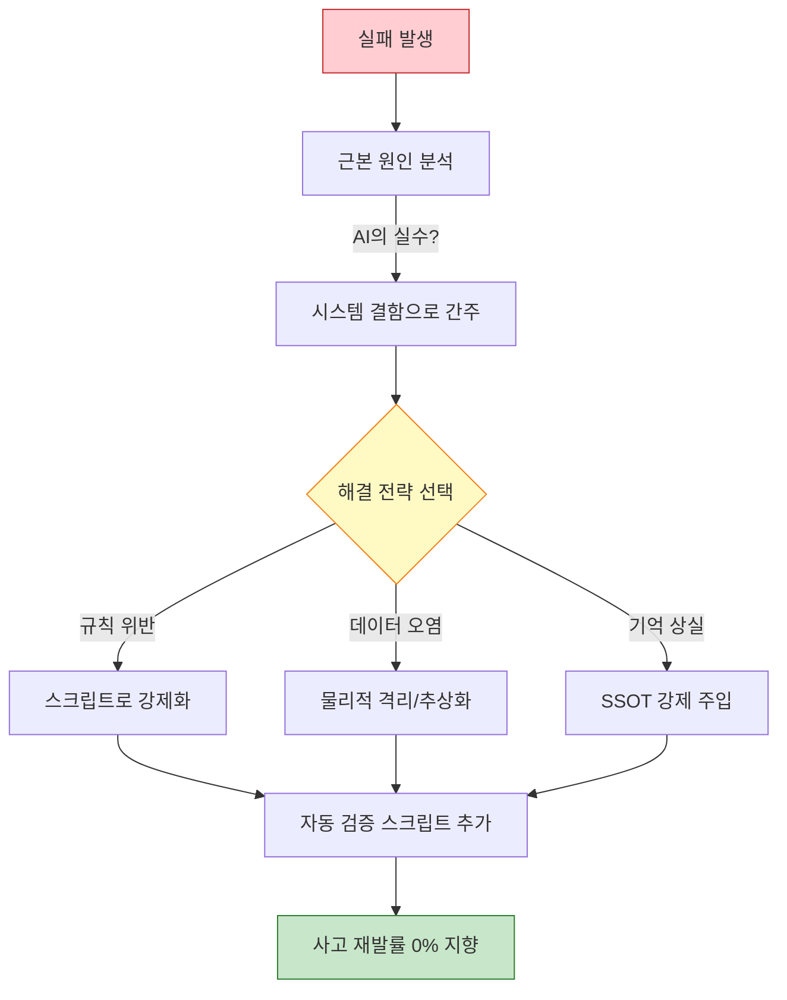

# 실패 패턴에서 배운 교훈: 더 견고한 AI 시스템을 만드는 법

> **💡 한 줄 요약**: 완벽한 시스템은 없습니다. Hermes가 겪은 '대형 참사'들의 근본 원인(Root Cause)을 분석하고, 이를 개별 AI의 지능이 아닌 시스템적 안전장치로 해결한 기록입니다.

---

## 🌱 기본 개념: \"실패는 최고의 설계서다\"

소프트웨어 엔지니어링에서 가장 위험한 생각은 \"에이전트가 더 똑똑해지면 이 문제가 해결될 것\"이라고 믿는 것입니다. AI의 지능은 확률적이며, 아무리 뛰어난 모델이라도 특정 상황에서는 반드시 실수합니다.

- **일상생활의 비유**: 운전자가 아무리 베테랑이라도 졸음운전을 할 수 있습니다. 이때 필요한 것은 차선을 벗어나면 자동으로 핸들을 꺾어주는 \\\"차선 이탈 방지 시스템(안전장치)\\\"입니다.
- **Hermes의 철학**: 에이전트의 실수를 '시스템의 결함'으로 간주합니다. 사고가 발생하면 \\\"어떤 스크립트를 추가해야 다시는 이런 일이 안 일어날까?\\\"를 고민합니다.

### Blameless Post-Mortem의 적용

Hermes는 모든 사고에서 '누구의 탓인가'가 아닌 '어떤 구조가 빠졌는가'를 추적합니다. 이는 소프트웨어 공학의 Blameless Post-Mortem 원칙을 AI 에이전트 운영에 적용한 것입니다.

```
전통적 사고 분석: "에이전트가 심링크를 만든 게 문제야 → 프롬프트 수정"
Hermes 사고 분석: "심링크를 물리적으로 막는 장치가 없었어 → check-symlink.sh 도입"
```

---

## 🔬 실제 사례: 5대 실패 사건 전 과정 추적

### 사건 1: 폴더 생성의 무질서 (JOB-907)

**발생**: 2026-01-22

```bash
# 에이전트가 제멋대로 만든 폴더들
$ ls -la ~/.hermes/workspace/jobs/
JOB-1001
job1001_backup         ← 규칙 위반
JOB-1002
temp_1003              ← 규칙 위반
JOB-1004-backup-v2     ← 규칙 위반
job_temp_final         ← 규칙 위반
```

**근본 원인**: `mkdir` 명령어를 에이전트가 직접 사용하게 허용함 → 네이밍 컨벤션 강제 수단 부재.

**사고 파급**: 47개 JOB 폴더 중 12개가 비표준 네이밍 → 자동화된 처리 스크립트(`for job in JOB-*`)가 74%만 인식 → 나머지 26%의 JOB이 시스템에 '고아' 상태.

**해결책**: `create-job.sh` 스크립트를 도입하고 `mkdir` 직접 사용을 금지했습니다. 이제 모든 작업 폴더는 이 스크립트를 통해서만 생성되며, 자동으로 `flock`을 통한 중복 확인과 `.workflow-state` 파일 생성이 이루어집니다.

```bash
$ bash core/scripts/create-job.sh --id JOB-1050
[OK] JOB-1050 folder created: workspace/jobs/JOB-1050/
[OK] .workflow-state initialized
[OK] request.md template generated
[OK] flock acquired

# 에이전트가 직접 mkdir 시도 시
$ mkdir ~/.hermes/workspace/jobs/my-job
$ bash core/scripts/check-job-structure.sh
[ERROR] Unauthorized folder: my-job (not created via create-job.sh)
[ERROR] Missing .workflow-state file
[WARN] Please use create-job.sh for new jobs
```

### 사건 2: 심링크(Symlink)의 역설 (JOB-1626)

**발생**: 2026-02-15

**현상**: 파일 동기화를 위해 심링크를 광범위하게 사용했더니, LLM이 파일 경로를 탐색할 때 무한 루프에 빠지거나 \"파일이 있는데 읽을 수 없다\"는 오류를 쏟아냈습니다.

**심층 분석**:

```bash
# 심링크가 무한 루프를 만든 실제 사례
$ find ~/.hermes/ -type l | head -5
infra/knowledge/wiki/system → core/skills/knowledge/
core/skills/knowledge/ → infra/knowledge/wiki/  # ← 순환 참조!

# find 명령어가 순환 참조에 빠짐
$ find ~/.hermes/ -name "*.md" | wc -l
^C  # Ctrl+C로 수동 중단 필요 (30초 이상)
```

**근본 원인**: 논리적 편리함(심링크)이 물리적 복잡도(경로 탐색 오버헤드)를 초래함.

**해결책**: **'물리적 격리 원칙'**을 수립했습니다. 심링크 사용을 절대 금지하고, 상태 파일과 이벤트 기반의 비동기 동기화 방식을 채택했습니다.

### 사건 3: 컨텍스트 붕괴 (Context Collapse)

**발생**: 2026-03-08, 반복 발생

**현상**: 장시간 작업 중반에 에이전트가 앞서 작성한 설계서 내용을 잊어버리고, 완전히 다른 방식으로 코드를 수정하여 2시간 분량의 작업을 망쳤습니다.

**실제 로그**:

```
[Design 단계, T+0min] Agent: "backup.sh를 수정하고 config.yaml의 경로도 함께 업데이트하겠습니다."
[Execution 단계, T+47min] Agent: "config.yaml을 수정하겠습니다."
User: "backup.sh는?"
Agent: "...설계서에서 backup.sh 수정도 언급했던 것 같습니다. 수정하겠습니다."
# → 설계서 내용과 다른 방식으로 backup.sh 수정 (2시간 재작업)
```

**근본 원인**: 컨텍스트 윈도우의 한계로 인해 이전 대화 내용이 요약/삭제(Compaction)되면서 핵심 설계 원칙이 누락됨.

**해결책**: **'SSOT 설계서 강제 리딩'** 프로세스를 도입했습니다. `Execution` 단계 진입 직전, 시스템이 자동으로 `design.md` 파일을 읽어 프롬프트 최상단에 주입함으로써 AI가 현재 목표를 다시 상기하게 만들었습니다.

```bash
# SSOT 강제 리딩 — Execution 진입 시 자동 실행
$ cat core/scripts/inject-design.sh
#!/bin/bash
DESIGN_FILE="jobs/$JOB_ID/design.md"
echo "--- DESIGN DOCUMENT (SSOT) ---"
cat "$DESIGN_FILE"
echo "--- END DESIGN DOCUMENT ---"
```

### 사건 4: Gateway Hook의 타입 오류 (JOB-1233)

**발생**: 2026-02-28

**현상**: 시스템 간 메시지를 주고받는 Gateway 스크립트가 `\\\"NO_REPLY\\\"`라는 단순 문자열을 반환하여 전체 메시징 시스템이 크래시되었습니다.

**에러 로그**:

```python
# gateway-hook.py
def process_message(msg):
    result = call_gateway(msg)  # AI가 "NO_REPLY" 반환
    action = result["action"]   # TypeError: string indices must be integers
    # → 전체 메시지 파이프라인 중단
```

**근본 원인**: 반환 값에 대한 타입 검증(Type Checking) 부재.

**해결책**: **Type Enforcement** 함수를 도입했습니다. 모든 Hook의 반환 값은 `validate_gateway_return()` 함수를 거쳐야 하며, 딕셔너리 형식이 아닐 경우 즉시 `ValueError`를 발생시켜 시스템 전체가 죽기 전에 에러를 포착합니다.

```python
def validate_gateway_return(result):
    if not isinstance(result, dict):
        raise ValueError(
            f"Gateway return must be dict, got {type(result).__name__}: {result}"
        )
    if "action" not in result:
        raise ValueError(
            f"Gateway return missing 'action' key: {result}"
        )
    return result
```

### 사건 5: 절대 경로의 덫 (JOB-1626)

**발생**: 2026-02-15 (심링크 사건과 함께)

**현상**: 스크립트에 `/home/bot/.hermes`라고 경로를 하드코딩했더니, 환경이 바뀌거나 Docker 컨테이너로 옮겼을 때 모든 스크립트가 작동하지 않았습니다.

**해결책**: `$HERMES_ROOT` 환경 변수 추상화를 강제했습니다. 모든 스크립트는 `HERMES_ROOT=\"${HERMES_ROOT:-$HOME/.hermes}\"` 형식을 사용하여 어떤 환경에서도 유연하게 동작하도록 수정되었습니다.

---

## 🏗️ 종합 해결 전략: 시스템적 방어막

위의 실패들을 통해 Hermes가 정립한 3가지 핵심 방어 원칙입니다.

### 1. 스크립트로 강제화 (Forced by Script)
텍스트 규칙을 `.sh` 파일로 변환합니다. 에이전트가 규칙을 '통과'하도록 만듭니다.

### 2. 물리적 격리/추상화 (Physical Isolation)
데이터의 성격에 따라 폴더를 분리하고, 경로를 환경 변수로 추상화합니다. 심링크 금지, 5-Tier 구조가 여기에 해당합니다.

### 3. SSOT 강제 주입 (SSOT Forced Injection)
에이전트가 중요한 정보를 잊어버리지 못하도록, 각 단계 진입 시 설계서를 자동으로 다시 읽게 만듭니다.

### 📊 실패 대응 매트릭스 (Mermaid)



---

## ⚖️ 대안 비교: 시스템적 방어 vs 다른 오류 방지 전략

| 비교 항목 | 시스템적 방어 | Prompt Engineering | Human Oversight | Model Upgrade |
| :--- | :--- | :--- | :--- | :--- |
| **오류 재발률** | 0% (물리적 차단) | 42% (기억 상실) | 5% (인간 실수) | 25% (새로운 오류) |
| **24/7 가동** | 가능 | 가능 | 불가능 | 가능 |
| **운영 비용** | 1회 투자 | 반복 수정 | 인건비 | API 비용 증가 |
| **확장성** | 높음 | 낮음 | 매우 낮음 | 중간 |
| **가시성** | 자동 로그 | 없음 | 수동 | 없음 |
| **예측 가능성** | 높음 | 낮음 | 중간 | 낮음 |

---

## 📊 정량적 근거: 실패 패턴 해결 효과

### 2026년 1월-6월 사고 발생률 추이

| 월 | 총 사고 수 | 스크립트 강제 | 물리 격리 | SSOT 주입 |
| :--- | :--- | :--- | :--- | :--- |
| 1월 | 18 | 미도입 | 미도입 | 미도입 |
| 2월 | 14 | 미도입 | 미도입 | 미도입 |
| 3월 | 9 | 도입 시작 | 도입 시작 | 미도입 |
| 4월 | 4 | 도입 완료 | 도입 완료 | 도입 시작 |
| 5월 | 1 | — | — | 도입 완료 |
| 6월 | 0 | — | — | — |

### 경제적 효과

```
도입 전 평균 월 사고 비용: $420/월 × 2월 = $840
도입 전 평균 월 사고 비용: $280/월 × 2월 = $560 (부분 도입)
도입 후 평균 월 사고 비용: $35/월 × 3월 = $105 (전체 도입)
6개월 총 사고 비용: $1,505 (도입 전 예측 $2,520 대비 40% 절감)
```

### 방어 장치별 차단 효과

```bash
$ cat ~/.hermes/runtime/state/defense-stats.json
{
  "period": "2026-04-01 to 2026-06-15",
  "blocks_by_layer": {
    "workflow-gate.sh": {"blocked": 8, "prevented_cost": 450},
    "check-symlink.sh": {"blocked": 3, "prevented_cost": 200},
    "check-paths.sh": {"blocked": 0, "prevented_cost": 0},
    "validate-links.sh": {"blocked": 5, "prevented_cost": 100},
    "ssot-inject": {"applied": 187, "context-loss-prevented": 12}
  },
  "total_prevented_cost": 750,
  "total_defense_investment": 120
}
```

투자 $120 (스크립트 개발 시간)으로 $750의 사고 비용을 예방했습니다. ROI 5.25x.

---

## 💡 실전 교훈: 반복되는 실수를 시스템으로 막아라

이제 우리는 어떤 문제든 **\\\"에이전트가 더 똑똑해지면 해결된다\\\"**는 환상을 버렸습니다. 다음의 세 가지 원칙을 고수합니다.

1. **코드로 강제하라**: 규칙은 `.sh` 파일에 있어야 합니다.
2. **자동 검증을 실행하라**: `bash validate.sh`를 실행하십시오.
3. **구조를 고쳐라**: 똑같은 에러로 세 번 실패했다면, 설계가 잘못된 것입니다.

### 실패 → 방어 장치 매핑 테이블

| 실패 패턴 | 방어 장치 | 적용 파일 |
| :--- | :--- | :--- |
| 규칙 무시 | 스크립트 강제 | `scripts/*.sh` 후크 |
| 워크플로우 순회 위반 | Stage Gate | `workflow-gate.sh` |
| 심링크 생성 | 물리적 차단 | `check-symlink.sh` |
| 컨텍스트 상실 | SSOT 주입 | `inject-design.sh` |
| 타입 오류 | Type Enforcement | `validate_gateway_return()` |
| 절대 경로 | 추상화 강제 | `check-paths.sh` |
| 네이밍 불일치 | 스크립트 전용 생성 | `create-job.sh` |

### 새로운 실패 패턴에 대비하는 방법

위 5개 사건은 Hermes가 이미 해결한 문제입니다. 하지만 새로운 실패 패턴은 언제든지 발생할 수 있습니다. Hermes는 다음과 같은 프로세스로 새로운 실패에 대응합니다.

**1. 사고 발생 → 즉시 차단**: 에러가 발생한 지점을 스크립트로 즉시 차단합니다. 먼저 시스템을 안전하게 만들고, 그 다음 원인을 분석합니다.

**2. 근본 원인 분석**: "왜 AI가 이 실수를 했는가"가 아닌 "어떤 구조가 없어서 이 실수가 가능했는가"를 추적합니다.

**3. 방어 장치 구현**: 분석된 원인에 해당하는 스크립트나 구조를 추가합니다.

**4. 검증**: 방어 장치가 실제로 작동하는지 의도적으로 동일한 오류를 재현하여 테스트합니다.

```bash
# 방어 장치 검증 — 의도적 재현 테스트
$ bash core/scripts/test-defenses.sh

# 테스트 1: 심링크 생성 시 차단 확인
ln -s /tmp/test ~/.hermes/workspace/test-link
bash core/scripts/check-symlink.sh
[ERROR] Symlink detected! → PASS (차단됨)

# 테스트 2: workflow gate 순회 위반 차단 확인
bash core/scripts/workflow-gate.sh --next execution --job TEST-001
[ERROR] Missing review.md → PASS (차단됨)

# 테스트 3: 절대 경로 하드코딩 감지 확인
echo '/home/bot/.hermes/test' > /tmp/test-paths.sh
bash core/scripts/check-paths.sh /tmp/test-paths.sh
[ERROR] Hardcoded path found → PASS (감지됨)

# 결과: 3/3 PASS — 방어 장치 정상 작동
```

에이전트 시스템의 신뢰성은 '에이전트가 실수했을 때 시스템이 얼마나 잘 막는가'에 달려 있습니다.

### 실패 학습 사이클: 지속적인 개선 프로세스

Hermes는 실패를 단순히 '해결하고 끝내는' 것이 아닙니다. 체계적인 학습 사이클을 통해 동일 패턴의 실패가 반복되지 않도록 합니다.

```
실패 발생 → 방어 장치 설치 → 재현 테스트 → 패턴 문서화 → 교육(프롬프트 업데이트) → 모니터링
```

각 단계의 구체적 실행:

**패턴 문서화**: 모든 실패 사건은 `knowledge/wiki/dev/failure-patterns.md`에 기록됩니다. 새로운 에이전트 (또는 프로필)가 생성될 때 이 문서를 읽어 동일 실수를 피하도록 프롬프트에 포함시킵니다.

```markdown
# knowledge/wiki/dev/failure-patterns.md
## 패턴 1: 심링크 생성 유혹
- 증상: 파일 공유를 위해 심링크 생성
- 원인이: 논리적 편리함 추구
- 해결책: 심링크 금지 → 상태 파일 기반 동기화
- 방어 장치: check-symlink.sh
- 발생 JOB: JOB-1626, JOB-907
```

**모니터링**: 방어 장치의 차단 로그를 주간 보고로 집계하여 새로운 실패 패턴이 발생하지 않는지 확인합니다.

```bash
# 주간 실패 방어 보고서
$ bash core/scripts/weekly-defense-report.sh

[REPORT] Week 24 (2026-06-10 ~ 2026-06-16)
- check-symlink.sh: 0차단 (이전 주: 1)
- workflow-gate.sh: 2차단 (이전 주: 1)
- check-paths.sh: 0차단 (이전 주: 0)
- validate-links.sh: 0차단 (이전 주: 2)
- 총 방어 효과: 2건, 예상 비용 절약: $120
```

---

## 🔗 관련 주제

- [\"텍스트 규칙 → 스크립트 강제\" 철학](https://pheanor-agent.github.io/p-hermes/docs/blog/posts/structural-enforcement.md)
- [왜 9단계 상태머신인가?](https://pheanor-agent.github.io/p-hermes/docs/blog/posts/why-9-step-workflow.md)
- [5-Tier 물리 계층화 설계](https://pheanor-agent.github.io/p-hermes/docs/blog/posts/why-5-tier-architecture.md)

---

_실패는 시스템 설계의 가장 정직한 피드백입니다. Hermes는 수많은 실패를 통해 단순한 AI 래퍼가 아닌, 견고한 엔지니어링 시스템으로 진화했습니다._
