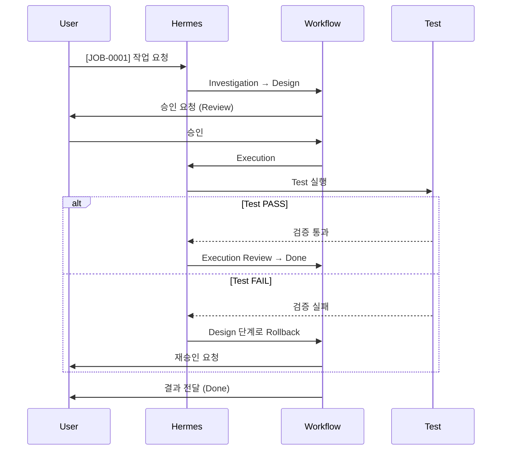

# 자주 묻는 질문 (FAQ)

💡 **Hermes 사용 중 사용자들이 가장 많이 겪는 상황과 그에 대한 공학적 해결 방법을 모았습니다.**

## 🛠️ 일반적 질문

### Q1. Hermes에게 작업을 지시할 때 꼭 `[JOB-XXXX]` 형식을 써야 하나요?
**결론부터 말씀드리면, 복잡한 작업일수록 반드시 사용하시길 강력히 권장합니다.**

`[JOB-0001]` 태그는 Hermes의 **'모드 전환 스위치'**입니다. 이 태그를 사용하면 Hermes는 단순 채팅 모드에서 **'공식 프로젝트 모드'**로 전환되어 다음과 같은 전문 공정을 수행합니다:
- **상태 추적**: 9단계 워크플로우(Investigation → Design → ... → Done)를 엄격히 따릅니다.
- **물리적 기록**: 모든 과정이 `~/.hermes/runtime/workspace/jobs/JOB-0001/` 폴더에 파일로 남습니다.
- **검증 강제**: `Test` 단계를 통과하지 못하면 작업을 종료하지 않고 스스로 수정합니다.

간단한 작업(예: "이 문장을 영어로 번역해줘", "오늘 날씨 어때?")은 `[TASK]` 태그를 쓰거나 일반 채팅으로 요청하는 것이 훨씬 빠르고 효율적입니다.

### Q2. Hermes의 응답이 갑자기 느려지거나 멈춘 것 같습니다. 어떻게 해야 하나요?
**먼저, Hermes가 현재 어떤 '단계'에 있는지 확인하십시오.**

Hermes가 수행하는 작업 중 `Investigation`(전수 조사)이나 `Design`(복잡한 설계) 단계는 수많은 파일을 읽고 논리적 구조를 짜는 과정이므로 시간이 다소 소요될 수 있습니다. 

- **확인 방법**: `[FEEDBACK] 현재 진행 상황과 단계를 알려줘`라고 입력하세요.
- **대처 방법**: 만약 `Investigation` 단계에서 너무 오래 걸린다면, "조사 범위를 `src/core/` 폴더로 한정해서 다시 찾아줘"와 같이 범위를 좁혀주는 피드백을 주면 속도가 개선됩니다.

### Q3. 실행 중 오류가 났을 때 제가 직접 코드를 수정해야 하나요?
**기본적으로는 아니오, 하지만 '방향성'은 잡아주셔야 합니다.**

Hermes는 자체적으로 `Test` 단계를 통해 결과물을 검증합니다. 테스트가 실패하면 에이전트가 스스로 오류 로그를 분석하여 롤백하거나 재시도합니다. 

다만, 에이전트가 해결하지 못하는 '논리적 설계 오류'가 발생한 경우에는 사용자의 개입이 필요합니다. 이때는 `[FEEDBACK] X 부분의 로직이 잘못되었어. Y 방식으로 접근해서 다시 설계해줘`라고 구체적인 방향을 제시해 주세요. 그러면 Hermes가 `Design` 단계로 돌아가 설계를 수정하고 다시 실행합니다.

**📊 Hermes 작업 처리 흐름**:

---

## 🧠 지식 및 설정

### Q4. Hermes가 "정보가 없습니다"라고 하는데, 분명히 이전에 알려준 내용입니다. 왜 기억을 못 하죠?
**AI의 기억 구조인 '컨텍스트 윈도우'와 '장기 기억'의 차이 때문입니다.**

Hermes는 현재 대화 중인 **세션(Conversation)**의 내용을 단기 기억으로 가집니다. 대화가 너무 길어지거나 세션이 바뀌면 과거의 내용은 '컨텍스트'에서 밀려나 삭제됩니다. 

이를 해결하기 위해 p-hermes는 **지식 베이스(Knowledge Base)** 시스템을 운영합니다. 
- **해결 방법**: "과거 세션에서 'X' 프로젝트에 대해 논의했던 내용을 찾아줘"라고 요청하세요. 그러면 에이전트가 `session_search` 도구를 사용하여 과거의 기록을 검색하고 다시 현재 컨텍스트로 불러옵니다. 
- **팁**: 정말 중요한 결정 사항은 "이 내용을 위키(Wiki)에 기록해줘"라고 요청하여 영구적인 지식으로 자산화하는 것이 가장 좋습니다.

### Q5. 작업 도중에 모델을 직접 바꿀 수 있나요? (예: GPT-4 → Claude)
**네, 가능합니다. 두 가지 방법이 있습니다.**

1. **일시적 변경**: 채팅창에 "이 작업의 `Execution` 단계부터는 코드 생성 능력이 뛰어난 Claude 3.5 Sonnet 모델을 사용해줘"라고 지시하십시오. 해당 세션 동안만 설정이 적용됩니다.
2. **영구적 변경**: `~/.hermes/core/skills/custom/model-catalog/catalog.json` 파일을 수정하여 특정 상태(State)에 매핑된 기본 모델을 변경하십시오. 시스템 전체에 적용됩니다.

---

## 📂 파일 및 데이터

### Q6. 작업 결과물이 정확히 어디에 저장되나요?
**모든 공식 작업은 고유한 격리 폴더에 저장됩니다.**

`[JOB-0001]` 형식을 통해 진행된 작업의 모든 흔적은 `~/.hermes/runtime/workspace/jobs/JOB-0001/` 폴더에 저장됩니다.
- `result.md`: 최종 결과물 및 요약.
- `design.md`: 어떤 논리로 수정했는지 적힌 설계서.
- `test-report.md`: 검증 스크립트 실행 결과.

이 폴더 구조 덕분에 사용자는 에이전트가 작성한 코드를 한눈에 리뷰할 수 있고, 필요 시 특정 작업의 설계 과정만 따로 추출하여 문서화할 수 있습니다.

### Q7. 실수로 파일을 삭제했는데 복구 가능한가요?
**네, Hermes는 안전장치를 갖추고 있습니다.**

Hermes는 파일을 삭제하기 전 자동으로 `pre-delete-backup.sh` 스크립트를 실행하여 해당 파일의 스냅샷을 `~/.hermes/backups/` 폴더에 저장합니다.

- **복구 방법**: "X 파일을 실수로 지웠어. 백업 폴더에서 최신 버전을 찾아 복구해줘"라고 요청하세요. 에이전트가 백업 경로를 추적하여 파일을 원래 위치로 되살려줍니다.

---

**이 문서에 없는 문제가 있나요?**
디스코드나 Telegram 채널에서 `[FEEDBACK] 문제 발생` 태그와 함께 증상을 알려주세요. Hermes가 즉각적으로 분석하고 대응합니다.
