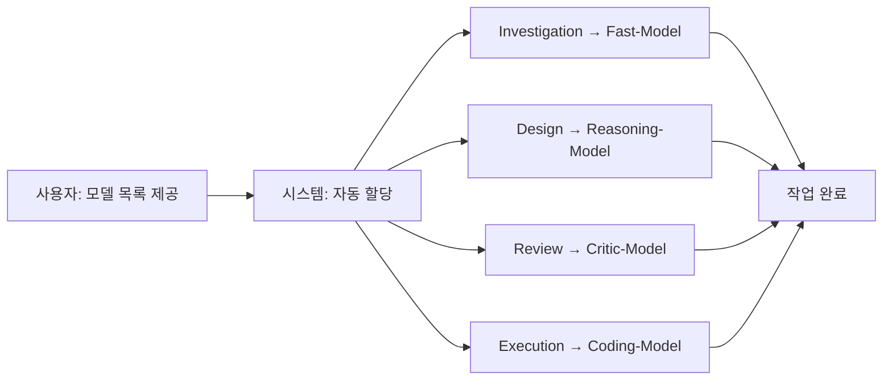

# 기본 설정 가이드

💡 **Hermes Agent의 지능(모델)과 동작 환경을 최적화하여 사용자의 워크플로우에 맞게 튜닝하는 방법입니다.**

## 🌱 기본 개념

에이전트의 설정은 **'역할 기반 라우팅'** 시스템을 통해 효율과 품질의 균형을 잡습니다. 숙련된 팀장이 작업의 난이도에 따라 적절한 인력을 배분하듯, 시스템은 각 작업 단계에 최적화된 모델을 자동으로 할당합니다.

## 🚀 모델 할당 방식

사용자가 사용 가능한 모델 목록을 제공하면, 시스템은 각 작업 단계의 성격에 맞춰 모델을 자동으로 할당합니다.

```yaml
# 예시: 사용 가능한 모델 목록 제공
available_models:
  - glm-5.2
  - Qwen3.6
  - Gemma-4
  - Claude-3.5-Sonnet
```

**자동 할당 결과:**

| 작업 단계 | 할당 모델 | 선택 근거 |
|-----------|-----------|-----------|
| Investigation | GPT-4o-mini / Haiku | 빠른 응답, 넓은 컨텍스트 |
| Design | Claude 3.5 Sonnet | 복잡한 논리 설계 |
| Review | Gemma-4 | 상호 견제 (다른 제조사) |
| Execution | Qwen3.6 | 높은 코드 정확도 |

## 🔍 문제 상황: 단일 모델의 한계

- **추론 오버헤드**: 단순 작업에 무거운 모델 배치 시 응답 지연 및 비용 상승
- **설계 부실**: 논리적 추론 능력이 낮은 모델이 설계 단계 수행 시 엣지 케이스 누락
- **확증 편향**: 설계 모델을 검토 단계에서 재사용 시 논리적 오류 발견 실패

## 🏗️ 기술 설계: 설정의 3대 핵심 축

### 1. 모델 라우팅 (`catalog.json`)

에이전트가 현재 수행 중인 **상태(State)**에 따라 모델을 호출하는 매핑 테이블입니다.

- **경로**: `~/.hermes/core/skills/custom/model-catalog/catalog.json`
- **상태별 라우팅 전략**:
    - `investigation` → **Fast-Model**: 빠른 현황 파악
    - `design` → **Reasoning-Model**: 정밀한 청사진 작성
    - `review` → **Critic-Model**: 설계서 허점発見 (상호 견제 구조)
    - `execution` → **Coding-Model**: 실제 구현 수행

### 2. 에이전트 프로필 (`AGENTS.md`)

에이전트의 정체성과 물리적 활동 범위를 정의합니다.

- **경로**: `~/.hermes/AGENTS.md`
- **핵심 변수**:
    - `skills_path`: '전문 지식' 폴더 경로
    - `knowledge_path`: '위키/리퍼런스' 폴더 경로
    - `workspace`: 작업 결과물 샌드박스 경로

### 3. 시스템 동작 설정 (`config.yaml`)

에이전트의 행동 규칙과 시스템 파라미터를 제어합니다.

- **경로**: `~/.hermes/config.yaml`
- **주요 파라미터**:
    - `workflow.checkpoint_validation`: 단계 전이 전 검증 스크립트 실행
    - `knowledge.update_interval`: 위키 정제 주기 (초)
    - `logging.level`: 로그 상세 수준

## 📊 설정 적용 흐름도



## 💡 활용 예시: 모델 목록 제공 방법

**Discord/Telegram에서:**
```
[CONFIG] 사용 가능한 모델 목록:
- glm-5.2
- Qwen3.6
- Gemma-4
- Claude-3.5-Sonnet
```

**설정 파일에서:**
```yaml
# config.yaml
available_models:
  - glm-5.2
  - Qwen3.6
  - Gemma-4
  - Claude-3.5-Sonnet
```

시스템은 자동으로 각 단계에 최적화된 모델을 할당하고, 할당 결과를 확인하실 수 있습니다.

## 🔗 관련 주제

- **[첫 번째 작업 요청하기](https://pheanor-agent.github.io/p-hermes/wiki/getting-started/first-job.md)**: 설정 완료 후 실제 작업 실행
- **[스킬 시스템 활용하기](https://pheanor-agent.github.io/p-hermes/wiki/guides/use-skills.md)**: 모델 라우팅 외에 에이전트 능력 확장
