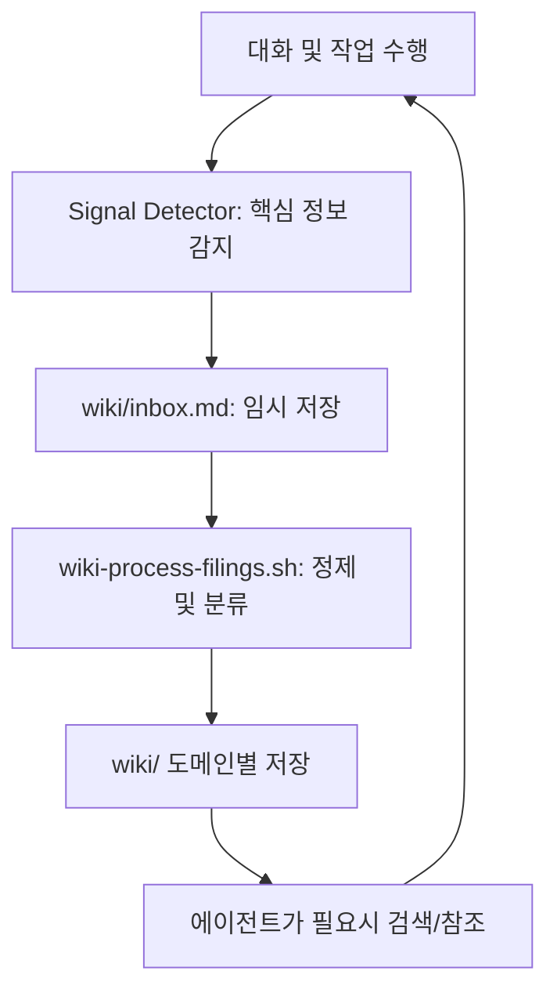

# 지식 시스템 검색 및 활용

💡 **에이전트가 경험한 모든 데이터를 체계적으로 저장하고, 필요할 때 정확하게 찾아내는 '디지털 기억 장치'의 활용법을 설명합니다.**

## 🌱 기본 개념
인간은 시간이 지나면 과거의 결정이나 세부 사항을 잊어버립니다. AI 역시 마찬가지로, 세션이 바뀌면 이전 대화 내용을 잊게 됩니다. 이는 매번 같은 설명을 반복해야 하는 비효율을 초래합니다.

p-hermes의 지식 시스템은 에이전트에게 **'영구적인 장기 기억(Long-term Memory)'**을 부여하는 장치입니다. 비유하자면, 에이전트가 모든 대화를 마친 후 중요한 내용만 요약해서 **'개인 위키(Personal Wiki)'**에 기록하고, 나중에 비슷한 문제가 발생했을 때 그 위키를 검색해서 \\\"아, 예전에 이렇게 해결했었지!\\\"라고 회상하는 것과 같습니다. '정제된 지식'을 관리하는 것이 핵심입니다.

## 🔍 문제 상황: 단순한 대화 이력 저장의 한계
많은 AI 시스템이 단순히 채팅 로그(JSON/Text)를 저장하고 검색하는 방식을 사용하지만, 이는 다음과 같은 심각한 문제가 있습니다:

- **노이즈 과다 (High Noise)**: \"안녕하세요\", \"네 알겠습니다\" 같은 무의미한 인사치레나 잡담이 모두 검색 결과에 포함되어, 정작 필요한 핵심 정보를 찾는 정확도가 급격히 떨어집니다.
- **파편화 (Fragmentation)**: 하나의 기술적 결정이 여러 세션에 걸쳐 논의되었을 때, 이를 하나의 완성된 '지식'으로 통합해서 보기 어렵고 여러 파일에 흩어져 있게 됩니다.
- **성능 저하 (Performance Degredation)**: 수천 개의 세션 파일을 일일이 읽어 검색하면 응답 속도가 너무 느려지며, 모델의 컨텍스트 제한으로 인해 모든 로그를 읽을 수 없습니다.

p-hermes는 **'수집 → 가공 → 저장'**이라는 정교한 파이프라인을 통해 노이즈를 제거하고 순수 지식만을 추출하여 저장합니다.

## 🏗️ 기술 설계: 지식 관리 파이프라인
지식 시스템은 원본 데이터가 정제된 위키 페이지가 되기까지의 공정을 거칩니다.

### 1. 지식의 흐름 (Data Pipeline)
- **수집 (Signal Detection)**: 에이전트가 대화 중 핵심 결정, 해결 방법, 외부 URL, 사용자의 선호도 등을 감지하여 `wiki/inbox.md`에 임시로 기록합니다. 이때 '지식으로서 가치가 있는 정보'인지 판단하는 필터링 과정이 포함됩니다.
- **가공 (Processing)**: `wiki-process-filings.sh` 스크립트가 주기적으로 실행되어, `inbox`에 쌓인 내용을 분석합니다. 중복된 정보를 통합하고, 모순되는 내용이 있다면 최신 정보를 우선시하며, 적절한 도메인 폴더(예: `system/`, `project-a/`)로 분류합니다.
- **저장 (Wiki DB)**: 정제된 지식은 `~/.hermes/knowledge/wiki/` 아래의 마크다운 파일로 저장됩니다. 이는 인간이 읽기에도 편하고, 에이전트가 `read_file`로 빠르게 읽어올 수 있는 구조입니다.

### 2. 계층적 검색 구조 (Hierarchical Retrieval)
에이전트는 다음과 같은 단계적 순서로 지식을 탐색합니다:
1. **Full-Text Search (FTS)**: SQLite 기반의 고속 검색을 통해 키워드가 포함된 모든 문서를 1차 필터링하여 후보군을 뽑습니다.
2. **Domain Navigation**: `index.md` → `도메인 폴더` → `상세 문서` 순으로 계층적으로 접근하여, 해당 지식이 어떤 맥락(Context)에서 작성되었는지 파악합니다.
3. **Source Trace (근거 추적)**: 위키에 기록된 정보가 의심스럽거나 더 자세한 맥락이 필요할 경우, 위키에 링크된 원본 세션 기록(`runtime/workspace/jobs/JOB-0001/`)으로 돌아가 실제 대화 내용을 확인합니다.

## 📊 지식 순환 구조도

## 💡 활용 예시: 지식 시스템을 활용한 질문법
에이전트가 기억을 더 잘 되살리게 하려면 **'과거의 맥락'**과 **'지식의 출처'**를 언급하며 질문하세요.

**❌ 단순 질문:**
> \"심링크 설정 어떻게 했었지?\" (에이전트가 현재 세션의 기억에만 의존하여 추측할 가능성이 큼)

**✅ 지식 시스템 유도 질문:**
> \"과거 세션이나 위키에서 '심링크(Symlink) 사용 불가' 결정이 내려진 이유를 찾아줘. 당시 어떤 기술적 한계 때문에 그렇게 결정했었는지, 그리고 그 결정이 기록된 위키 문서의 경로를 알려줘.\"

**에이전트의 내부 동작:**
1. `session_search` 또는 `search_files` 도구를 사용하여 '심링크' 키워드가 포함된 과거 기록 및 위키 검색.
2. `knowledge/wiki/system/network/` 폴더에서 관련 결정 레코드 발견.
3. \"2025년 10월, LLM이 심링크 경로를 해석할 때 잦은 경로 오류가 발생하여 직접 복사 방식으로 변경하기로 결정했습니다. 자세한 내용은 `knowledge/wiki/system/network/symlink-policy.md`에서 확인하실 수 있습니다.\"라고 정확히 답변.

## 🔗 관련 주제
- **[스킬 시스템 활용하기](https://pheanor-agent.github.io/p-hermes/docs/wiki/guides/use-skills.md)**: 스킬이 '방법(How)'에 대한 매뉴얼이라면, 지식 시스템은 '데이터(What)'에 대한 저장소입니다.
- **[Cron 자동화 설정](https://pheanor-agent.github.io/p-hermes/docs/wiki/guides/automation.md)**: 지식 시스템의 정제 프로세스(`wiki-process-filings.sh`)는 크론(Cron)에 의해 자동으로 수행되어 항상 최신 상태를 유지합니다.
