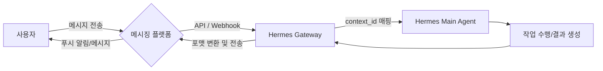

# 메시징 플랫폼 연동

💡 **에이전트를 로컬 서버에 가두지 않고, 사용자가 가장 많이 사용하는 Discord와 Telegram에 연결하여 언제 어디서나 소통하는 방법을 설명합니다.**

## 🌱 기본 개념
AI 에이전트의 진정한 가치는 '접근성'에서 나옵니다. 터미널 앞에 앉아 있을 때만 대화할 수 있다면 그것은 단순한 도구에 불과하지만, 내 주머니 속의 메신저와 연결되는 순간 그것은 **'개인 비서'**가 됩니다.

비유하자면, p-hermes의 메시징 연동은 에이전트에게 **'전화기와 메신저 계정'**을 부여하는 것과 같습니다. 에이전트는 서버라는 집에서 대기하고 있다가, 사용자가 디스코드나 텔레그램이라는 통신망을 통해 메시지를 보내면 이를 수신하여 처리하고, 다시 같은 통신망을 통해 답변을 보내는 구조입니다. 마치 비서가 사무실에서 대기하다가 사장님의 카톡 메시지를 보고 업무를 처리한 뒤 다시 카톡으로 보고하는 것과 같습니다.

## 🔍 문제 상황: 왜 전용 인터페이스가 필요한가?
단순히 웹 채팅 UI를 사용하는 것보다 메시징 플랫폼 연동이 강력한 이유는 다음과 같습니다:

- **푸시 알림 (Real-time Alert)**: 에이전트가 수행한 장시간 작업(예: 2시간 걸리는 코드 분석)이 끝났을 때, 사용자가 브라우저를 계속 새로고침하며 확인하러 갈 필요 없이 폰으로 즉시 알림을 보내줍니다. 이는 '능동적 보고' 체계를 가능하게 합니다.
- **멀티미디어 최적화 (Native View)**: 이미지 생성 결과물이나 PDF 리포트를 플랫폼의 네이티브 뷰어로 즉시 확인하고 공유할 수 있습니다. 별도의 다운로드 과정 없이 썸네일로 빠르게 내용을 파악할 수 있습니다.
- **그룹 협업 (Collaborative Workspace)**: 텔레그램 그룹이나 디스코드 서버에 에이전트를 초대하여, 여러 명의 팀원이 동시에 에이전트에게 작업을 요청하고 결과를 공유할 수 있습니다. 이는 에이전트가 팀의 '공용 지식 창구' 역할을 수행하게 합니다.

## 🏗️ 기술 설계: 메시징 게이트웨이 아키텍처
p-hermes는 플랫폼별 특성을 추상화한 **'메시징 게이트웨이'** 구조를 사용하여 일관된 경험을 제공합니다. 내부적으로는 각 플랫폼의 API를 래핑(Wrapping)하여 메인 에이전트가 플랫폼 종류에 상관없이 동일한 메시지 객체를 처리할 수 있도록 설계되었습니다.

### 1. 플랫폼별 특화 메커니즘
- **Discord 연동**: 
    - **쓰레드(Threads) 기반 컨텍스트 격리**: `[JOB-0001]` 작업이 시작되면 에이전트는 자동으로 전용 쓰레드를 생성합니다. 이는 OS의 '프로세스 격리'와 유사합니다. 메인 채널의 대화 흐름을 방해하지 않으면서, 해당 작업의 상세 진행 상황, 로그, 중간 산출물을 하나의 쓰레드에 응집시켜 나중에 추적하기 매우 용이하게 만듭니다.
    - **Slash Commands**: `/` 명령어를 통해 `system_status`, `job_list` 등 정형화된 스킬을 빠르게 호출합니다.
- **Telegram 연동**:
    - **경량 알림 최적화**: 빠른 응답과 간단한 텍스트 기반 명령에 최적화되어 있습니다.
    - **Polling/Webhook 하이브리드**: 서버 환경에 따라 최적의 수신 방식을 선택하여 지연 시간을 최소화합니다.

### 2. 메시지 송수신 파이프라인 (The Loop)
메시지는 다음과 같은 정교한 단계를 거쳐 처리됩니다:
1. **Ingress (수신)**: 플랫폼 API(Webhook 또는 Polling)를 통해 사용자의 메시지를 수신합니다. 이때 메시지의 `channel_id`, `thread_id`, `user_id`를 묶어 고유한 `context_id`를 생성하고 이를 세션 관리자에 기록합니다.
2. **Processing (처리)**: 수신된 메시지를 에이전트의 메인 로직으로 전달합니다. 이때 `context_id`를 통해 이전 대화 맥락을 불러와 적절한 응답을 생성합니다.
3. **Egress (송신)**: 생성된 응답을 플랫폼별 API 포맷(예: Discord의 Embed 메시지, Telegram의 MarkdownV2)으로 변환합니다. 저장해 두었던 `context_id`를 참조하여 정확히 원래의 대화방/쓰레드로 회신함으로써 대화의 일관성을 유지합니다.

## 📊 메시징 데이터 흐름도

## 💡 활용 예시: 플랫폼별 최적 활용법
- **Deep Work는 Discord에서**: 복잡한 프로젝트 작업(`[JOB-0001]`)은 디스코드의 쓰레드 기능을 활용하세요. 설계서, 수정 코드, 테스트 결과가 쓰레드 하나에 모두 담겨 나중에 복기하기 매우 좋습니다.
- **Quick Check는 Telegram에서**: "지금 서버 상태 어때?", "오늘의 뉴스 요약 보내줘" 같은 간단한 확인이나 크론(Cron) 알림 수신용으로 사용하세요.
- **파일 전송**: Hermes는 이미지와 함께 `.pdf`, `.zip` 등 다양한 파일을 플랫폼에 직접 첨부하여 보냅니다. 상세 리포트는 파일 형태로 요청하는 것이 효율적입니다.

## 🔗 관련 주제
- **[이미지 생성 및 관리](https://pheanor-agent.github.io/p-hermes/docs/wiki/guides/generate-images.md)**: 생성된 고화질 이미지를 메시징 플랫폼으로 즉시 전달받는 방법.
- **[자동화(Cron) 설정 가이드](https://pheanor-agent.github.io/p-hermes/docs/wiki/guides/automation.md)**: 자동화 작업의 결과를 특정 디스코드 채널이나 텔레그램 그룹으로 전송하는 설정 방법.
