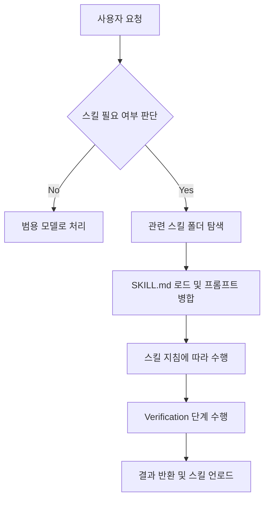

# 스킬 시스템 활용하기

💡 **에이전트의 능력을 무한히 확장시키는 '전문가 지식 모듈', 스킬(Skill) 시스템의 작동 원리와 활용법을 설명합니다.**

## 🌱 기본 개념
AI 모델은 매우 똑똑하지만, 모든 세부적인 도구 사용법이나 특정 도메인의 복잡한 규칙을 모두 기억할 수는 없습니다. 

비유하자면, 에이전트는 매우 유능한 **'범용 천재'**이지만, 특정 작업(예: 복잡한 이미지 생성, 특정 기업 내부 API 연동)을 수행할 때는 그 분야의 **'전문가 매뉴얼'**이 필요합니다. 이 매뉴얼이 바로 **스킬(Skill)**입니다. 에이전트는 작업이 시작되면 현재 수행해야 할 작업에 가장 적합한 매뉴얼을 책상 위에 펼쳐놓고(Dynamic Loading), 그 지침에 따라 정확하게 행동합니다. 작업이 끝나면 매뉴얼을 다시 서가에 꽂아 넣어 책상을 깨끗이 유지합니다.

## 🔍 문제 상황: 왜 스킬 시스템이 필요한가?
모델의 컨텍스트 윈도우(Context Window)에 모든 지침을 미리 집어넣으려 하면 다음과 같은 치명적인 문제가 발생합니다:

- **컨텍스트 희석 (Prompt Drift)**: 너무 많은 지침이 들어가면, 정작 중요한 현재 작업의 세부 사항이나 사용자의 최신 요청을 잊어버리는 현상이 발생합니다.
- **업데이트 지옥 (Maintenance Hell)**: 스킬 하나를 수정하기 위해 전체 시스템 프롬프트를 수정하고, 그 영향으로 인해 다른 기능이 망가지지 않았는지 전체 시스템을 다시 테스트해야 하는 비효율이 발생합니다.
- **토큰 낭비 (Token Inefficiency)**: 단순한 텍스트 요약 작업만 하는데, 복잡한 이미지 생성 스킬과 데이터베이스 관리 스킬까지 모두 프롬프트에 포함되어 불필요한 비용이 발생하고 응답 속도가 느려집니다.

스킬 시스템은 필요한 때에 필요한 지식만 로드하는 **'온디맨드(On-Demand) 지식 로딩'** 방식으로 이러한 문제를 공학적으로 해결합니다.

## 🏗️ 기술 설계: 스킬의 구조와 메커니즘
하나의 스킬은 파일 시스템 상의 독립된 폴더로 존재하며, 에이전트가 즉시 해석하고 실행할 수 있도록 표준화된 구조를 가집니다.

### 1. 스킬의 물리적 구조
- **`SKILL.md` (The Manual)**: 스킬의 핵심입니다. 여기에는 다음과 같은 필수 항목이 정의됩니다:
    - **Trigger**: 어떤 상황이나 키워드에서 이 스킬을 사용해야 하는가?
    - **Steps**: 작업을 완수하기 위한 단계별 실행 절차 (Step-by-Step).
    - **Verification**: 결과물이 성공적으로 생성되었는지 판단하는 정량적/정성적 기준.
- **`references/`**: 공식 문서, API 명세서, 예시 코드, 스타일 가이드 등 에이전트가 참고할 상세 데이터가 저장됩니다.
- **`scripts/`**: 스킬 수행을 위해 호출해야 하는 전용 쉘 스크립트나 파이썬 도구들이 위치합니다.
- **`templates/`**: 최종 결과물 작성을 위한 표준 양식 파일들이 저장됩니다.

### 2. 스킬 활성화 과정 (Activation Pipeline)
1. **Trigger 감지**: 사용자의 요청을 분석하여 특정 키워드를 찾거나, 에이전트가 `Investigation` 단계에서 "이 작업의 성격상 X 스킬의 지침이 필요하겠다"라고 스스로 판단합니다.
2. **Dynamic Loading**: 해당 스킬 폴더의 `SKILL.md`와 필요한 `references/` 파일들을 읽어, 현재 세션의 시스템 프롬프트에 일시적으로 병합합니다.
3. **Execution**: `SKILL.md`에 정의된 정교한 `Steps`에 따라 도구를 사용하여 작업을 수행합니다.
4. **Unloading**: 작업이 완료되거나 세션이 종료되면 해당 지식을 컨텍스트에서 제거하여, 다음 작업에 영향을 주지 않고 토큰 효율성을 유지합니다.

## 📊 스킬 작동 흐름도

## 💡 활용 예시: 커스텀 스킬 만들기
반복되는 업무 패턴이 있다면 이를 스킬로 만들어 보세요. 에이전트의 생산성이 비약적으로 상승합니다.

**예시: [GitHub 이슈 자동 생성 스킬]**
- **목표**: 사용자의 버그 리포트를 받으면 자동으로 분석하여 GitHub 이슈를 생성하고 적절한 라벨을 붙임.
- **SKILL.md 구성**:
    - **Trigger**: "이슈 만들어줘", "버그 리포트 작성해줘"
    - **Steps**: 
        1. 사용자와 소통하여 이슈의 제목, 내용, 우선순위를 확정.
        2. `gh issue create` 명령어를 구성하여 호출.
        3. 생성된 이슈 URL을 사용자에게 보고.
    - **Verification**: GitHub API를 통해 실제 이슈가 생성되었는지 확인.

**에이전트에게 요청하는 법:**
> \"최근에 내가 반복적으로 하는 '주간 리포트 작성' 과정을 분석해서, 이걸 수행할 수 있는 커스텀 스킬로 만들어줘. 폴더 구조와 `SKILL.md`까지 완벽하게 작성해서 `~/.hermes/core/skills/custom/`에 저장해줘.\"

이렇게 요청하면 에이전트는 사용자의 기존 작업 패턴을 학습하여, 스스로 전문가 매뉴얼(`SKILL.md`)을 작성하고 시스템에 등록합니다.

## 🔗 관련 주제
- **[작업 요청 및 워크플로우 상세](https://pheanor-agent.github.io/p-hermes/docs/wiki/guides/request-task.md)**: 스킬이 실제 9단계 워크플로우의 어느 단계(주로 Investigation/Execution)에서 로드되는지 확인하세요.
- **[지식 시스템 사용법](https://pheanor-agent.github.io/p-hermes/docs/wiki/guides/knowledge-search.md)**: 스킬(방법론/How)과 위키(데이터/What)의 결정적인 차이점을 알아보세요.
