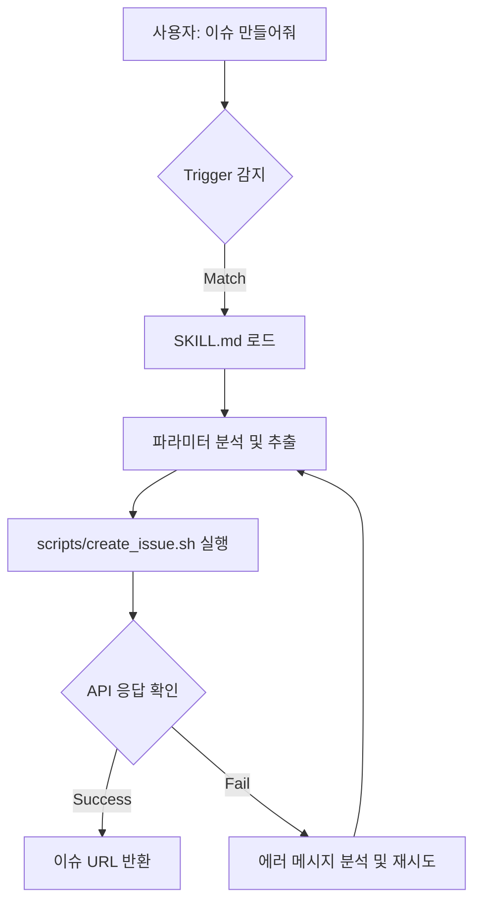

# 튜토리얼: 나만의 스킬 추가하기

💡 **Hermes의 기본 기능만으로도 충분하지만, 당신만의 독특한 워크플로우를 시스템화하고 싶다면 '커스텀 스킬(Custom Skill)'을 작성해 보세요.**

## 🌱 기본 개념
**'스킬(Skill)'**은 에이전트가 특정 목적을 달성하기 위해 사용하는 '전문 지식 패키지'입니다. 기본 스킬이 일반 상식이나 범용 도구라면, 커스텀 스킬은 특정 회사나 개인의 업무 방식에 최적화된 **'전담 전문가'**를 고용하는 것과 같습니다.

비유하자면, Hermes라는 인턴 사원에게 \"GitHub 이슈를 만드는 법\"을 가르치는 것입니다. 처음에는 하나하나 알려줘야 하지만, 일단 **'작업 매뉴얼(SKILL.md)'**과 **'전용 도구(Scripts)'**를 만들어 주면, 다음부터는 \"이슈 만들어줘\"라는 한 마디에 완벽하게 업무를 처리하는 숙련된 전문가가 됩니다.

## 🔍 문제 상황: 왜 커스텀 스킬이 필요한가?
단순한 채팅 요청으로 반복적인 작업을 수행하면 다음과 같은 한계가 발생합니다:

- **명령어의 파편화**: 매번 \"GitHub API를 쓰고, 제목은 [BUG]로 시작하고, 라벨은 'urgent'로 해서 이슈를 만들어줘\"라고 길게 설명해야 함. 이는 시간 낭비이며 휴먼 에러의 원인이 됩니다.
- **일관성 부족**: 요청할 때마다 에이전트가 조금씩 다른 방식으로 결과를 내놓아, 데이터의 정규화(Normalization)가 이루어지지 않음.
- **전달의 한계**: 나만 아는 효율적인 워크플로우를 다른 에이전트나 팀원에게 전달하기 어려움.

커스텀 스킬은 이러한 반복 프로세스를 **'코드화된 문서'**로 만들어, 누구나 동일한 품질의 결과를 얻을 수 있게 합니다.

## 🏗️ 기술 설계: [GitHub Issue 자동 생성 스킬]
우리가 만들 스킬은 사용자가 간단한 입력만 주면, 내부적으로 GitHub CLI(`gh`)를 호출하여 정해진 규격에 맞게 이슈를 생성하는 스킬입니다.

### 1. 스킬의 물리적 구조
Hermes는 스킬을 다음과 같은 표준 폴더 구조로 관리하여 유지보수성을 높입니다.
**경로**: `~/.hermes/skills/custom/github-auto-issue/`

- **`SKILL.md`**: 스킬의 **'두뇌'**입니다. 어떤 상황에 작동해야 하는지(Trigger), 어떤 순서로 작업해야 하는지(Steps), 성공했는지를 어떻게 판단하는지(Verification)가 정의된 명세서입니다.
- **`references/`**: 스킬 구현에 참고한 공식 API 문서, 예제 코드, 내부 규정 등이 보관됩니다. 에이전트가 스킬을 업데이트할 때 참고하는 '교과서' 역할을 합니다.
- **`scripts/`**: 실제 동작을 수행하는 **'손과 발'**입니다. `gh issue create`와 같은 쉘 스크립트나 파이썬 코드가 포함됩니다.

### 2. SKILL.md의 핵심 로직 설계
- **Trigger (트리거)**: \"GitHub 이슈 생성해줘\", \"버그 리포트 작성해줘\" 등 사용자의 의도를 분석하여 해당 스킬을 활성화합니다.
- **Steps (실행 단계)**:
    1. **Context 확인**: 현재 작업 중인 프로젝트의 GitHub 저장소 URL을 확인합니다.
    2. **Parameter 추출**: 사용자 입력에서 `제목`, `설명`, `라벨`을 분리합니다. 만약 누락되었다면 사용자에게 되묻는 Fallback 로직을 수행합니다.
    3. **Command 구성**: `gh issue create --title "..." --body "..." --label "..."` 형태의 명령어를 생성합니다.
    4. **Execution**: 스크립트를 실행하여 실제 GitHub API에 요청을 보냅니다.
- **Verification (검증)**: CLI의 표준 출력(stdout)에서 생성된 이슈의 URL(예: `https://github.com/.../issues/123`)을 추출하여 사용자에게 반환함으로써 성공을 증명합니다.

## 📊 스킬 적용 흐름도

## 💡 실습 가이드: 스킬 구현하기
이제 실제로 Hermes에게 요청하여 스킬을 구축해 보세요.

**1단계: 스킬 생성 요청**
> \"[TASK] GitHub 저장소의 Issue를 자동으로 생성하는 커스텀 스킬을 만들어줘. 제목, 설명, 라벨을 입력받아 `gh` CLI를 사용해 생성하도록 설계하고, `~/.hermes/skills/custom/github-auto-issue/` 경로에 구축해줘.\"

**2단계: 설계 및 구현 검토**
Hermes가 생성한 `SKILL.md`를 읽고, 특히 **Verification** 단계에서 URL을 정확히 추출하는지 확인하세요.

**3단계: 스킬 테스트**
> \"[TASK] 방금 만든 스킬을 사용해서 '로그인 페이지 레이아웃 깨짐' 이슈를 만들어줘. 라벨은 `bug`와 `ui`로 설정해줘.\"

## 🔗 관련 주제
- **[첫 번째 작업 요청하기](https://pheanor-agent.github.io/p-hermes/docs/wiki/getting-started/first-job.md)**: 스킬을 활용하여 실제 JOB을 수행하는 방법.
- **[지식 시스템 가이드](../guides/knowledge-system.md)**: 커스텀 스킬 작성 중 얻은 노하우를 위키 지식으로 변환하여 저장하는 방법.
