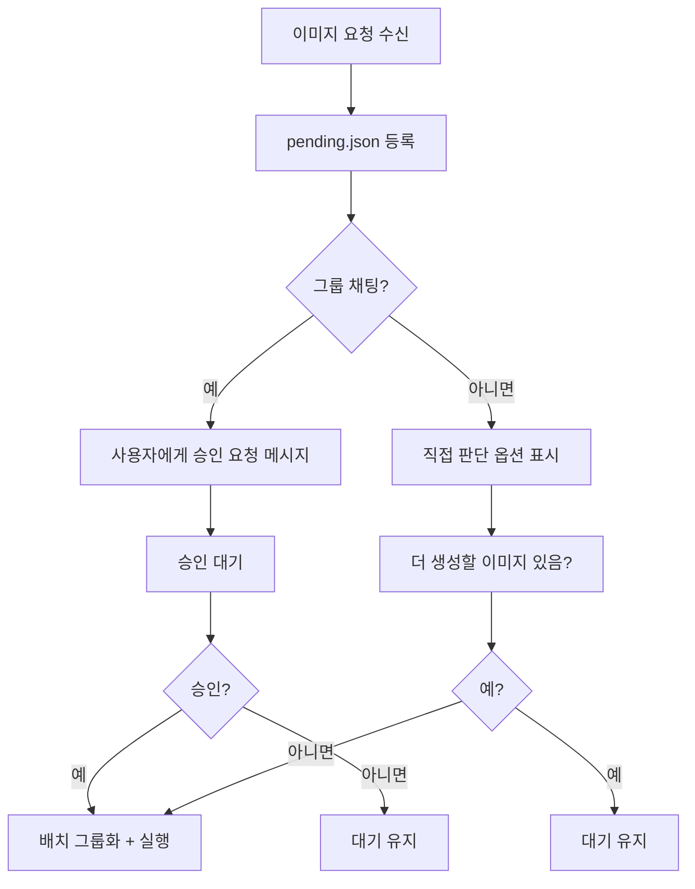

# RunPod ComfyUI 연동 가이드 (JOB-1289 시리즈)

## 개요

RunPod 외부 GPU 서버 (RTX 4090) 를 대여하여 ComfyUI + Flux2 이미지 생성 환경을 구축하고, Hermes 에서 API 로 제어하는 자동화 시스템.

**핵심 전략**:
- **배치 우선 처리**: 단일 생성보다 배치 처리로 비용 최소화
- **ROI 최적화**: Pod 유지 시간 최적화, Warm Start 활용
- **Flux2 최대 성능**: 최적 하이퍼파라미터, 고품질 프롬프트 전략
- **그룹 격리**: 채팅 그룹별로 독립적 배치, 출처 채널 기준 필터링
- **승인 워크플로우**: 배치 전 사용자 승인 (그룹 채팅 필수, DM 직접 판단)

## 아키텍처

```
┌─────────────────────────────────────────────────────────┐
│  Hermes (에르메스)                                         │
│                                                         │
│  ┌──────────────┐    ┌───────────────────────────────┐  │
│  │ image-queue  │    │  RunPod API Client             │  │
│  │ (배치 큐)      │───▶│  - Pod 시작/정지                │  │
│  └──────────────┘    │  - ROI 최적화                   │  │
│                      │  - 비용 모니터링                 │  │
│                      └───────────────────────────────┘  │
│                                    │                     │
│                      ┌─────────────▼──────────────┐     │
│                      │  ComfyUI API Client         │     │
│                      │  - Flux2 최적화 워크플로우     │     │
│                      │  - 배치 처리                 │     │
│                      └─────────────────────────────┘     │
└─────────────────────────────────────────────────────────┘
                          │
                  ┌───────▼───────┐
                  │  RunPod GPU   │
                  │  (RTX 4090)   │
                  │  ComfyUI      │
                  │  Flux2        │
                  └───────────────┘
```

## 설정 파일

### ~/.hermes/config/image-gen.yaml

```yaml
# 제공자 설정
providers:
  - name: runpod
    type: comfyui_remote
    endpoint: "http://213.173.110.132:11934"
    api_token_env: "RUNPOD_API_KEY"
    gpu: "RTX 4090"
    active: true

# 배치 설정
batch:
  enabled: true
  max_size: 50
  approval_required: true      # 배치 전 승인 필수
  group_isolation: true        # 그룹 격리 활성화

# Pod 제어
pod:
  start_on_batch: true         # 배치 시 Pod 자동 시작
  idle_timeout: 600            # 10 분 (Warm Start 대비)
  stop_mode: "batch"           # "batch" 또는 "immediate"

# ROI 설정
roi:
  warm_start_cost_krw: 24.5    # Warm Start 비용
  cold_start_cost_krw: 49.0    # Cold Start 비용
  per_image_cost_krw: 2.72     # GPU 비용/장
  daily_budget_krw: 70000      # 일일 한도

# Flux2 최적화
flux2:
  steps: 25
  cfg: 7.5
  sampler: "dpmpp_2m"
  scheduler: "karras"
  resolution: "1024x1024"
```

## 대기 큐 구조

```yaml
# ~/.shared/queue/images/pending.json
queue:
  - id: "entry_id"
    projectId: "project_slug"
    sourceChannel: "telegram:-3975653825:219"  # 출처 채널/토픽
    sourceUser: "pheanor"                       # 요청자 ID
    status: "pending"
    createdAt: "ISO8601"
    metadata:
      prompt: "..."
      resolution: "1024x1024"
```

## 승인 워크플로우



### 승인 메시지 템플릿

```
📸 이미지 배치 대기 중

• 총 {count} 장
• 예상 비용: {cost} 원
• 출처: {groups}

진행하시겠습니까?
[1] 진행
[2] 대기 유지
[3] 개별 상세 확인
```

## 비용 분석

| 배치 크기 | 장당 비용 | 비고 |
|----------|----------|------|
| 1 장 | 27 원 | Cold Start 포함 |
| 10 장 | 4.6 원 | Warm Start 포함 |
| 20 장 | 3.0 원 | Warm Start 포함 |
| 50 장 | 1.9 원 | Warm Start 포함 |

**Pod 유지 결정**:
- 추가 작업 대기: 즉시 처리
- 무작업: 10 분 유지 (Warm Start 비용 24.5 원 절감)
- 10 분 초과: Pod 정지

## Flux2 최적화 설정

### 하이퍼파라미터

```json
{
  "steps": 25,
  "cfg": 7.5,
  "sampler_name": "dpmpp_2m",
  "scheduler": "karras",
  "denoise": 1.0,
  "resolution": "1024x1024"
}
```

### Negative Prompt (기본)

```
blurry, bad quality, distorted, deformed, ugly, duplicate, morbid, mutilated, poorly drawn, bad anatomy, wrong anatomy, extra limb, missing limb, floating limbs, disconnected limbs, mutation, mutated, ugly, disgusting, amputation
```

## 제어 스크립트 사용법

### Pod 상태 확인

```bash
python3 scripts/pod_manager.py --action status
```

### Pod 시작 + 모델 설치 확인

```bash
python3 scripts/pod_manager.py --action ensure
```

### Pod 정지

```bash
python3 scripts/pod_manager.py --action stop
```

### 배치 승인 미리보기

```bash
python3 scripts/batch_approval.py --action preview
```

### 그룹 격리 필터

```bash
python3 scripts/group_isolation.py --channel "telegram:-3975653825:219" --action filter
```

### 비용 사용량 확인

```bash
python3 scripts/cost_manager.py --action status
```

## 에러 처리

| 에러 | 해결 방법 |
|------|----------|
| Pod 시작 실패 | 재시도 (3 회, 지수 백오프: 1 초 → 2 초 → 4 초) |
| Pod readiness timeout | 5 분 초과 시 Pod 종료 후 재시도 (3 회) |
| ComfyUI API 타임아웃 | 작업 취소, 재시도 |
| 네트워크 오류 | 지수 백오프 재시도 (base=1 초, max=30 초) |
| 결과 다운로드 실패 | 재시도 (3 회) |
| OOM 에러 | ComfyUI 재시작 시도, 실패 시 Pod 재시작 |
| 일일 한도 초과 | 자동 정지 + 알림 |

## 보안

- **API 토큰**: 환경변수 저장 (`~/.hermes/env`, 평문 저장 금지)
- **ComfyUI API**: Pod 내부 네트워크만 접근 (8188 포트 외부 차단)
- **HTTPS**: ComfyUI API 는 HTTP (내부 네트워크), 외부 통신은 HTTPS
- **볼륨**: 모델/결과 데이터는 Persistent Volume 저장

## 모델 지속성

**Persistent Volume 사용**:
- Pod 생성 시 50GB SSD 볼륨 마운트
- Flux2 모델, LoRA, 커스텀 노드 모두 볼륨에 저장
- Pod 정지 시 볼륨 유지 (다음 시작 시 재사용)
- 템플릿 고정: `comfyui-stable`

## Cold Start 시간

- Cold start (Pod 생성 + ComfyUI 시작): **2-5 분**
- Warm start (볼륨 유지, 재시작): **1-2 분**
- 첫 실행 시 모델 로드 추가 시간: ~1 분

## WebSocket vs Polling

- WebSocket: 실시간 작업 상태 수신 (기본)
- Polling: WebSocket 연결 실패 시 `/queue` endpoint 폴링 (5 초 간격)
- 자동 fallback: WebSocket 3 회 연결 실패 시 polling 전환

---

**최종 업데이트**: 2026-05-24 (v3.0 + 배치 승인 워크플로우 + 그룹 격리)