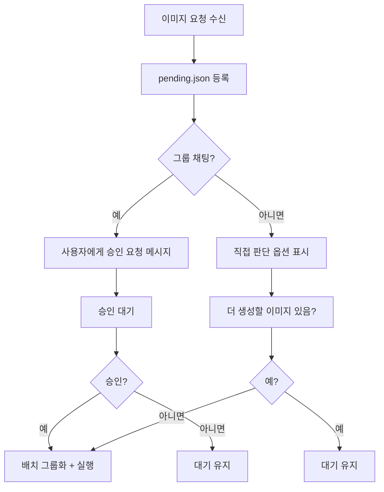

# 배치 승인 워크플로우 - JOB-1338

## 개요

사용자가 요청한 배치 승인 기반 이미지 생성 워크플로우. 자동 5 분 병합 로직 제거, 승인 필수, 그룹 격리 구현.

## 변경 내역

### ❌ 제거된 기능
- 5 분 시간창 자동 병합 로직 (기존 `batch_group.py` time_window 기반)

### ✅ 추가된 기능
1. **배치 전 승인 요청**: 사용자에게 진행 여부 확인
2. **그룹 격리**: `sourceChannel` 필드로 출처 추적, 결과 격리
3. **직접 판단 옵션**: DM 에서 "더 생성할 이미지 있음?" 확인

## 큐 구조 변경

```yaml
queue:
  - id: "entry_id"
    projectId: "project_slug"
    sourceChannel: "telegram:-3975653825:219"  # NEW:出处 채널/토픽
    sourceUser: "pheanor"                       # NEW: 요청자 ID
    status: "pending"
    createdAt: "ISO8601"
    metadata:
      prompt: "..."
      resolution: "1024x1024"
```

## 승인 워크플로우



## 그룹 격리 구현

- **필터링**: `batch_approval.py --source-channel {channel}`
- **결과 격리**: 해당 그룹에서 요청하지 않은 이미지 결과에서 제외
- **출처 추적**: 모든 큐 항목에 `sourceChannel` 필드 필수

## 승인 메시지 템플릿

```
📸 이미지 배치 대기 중

• 총 {count} 장
• 예상 비용: {cost} 원
• 출처: {groups}

진행하시겠습니까?
[1] 진행
[2] 대기 유지
[3] 개별 상세 확인
```

## CLI 명령어

```bash
# 배치 미리보기
batch_approval.py --action preview

# 그룹 격리 필터
batch_approval.py --source-channel "telegram:-3975653825:219" --action preview

# 승인 및 claimed 상태로 변경
batch_approval.py --action approve

# 채널별 리포트
group_isolation.py --action report
```

## 설정 파일

`~/.hermes/config/image-gen.yaml`:
```yaml
batch:
  enabled: true
  max_size: 50
  approval_required: true      # 배치 전 승인 필수
  group_isolation: true        # 그룹 격리 활성화
```

## 관련 파일

- `comfyui_api.py` - ComfyUI API 클라이언트
- `batch_group.py` - 배치 그룹화 로직
- `batch_approval.py` - 승인 워크플로우
- `group_isolation.py` - 그룹 격리 필터
- `image-gen.yaml` - 통합 설정

---

**작성일**: 2026-05-24
**작성자**: Hermes Agent (JOB-1338)
