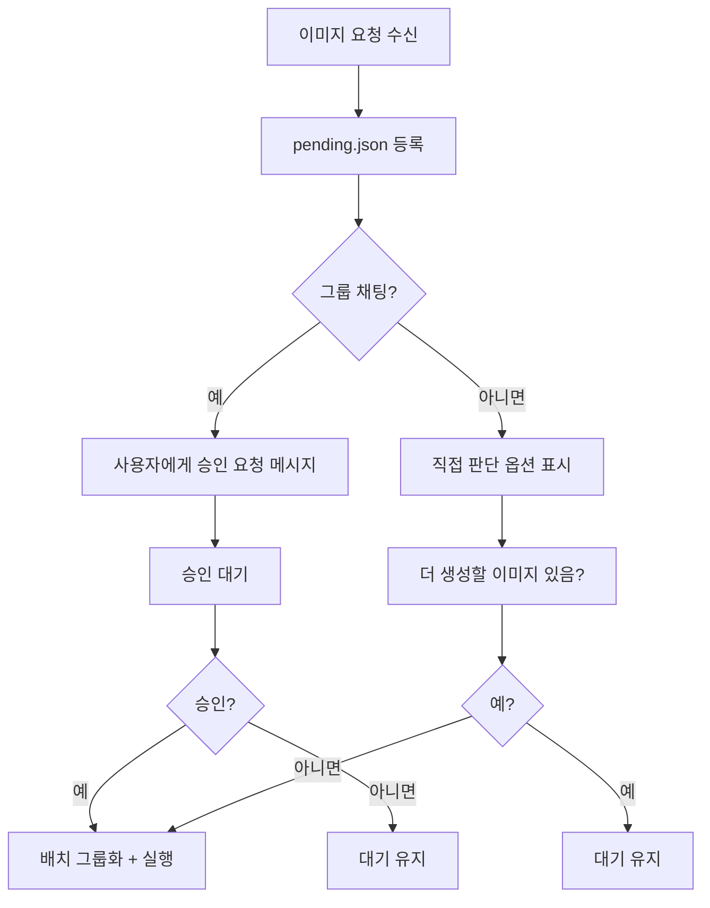

# RunPod ComfyUI 연동 참조 가이드 (JOB-1333, 1338)

## 개요

Hermes Agent 가 RunPod 외부 GPU 서버 (RTX 4090) 를 제어하여 Flux2 모델로 고품질 이미지를 생성하는 자동화 파이프라인.

## 아키텍처

```
Hermes → RunPod API (GQL) → ComfyUI API (REST/WS) → RunPod GPU
```

## 핵심 구성 요소

### 1. ComfyUI API 클라이언트 (`comfyui_api.py`)

- 워크플로우 제출 (`POST /prompt`)
- 결과 수집 (`GET /history/{prompt_id}`)
- WebSocket/polling 지원
- 배치 처리 (`wait_for_all()`, `download_all()`)

### 2. 배치 그룹화 (`batch_group.py`)

- 동일 `projectId+loraId` 그룹화
- 5 분 시간 창 기반 병합
- 최대 배치 50 장
- 비용 추정 (`estimate_cost()`)

### 3. 그룹 격리 (JOB-1338)

- `sourceChannel` 필드로 출처 추적
- `sourceUser` 필드로 요청자 기록
- 그룹 채팅: 승인 필수
- DM: 직접 판단 옵션 ("더 생성할 이미지 있음?")
- 결과 격리: 각 그룹은 해당 그룹 요청 이미지만 확인

## Flux2 최적화 파라미터

| 파라미터 | 값 |
|----------|-----|
| steps | 25 |
| cfg | 7.5 |
| sampler | dpmpp_2m |
| scheduler | karras |
| resolution | 1024x1024 |

## 비용 분석

| 항목 | 비용 (원) |
|------|-----------|
| 장당 GPU 비용 | 2.72 |
| Warm Start (10 분 유지) | 24.5 |
| Cold Start (2-5 분) | 49.0 |
| 10 장 배치 (Warm Start 포함) | 4.6 원/장 |
| 월 1 만장 기준 | 약 5,000 원 |

## Pod 관리 전략

- **On-Demand 방식**: 작업 시에만 구동
- **10 분 유지**: Warm Start 비용 (약 24.5 원) 분산을 위해 무작업 시 10 분 후 정지
- **배치 최적화**: 5 분 시간 창 내 동일 프로젝트/LoRA 작업 자동 그룹화
- **목표**: 단일 장당 비용 27 원 → 배치 시 1.9~4.6 원 절감

## 상태 머신

```
pending → claimed → processing → completed
                    ↓ (15 분 TTL 롤백)
                  failed_archive
```

## 동시성 제어

- `flock -n` 기반 원자적 접근
- `with_lock()` 래퍼 사용
- Entry 상태 전환 (`pending→claimed→processing→completed`)
- 15 분 TTL 초과 시 자동 롤백으로 큐 교착 방지

## 승인 워크플로우 (JOB-1338)



## 대기 큐 구조 변경 (JOB-1338)

```yaml
queue:
  - id: "entry_id"
    projectId: "project_slug"
    sourceChannel: "telegram:-3975653825:219"  # 출처 채널
    sourceUser: "pheanor"                       # 요청자
    status: "pending"
    createdAt: "ISO8601"
    metadata:
      prompt: "..."
      resolution: "1024x1024"
```

## 승인 메시지 템플릿

```
📸 이미지 배치 대기 중

• 총 {count} 장
• 예상 비용: {cost} 원
• 출처: {groups}

진행하시겠습니까?
[1] 진행
[2] 대기 유지
[3] 개별 상세 확인
```

## 관련 파일

- `~/.hermes/workspace/jobs/JOB-1333-ComfyUI-연동-API-+-image-queue-연동-parent-JOB-1289/`
- `~/.hermes/workspace/jobs/JOB-1338-이미지-배치-승인-워크플로우-그룹-격리-JOB-1289/`
- `~/.hermes/skills/custom/image-generation/comfyui-remote/scripts/`

---

**작성일**: 2026-05-24
