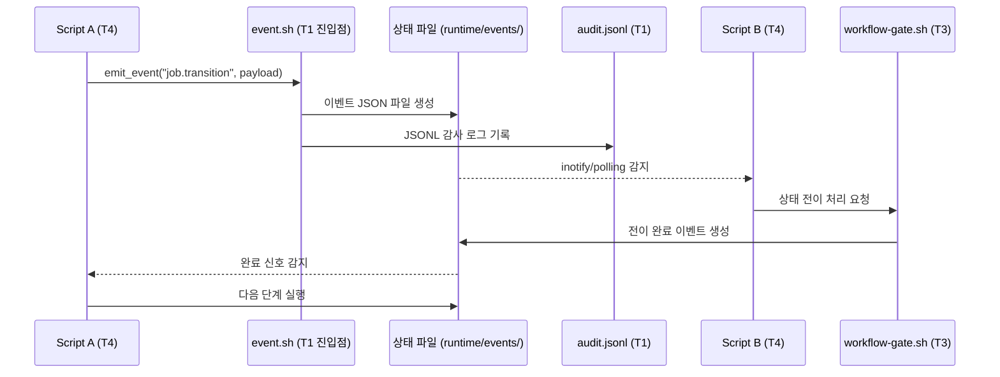
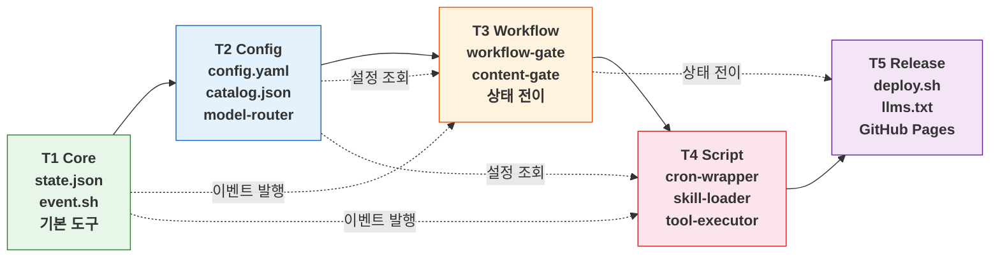
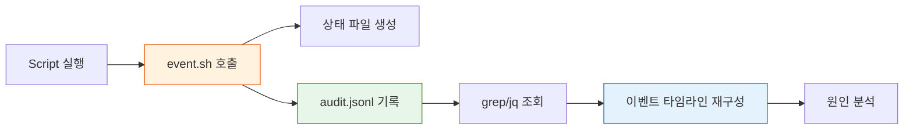

# 레이어드 아키텍처: 왜 모듈화가 에이전트 시스템의 생존 조건인가

> **💡 한 줄 요약**: Hermes의 레이어드 아키텍처는 Core, Runtime, Interfaces, Infra, Release로 수직 분리를 통해 수평 확장을 가능하게 하며, event.sh 단일 진입점과 JSONL 감사 추적을 통해 시스템 신뢰성을 확보합니다.

---


## 💡 한 줄 요약

Hermes의 레이어드 아키텍처는 수직 분리로 수평 확장을 가능하게 하며, event.sh 단일 진입점과 JSONL 감사 추적을 통해 시스템 신뢰성을 확보합니다.

---

## 서론: 단단한 결합이 야기하는 시스템 취약성

AI 에이전트 시스템은 점점 더 많은 기능을 통합합니다. 코드 생성, 파일 관리, 스케줄링, 메시징, 메모리 관리, 외부 API 연동 — 각각의 기능은 자체적으로 복잡한 로직을 포함합니다. 이러한 기능들이 하나의 스크립트나 단일 진입점에 밀집하면, 시스템은 예측 불가능하게 불안정해집니다.

공학적 시스템에서 **'단단한 결합(Tight Coupling)'**은 변화에 대한 저항력을 약화시킵니다. 하나의 스크립트가 파일 조작, 상태 관리, 외부 통신을 모두 수행할 경우, 각 책임 영역이 서로 의존하게 됩니다. Config 파일 형식이 변경되면 파일 처리 스크립트를 수정해야 하고, 상태 관리 로직이 바뀌면 통신 함수를 함께 고쳐야 합니다. 이러한 연쇄 수정은 변경 범위를 통제 불능 상태로 키웁니다.

Hermes는 이 문제를 구조적 분리로 해결합니다. **레이어드 아키텍처** — Core, Runtime, Interfaces, Infra, Release — 는 각 계층이 단일 책임을 가지도록 강제합니다. 설계 철학은 명확합니다: **'수직 분리가 수평 확장을 가능하게 한다'**.

---

## 🌱 기본 개념: 계층(Hierarchy)과 책임(Separation of Concerns)

소프트웨어 공학에서 계층화(Hierarchy)란 시스템을 기능적 경계로 나누고, 각 계층이 고유한 책임을 맡도록 조직하는 설계 방법입니다.

- **일상생활의 비유**: 건설 현장에서 '설계도 작성', '자재 관리', '시공', '품질 검사', '인도'가 서로 다른 전문가 팀이 담당합니다. 설계자가 직접 시공을 수행하거나, 시공자가 품질 검사를 스스로 하는 구조보다 각 전문가가 고유한 영역에 집중하는 구조가 결과물의 품질과 신뢰성을 높입니다.
- **AI 에이전트 시스템에 적용**: Hermes는 시스템의 핵심 논리(Core), 구성(Config), 작업 흐름(Workflow), 스크립트(Script), 배포 버전(Release)을 각각 독립된 계층으로 분리합니다. 각 계층은 인접 계층과만 통신하며, 건너뛰어 통신할 수 없습니다.

계층화의 핵심 이점은 **'변경의 국소화'**입니다. Config 파일 형식이 변경되어도 Workflow, Script, Release 계층은 영향받지 않습니다.Workflow 상태 전이 로직이 개선되어도 Core와 Script 계층은 변경이 필요 없습니다.

### 레이어드 구조 개요

| 계층 | 책임 | 파일/경로 | 외부 의존성 |
|------|------|-----------|-------------|
| **Core (T1)** | 시스템 핵심 상태 관리, 모델 라우팅, 기본 도구 호출 | `core/state.json`, `core/scripts/model-router.sh` | 없음 (최저 의존성) |
| **Config (T2)** | YAML/TOML 설정 파일 파싱, 유효성 검사 | `core/config.yaml`, `catalog.json` | Core |
| **Workflow (T3)** | 9단계 상태 머신, 워크플로우 엔진, gate 검사 | `workflow-gate.sh`, `.workflow-state` | Core, Config |
| **Script (T4)** | 도메인별 스크립트 (cron, skill, tool 등) | `scripts/*.sh`, `core/scripts/*.sh` | Core, Config, Workflow |
| **Release (T5)** | 배포 패키지, 버전 관리, GitHub Pages 연동 | `src/deploy.sh`, `docs/` | 전체 계층 |

---

## 🏗️ 기술 설계: 비동기 통신과 event.sh 단일 진입점

Hermes는 스크립트 간 직접 호출을 금지하고, **event.sh**를 유일한 진입점으로 강제합니다.

### 설계 철학: "모든 변화는 하나의 관문을 통과한다"

event.sh는 Hermes 시스템의 신경 중추입니다. 모든 스크립트, Job, 워크플로우는 서로 직접 통신할 수 없습니다. event.sh를 통해 상태를 변경하고, 다른 모듈이 그 변경을 감지하여 반응합니다. 이 설계가 추구하는 세 가지 원칙:

1. **Single Entry Point**: 시스템 내부의 모든 상태 변경은 event.sh를 통과합니다.
2. **Asynchronous Decoupling**: 송신자와 수신자는 서로의 존재를 알 필요 없이 상태 파일을 매개로 통신합니다.
3. **Auditability**: event.sh가 처리하는 모든 이벤트는 JSONL 형식의 로그에 기록되어 완전한 감사 추적이 가능합니다.

### 상태 파일 기반 통신 (State File Messaging)

event.sh는 이벤트 큐를 파일 시스템에 유지합니다. 각 이벤트는 JSON 객체로 직렬화되어 `core/skills/shared/system-common/lib/` 디렉토리에 기록됩니다.

```
~/.hermes/runtime/events/
├── 2026-06-17T10-00-00.json    # 이벤트 타임스탬프
├── 2026-06-17T10-05-30.json
└── ...
```

각 이벤트 파일의 구조:

```json
{
  "timestamp": "2026-06-17T10:05:30Z",
  "source": "workflow-gate.sh",
  "event": "job.transition",
  "job_id": "JOB-1234",
  "from": "design",
  "to": "review",
  "payload": {
    "design_file": "design.md",
    "validators_passed": ["l2", "l3", "l4"]
  }
}
```

이 상태 파일은 다른 모듈이 `inotify` 또는 폴링(polling) 방식으로 감지하여 처리합니다. 송신자는 수신자가 누구인지, 언제 처리될 것인지 알 필요가 없습니다.

### event.sh 단일 진입점 아키텍처

```bash
# event.sh — 모든 이벤트의 단일 진입점
emit_event() {
    local source="$1"
    local event="$2"
    local payload="$3"
    
    local timestamp=$(date +%Y-%m-%dT%H-%M-%S)
    local event_file="${HERMES_ROOT}/runtime/events/${timestamp}.json"
    
    # 이벤트 객체 생성
    jq -n \
        --arg ts "$(date -u +%Y-%m-%dT%H:%M:%SZ)" \
        --arg src "$source" \
        --arg evt "$event" \
        --argjson payload "$payload" \
        '{timestamp: $ts, source: $src, event: $evt, payload: $payload}' \
        > "$event_file"
    
    # 감사 로그 기록
    echo "{\"ts\": \"$(date -u +%Y-%m-%dT%H:%M:%SZ)\", \"src\": \"$source\", \"evt\": \"$event\"}" \
        >> "${HERMES_ROOT}/runtime/audit.jsonl"
}

# 사용 예시
emit_event "workflow-gate.sh" "job.transition" \
    '{"job_id": "JOB-1234", "from": "design", "to": "review"}'
```

### 비동기 통신이 주는 이점

직접 호출 패턴을 비동기 통신으로 대체하며 얻는 구조적 이점이 명확합니다.

**교착 상태 소멸**: 서로를 직접 호출하는 관계가 사라지므로, 교착 상태의 전제가 제거됩니다. 모듈은 상태 파일만 읽고 쓰기 때문에, 자원 잠금(lock) 경쟁이 발생하지 않습니다.

**실패 격리**: 한 모듈의 실패가 다른 모듈에 전파되지 않습니다. 실패한 모듈의 상태 파일이 업데이트되지 않으면, 다른 모듈은 이전 상태로 계속 작동하며, 실패 모듈이 복구된 후 이벤트가 재전송됩니다.

**확장성**: 새로운 모듈을 추가할 때 기존 모듈의 코드를 수정할 필요가 없습니다. 상태 파일을 읽는 새로운 모듈을 추가하면, 기존 시스템이 생산하는 이벤트를 자동으로 처리합니다.

## 📊 구조/흐름도

아키텍처의 구조와 데이터 흐름을 시각화한 다이어그램입니다.

### Mermaid: event.sh 기반 비동기 통신 흐름



---

## 📊 레이어드 구조: 계층 간 관계망으로 수평 확장 가능

### 계층 간 의존성 관계

레이어드 아키텍처의 핵심은 **계층 간 명확한 경계**와 **필요한 의존성만 허용**하는 것입니다. Core는 독립적으로 동작하며, 상위 계층은 하위 계층을 필요할 때만 참조합니다.



**실제 의존성 관계**

| 계층 | 직접 의존 | 간접 의존 (이벤트/설정) |
|------|-----------|------------------------|
| T1 Core | 없음 | 없음 |
| T2 Config | T1 | 없음 |
| T3 Workflow | T1, T2 | 없음 |
| T4 Script | T1, T2, T3 | 없음 |
| T5 Release | T1, T2, T3, T4 | 없음 |

실제 시스템에서 각 계층은 필요한 기능만 하위 계층에서 가져옵니다. Core의 `event.sh`는 모든 계층에서 사용할 수 있으며, Config의 설정은 Workflow와 Script에서 필요할 때 조회합니다.

### 계층별 상세 설계

**T1 Core — 시스템의 심층**

Core 계층은 시스템의 가장 내측에 위치하며, 어떤 외부 의존성도 포함하지 않습니다. 상태 파일(`state.json`)의 읽기/쓰기, 이벤트 진입점(`event.sh`), 기본 도구 호출 인터페이스가 여기에 속합니다. Core 계층이 변경되면 모든 상위 계층이 영향을 받습니다. Core가 변경되는 시점은 시스템의 근본적 구조가 바뀌는 때 — 예를 들어 상태 머신 전이 규칙이 변경되거나, 이벤트 프로토콜이 업데이트될 때입니다.

**T2 Config — 구성의 경계**

Config 계층은 YAML 설정 파일과 JSON 카탈로그를 파싱하며, Core 상태 파일과 연동합니다. `config.yaml`에 정의된 모델 라우팅 규칙, `catalog.json`에 등록된 모델 목록, 프로필(Profile)별 설정 등을 처리합니다. Config 계층의 변경은 모델 추가, 라우팅 규칙 수정, 설정 값 업데이트 등에서 발생합니다.

**T3 Workflow — 상태의 관문**

Workflow 계층은 9단계 상태 머신의 구현체입니다. `workflow-gate.sh`는 상태 전이를 검증하고 승인하며, `content-gate.sh`는 콘텐츠 품질 게이트를 통과하는지 확인합니다. Config 계층에서 설정을 읽어서 상태 전이 조건을 평가합니다. Workflow의 변경은 새 단계 추가, 전이 규칙 수정, 게이트 조건 추가 등에서 발생합니다.

**T4 Script — 도메인의 구현**

Script 계층은 Cron Job, Skill, Tool Executor 등 도메인별 구현체를 담습니다. Workflow 계층의 상태 전이를 트리거하며, event.sh를 통해 다른 스크립트와 통신합니다. Script 계층이 가장 빈번하게 변경됩니다. 새로운 스크립트 추가, 기존 스크립트 로직 수정, 도메인별 커스터마이징이 여기에 해당합니다.

**T5 Release — 배포의 포맷**

Release 계층은 빌드, 패키징, GitHub Pages 배포, llms.txt 재생성을 담당합니다. `src/deploy.sh`는 링크 검증, 문서 재생성, git push를 연동합니다. Release 계층의 변경은 배포 파이프라인 수정, 문서 구조 변경, 빌드 옵션 추가 등에서 발생합니다.

### 수직 분리가 수평 확장으로 연결되는 과정

레이어드 아키텍처가 제공하는 확장 메커니즘은 다음과 같습니다.

**1. 독립적 버전 관리**: 각 계층의 변경 빈도가 다릅니다. Core는 분기별로, Script는 매일 변경될 수 있습니다. 독립적 계층화가 가능하면 각 계층의 릴리스 주기를 분리할 수 있습니다. Script 계층에 새로운 도메인 스크립트를 추가하더라도 Core를 재배포할 필요가 없습니다.

**2. 도메인별 Script 추가**: T4 Script 계층에 새로운 도메인 스크립트를 추가하면, 기존 시스템은 전혀 수정되지 않습니다. event.sh를 사용하는 패턴만 따르는 한, 어떤 도메인 스크립트도 시스템에 통합됩니다.

**3. 대체 구현체 교체**: T2 Config에 새로운 모델 공급자를 등록하면, T3 Workflow와 T4 Script는 모델 라우팅 규칙만 업데이트됩니다. 기존 스크립트 코드의 수정은 필요 없습니다.

---

## 💡 활용 예시: 레이어드 아키텍처 하에서의 Cron Job 추가

새로운 Cron Job을 Hermes 시스템에 추가하는 과정을 통해 레이어드 아키텍처의 작동 방식을 확인합니다.

```bash
# Step 1: Cron Job 정의 (T4 Script 계층에 추가)
# scripts/monitor-disk.sh
#!/bin/bash
source "${HERMES_ROOT}/core/scripts/event.sh"

# 디스크 사용량 확인
usage=$(df / | tail -1 | awk '{print $5}' | tr -d '%')

if [ "$usage" -gt 90 ]; then
    emit_event "monitor-disk.sh" "alert.disk.high" \
        '{"usage_percent": '$usage'}'
fi

# Step 2: 이벤트가 audit.jsonl에 자동 기록 (T1 Core)
# 2026-06-17T10:30:00Z monitor-disk.sh alert.disk.high

# Step 3: workflow-gate.sh가 감지하여 알림 Job 생성 (T3 Workflow)
# Step 4: notify.sh가 event를 소비하여 Telegram/Discord 알림 전송 (T4 Script)
```

Cron Job 추가 과정에서 수정된 계층은 T4 Script뿐입니다. Core, Config, Workflow, Release 계층에는 변경이 없습니다. 기존 시스템이 어떻게 작동하는지 알 필요 없이, event.sh 함수만 import 하면 시스템에 통합됩니다.

---

## 감사 추적성: JSONL 이벤트 히스토리의 디버깅 편의성

### JSONL 형식의 감사 로그

Hermes는 event.sh를 통과하는 모든 이벤트를 JSONL(JavaScript Object Notation Lines) 형식으로 기록합니다. 각 라인이 독립적인 JSON 객체이므로, 표준 Unix 도구로 파싱하고 조회할 수 있습니다.

```bash
# 최근 10개 이벤트 조회
tail -10 ~/.hermes/runtime/audit.jsonl

# 출력 예시
{"ts": "2026-06-17T09:00:00Z", "src": "cron-wrapper.sh", "evt": "job.start", "job": "JOB-1234"}
{"ts": "2026-06-17T09:01:30Z", "src": "workflow-gate.sh", "evt": "job.transition", "from": "investigation", "to": "design"}
{"ts": "2026-06-17T09:15:00Z", "src": "workflow-gate.sh", "evt": "job.transition", "from": "design", "to": "review"}
{"ts": "2026-06-17T09:18:00Z", "src": "content-gate.sh", "evt": "validation.pass", "level": "l3"}
{"ts": "2026-06-17T09:20:00Z", "src": "workflow-gate.sh", "evt": "job.transition", "from": "review", "to": "execution"}
```

### 디버깅 시나리오

JSONL 감사 로그가 주는 디버깅 이점을 실제 시나리오에서 확인합니다.

**시나리오**: Cron Job이 의도한대로 실행되지 않았을 때의 디버깅 경로입니다.

```bash
# 1. 해당 Job의 이벤트 추적
grep "JOB-1234" ~/.hermes/runtime/audit.jsonl

# 2. 이벤트 타임라인 재구성
grep "JOB-1234" ~/.hermes/runtime/audit.jsonl | jq -r '.ts + " | " + .src + " → " + .evt'

# 출력:
# 2026-06-17T09:00:00Z | cron-wrapper.sh → job.start
# 2026-06-17T09:00:05Z | workflow-gate.sh → job.transition (investigation → design)
# 2026-06-17T09:05:00Z | workflow-gate.sh → job.transition (design → review)
# ← 여기서 review → execution 전이가 없음
# → review 단계에서 content-gate 검증을 통과하지 못함

# 3. 원인 확인
grep "JOB-1234" ~/.hermes/runtime/audit.jsonl | jq -r 'select(.evt | contains("validation"))'
```

감사 로그를 통해 Job이 review 단계에서 중단되었음을 10초 내에 파악할 수 있습니다. 이벤트 기반 아키텍처의 부가 효과입니다.

### Mermaid: 감사 추적 흐름



---

## 🔗 관련 주제

- [왜 9단계 상태머신인가?](./why-9-step-workflow.md): 레이어드 아키텍처 위에서 작동하는 상태 머신 설계.
- [역할 기반 모델 라우팅 설계](./model-routing-design.md): Config 계층과 연동된 모델 라우팅 전략.
- [Cron System 설계 분석](./cron-automation-design.md): Script 계층의 Cron 자동화 구현.

---

## 향후 전망: 마이크로서비스 아키텍처와의 수렴과 모듈화 플랫폼의 진화

Hermes의 레이어드 아키텍처는 마이크로서비스 아키텍처(MSA) 설계 원칙과 동일한 철학을 공유합니다. 마이크로서비스가 애플리케이션을 서비스 경계로 나누고 REST/gRPC로 통신하는 것처럼, Hermes는 스크립트를 계층 경계로 나누고 event.sh + 상태 파일로 통신합니다.

### 수렴 포인트

**이벤트 기반 아키텍처(EBA)**: 마이크로서비스 환경에서 Kafka, RabbitMQ 같은 메시지 브로커가 서비스 간 비동기 통신을 중재하는 패턴입니다. Hermes의 event.sh는 동일한 역할을 파일 시스템 레벨에서 수행합니다. 상태 파일을 메시지 브로커의 대안으로 사용하며, 같은 비동기 감쇠(decoupling) 원리를 적용합니다.

**관측 가능성(Observability)**: 마이크로서비스 환경에서 Distributed Tracing(Jaeger, Zipkin)과 Structured Logging(ELK Stack)이 시스템 상태를 가시화합니다. Hermes의 JSONL 감사 로그는 동일한 목적을 더 경량한 형태로 제공합니다.

**독립적 배포**: 마이크로서비스의 핵심 이점 중 하나는 개별 서비스의 독립적 배포입니다. Hermes의 레이어드 구조는 Script 계층의 변경이 다른 계층에 영향을 주지 않으므로, 동일한 독립적 배포를 스크립트 레벨에서 실현합니다.

### 진화 방향

**1. 이벤트 스토밍(Event Storming)**: 현재 event.sh는 단일 파일 기반 큐를 사용합니다. 대량의 이벤트가 발생하는 시나리오에서 Redis Streams나 NATS JetStream 같은 외부 이벤트 스토어로 확장합니다. 이벤트 중복 발행 처리(at-least-once delivery)와 순서 보장을 추가합니다.

**2. 서비스 메시(Service Mesh) 패턴**: Istio가 마이크로서비스 간 통신을 프록시 레이어에서 관리하는 것처럼, Hermes는 event.sh를 확장하여 인터셉트, 재시도, 서킷 브레이커 패턴을 제공합니다. 개별 스크립트는 통신 로직을 구현할 필요 없이, event.sh가 모든 횡단 관심사(cross-cutting concern)를 처리합니다.

**3. 다중 에이전트 오케스트레이션**: 레이어드 아키텍처는 다중 에이전트 환경에 자연스럽게 확장됩니다. 각 에이전트가 독립적인 T4 Script 계층을 가지며, 공통의 event.sh를 통해 이벤트 기반 통신을 수행합니다. 이벤트 필터링과 라우팅 규칙을 통해 에이전트 간 협력과 경쟁을 조정합니다.

### 모듈화 플랫폼의 궁극적 목표

모듈화 플랫폼의 궁극적 목표는 **'투명한 확장'**입니다. 새로운 기능을 추가할 때 기존 코드를 그대로 유지하며, 새로운 모듈만 추가하면 시스템이 자동으로 통합합니다. 레이어드 아키텍처는 이 목표를 향한 구조적 기반입니다.

Hermes는 현재 레이어드 아키텍처를 파일 시스템과 쉘 스크립트 레벨에서 구현하고 있습니다. 마이크로서비스 아키텍처의 설계 원칙을 지속적으로 적용하며, 플랫폼의 확장성과 신뢰성을 높여갑니다.

---

_모듈화는 에이전트 시스템의 생존 조건입니다. 단단하게 결합된 시스템은 작은 변화에도 무너지지만, 느슨하게 결합된 시스템은 새로운 기능의 추가에 견고하게 대응합니다. Hermes의 레이어드 아키텍처는 이 원리를 에이전트 시스템에 구현한 사례입니다._
