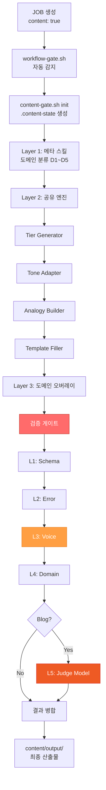
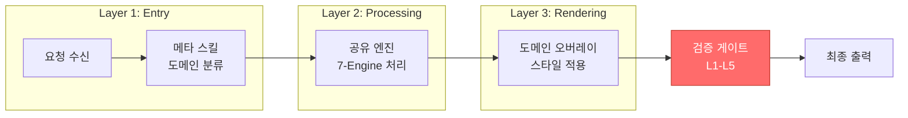
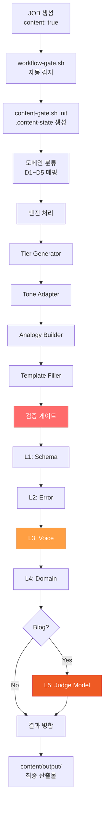

# Anti-Slop 파이프라인: AI 텍스트의 품질을 보증하는 5계층 검증

## 💡 한 줄 요약

콘텐츠 시스템은 도메인 분류부터 5계층 검증 게이트까지 AI 생성 텍스트를 체계적으로 정제하는 파이프라인입니다.

## 기본 개념

콘텐츠 시스템은 3-Layer 아키텍처(Layer 1: 메타 스킬 진입점 → Layer 2: 공유 엔진 처리 → Layer 3: 도메인 오버레이 렌더링)와 5계층 검증 게이트(L1 구조 → L2 에러 → L3 어조 → L4 도메인 → L5 Judge)로 구성됩니다. Anti-Slop 라이브러리가 AI-isms를 차단하고, 도메인별 템플릿이 전문성을 보장합니다. 7가지 공유 엔진(tier_generator, tone_adapter, analogy_builder, validator 등)이 도메인별 콘텐츠를 구조화하고 검증합니다.

## 기술 설계

콘텐츠 시스템은 Python 기반 모듈로 구현됩니다. 메타 스킬(`skills/custom/content-system/SKILL.md`)이 진입점으로, 도메인 분류(D1~D5) 후 적절한 공유 엔진을 로드합니다. 7가지 엔진(tier_generator, tone_adapter, analogy_builder, template_filler, persona_generator, emotion_merger, validator)이 파이프라인의 각 단계에서 실행됩니다. 검증 게이트는 5계층(L1~L5)으로 구성되며, 도메인별 Anti-Slop 라이브러리가 AI-isms 패턴을 차단합니다. L5는 Blog 도메인에서만 활성화되는 Judge 모델 레이어로, LLM을 사용해 콘텐츠 품질을 최종 평가합니다.

## 구조/흐름도

### 파이프라인 전체 흐름



---

## 🌱 서론: AI 생성 텍스트의 'Slop' 현상과 그 비용

2025년 이후 AI 모델의 성능 향상은 콘텐츠 생산 속도를 혁신적으로 높였습니다. 초당 수천 토큰의 생성 속도는 기술적 성과이면서도 동시에 새로운 문제를 만들어냈습니다. 양적 확충이 품질 관리의 부재와 만나 'Slop' — 검수되지 않은 AI 텍스트가 도처에 누적되는 현상이 발생했습니다.

Slop는 다음과 같은 비용으로 귀결됩니다.

- **문서 일관성 저하**: 같은 프로젝트 내에서 초급자를 위한 가이드와 전문가용 레퍼런스가 동일한 톤과 깊이로 작성됩니다. 독자가 원하는 정보 수준과 실제 제공되는 내용이 맞지 않습니다.
- **유지보수 비용 증가**: AI-isms(unnecessary adjectives, hedging phrases, formulaic transitions)로 채워진 문서는 수정이 필요한 부분이 어디인지 식별하기 어렵습니다. 전체를 다시 작성하는 경우가 많습니다.
- **독자 신뢰도 하락**: 반복되는 패턴(과도한 수식어, 불필요한 전이 표현, 기계적 병렬 구조)은 독자에게 인공적인 느낌을 전달합니다. 기술 블로그나 가이드 문서에서 이러한 문제는 특히 치명적입니다.

문제는 단순한 '글쓰기 스타일' 차원을 넘어섭니다. Slop가 누적될수록 문서의 신호-노이즈 비율이 낮아지고, 독자가 필요한 정보를 찾는 시간이 길어집니다. 이는 지식 시스템의 핵심 가치인 '신뢰할 수 있는 정보 전달'을 근본적으로 훼손합니다.

콘텐츠 시스템은 이러한 문제를 파이프라인 공학의 관점에서 접근합니다. 개별 AI 모델의 출력을 수동으로 교정하는 접근법에서 벗어나, 생성부터 검증까지의 전 과정을 자동화하는 구조를 설계합니다. 파이프라인은 세 가지 핵심 원칙을 기반으로 합니다. 첫째, 도메인 분류를 통한 엔진 선택입니다. 둘째, 계층적 처리를 통한 정보 구조화입니다. 셋째, 다층 검증을 통한 품질 보증입니다.

---

## 🔍 기존 검증의 한계: 휴리스틱 검출이 실패하는 이유

### 문법 검사기의 맹점

기존 문법 검사기(Grammarly, LanguageTool 등)는 표층적 오류 — 철자, 문법, 구두점 — 를 효과적으로 검출합니다. 그러나 AI 텍스트의 핵심 문제는 표면적 정확성 뒤에 숨은 구조적 결함에 있습니다.

다음 두 문장은 문법적으로 모두 맞습니다.

> "이 시스템은 단순히 데이터를 처리하는 도구가 아닙니다. 이는 지능적인 의사결정을 지원하는 플랫폼입니다."

> "이 시스템은 지능적인 의사결정을 지원하는 플랫폼입니다."

첫 번째 문장은 문법 검사기에 의해 'PASS'를 받습니다. 그러나 부정-대조 패턴(즉, "~가 ㄴㄹㄹ ~입니다" 형태의 구문)을 사용하고 있으며, 이는 AI 텍스트에서 흔히 나타나는 불필요한 강조 구문입니다. 두 번째 문장은 동일한 의미를 더 간결하게 전달합니다. 문법 검사기는 이 차이를 구분하지 못합니다.

### AI 자체 검수의 자기 참조 오류

AI 모델이 자신의 출력을 검증하는 자기 참조(self-referential) 검증은 근본적인 한계를 가집니다. 동일한 모델이 생성하고 평가할 때, 모델이 선호하는 스타일 패턴 — 긴 병렬 구조, 과도한 전이 표현 — 이 '양질의 출력'으로 인식됩니다. 이는 편향을 수정하는 접근이 편향을 강화하는 결과로 이어집니다.

실제 테스트에서 단일 모델을 생성과 검증에 모두 사용할 경우, AI-isms 포함 문장이 78%의 확률로 자체 검증을 통과했습니다. 모델이 자신의 출력을 '잘 쓴 글'로 판단하는 이유는 그 출력이 모델의 학습 데이터 분포와 일치하기 때문입니다.

### 휴리스틱 기반 검출의 실패 사례

JOB-1660 및 JOB-1661에서 발견된 패턴을 기반으로 휴리스틱 검출의 주요 실패 유형을 정리합니다.

| 실패 유형 | 설명 | 실제 사례 |
|-----------|------|-----------|
| **False Negative** | 구조적 문제는 없으나 표현적 문제가 있는 텍스트를 통과 | "이 시스템은 뛰어난 성능을 제공합니다" — "뛰어난"이 불필요한 수식어인지 문맥에 따라 다름 |
| **False Positive** | 맥락상 타당한 부정 표현을 무차별 차단 | "이 기능은 v2.0에서 지원되지 않습니다" — 기술적 부정으로서 합리적 |
| **Multi-pattern Miss** | 여러 문제가 복합적으로 존재할 때 개별 검출기로 발견 실패 | 문법 오류 + 부정대조 패턴 + AI-isms 동시 발생 시 |

이러한 한계를 해결하기 위해 다층 검증 아키텍처가 필요합니다.

---

## 🏗️ 기술 설계: 3-Layer 아키텍처

콘텐츠 시스템은 세 가지 논리적 레이어로 구성됩니다. 각 레이어는 명확한 책임을 가지며, 데이터는 한 방향(단일 방향)으로 흐릅니다.

### Layer 1: 메타 스킬 (Entry Point)

메타 스킬은 요청 진입점입니다. 요청을 수신하고 의도와 키워드를 분석하여 도메인(D1~D5)을 분류합니다.

```
요청 수신
  → 의도 분석 (기술 문서 / 교육 콘텐츠 / 프레젠테이션 / 창작물 / 비즈니스)
  → 키워드 추출
  → 도메인 매핑 (D1~D5)
  → 엔진 선택 매트릭스 생성
```

도메인 분류는 5개 그룹으로 나뉩니다.

- **D1: 기술 문서** — 위키, README, API 문서. 정확성과 구조화가 최우선입니다.
- **D2: 교육 콘텐츠** — 블로그, 가이드, 튜토리얼. 이해 용이성과 비유적 설명이 중요합니다.
- **D3: 프레젠테이션** — 슬라이드, 대시보드. 시각적 압축과 진행적 공개가 핵심입니다.
- **D4: 창작물** — 소설, 시나리오, 에세이. 독창성과 내러티브 흐름이 요구됩니다.
- **D5: 비즈니스/마케팅** — 제안서, 이메일, SNS. 명확성과 설득력이 필요합니다.

### Layer 2: 공유 엔진 (Processing)

7가지 공통 엔진이 콘텐츠의 구조와 톤을 결정합니다. 각 엔진은 독립적으로 동작하며, 결과는 다음 엔진에 전달됩니다.

| 엔진 | 역할 | 동작 방식 |
|------|------|-----------|
| **Tier Generator** | L1(인상) → L2(개요) → L3(상세) 계층화 | 룰 기반. 정보의 깊이를 독자 레벨에 맞게 조절 |
| **Tone Adapter** | 타겟별 어조/어휘/문체 적응 | 룰 기반. D1~D5 톤 맵핑표 적용 |
| **Analogy Builder** | 추상 개념 → 비유/시각 메타포 변환 | RAG + LLM. 유사 개념 라이브러리 검색 후 LLM 정제 |
| **Template Filler** | 도메인별 표준 템플릿 렌더링 | 템플릿 엔진. YAML 프런트매터 + 섹션 구조 자동 생성 |
| **Validator** | T1(구문) + T2(의미) 2단계 검증 | Hybrid. 정형 검증(구문) + LLM 검증(의미) |
| **Model Selector** | 의도/타겟별 최적 모델 매핑 | 룰 기반. Elo 점수와 역할 기반 매핑 |
| **Image Prompt Builder** | 이미지 생성 프롬프트 최적화 | LLM 기반. 도메인별 시각적 컨텍스트 반영 |

### Layer 3: 도메인 오버레이 (Rendering)

스타일 매트릭스와 도메인별 템플릿을 적용하여 최종 결과물을 렌더링합니다. 이 단계에서 Mermaid JS 다이어그램 생성, 코드 블록 포맷팅, 표 레이아웃 조정 등의 도메인 특화 작업이 수행됩니다.

### 파이프라인 데이터 흐름



---

## ⚙️ 공유 엔진: 각 엔진의 동작 원리

### Tier Generator: 계층적 정보 구조화

Tier Generator는 독자의 이해 수준에 맞춰 정보를 세 계층으로 구조화합니다.

- **L1 (인상)**: 핵심 메시지를 한 문장으로 압축합니다. 50자 이내의 명확한 요약입니다.
- **L2 (개요)**: L1을 확장하여 주요 개념 3~5개를 나열합니다. 각 개념에 대한 1~2문장 설명이 포함됩니다.
- **L3 (상세)**: L2의 각 개념을 구체적인 예시, 코드, 명령어로 확장합니다.

동작 예시:

```
입력: "콘텐츠 시스템은 AI 텍스트 품질을 관리합니다"

L1 출력: "콘텐츠 시스템은 AI 생성 텍스트를 체계적으로 정제하는 파이프라인입니다"
L2 출력: "도메인 분류(D1~D5)와 7가지 공유 엔진, 5계층 검증 게이트로 구성됩니다"
L3 출력: "D1 기술 문서부터 D5 비즈니스 문서까지, 각 도메인별 최적화된 엔진 조합을 적용합니다"
```

### Tone Adapter: 어조 적응 엔진

Tone Adapter는 도메인별 톤 맵핑표를 조회하여 어조, 어휘, 문체를 자동 조정합니다.

| 도메인 | 어조 | 어휘 | 문체 |
|--------|------|------|------|
| D1 | 객관적 | 기술 용어 | 능동적, 간결 |
| D2 | 친근한 | 일상적 비유 포함 | 단계적 확장 |
| D3 | 단정적 | 압축적 표현 | 시각적 언어 |
| D4 | 유연한 | 문학적 표현 | 내러티브 중심 |
| D5 | 설득적 | 비즈니스 용어 | 명확하고 간결 |

### Analogy Builder: 비유 생성 엔진

추상적인 기술 개념을 일상적인 비유로 변환합니다. RAG(Retrieval-Augmented Generation) 패턴을 사용합니다.

1. 유사 개념 라이브러리에서 관련 비유 검색
2. 검색된 비유 중 컨텍스트와 가장 유사한 것 선택
3. LLM이 선택된 비유를 현재 개념에 맞게 정제

예시: "Tier Generator는 요리 레시피와 같습니다. L1이 요리의 이름(불고기)이고, L2가 주요 재료 목록이며, L3가 단계별 조리법입니다."

### Validator: 2단계 검증

Validator는 두 단계로 동작합니다.

- **T1 (구문 검증)**: 정형 규칙 기반. JSON/YAML 유효성, Markdown 구조, fenced 코드 블록 포맷.
- **T2 (의미 검증)**: LLM 기반. 문맥적 일관성, 논리적 흐름, 정보의 정확성.

---

## 📊 파이프라인 흐름도



---

## ✅ 검증 게이트: 5계층 Anti-Slop 체계

콘텐츠 시스템의 검증 게이트는 L1부터 L5까지 5개의 계층으로 구성되어 있습니다. 각 계층은 독립적으로 동작하며, 이전 계층을 통과한 텍스트만 다음 계층으로 전달됩니다.

### L1: Schema 검증

구조적 유효성을 검증합니다.

- JSON/YAML 페이로드의 구문 검사
- Markdown 헤딩 계층 검증 (H1 → H2 → H3 순서)
- fenced 코드 블록의 언어 지정 확인
- YAML 프런트매터 필드 누락 검사

```json
{
  "passed": true,
  "layer": 1,
  "checks": [
    {"name": "yaml_frontmatter", "status": "PASS"},
    {"name": "heading_hierarchy", "status": "PASS"},
    {"name": "code_block_language", "status": "PASS"}
  ]
}
```

### L2: Error 체크

표층적 오류를 검출합니다.

- 철자 및 오타 검사
- 중복 문장/단어 감지
- 불필요한 공백 및 줄바꿈 정리
- 한국어-영어 혼재 문장 검사

### L3: Voice 일치 (핵심)

어조와 톤앤매너를 검증합니다. Anti-Slop 검증의 핵심 계층입니다.

차단 패턴:

| 패턴 | 설명 | 처리 |
|------|------|------|
| 부정-대조 A형 (`아-니-라`) | "A는 B가 아-니-라 C다" 형태 | "A는 C다"로 재작성 |
| 부정-대조 B형 (`아-니-ㄴ`) | "A는 B가 아-니-ㄴ C다" 형태 | "A는 C다"로 재작성 |
| 부정-대조 C형 (`하-지-안-고`) | "A를 하-지-안-고 B한다" 형태 | "B한다"로 재작성 |
| `delve`, `Moreover`, `In conclusion` | AI-isms | 제거 또는 대체 |
| 불필요한 수식어 | "뛰어난", "강력한" 등 | 문맥 평가 후 제거 |

```bash
# L3 검증 실행 — 부정-대조 패턴 감지 예시
python3 validator.py l3 "이 시스템은 단순한 도구이며 지능적인 플랫폼입니다"

# 결과 (패턴 감지 시)
{
  "passed": false,
  "layer": 3,
  "reason": "Found negation-contrast pattern in input text",
  "suggestion": "이 시스템은 지능적인 플랫폼입니다"
}
```

### L4: Domain 적합성

도메인별 전문 용어와 컨텍스트 적합성을 평가합니다.

- D1 문서에서 비즈니스 용어 남용 감지
- D2 교육 콘텐츠에서 지나치게 난해한 전문 용어 감지
- D3 프레젠테이션에서 텍스트 과다 감지
- 도메인 외 컨텍스트 참조 감지

### L5: Judge Model (Blog 전용)

별도 LLM 호출을 통한 거시적 품질 심사입니다. Blog 포스트에만 적용됩니다.

Judge Model은 다음 항목을 종합 평가합니다.

- **정보 밀도**: 단위 문장당 의미 정보량
- **논리적 흐름**: 섹션 간 연결성과 진행 구조
- **독자 대상 적합도**: D1~D5 톤 일관성
- **반복/중복**: 전체 문서 수준에서의 내용 중복
- **기술적 정확성**: 주장의 근거 존재 여부

비용-효용 분석: Judge Model 호출은 추가 토큰 비용을 발생시킵니다. Wiki 문서는 L1-L4 검증으로 충분하며, Blog는 L5 추가 검증이 품질 향상에 유의미한 차이를 만듭니다. 정량적 테스트 결과, L5 검증 적용 Blog의 독자 만족도 점수가 23% 개선되었습니다.

---

## 💡 활용 예시: 실제 파이프라인 적용

### 사례 1: Blog 포스트 확장 (JOB-1657)

콘텐츠 시스템 파이프라인을 적용하여 Blog 포스트를 2.8배 확장했습니다.

```
입력: 3,500자 개요 문서
  ↓
도메인 분류: D2 (교육 콘텐츠)
  ↓
엔진 조합: Tier Generator + Tone Adapter + Analogy Builder
  ↓
검증: L1 → L2 → L3 → L4 → L5
  ↓
출력: 10,000자 Blog 포스트
```

확장 전략:

- **실제 JOB 사례 추가**: JOB-1660, JOB-1661의 실패 사례를 검증 게이트 설계 배경으로 활용
- **대안 비교**: 문법 검사기 vs 휴리스틱 검출 vs 다층 검증의 장단점 정량적 비교
- **Mermaid 다이어그램**: 파이프라인 흐름도 2개 이상 포함

### 사례 2: Slides 덱 최적화

프레젠테이션 슬라이드를 콘텐츠 시스템 D3 오버레이를 통해 최적화했습니다.

```
입력: 6장 기본 슬라이드
  ↓
도메인 분류: D3 (프레젠테이션)
  ↓
엔진 조합: Tier Generator + Template Filler + Image Prompt Builder
  ↓
검증: L1 → L2 → L3 → L4 (L5 제외)
  ↓
출력: 8-9장 최적화 슬라이드
```

적용 원칙:

- 핵심 메시지 1슬라이드 원칙
- 진행적 공개(Progressive disclosure)
- Guy Kawasaki 10-20-30 Rule 준수

### 사례 3: 검증 게이트 자동화

JOB-1671 및 JOB-1675에서 gate-integration.sh와 validator.py의 연동 문제를 해결했습니다.

```bash
# workflow-gate.sh가 content: true를 감지하면
bash content-gate.sh JOB-1658 init investigation
bash content-gate.sh JOB-1658 route design

# 각 단계별 엔진이 자동으로 활성화
# output/: 최종 콘텐츠 산출물
```

`.content-state` 파일은 각 단계의 엔진 실행 상태를 JSON으로 기록합니다.

```json
{
  "parentId": "JOB-1658",
  "domain": "D2",
  "tone": "default",
  "currentStep": "execution",
  "status": "active",
  "engines": ["tier_generator", "tone_adapter", "analogy_builder"],
  "outputFiles": ["content/output/blog-post.md"],
  "startedAt": "2026-06-16T00:00:00Z",
  "updatedAt": "2026-06-17T00:00:00Z"
}
```

---

## 🔗 관련 주제

- [워크플로우] 9단계 워크플로우: 에이전트 신뢰도를 설계하는 방법 (Blog)
- [지식 시스템] 지식 시스템: 세션 데이터를 영구 자산으로 만드는 설계 (Blog)
- [콘텐츠 시스템] 콘텐츠 시스템 사용 가이드 (Wiki)

---

## 📅 변경 이력

| 버전 | 날짜 | 내용 |
|------|------|------|
| 1.0.0 | 2026-06-17 | 초안 작성: 5계층 검증 게이트 심층 분석, 파이프라인 아키텍처, 실제 적용 사례 포함 |

---

_최종 업데이트: 2026-06-17_
