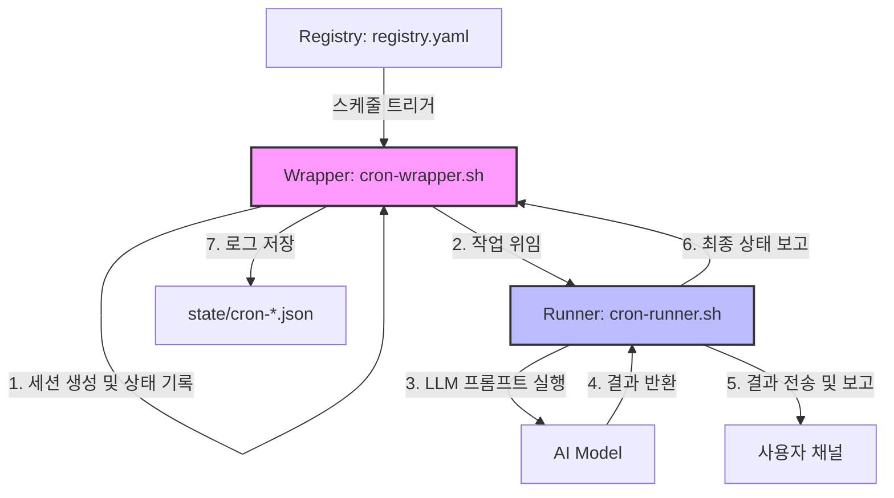

# ⏰ 잊지 않고 일하는 AI의 비결: 크론(Cron) 3계층 아키텍처

> **💡 한 줄 요약**: 에이전트가 정해진 시간에 정확히 작업을 수행하고, 실패해도 스스로 복구하는 '신뢰할 수 있는 자동화' 시스템 설계 이야기입니다.

---

## 🌱 기본 개념: '크론(Cron)'이란 무엇일까요?

컴퓨터 세계에는 **'크론(Cron)'**이라는 아주 성실한 비서가 있습니다. 이 비서의 유일한 임무는 **"정해진 시간에 정해진 일을 실행하는 것"**입니다.

- **일상생활의 비유**: 매일 아침 7시에 울리는 알람 시계, 혹은 매주 일요일 저녁에 규칙적으로 찾아오는 쓰레기 수거 서비스와 같습니다. 정해진 '주기'와 '시점'이 핵심입니다.
- **AI 에이전트에게는?**: "매일 아침 9시에 최신 뉴스를 요약해서 알려줘", "6시간마다 시스템 메모리를 체크해서 보고해줘" 같은 요청을 처리하는 심장과 같습니다. AI가 스스로 깨어나 능동적으로 업무를 시작하게 만드는 장치입니다.

하지만 AI는 사람과 달리 예상치 못한 변수에 취약합니다. 네트워크가 잠시 끊기거나, API 한도를 초과하거나, 혹은 엉뚱한 루프에 빠져 시스템 전체를 마비시키기도 하죠. Hermes는 이러한 불안정성을 해결하기 위해 단순 실행이 아닌 **'3계층 분리 구조'**라는 공학적 안전장치를 도입했습니다.

---

## 🔍 문제 상황: 왜 그냥 실행하면 안 될까?

초기 Hermes의 크론은 매우 단순했습니다. "시간이 되면 스크립트를 실행해!"라고 명령하는 수준이었죠. 하지만 실제 운영 환경에서 세 가지 치명적인 '페인 포인트(Pain Point)'가 발생했습니다.

### 1. 침묵의 실패 (Silent Failure)
스크립트가 내부 에러로 멈췄지만, 외부에서는 알 방법이 없었습니다. 사용자는 보고서가 오지 않아 의아해하지만, 시스템은 조용히 죽어있는 상태였습니다. 이는 '신뢰성'이 생명인 자동화 시스템에서 가장 치명적인 문제입니다.

### 2. 에이전트의 폭주 (Agent Rampage)
뉴스 수집 AI가 예상치 못한 무한 루프에 빠져 30분 만에 수백 개의 세션을 생성한 사례가 있었습니다. 결과적으로 전체 API 토큰을 순식간에 소모하여 시스템 전체가 마비되었습니다. '브레이크 없는 자동차'와 같은 상황이었습니다.

### 3. 기록의 부재 (Lack of Observability)
"어제 오후 3시 작업이 왜 실패했지?"라는 질문에 답할 수 없었습니다. 실행 결과가 표준 출력으로만 나갔거나 사라졌기 때문에, 사후 분석(Post-mortem)이 불가능했고 동일한 실수를 반복하게 되었습니다.

---

## 🏗️ 기술 설계: Registry $\rightarrow$ Wrapper $\rightarrow$ Runner

Hermes는 이 문제를 해결하기 위해 역할을 셋으로 쪼개어 **'책임과 권한'**을 엄격히 분리했습니다. 이는 소프트웨어 공학의 '단일 책임 원칙(Single Responsibility Principle)'을 물리적 구조로 구현한 것입니다.

### 1️⃣ 레지스트리 (Registry): "전략적 계획표"
가장 윗단에 있는 레지스트리는 **'무엇을, 언제, 누구(모델)가, 어디로'** 보낼지를 정의한 마스터 명단입니다. 주로 `registry.yaml` 파일로 관리됩니다.

- **공학적 역할**: 작업의 정의 및 스케줄링의 **SSOT (Single Source of Truth)** 역할을 수행합니다.
- **비유**: 회사 내의 '전사 업무 스케줄표'입니다. "월요일 9시, 뉴스 요약 작업, Claude-3.5 모델 사용, 텔레그램으로 전송"이라고 명시된 공식 문서입니다.
- **핵심 데이터**: `Job ID`, `Cron Expression`, `Target Model`, `Prompt Path`, `Notification Channel`.

### 2️⃣ 래퍼 (Wrapper): "철저한 관리 감독관"
레지스트리에 설정된 시간이 되면, 래퍼(`cron-wrapper.sh`)가 깨어나 작업을 준비하고 감시합니다.

- **공학적 역할**: 세션 생성, 상태 기록(State Tracking), 예외 처리 및 지수 백오프(Exponential Backoff) 기반의 재시도 로직을 담당합니다.
- **비유**: 신입 사원에게 업무를 맡기는 '깐깐한 팀장님'입니다. "자, 지금부터 작업 시작해. 세션 ID는 이거고, 만약 실패하면 1초, 2초, 4초 간격으로 다시 시도해봐. 그리고 모든 진행 상황을 기록지에 꼼꼼히 적어둬."라고 지시하고 감시합니다.
- **메커니즘**: 
    - `flock`을 이용한 중복 실행 방지.
    - `~/.hermes/state/cron-*.json` 파일에 실시간 상태 기록.
    - Runner의 종료 코드를 확인하여 성공/실패 판정.

### 3️⃣ 러너 (Runner): "능숙한 실무 작업자"
실제 AI 모델이 구동되어 구체적인 업무를 수행하는 단계입니다(`cron-runner.sh`).

- **공학적 역할**: 프롬프트 주입, LLM 호출, 결과 수집, 최종 알림 전송이라는 '순수 기능'에만 집중합니다.
- **비유**: 실제로 뉴스를 검색하고 요약하는 '실무자'입니다. 팀장님(Wrapper)이 준 지침과 환경(세션) 속에서 일을 끝내고 결과를 보고하는 역할입니다.
- **특징**: 러너는 자신이 실패하더라도도 시스템 전체를 죽이지 않습니다. 실패하면 Wrapper에게 에러 코드를 반환할 뿐이며, 복구 책임은 Wrapper에게 있습니다.

### 📊 시스템 흐름도 (Mermaid)

---

## 💡 활용 예시: "주간 뉴스 소화제"

실제로 이 시스템이 어떻게 작동하는지 시나리오를 통해 살펴보겠습니다.

**1. 설정 (Registry)**
- **ID**: `job-news-digest`
- **스케줄**: `0 9 * * 1` (매주 월요일 오전 9시)
- **모델**: `Claude 3.5 Sonnet`
- **프롬프트**: "이번 주 AI 트렌드 Top 3를 분석하여 요약해줘."

**2. 실행 프로세스**
- **T+0s**: 레지스트리에 의해 트리거 발생 $\rightarrow$ **Wrapper**가 실행됩니다.
- **T+1s**: Wrapper가 `cron-20260616-0900` 세션을 생성하고, `state` 파일에 `"status": "running"`이라고 기록합니다.
- **T+2s**: Wrapper가 **Runner**를 호출합니다. Runner는 클로드 모델을 통해 뉴스를 요약합니다.
- **T+30s**: Runner가 요약본을 텔레그램으로 전송하고, Wrapper에게 `exit 0` (성공)을 반환합니다.
- **T+31s**: Wrapper가 상태를 `"status": "completed"`로 변경하고 로그를 저장하며 종료합니다.

**3. 예외 상황 (Edge Case): 네트워크 단절**
만약 Runner가 모델 호출 중 네트워크 오류로 `exit 1`을 반환했다면?
- **Wrapper**가 이를 즉시 감지합니다.
- **재시도 전략**: 1초 후 재시도 $\rightarrow$ 실패 $\rightarrow$ 2초 후 재시도 $\rightarrow$ 성공.
- 결과적으로 사용자는 약간의 지연만 느낄 뿐, 작업이 완전히 누락되는 일은 없습니다. 만약 모든 재시도가 실패하면 Wrapper는 최후의 수단으로 사용자에게 "뉴스 요약 작업이 최종 실패했습니다"라고 알림을 보냅니다.

---

## 🔗 관련 주제

- [이벤트 기반 도메인 통신](https://pheanor-agent.github.io/p-hermes/docs/blog/posts/event-driven-communication.md): 크론 작업 완료 후 다른 시스템을 깨우는 방법.
- [역할 기반 모델 라우팅 설계](https://pheanor-agent.github.io/p-hermes/docs/blog/posts/model-routing-design.md): 작업의 성격에 따라 어떤 모델을 Runner에 배정할 것인가.
- [5-Tier 물리 계층화 설계](https://pheanor-agent.github.io/p-hermes/docs/blog/posts/why-5-tier-architecture.md): 크론 레지스트리와 상태 파일이 저장되는 물리적 위치.

---

_Cron 3계층 아키텍처는 단순한 자동화를 넘어, AI가 스스로를 관리하고 보고하는 '엔지니어링적 신뢰성'의 기초가 됩니다._
