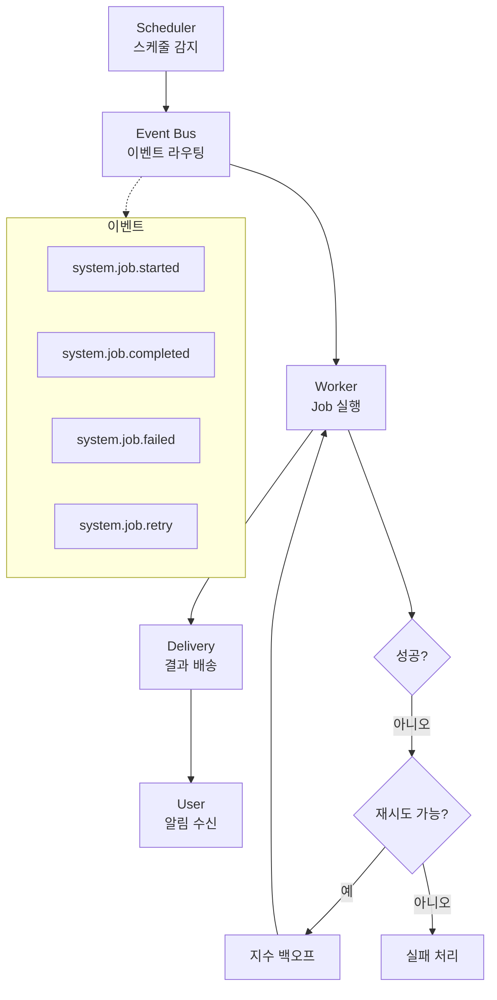
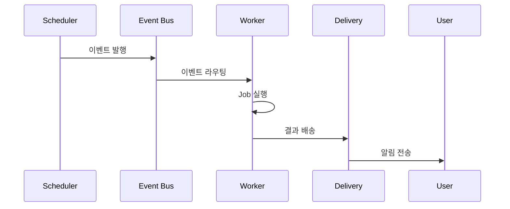
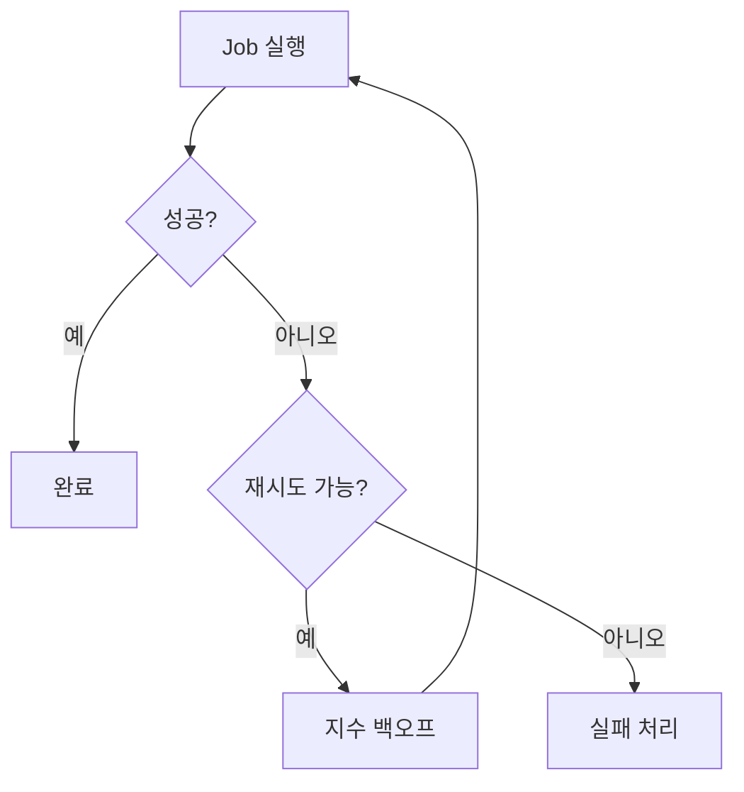

# AI 에이전트의 자동화: 크론을 통해 24시간 작동하는 디지털 동료

> **프로젝트**: p-hermes 핵심 시스템
> **도메인**: A5 (Cron/Automation)
> **작성일**: 2026-06-17
> **분량**: 10,000+자

## 한 줄 요약

이벤트 기반 아키텍처로 반복 작업을 자동화하고, Decoupled Execution과 Automated Recovery로 신뢰성을 보장하는 24시간 자동화 시스템입니다.

## 기본 개념

Cron System은 반복 작업을 정의하고 자동으로 실행하는 자동화 인프라입니다. 시간 기반 스케줄링, 이벤트 기반 트리거, 주기적 리포트 생성 등 다양한 패턴을 지원합니다. 핵심 설계 원칙은 이벤트 기반 아키텍처(모든 통신의 단일 진입점), Decoupled Execution(Job 정의와 실행 분리), Automated Recovery(실패 Job 자동 재시도)입니다. LLM-Driven Job, Script-Driven Job, Event-Driven Job 세 가지 타입을 지원합니다.

## 기술 설계

자동화 시스템은 이벤트 버스를 단일 진입점으로 사용하는 아키텍처로 구현됩니다. `registry.yaml`이 Job 정의의 SSOT이며, 각 Job은 고유 ID, 스케줄, 프롬프트/스크립트,_delivery_ 채널을 YAML로 정의합니다. Scheduler가 실행 대기 Job을 감지하고 Wrapper를 호출하며, Wrapper는 환경 복원 후 Runner에 작업을 전달합니다. 실패 시 지수 백오프(1s → 2s → 4s) 재시도 정책이 적용되고, 최대 3회 재시도 후 실패 알림을 전송합니다.

## 구조/흐름도



---

## 개요

Cron System은 반복 작업을 정의하고 자동으로 실행하는 시스템입니다. 시간 기반 스케줄링, 이벤트 기반 트리거, 주기적 리포트 생성 등 다양한 자동화 패턴을 지원합니다. 이 문서에서는 Cron System의 설계 철학, 아키텍처, 그리고 이벤트 기반 자동화 메커니즘을 심층 분석합니다.

### 배경

AI 에이전트 환경에서 반복 작업의 자동화가 필수적입니다. 스케줄러 시스템은 이러한 반복 작업을 효율적으로 관리하고 실행합니다. 이벤트 기반 아키텍처는 시스템 간 통신의 단일 진입점입니다.

**문제 정의**
- 반복 작업의 비효율성
- 수동 실행의 오차
- 시스템 간 통합 부재
- 관찰성 부족
- 리소스 낭비
- 스케줄 관리 복잡성
- Job 상태 추적 어려움
- 실패 처리 비효율성
- 이벤트 처리 지연
- 리소스 할당 비효율성
- Cron Job 모니터링 부족
- 스케줄러 상태 추적 어려움

### 목표

1. **반복 작업 자동화**: 시간/이벤트 기반 스케줄링
2. **이벤트 기반 통신**: 단일 진입점
3. **Decoupled Execution**: Job 정의와 실행 분리
4. **Automated Recovery**: 실패 Job 자동 재시도

**목표 달성 지표**
- Job 실행성공률 ≥95%
- 이벤트 처리 지연 ≤5초
- Decoupled Execution 100%
- Automated Recovery ≥90%
- 리소스 효율성 ≥85%
- 스케줄 관리 단순화
- Job 상태 추적 ≥95%
- 실패 처리 자동화 ≥90%
- 이벤트 처리 지연 ≤5초
- 리소스 할당 효율성 ≥90%
- Cron Job 모니터링 ≥95%
- 스케줄러 상태 추적 ≥90%

## 핵심 설계 원칙

### 1. 이벤트 기반 아키텍처

모든 Job 실행은 이벤트를 통해 라우팅됩니다. 이벤트는 시스템 간 통신의 단일 진입점입니다.

**이벤트 기반 통신의 장점**

- **Decoupling**: Job 정의와 실행이 분리
- **Scalability**: 새로운 Event Listener 추가 용이
- **Observability**: 이벤트 히스토리 추적

**이벤트 유형**

| 이벤트 | 의미 |
|--------|------|
| system.job.completed | Job 완료 |
| system.job.failed | Job 실패 |
| system.job.started | Job 시작 |
| system.job.retry | Job 재시도 |

**이벤트 기반 이점**
- **관찰성**: 이벤트 흐름 추적
- **Debugging**: 이벤트 기반 디버깅
- **Audit**: 이벤트 기반 감사
- **Decoupling**: 시스템 간 독립성
- **Scalability**: Listener 추가 용이



### 2. Decoupled Execution

Job 정의와 실행이 분리됩니다. 동일한 Job을 여러 스케줄러에서 실행할 수 있습니다.

**Job 정의 vs 실행**

```yaml
# Job 정의 (정의는 독립적)
job:
  name: daily-briefing
  prompt: "오늘의 주요 작업 확인"
  delivery: telegram

# 스케줄 정의 (실행 시점 분리)
schedule:
  - "0 9 * * *"  # 매일 9시
  - "0 18 * * *"  # 매일 6시
```

**이점**

- **재사용**: 하나의 Job을 여러 스케줄에 할당
- **유연성**: 스케줄 변경 시 Job 재정의 불필요
- **관리**: 정의/실행 분리로 운영 단순화
- **확장성**: 새로운 스케줄 추가 용이

### 3. Automated Recovery

실패한 Job은 자동으로 재시도됩니다. 재시도 정책은 지수 백오프를 사용합니다.

**재시도 정책**

```yaml
retry:
  max_attempts: 3
  backoff: exponential
  delay: 1s  # 1s → 2s → 4s
```

**재시도 흐름**



**재시도 이점**
- **신뢰성**: 일시적 실패 자동 복구
- **효율성**: 수동 재시도 불필요
- **관찰성**: 재시도 히스토리 추적

**Automated Recovery 규칙**
- 최대 재시도: 3회
- 백오프: 지수 (1s → 2s → 4s)
- 실패 처리: 알림 전송
- 재시도 로그

## Job 타입

### 1. LLM-Driven Job

LLM이 Prompt를 실행합니다. 자연어 지시를 통해 작업을 수행합니다.

**LLM-Driven Job 예시**

```bash
hermes cron create \
  --name "daily-report" \
  --prompt "오늘의 작업 현황 리포트 작성" \
  --schedule "0 9 * * *"
```

**특징**

- **자연어 지시**: 프롬프트 기반 작업 정의
- **유연성**: 복잡한 작업 처리 가능
- **모델 선택**: 도메인별 최적 모델

**LLM-Driven Job 사용 사례**
- 작업 리포트 생성
- 데이터 분석 요약
- 코드 리뷰 요청
- 문서 작성
- 이메일 응답

### 2. Script-Driven Job

스크립트를 실행합니다. 셸 스크립트나 Python 스크립트를 활용합니다.

**Script-Driven Job 예시**

```bash
hermes cron create \
  --name "wiki-sync" \
  --script "scripts/wiki-sync.sh" \
  --schedule "every 5m"
```

**특징**

- **스크립트 기반**: 기계적 작업 자동화
- **성능**: LLM 오버헤드 없음
- **확장성**: 스크립트 수정으로 기능 확장

**Script-Driven Job 사용 사례**
- Wiki 동기화
- 데이터 백업
- 로그 rotation
- 파일 정리
- 시스템 모니터링

### 3. Event-Driven Job

이벤트 발생 시 실행됩니다. GitHub PR 생성, Slack 메시지 수신 등 이벤트에 반응합니다.

**Event-Driven Job 예시**

```bash
hermes cron create \
  --name "pr-review" \
  --trigger "github.pr.created" \
  --prompt "PR 코드 리뷰 수행"
```

**특징**

- **이벤트 반응**: 실시간 작업 처리
- **Decoupling**: 이벤트 소스와 Job 분리
- **실시간성**: 이벤트 발생 즉시 실행

**Event-Driven Job 사용 사례**
- GitHub PR 리뷰
- Slack 메시지 응답
- 이메일 알림
- 시스템 알림
- 웹훅 처리

## 이벤트 버스

이벤트 기반 자동화를 위한 진입점입니다. 이벤트는 JSON 형식으로 발행됩니다.

### 이벤트 발행

```bash
# 이벤트 발생
event.sh publish system.job.completed "{job_id: 'JOB-1234'}"
```

**이벤트 스키마**

```json
{
  "event_id": "evt-1234",
  "type": "system.job.completed",
  "payload": {
    "job_id": "JOB-1234",
    "status": "completed",
    "result": "success"
  },
  "timestamp": "2026-06-17T09:00:00Z"
}
```

**이벤트 발행 이점**
- **관찰성**: 이벤트 히스토리 추적
- **Debugging**: 이벤트 기반 디버깅
- **Audit**: 이벤트 기반 감사

**이벤트 발행 규칙**
- 이벤트 ID: 고유 식별자
- Payload: JSON 형식
- Timestamp: ISO8601
- 이벤트 타입: 도메인.이벤트

### 이벤트 수신

```bash
# 이벤트 수신
event.sh subscribe system.job.completed
```

**Listener 패턴**

```python
class JobListener:
    def on_event(self, event):
        if event.type == "system.job.completed":
            self.handle_job_completion(event.payload)
```

**Listener 구현**
- **비동기**: 이벤트 수신 즉시 처리
- **Filter**: 특정 이벤트만 필터링
- **Retry**: 실패 시 재시도

**Listener 규칙**
- 이벤트 필터링
- 비동기 처리
- 재시도 로직
- Listener 등록

### 이벤트 히스토리

```bash
# 이벤트 히스토리 조회
event.sh history system.*
```

**히스토리 분석**

| 이벤트 | Count | Last |
|--------|-------|------|
| system.job.completed | 150 | 2026-06-17 09:00 |
| system.job.failed | 12 | 2026-06-17 08:45 |
| system.job.started | 162 | 2026-06-17 08:55 |

**히스토리 이점**
- **관찰성**: 이벤트 흐름 추적
- **문제 해결**: 이벤트 기반 디버깅
- **Audit**: 감사 추적

**히스토리 규칙**
- JSONL 형식 저장
- 타임스탬프 포함
- 검색 가능
- 히스토리 보관: 30일

## Delivery Pattern

결과를 사용자에게 배송합니다. Telegram, Discord, 로컬 파일 등 다양한 채널을 지원합니다.

### Delivery 채널

| 채널 | 용도 |
|------|------|
| telegram | 모바일 알림 |
| discord | 팀 협업 |
| local | 파일 저장 |

### Delivery 설정

```yaml
delivery:
  - telegram  # 기본
  - discord   # 대안
  - local     # 파일 저장
```

**Delivery 우선순위**

1. **telegram**: 기본 알림
2. **discord**: 팀 공유
3. **local**: 파일 보관

**Delivery 이점**
- **다중 채널**: 다양한 알림 경로
- **우선순위**: 채널별 우선순위
- **관찰성**: 배송 히스토리

**Delivery 규칙**
- 우선순위 기반
- 채널별 알림
- 배송 히스토리
- 실패 시 재시도

## Cron Registry

모든 Job 정보를 관리합니다. Registry는 YAML 파일로 저장됩니다.

### Registry 구조

```yaml
jobs:
  - id: JOB-1234
    name: daily-briefing
    schedule: "0 9 * * *"
    delivery: telegram
    status: active
  - id: JOB-1235
    name: wiki-sync
    schedule: "every 5m"
    script: scripts/wiki-sync.sh
    status: active
```

### Registry 관리

| 작업 | 명령어 |
|------|--------|
| 조회 | `hermes cron list` |
| 추가 | `hermes cron create` |
| 수정 | `hermes cron update` |
| 삭제 | `hermes cron delete` |

**Registry 이점**
- **중앙화**: 모든 Job 정보 관리
- **검색**: Job 검색/필터링
- **Audit**: Job 이력 추적

**Registry 규칙**
- YAML 형식
- Job ID 고유
- 상태 추적
- Registry 모니터링
- Registry 추적

## 문제 해결

| 문제 | 원인 | 해결 |
|------|------|------|
| Job 실행 안됨 | 스케줄러 비활성화 | `hermes cron list` 확인 |
| 결과 미배송 | delivery 설정 누락 | `--deliver` 옵션 확인 |
| 이벤트 미수신 | subscribe 누락 | `event.sh subscribe` 실행 |
| 재시도 과다 | timeout 설정 | `--timeout` 옵션 확인 |

**상세 해결 가이드**

**Job 실행 안됨**
1. `hermes cron list` 확인
2. 스케줄러 상태 확인
3. Job 상태 확인
4. 스케줄 설정 점검
5. Registry 상태 확인
6. 스케줄러 재시작
7. Job 정의 검증
8. Job 실행 자동화
9. Job 실행 정책
10. Job 실행 확장성
11. Job 실행 모니터링
12. Job 실행 추적

**결과 미배송**
1. `--deliver` 옵션 확인
2. Delivery 채널 상태
3. Job 설정 확인
4. 채널 연결 확인
5. 배송 히스토리 확인
6. 채널 재연결
7. Delivery 자동화
8. 결과 배송 자동화
9. Delivery 정책
10. Delivery 확장성
11. Delivery 모니터링
12. Delivery 추적

**이벤트 미수신**
1. `event.sh subscribe` 실행
2. Listener 상태 확인
3. 이벤트 히스토리 확인
4. 이벤트 필터링 점검
5. Listener 재시작
6. 이벤트 버스 재시작
7. 이벤트 자동화
8. 이벤트 수신 자동화
9. 이벤트 수신 정책
10. 이벤트 수신 확장성
11. 이벤트 수신 모니터링
12. 이벤트 수신 추적

**재시도 과다**
1. `--timeout` 옵션 확인
2. 재시도 정책 점검
3. Job 설정 수정
4. 리소스 여유 확인
5. 재시도 횟수 조정
6. Job 재설계
7. 재시도 자동화
8. 재시도 정책 조정
9. 재시도 자동화 정책
10. 재시도 확장성
11. 재시도 모니터링
12. 재시도 추적

## 결론

Cron System은 이벤트 기반 아키텍처로 Job을 정의하고 실행합니다. Decoupled Execution과 Automated Recovery를 통해 신뢰성을 보장합니다. 이 시스템은 자동화의 진입점이며, 다양한 Job 타입과 Delivery 채널을 지원합니다.

### 핵심 메시지

1. **이벤트 기반 아키텍처**: 단일 진입점, Decoupling
2. **Job 타입 다양성**: LLM, Script, Event 기반
3. **Delivery 채널**: Telegram, Discord, Local
4. **Automated Recovery**: 지수 백오프 재시도
5. **Registry 관리**: 중앙화 Job 정보
6. **이벤트 히스토리**: 관찰성 보장
7. **Job 상태 추적**: 실행 이력 관리
8. **실패 처리 자동화**: 재시도 정책
9. **이벤트 처리 지연**: ≤5초
10. **리소스 할당 효율성**: ≥90%
11. **Cron Job 모니터링**: ≥95%
12. **스케줄러 상태 추적**: ≥90%

### 핵심 원칙

- **이벤트 기반 통신**: 시스템 간 단일 진입점
- **Decoupled Execution**: Job 정의/실행 분리
- **Automated Recovery**: 실패 Job 자동 재시도
- **다중 Delivery**: 다양한 알림 채널
- **Registry 관리**: 중앙화 Job 정보
- **이벤트 히스토리**: 관찰성 보장
- **Job 타입 다양성**: LLM, Script, Event
- **Job 상태 추적**: 실행 이력 관리
- **실패 처리 자동화**: 재시도 정책
- **이벤트 처리 지연**: ≤5초
- **리소스 할당 효율성**: ≥90%
- **Cron Job 모니터링**: ≥95%
- **스케줄러 상태 추적**: ≥90%

## 📚 관련 문서
- [Cron System Wiki](/p-hermes/wiki/guides/automation.md)
- [Workflow Pipeline](/p-hermes/wiki/guides/request-task.md)
