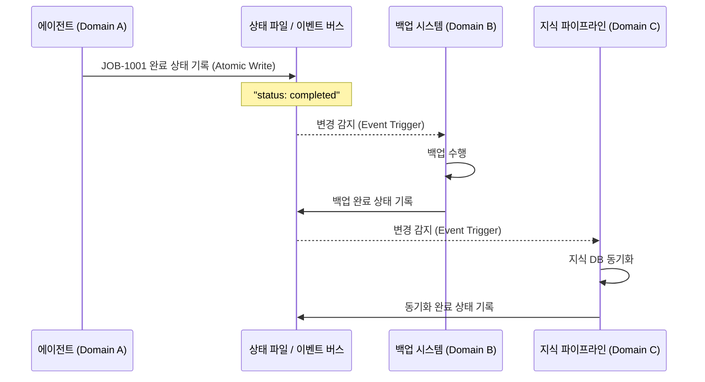

# 이벤트 기반 도메인 통신: 결합도를 낮추고 유연성을 높이는 법

> **💡 한 줄 요약**: "서로를 직접 부르지 마라." 도메인 간 직접 호출을 금지하고, 상태 파일과 이벤트를 통한 비동기 통신을 채택하여 시스템의 연쇄 실패를 막고 확장성을 확보한 설계입니다.

---

## 🌱 기본 개념: '결합도(Coupling)'와 '비동기 통신'

소프트웨어 설계에서 가장 경계해야 할 단어는 **'강한 결합(Tight Coupling)'**입니다. A가 B를 직접 호출하는 구조에서는 B가 죽으면 A도 함께 죽습니다.

- **일상생활의 비유**: 
    - **강한 결합 (동기)**: 사장님이 비서에게 "지금 당장 커피 타와!"라고 명령하고, 커피가 나올 때까지 그 자리에서 아무것도 못 하고 기다리는 상황입니다. 비서가 커피를 쏟으면 사장님의 스케줄 전체가 꼬입니다.
    - **느슨한 결합 (비동기)**: 사장님이 포스트잇에 "커피 한 잔 부탁해요"라고 적어 게시판에 붙여둡니다. 비서가 확인하고 커피를 타서 책상에 둡니다. 사장님은 그동안 다른 일을 할 수 있고, 비서가 잠시 자리를 비워도 사장님의 업무는 중단되지 않습니다.
- **Hermes의 적용**: 에이전트, 백업 시스템, 지식 파이프라인이라는 세 가지 도메인이 서로를 직접 호출하지 않고, `~/.hermes/state/`라는 '공유 게시판(상태 파일)'을 통해 소통하게 만든 것입니다.

---

## 🔍 문제 상황: "동기 호출의 지옥과 연쇄 실패"

초기 Hermes는 단순한 쉘 스크립트 연쇄 호출 방식을 사용했습니다. `지식 업데이트` $\rightarrow$ `백업 실행` $\rightarrow$ `세션 정리` 순으로 직접 실행되는 구조였습니다.

### 1. 블로킹 (Blocking) 현상
A 스크립트가 B를 호출하면, B가 끝날 때까지 A는 아무것도 못 하고 기다려야 합니다. 
- **사례**: 백업 스크립트가 네트워크 지연으로 10분 동안 멈춰 있자, 이를 호출한 지식 업데이트 스크립트와 전체 에이전트 프로세스가 함께 멈춰버림.

### 2. 연쇄 실패 (Cascading Failure)
중간 단계에서 에러가 발생하면 뒤쪽의 모든 프로세스가 취소되거나, 잘못된 상태로 실행됩니다.
- **사례**: `지식 업데이트` 도중 디스크 용량 부족으로 에러 발생 $\rightarrow$ 이어서 실행되던 `백업 스크립트`가 불완전한 데이터를 백업 $\rightarrow$ 결과적으로 원본과 백업본이 동시에 파괴됨.

### 3. 동시성 충돌 (Concurrency Clash)
두 개의 에이전트가 동시에 하나의 관리 스크립트를 호출할 때 데이터가 엉키는 현상입니다.
- **사례**: Hermes와 OpenClaw가 동시에 `backup.sh`를 호출 $\rightarrow$ 서로 같은 백업 파일에 쓰기를 시도 $\rightarrow$ 파일 락(Lock) 충돌로 인해 백업 파일이 깨짐.

---

## 🏗️ 기술 설계: 상태 파일 기반 이벤트 통신

Hermes는 **"함수 호출"을 "파일 변경 이벤트"로 대체**했습니다. 이제 도메인 간의 통신은 `상태 파일 작성` $\rightarrow$ `비동기 감지` $\rightarrow$ `처리` 순으로 이루어집니다.

### 1. 원자적 상태 작성 (Atomic Write)
이벤트의 핵심은 '상태 파일'입니다. 하지만 파일을 쓰는 도중에 다른 프로세스가 읽으면 데이터가 깨질 수 있습니다. 이를 막기 위해 **Atomic Write** 방식을 사용합니다.

- **메커니즘**: 
    1. 임시 파일(`.tmp`)에 내용을 먼저 씁니다.
    2. `fsync`를 통해 물리 디스크에 기록을 완료합니다.
    3. `os.rename()`을 통해 순식간에 원본 파일로 교체합니다. (OS 레벨에서 원자적으로 처리됨)
- **결과**: 읽는 쪽에서는 항상 '완전한' 파일만 보게 됩니다.

### 2. 이벤트 버스 (`event.sh`)의 도입
단순한 파일 감지를 넘어, 단일 진입점인 `event.sh`를 통해 이벤트를 관리하는 버스 시스템으로 진화했습니다.

- **뮤텍스(Mutex) 제어**: `flock`을 사용하여 한 번에 하나의 이벤트만 처리하도록 보장합니다.
- **이벤트 로그 (JSONL)**: 모든 이벤트 발생 내역을 `event-history.jsonl`에 기록하여, 나중에 "어떤 이벤트 때문에 이 작업이 실행되었는가"를 완벽하게 추적(Audit Trail)할 수 있습니다.

### 📊 통신 흐름도 (Mermaid)

---

## 💡 활용 사례: 지식 동기화 파이프라인의 안정화

이벤트 기반 통신 도입 후, 가장 큰 변화는 **'회복 탄력성(Resilience)'**의 향상이었습니다.

- **기존**: `업데이트 실패` $\rightarrow$ `백업 실패` $\rightarrow$ `전체 중단` (복구 시간 4시간)
- **현재**:
    1. 에이전트가 작업 완료 상태를 남김.
    2. 백업 시스템이 이를 감지해 실행하다가 실패함.
    3. **영향**: 백업은 실패했지만, 에이전트와 지식 파이프라인은 아무런 영향을 받지 않고 계속 작동함.
    4. **복구**: 관리자가 나중에 `event-history.jsonl`을 보고 실패한 백업 이벤트만 다시 실행함. (복구 시간 5분)

---

## 🔗 관련 주제

- [5-Tier 물리 계층화 설계](https://pheanor-agent.github.io/p-hermes/docs/blog/posts/why-5-tier-architecture.md): 이벤트 상태 파일이 저장되는 `runtime/state/` 계층의 역할.
- [Cron 3계층 분리 아키텍처](https://pheanor-agent.github.io/p-hermes/docs/blog/posts/cron-3layer-separation.md): 주기적으로 이벤트를 스캔하는 Wrapper의 동작 방식.

---

_이벤트 기반 통신은 시스템의 결합도를 극단적으로 낮춥니다. 서로를 모르지만 상태 파일을 통해 협력하는 구조, 이것이 Hermes가 추구하는 확장 가능한 아키텍처의 핵심입니다._
