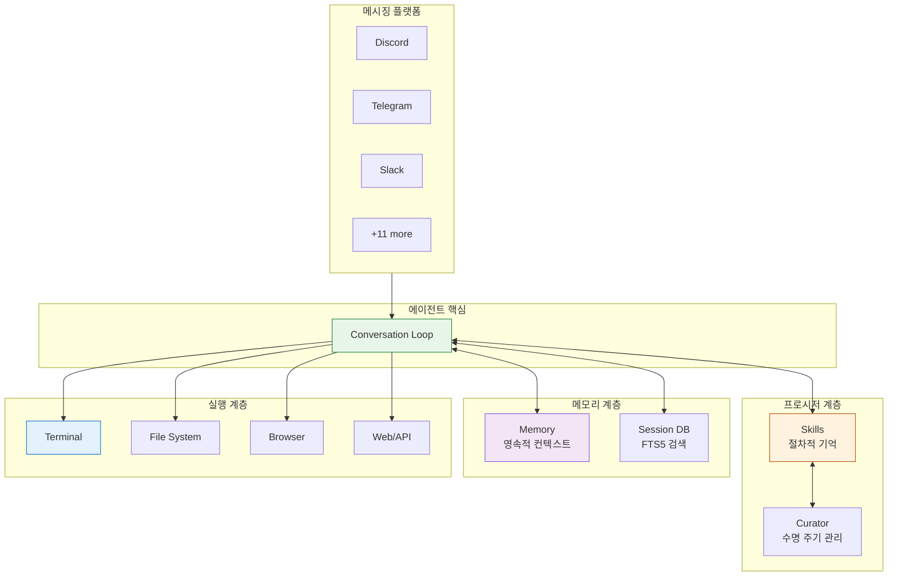
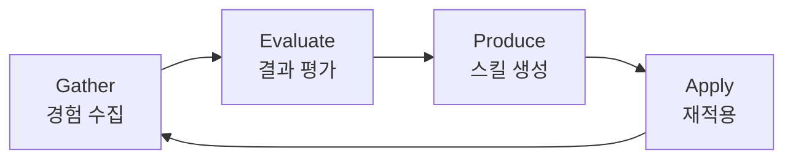
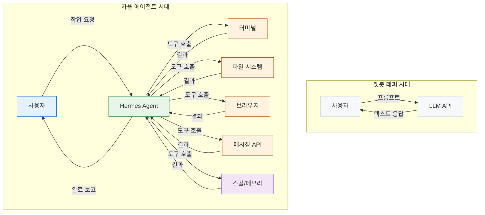
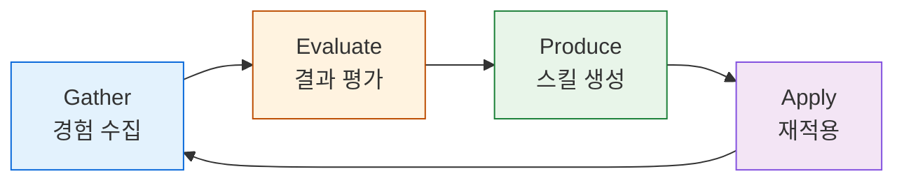
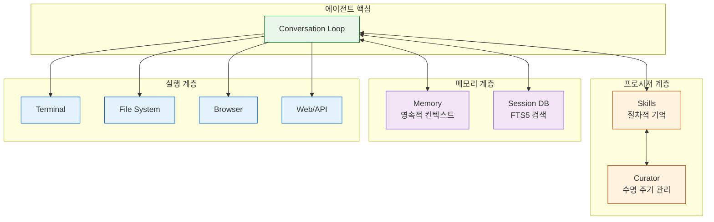
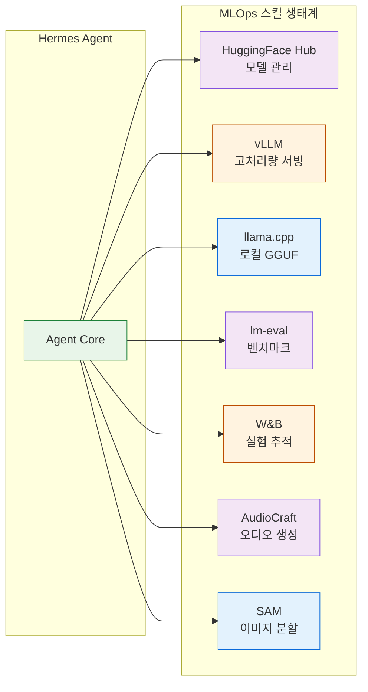
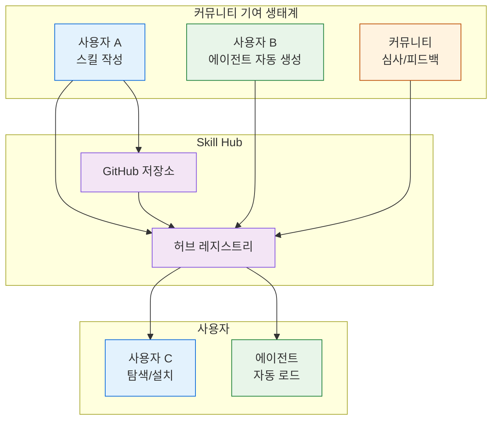
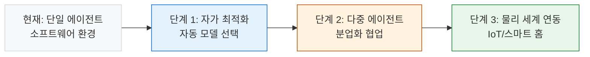

# 에르메스 에이전트: 자율적 AI 플랫폼이 개척하는 패러다임

> **💡 한 줄 요약**: Hermes Agent는 단순한 AI 어시스턴트를 넘어, 영속적 생명력을 지닌 자율 에이전트 플랫폼으로, 스스로 학습하고 진화하며 300여 개 모델과 15개 이상 메시징 플랫폼을 통합합니다.

## 한 줄 요약

Hermes Agent는 영속적 메모리, GEPA 학습 루프, 300여 개 모델 지원, 15개 메시징 플랫폼 통합을 갖춘 오픈소스 자율 AI 에이전트 플랫폼입니다.

## 기본 개념

Hermes Agent는 사용자가 CLI 앞에 앉아 있지 않아도 메시징 플랫폼을 통해 언제든 상호작용할 수 있는 자율 에이전트입니다. 세 가지 핵심 특성이 챗봇과 구분됩니다. 첫째, 영속적 생명력 — 세션 종료 후에도 환경 설정, 작업 이력, 프로젝트 구조를 유지합니다. 둘째, 폐쇄형 학습 루프 — GEPA(Gather, Evaluate, Produce, Apply) 사이클로 경험을 구조화하여 재사용 가능한 스킬로 변환합니다. 셋째, 벤더 중립성 — 20개 이상의 모델 제공자를 지원하며, 모델 변경은 한 줄 명령어로 완료됩니다.

## 기술 설계

Hermes Agent는 다음 기술로 구현됩니다. Hermes Gateway는 백그라운드 서비스로 15개 이상 메시징 플랫폼에 동시에 연결되며, 동일한 에이전트 인스턴스가 모든 플랫폼 메시지를 처리합니다. GEPA 메커니즘이 Gather(세션 이력 기록) → Evaluate(복잡도 평가) → Produce(SKILL.md 생성) → Apply(자동 로드) 사이클을 수행하며, Curator 백그라운드 프로세스가 스킬 수명 주기를 관리합니다. 프로파일 시스템(`~/.hermes/profiles/<name>/`)이 독립적인 설정·세션·스킬·메모리를 격리 저장합니다.

## 구조/흐름도

### 자율 에이전트 아키텍처



### GEPA 학습 루프



---

## 챗봇 래퍼 시대의 종식과 자율적 에이전트 패러다임

AI 소프트웨어는 이제 '대화를 하는 도구'의 범주를 벗어났습니다. 과거 챗봇은 사용자의 입력에 텍스트 응답을 생성하는 일방향 서비스였습니다. 프롬프트를 입력하고 답변을 받으며 대화할 수 있었지만, 시스템의 경계 안에서만 작동했습니다. 파일을 읽고 수정하거나, 터미널 명령어를 실행하거나, 외부 서비스와 연동하는 능력은 없었습니다.

2025년 이후 AI 에이전트 프레임워크가 등장하며 이 경계가 무너졌습니다. Claude Code, OpenAI Codex, 그리고 Hermes Agent는 동일한 카테고리를 공유합니다. 도구 호출(Tool Calling)을 통해 사용자의 시스템과 직접 상호작용하는 자율적 코딩 및 작업 실행 에이전트입니다. 이 세 프레임워크는 공통적으로 LLM의 추론 능력을 실제 실행 환경과 연결하는 다리 역할을 합니다.

Hermes Agent가 이 카테고리에서 구별되는 점은 자율성의 범위와 깊이입니다. 사용자의 터미널, 메시징 플랫폼, IDE에서 실행되며, 세션 간 영속적 메모리를 유지하고, 스스로 프로시저를 발견하여 재사용 가능한 스킬(Skill)로 축적합니다. Nous Research가 개발한 이 오픈소스 플랫폼은 20개 이상의 모델 제공자(OpenRouter, Anthropic, OpenAI, DeepSeek, 로컬 모델 등)와 15개 이상의 메시징 플랫폼(Telegram, Discord, Slack, WhatsApp, Signal, Matrix 등)을 지원합니다.

자율 AI 에이전트 플랫폼의 등장으로, 개발자와 연구자는 AI를 '질문-답변' 도구로 사용하는 것을 넘어 '작업을 실행하는 파트너'로 활용하게 되었습니다. 이 전환의 핵심은 에이전트가 사용자의 환경에 영속적으로 상주하며, 작업을 완수하기 위해 필요한 도구를 자율적으로 선택하고 실행할 수 있다는 점입니다.



---

## 영속적 생명력: 서버 상주, 프로젝트 학습, 도구 선택, 브라우저 제어

에이전트의 영속성(Persistence)은 챗봇과 에이전트의 핵심 구분 기준입니다. 챗봇은 세션이 종료되면 모든 컨텍스트가 소멸합니다. 에이전트는 그렇지 않습니다. Hermes Agent는 세션 종료 후에도 사용자의 환경 설정, 과거 작업 이력, 프로젝트 구조, 선호도를 유지합니다.

### 서버 상주 (Gateway Residency)

Hermes Gateway는 백그라운드 서비스로 실행되며, Telegram, Discord, Slack, WhatsApp, Signal, Matrix, 이메일, SMS, Feishu, WeCom, BlueBubbles(iMessage), WeChat 등 15개 이상의 메시징 플랫폼에 동시에 연결됩니다. 사용자가 CLI 앞에 앉아 있지 않아도, 메시징 플랫폼을 통해 언제든 에이전트와 상호작용할 수 있습니다.

```bash
# Gateway 서비스 설치 및 실행
hermes gateway install
hermes gateway start
hermes gateway status
```

Gateway는 다중 플랫폼 연결을 유지하면서도, 동일한 에이전트 인스턴스가 모든 플랫폼의 메시지를 처리합니다. Discord 채널에서의 코드 리뷰 작업과 Telegram DM에서의 데이터 분석 작업이 동일한 메모리와 스킬을 공유합니다.

### 프로젝트 학습 (Project Awareness)

에이전트는 실행 컨텍스트에 따라 작동 방식을 조정합니다. `--worktree` 플래그로 격리된 Git 워크트리를 생성하면, 각 워크트리에 독립적인 세션이 할당됩니다. 프로젝트 루트에 `AGENTS.md` 파일이 존재하면, 에이전트는 해당 파일에 정의된 프로젝트 규칙과 컨벤션을 자동으로 로드합니다.

프로필(Profile) 시스템은 영속성 계층을 더 확장합니다. `~/.hermes/profiles/<name>/` 경로에 독립적인 설정, 세션, 스킬, 메모리가 격리되어 저장됩니다. 개발용 프로필, 연구용 프로필, 개인용 프로필을 분리하여 각각 독립적인 에이전트 인스턴트를 운영할 수 있습니다.

### 도구 선택 (Toolset Orchestration)

에이전트가 호출 가능한 도구는 25개 이상의 툴셋으로 구성됩니다. 터미널 명령어 실행, 파일 읽기/쓰기/검색/수정, 브라우저 자동화, 비전 분석, 이미지 생성, 텍스트 음성 변환, 스케줄링, 메시지 전송, 지식 탐색, 스파이피 재생, 스마트 홈 제어 등입니다.

모든 툴셋은 `hermes tools` 명령어로 플랫폼별로 활성화/비활성화할 수 있습니다. 에이전트는 각 툴의 요구사항(`check_fn`)을 자동으로 검증하며, 필요한 환경 변수가 설정되지 않은 도구는 세션에서 숨겨집니다.

### 브라우저 제어 (Browser Automation)

브라우저 툴셋은 CDP(Chrome DevTools Protocol)를 통해 웹 페이지를 탐색하고, 폼을 작성하며, 동적 콘텐츠를 분석합니다. Browserbase, Camofox, 또는 로컬 Chromium 백엔드를 지원합니다. 에이전트는 웹 검색 결과를 추출하고, 웹 애플리케이션의 UI를 테스트하며, 시각적 요소를 분석하여 결론을 도출합니다.

```bash
# 브라우저 세션 시작
hermes tools enable browser
# 새 세션에서 브라우저 도구 사용 가능
hermes chat  # → /reset
```

영속적 생명력은 에이전트가 '한 번의 대화'를 넘어 '장기적인 파트너'로 작동할 수 있는 기반입니다. 서버 상주는 접근성, 프로젝트 학습은 문맥 정확성, 도구 선택은 작업 범위, 브라우저 제어는 외부 세계와의 상호작용을 보장합니다.

---

## 폐쇄형 학습 루프: GEPA 메커니즘, 스킬 자생, 지식 내재화

에이전트가 '학습하는 시스템'으로 작동하게 하는 핵심 메커니즘은 폐쇄형 학습 루프(Closed Learning Loop)입니다. Hermes Agent는 GEPA(Gather, Evaluate, Produce, Apply) 사이클을 통해 경험을 구조화하고, 구조화된 경험을 재사용 가능한 스킬로 변환하며, 축적된 스킬을 지식 그래프로 내재화합니다.

### GEPA 메커니즘

GEPA는 에이전트가 작업을 수행하는 과정에서 자연스럽게 발생하는 학습 사이클입니다.



**Gather(수집)**: 에이전트는 복잡한 작업을 해결하는 과정에서 실행한 명령어, 발견한 에러, 성공한 워크플로우를 기록합니다. 세션 이력은 SQLite + FTS5 기반의 `state.db`에 저장되며, 검색 가능한 영구 저장소가 됩니다.

**Evaluate(평가)**: 작업 완료 후 에이전트는 결과를 분석합니다. 5회 이상의 도구 호출이 필요한 복잡한 작업, 에러를 해결한 경우, 사용자 교정을 반영한 경우, 반복 가능성이 높은 워크플로우가 식별됩니다.

**Produce(생성)**: 식별된 패턴은 SKILL.md 형식으로 구조화됩니다. YAML 프런트매터(트리거 조건, 버전, 메타데이터)와 마크다운 본문(단계별 절차, 주의사항, 검증 방법)으로 구성된 스킬 문서가 생성되며, `~/.hermes/skills/` 디렉토리에 저장됩니다.

**Apply(재적용)**: 향후 세션에서 에이전트는 사용 가능한 스킬 목록을 스캔하고, 현재 작업과 일치하는 스킬을 자동 로드합니다. 로드된 스킬은 시스템 프롬프트의 일부로 통합되어, 에이전트가 이미 검증된 워크플로우를 따르도록 유도합니다.

### 스킬 자생 (Skill Autogenesis)

스킬은 에이전트가 스스로 생성하는 지식 자산입니다. 시스템은 스킬의 수명 주기를 Curator 백그라운드 프로세스가 관리합니다.

- **사용량 추적**: `~/.hermes/skills/.usage.json`에 각 스킬의 사용 횟수(`use_count`), 조회 횟수(`view_count`), 패치 횟수(`patch_count`), 마지막 활동 시각(`last_activity_at`)이 기록됩니다.
- **부패 감지**: 일정 기간 미사용 스킬은 'stale'(부패) 상태로 전환되며, 추가 방치 시 'archived'(보관) 상태로 이동합니다.
- **보관/복구**: Curator는 실행 전 tar.gz 백업을 생성하므로, 모든 전환은 되돌릴 수 있습니다.
- **핀(Pin)**: 사용자가 핀으로 표시한 스킬은 자동 전환과 LLM 검토에서 제외됩니다.

Curator는 에이전트가 생성한 스�_skill_(`created_by: "agent"`)에만 적용되며, 번들 스킬과 허브에서 설치한 스킬은 관리 대상에서 제외됩니다. Curator의 가장 강력한 작용은 아카이브이며, 삭제는 절대 수행하지 않습니다.

에이전트는 스킬이 stale하거나 불완전한 경우 `skill_manage(action='patch')`를 통해 즉시 수정합니다. 유지 관리되지 않는 스킬은 부채가 되므로, 발견 즉시 갱신하는 것이 시스템의 핵심 원칙입니다.

### 지식 내재화 (Knowledge Internalization)

축적된 스킬은 단순한 텍스트 파일을 넘어, 에이전트의 행동 패턴과 결정 로직에 내재화됩니다. 세 가지 계층에서 지식 통합이 발생합니다.

1. **프로시저 기억**: 스킬은 에이전트의 '절차적 기억'(procedural memory)으로 작동합니다. 반복적으로 실행되는 작업(예: CI/CD 설정, 데이터 파이프라인 구축)의 경우, 에이전트는 스킬을 참조하여 검증된 절차를 따릅니다.

2. **메모리 시스템**: 영속적 메모리(`memory_enabled`)는 사용자 프로필, 환경 세부 사항, 학습된 교훈을 세션 간에 유지합니다. Honcho, Mem0 등 플러그인 가능한 백엔드를 지원합니다.

3. **세션 탐색**: `session_search` 도구는 FTS5 기반의 SQLite 세션 DB에서 과거 대화를 검색합니다. 사용자가 과거 논의를 참조하면, 에이전트는 동일하게 관련 세션을 검색하여 컨텍스트를 복원합니다.



폐쇄형 학습 루프는 에이전트가 매번 동일한 실수를 반복하지 않도록 합니다. 스킬은 과거의 성공과 실패를 구조화한 지식이고, 메모리는 문맥의 연속성을 유지하고, 세션 탐색은 과거의 통찰을 재활용합니다. 이 삼층 구조가 에이전트의 '지적 성숙도'를 시간에 따라 높여갑니다.

---

## 확장성: MLOps 인프라, 훈련 데이터 합성, RL 실험

에이전트 플랫폼의 확장성(Scalability)은 세 가지 축으로 분석됩니다. 모델 제공자 통합의 폭, MLOps 워크플로우 지원의 깊이, 그리고 다중 에이전트 오케스트레이션의 규모입니다.

### MLOps 인프라

Hermes Agent는 MLOps 도메인에서 광범위한 기능을 통합합니다. Hugging Face Hub를 통한 모델 검색/다운로드/업로드, vLLM을 통한 고처리량 모델 서빙, llama.cpp를 통한 GGUF 로컬 추론, lm-eval-harness를 통한 LLM 벤치마킹(MMLU, GSM8K 등), Weights & Biases를 통한 실험 로깅과 스웩 관리, AudioCraft를 통한 오디오 생성, SAM을 통한 이미지 분할, vLLM을 통한 양자화 서비스 등입니다.



### 훈련 데이터 합성과 RL 실험

RL(Reinforcement Learning) 툴셋은 에이전트가 직접 RL 실험을 설계하고 실행할 수 있는 기능을 제공합니다. 훈련 데이터 합성, 환경 정의, 보상 함수 설계, 정책 학습, 평가 피드백까지 엔드투엔드 워크플로우를 에이전트가 도구 호출만으로 수행합니다.

에이전트는 학습 환경에서 수집한 로그를 분석하고, 보상 분포를 시각화하며, 하이퍼파라미터를 조정하는 전체 사이클을 자율적으로 처리합니다. 이 기능은 MLOps 스킬과 연계되어, 모델 평가 결과를 자동으로 Weights & Biases에 로깅하고, 벤치마크 점수를 lm-eval-harness로 추적합니다.

### 다중 에이전트 오케스트레이션

Hermes는 세 가지 방식으로 다중 에이전트 작업을 지원합니다.

1. **대리(Delegation)**: `delegate_task` 도구를 통해 부모 에이전트가 하위 에이전트를 동기식 생성합니다. 하위 에이전트는 격리된 컨텍스트와 터미널 세션을 가집니다. 배치 모드는 최대 3개(기본값)의 하위 에이전트를 병렬로 실행합니다. 오케스트레이터 역할(`orchestrator`)은 최대 깊이(`max_spawn_depth`)까지 중첩된 스폰을 허용합니다.

2. **프로세스 스폰**: `hermes chat -q` 명령어를 별도 프로세스로 실행하여, 완전히 독립적인 에이전트 인스턴스를 생성합니다. PTY 모드(`tmux`)는 인터랙티브 세션을 지원합니다. 각 인스턴스는 별도 세션, 도구, 환경에서 작동합니다.

3. **Kanban**: SQLite 기반 보드는 다중 프로필/다중 작업자 협업을 위한 내구성 있는 작업 대기열을 제공합니다. 디스패처는 만료된 클레임을 회수하고, 준비된 작업을 승격하며, 원자적으로 작업을 클레임하여 할당된 프로필을 스폰합니다. 실패 제한(`failure_limit`, 기본값 2) 이후 작업을 자동 블로킹합니다.

### 벤더 중립성과 크레덴셜 풀

20개 이상의 모델 제공자를 지원하는 벤더 중립성은 확장성의 핵심입니다. OpenRouter, Anthropic, OpenAI, DeepSeek, xAI/Grok, Google Gemini, Hugging Face, Z.AI/GLM, MiniMax, Kimi/Moonshot, Alibaba/DashScope, Xiaomi MiMo, Kilo Code, OpenCode Zen/Go, Qwen OAuth, 커스텀 엔드포인트, GitHub Copilot ACP를 포함합니다.

크레덴셜 풀(Credential Pool)은 여러 API 키를 자동으로 순환(Rotate)합니다. 단일 키의 할당량 한계에 도달하면 다음 키로 전환되며, 고가용성을 보장합니다. OAuth 제공자(Nous Portal, OpenAI Codex, GitHub Copilot, Qwen)는 `hermes auth` 명령어로 장치 코드(Device Code) 플로우를 지원합니다.

---

## 오픈소스 운동: Nous Research의 비전, 커뮤니티 기여

Hermes Agent는 Nous Research가 주도하는 오픈소스 프로젝트입니다. MIT 라이선스 하에 개발 및 배포되며, GitHub에서 소스 코드를 공개하고 커뮤니티 기여를 적극적으로 수용합니다.

Nous Research의 비전은 AI가 단일 기업의 폐쇄적 생태계에 종속되지 않도록 하는 것입니다. 상업적 LLM 제공자가 각자 플랫폼을 폐쇄하고, 사용자 데이터를 독점하며, 모델 변경 시 호환성을 보장하지 않는 생태계에서, 오픈소스 에이전트 프레임워크는 사용자의 선택권을 보호합니다. Hermes는 20개 이상의 제공자를 지원하며, 모델 변경은 `/model <name>` 명령어 한 줄로 완료됩니다. 이 벤더 중립성은 사용자를 특정 제공자에 묶지 않습니다.

커뮤니티 기여는 스킬 허브(Skill Hub)를 통해 이루어집니다. 개발자는 자체 SKILL.md를 작성하여 `hermes skills publish` 명령어로 허브에 공개할 수 있습니다. 다른 사용자는 `hermes skills browse`로 탐색하고, `hermes skills install`로 설치합니다. GitHub 저장소는 `hermes skills tap add REPO` 명령어로 스킬 소스로 등록됩니다.

에이전트 스스로도 기여 주체가 됩니다. 에이전트는 복잡한 작업을 해결한 후 `skill_manage(action='create')`로 스킬을 생성하고, 발견된 결함은 `skill_manage(action='patch')`로 즉시 수정합니다. 이 프로세스는 에이전트가 기여하는 지식의 양을 시간이 지날수록 증가시킵니다.



에이전트 생태계의 성장은 기여하는 사용자 수에 비례합니다. Hermes Agent는 오픈소스 프로토콜을 따르므로, 누구든 스킬을 작성하고 게시할 수 있으며, 시스템은 모든 기여를 동등하게 처리합니다. 이 개방성이 커뮤니티 참여를 유도하고, 참여가 축적된 지식을 생성하며, 축적된 지식이 에이전트의 능력을 확장하는 선순환이 만들어집니다.

---

## 향후 전망: 자율 AI 플랫폼의 진화 방향

에이전트 플랫폼은 세 가지 방향으로 진화합니다. 각 방향은 현재 Hermes Agent의 아키텍처가 이미 지원하는 기능을 확장하는 것입니다.

### 1. 자가 최적화 에이전트

에이전트는 자신의 실행 패턴을 분석하여 최적화할 것입니다. 토큰 소비 분포를 추적하고, 각 작업 유형에 최적화된 모델을 자동으로 선택하며, 실패한 도구 호출 패턴을 학습하여 대체 경로를 생성합니다. 현재 Hermes의 모델 라우팅과 크레덴셜 풀, 토큰 사용 분석(`hermes insights`)이 이 방향의 초기 인프라입니다.

### 2. 다중 에이전트 생태계

단일 에이전트가 모든 작업을 처리하는 모델에서, 전문화된 에이전트가 협업하는 생태계로 전환됩니다. Investigation을 담당하는 분석 에이전트, Design을 담당하는 설계 에이전트, Execution을 담당하는 실행 에이전트가 분업화됩니다. Hermes의 대리 시스템과 Kanban 보드는 이미 이 구조를 위한 기반을 제공합니다.

### 3. 실시간 물리 세계 연동

에이전트는 소프트웨어 환경에만 국한되지 않습니다. 스마트 홈 제어(Home Assistant 연동), IoT 장비 모니터링, 산업 설비 제어 등 물리 세계와의 상호작용이 확대됩니다. 현재 Hermes의 Home Assistant 툴셋이 이 방향의 시작점입니다.



자율 AI 플랫폼의 진화 방향은 명확합니다. 에이전트는 점차 더 많은 도구를 획득하고, 더 많은 모델을 활용하며, 더 많은 플랫폼에 상주할 것입니다. 동시에, 사용자의 통제권과 감사 추적성은 시스템 설계에 내장됩니다. Hermes Agent는 이 방향을 오픈소스로, 벤더 중립적으로, 커뮤니티와 함께 구현합니다.

---

## 🔗 관련 주제

- [9단계 워크플로우: 에이전트 신뢰도를 설계하는 방법](./why-9-step-workflow.md) (Blog)
- [시스템 아키텍처 레퍼런스](/p-hermes/wiki/system-architecture.md) (Wiki)
- [에르메스 설치 및 설정](/p-hermes/wiki/getting-started/install.md) (Wiki)

---

## 📝 변경 이력

| 버전 | 날짜 | 변경 내용 |
|------|------|-----------|
| 1.0.0 | 2026-06-17 | 초기 작성 |

---

_에이전트는 사용자를 위해 작업을 실행하는 도구를 넘어, 사용자와 함께 성장하는 지적 파트너입니다. Hermes Agent는 오픈소스 벤더 중립적 플랫폼으로 이 비전을 구현합니다._
