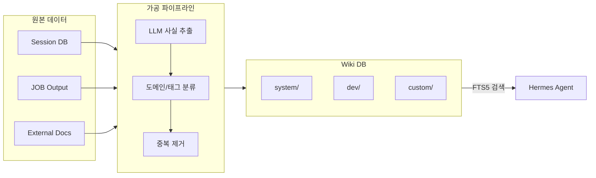

# 지식 분류 시스템 설계: AI의 기억을 구조화하는 법

> **💡 한 줄 요약**: 방대한 데이터를 무분별하게 학습시키는 대신, 원본 $\rightarrow$ 가공 $\rightarrow$ 계층적 Wiki로 이어지는 파이프라인을 통해 AI의 환각을 줄이고 정확한 사실만을 제공하는 시스템 설계입니다.

---

## 🌱 기본 개념: AI에게 '기억'이란 무엇일까요?

우리는 흔히 AI가 모든 것을 기억한다고 생각하지만, 실제로는 **'컨텍스트 윈도우(Context Window)'**라는 한정된 공간 안에 정보를 밀어 넣는 방식입니다. 

- **일상생활의 비유**: AI의 기억은 거대한 도서관이 아니라, 책상 위에 펼쳐놓은 '메모지'와 같습니다. 메모지가 너무 많아지면 정작 중요한 내용을 찾지 못하거나, 오래된 메모와 최신 메모가 섞여 엉뚱한 소리를 하게 됩니다.
- **지식 시스템의 필요성**: 모든 대화 기록과 로그를 그대로 AI에게 주면, AI는 "과거에 내가 이렇게 말했으니 이게 정답이야"라는 식의 **추론 오염**에 빠집니다. 이를 막기 위해 필요한 것이 바로 '지식 분류 시스템'입니다. 

Hermes는 데이터를 그대로 저장하지 않고, **원본(Source) $\rightarrow$ 가공 파이프라인 $\rightarrow$ 계층적 Wiki(Wiki DB)**라는 엄격한 정제 과정을 거쳐 AI의 '정제된 기억'을 구축합니다.

---

## 🔍 문제 상황: "기억의 과부하와 오염"

초기 Hermes 시스템은 사용자와의 모든 대화, JOB 산출물, 외부 뉴스 등을 가공 없이 그대로 에이전트에게 제공했습니다. 그 결과 두 가지 치명적인 공학적 문제가 발생했습니다.

### 1. 컨텍스트 오버플로우 (Context Overflow)
방대한 데이터가 컨텍스트 윈도우를 가득 채우면서, 정작 현재 사용자가 요청한 핵심 지시사항이 뒤로 밀려나는 현상이 발생했습니다. 
- **현상**: 50개의 세션 이력과 100개의 뉴스 요약을 읽느라, 정작 "지금 이 코드를 수정해줘"라는 명령을 무시하거나 잊어버림.
- **결과**: 에이전트의 반응 속도 저하 및 지시 이행률 하락.

### 2. 추론 오염 (Inference Contamination)
AI가 과거의 잘못된 판단이나, 시간이 지나 더 이상 유효하지 않은 정보를 '사실'로 착각하여 현재의 결정에 반영하는 문제입니다.
- **현상**: 6개월 전 세션에서 "A 모델이 최고다"라고 말한 기록을 읽고, 최신 벤치마크 결과가 나왔음에도 불구하고 계속 A 모델을 추천함.
- **결과**: 데이터 노후화(Stale Data Problem)로 인한 잘못된 기술적 의사결정.

---

## 🏗️ 기술 설계: 계층적 가공 파이프라인

Hermes는 지식을 무조건 저장하지 않습니다. 데이터가 '사실(Fact)'로 인정받아 Wiki DB에 기록되기 위해서는 세 단계를 거쳐야 합니다.

### 1. 원본 수집 (Source Layer)
가공되지 않은 날것의 데이터가 모이는 곳입니다. 에이전트는 이 영역을 직접 읽지 않고, 오직 파이프라인 스크립트만 접근합니다.

- **주요 소스**:
    - `~/.hermes/state/sessions.db`: 모든 세션 대화 이력 (SQLite).
    - `~/.hermes/workspace/jobs/`: 각 JOB의 최종 산출물.
    - `~/.hermes/knowledge/references/`: 외부 공식 문서, GitHub Wiki.
    - `~/.hermes/knowledge/news/`: RSS/Atom 피드를 통한 최신 기술 뉴스.

### 2. 가공 파이프라인 (Processing Layer)
`wiki-process-filings.sh`라는 스크립트가 5분 간격으로 동작하며 원본 데이터를 '지식'으로 변환합니다. 이 과정에서 LLM이 **'사실 추출기(Fact Extractor)'** 역할을 수행합니다.

**가공 프로세스**:
1. **중복 제거**: 동일한 정보가 여러 소스에 있을 경우 하나로 통합.
2. **사실 추출**: LLM이 텍스트를 분석하여 "의견"은 버리고 "검증 가능한 사실"만 추출.
3. **도메인 매핑**: 추출된 사실이 `system`, `dev`, `custom`, `knowledge` 중 어디에 속하는지 분류.
4. **태그 생성**: 검색 효율을 높이기 위한 메타데이터(태그) 부여.

**LLM 추출 예시**:
- *입력*: "JOB-1001에서 Flux.2 Pro가 가성비가 좋아서 기본 모델로 선정했다. 내 생각엔 이게 최선인 것 같다."
- *출력*: `{"fact": "Flux.2 Pro가 기본 이미지 모델로 선정됨", "domain": "system", "tags": ["image", "flux", "default"], "confidence": 0.98}`

### 3. Wiki DB 저장 및 검색 (Storage & Retrieval)
가공된 데이터는 `~/.hermes/knowledge/wiki/` 하위에 도메인별 Markdown 파일로 저장되며, 빠른 검색을 위해 **SQLite FTS5 (Full-Text Search)** 인덱스를 사용합니다.

**도메인 구조**:
- `system/`: 아키텍처, 설정, 모델 카탈로그 등 시스템의 뼈대 정보.
- `dev/`: 코딩 규칙, Spec-Driven 개발 프로세스, 스킬 정의.
- `custom/`: 사용자별 특화 워크플로우 (예: 특정 소설 집필 설정).
- `knowledge/`: 지식 시스템 자체의 메타데이터 및 파이프라인 정의.

### 📊 지식 흐름도 (Mermaid)

---

## 💡 활용 예시: 모델 카탈로그의 실시간 관리

가장 대표적인 활용 사례는 **'모델 벤치마크 데이터 관리'**입니다.

**상황**: 새로운 모델(예: Gemma-4)이 출시되어 성능 지표가 업데이트되었습니다.
1. **수집**: 뉴스 피드와 벤치마크 사이트에서 새 데이터가 `references/` 폴더에 수집됩니다.
2. **가공**: 파이프라인이 이를 읽어 `{"model": "Gemma-4", "mmlu": 0.88, "reasoning": "high"}`라는 사실을 추출합니다.
3. **저장**: `wiki/system/models.md` 파일의 해당 항목이 자동으로 갱신됩니다.
4. **활용**: 에이전트가 "지금 가장 추론 능력이 좋은 모델이 뭐야?"라고 물으면, 5분 전 업데이트된 `models.md`를 참조하여 정확하게 Gemma-4를 추천합니다.

---

## 🔗 관련 주제

- [5-Tier 물리 계층화 설계](https://pheanor-agent.github.io/p-hermes/docs/blog/posts/why-5-tier-architecture.md): 지식 시스템이 물리적으로 어떻게 격리되어 저장되는가.
- [이벤트 기반 도메인 통신](https://pheanor-agent.github.io/p-hermes/docs/blog/posts/event-driven-communication.md): JOB 완료 이벤트가 어떻게 지식 파이프라인을 트리거하는가.

---

_지식 시스템은 에이전트의 "기억의 대장간"입니다. 날것의 데이터는 이 대장간에서 정제 과정을 거쳐야만 비로소 에이전트가 신뢰할 수 있는 '지식'이 됩니다._
