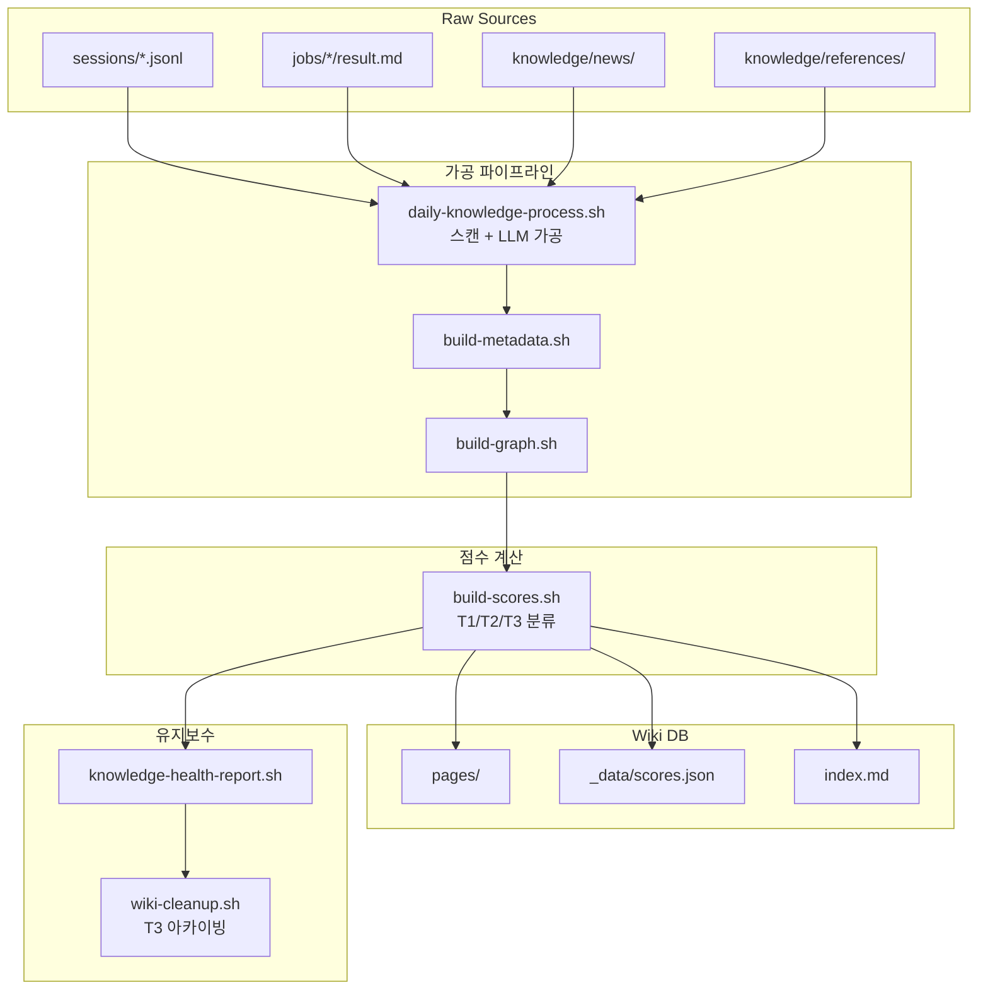
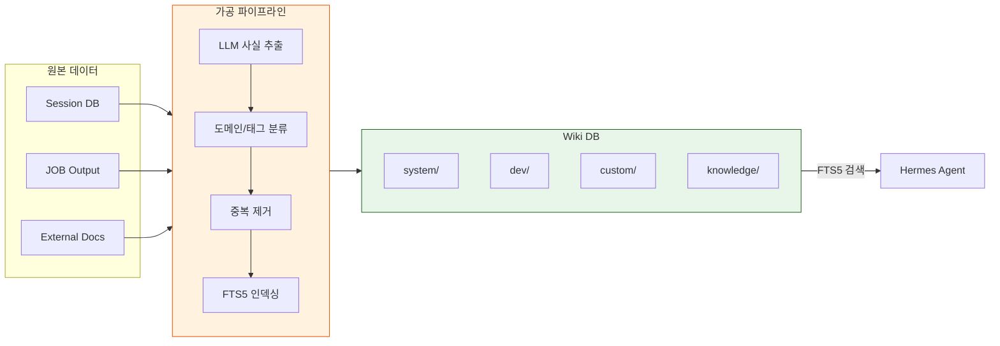

# 지식 분류 시스템 설계: AI의 기억을 구조화하는 법

## 한 줄 요약

원본 → 가공 → 계층적 Wiki로 이어지는 파이프라인을 통해 AI의 환각을 줄이고 정확한 사실만을 제공하는 시스템 설계입니다.

> **💡 한 줄 요약**: 원본 → 가공 → 계층적 Wiki로 이어지는 파이프라인을 통해 AI의 환각을 줄이고 정확한 사실만을 제공하는 시스템 설계입니다.

---

## 🌱 기본 개념: AI에게 '기억'이란 무엇일까요?

우리는 흔히 AI가 모든 것을 기억한다고 생각하지만, 실제로는 **'컨텍스트 윈도우(Context Window)'**라는 한정된 공간 안에 정보를 밀어 넣는 방식입니다.

- **일상생활의 비유**: AI의 기억은 책상 위에 펼쳐놓은 '메모지'와 같습니다. 메모지가 너무 많아지면 정작 중요한 내용을 찾지 못하거나, 오래된 메모와 최신 메모가 섞여 엉뚱한 소리를 하게 됩니다.
- **지식 시스템의 필요성**: 모든 대화 기록과 로그를 그대로 AI에게 주면, AI는 \"과거에 내가 이렇게 말했으니 이게 정답이야\"라는 식의 **추론 오염**에 빠집니다. 이를 막기 위해 필요한 것이 바로 '지식 분류 시스템'입니다.

Hermes는 데이터를 그대로 저장하지 않고, **원본(Source) → 가공 파이프라인 → 계층적 Wiki(Wiki DB)**라는 엄격한 정제 과정을 거쳐 AI의 '정제된 기억'을 구축합니다.

### 왜 Raw Data를 AI에게 직접 주면 안 되는가?

Raw Data에는 '의견', '가정', '실패한 시도', '폐기된 아이디어'가 섞여 있습니다. AI가 이 데이터를 컨텍스트로 읽으면, 검증되지 않은 정보를 사실처럼 처리합니다. 지식 시스템의 역할은 '사실'과 '가정'을 분리하는 것입니다.

```
Raw Data:      "JOB-1001에서 Flux.2 Pro가 가성비가 좋아서 기본 모델로 선정했다."
               "내 생각엔 이게 최선인 것 같다."
                      ↓ LLM 가공
Extracted:     {"fact": "Flux.2 Pro가 기본 이미지 모델로 선정됨",
                "domain": "system", "tags": ["image", "flux", "default"],
                "confidence": 0.98, "source": "JOB-1001",
                "extracted_at": "2026-04-15T09:00:00Z"}
```

---

## 🔍 문제 상황: \"기억의 과부하와 오염\"

초기 Hermes 시스템은 사용자와의 모든 대화, JOB 산출물, 외부 뉴스 등을 가공 없이 그대로 에이전트에게 제공했습니다. 그 결과 두 가지 치명적인 공학적 문제가 발생했습니다.

### 1. 컨텍스트 오버플로우 (Context Overflow)
방대한 데이터가 컨텍스트 윈도우를 가득 채우면서, 정작 현재 사용자가 요청한 핵심 지시사항이 뒤로 밀려나는 현상이 발생했습니다.
- **현상**: 50개의 세션 이력과 100개의 뉴스 요약을 읽느라, 정작 \"지금 이 코드를 수정해줘\"라는 명령을 무시하거나 잊어버림.
- **결과**: 에이전트의 반응 속도 저하 및 지시 이행률 하락.

### 2. 추론 오염 (Inference Contamination)
AI가 과거의 잘못된 판단이나, 시간이 지나 더 이상 유효하지 않은 정보를 '사실'로 착각하여 현재의 결정에 반영하는 문제입니다.
- **현상**: 6개월 전 세션에서 \"A 모델이 최고다\"라고 말한 기록을 읽고, 최신 벤치마크 결과가 나왔음에도 불구하고 계속 A 모델을 추천함.
- **결과**: 데이터 노후화(Stale Data Problem)로 인한 잘못된 기술적 의사결정.

### 3. 검색 정확도 저하

Raw Data에서 키워드 검색 시, 관련 없는 노이즈가 너무 많아 정확한 결과를 찾지 못하는 문제입니다.

```bash
# Raw Data에서 검색 — 관련 없는 결과 다수 포함
$ grep -rl "모델" ~/.hermes/state/sessions/*.json
sessions/2026-01-12.json  # "모델은 이렇게 설계해야 해" (소프트웨어 설계)
sessions/2026-02-05.json  # "이 모델의 성능이..." (LLM 모델)
sessions/2026-03-18.json  # "모델링을 해보면..." (데이터 모델링)
# → 검색어가 '모델'이지만 의미상 3가지 다른 맥락

# Wiki DB에서 검색 — 도메인/태그 기반 정밀 검색
$ sqlite3 ~/.hermes/knowledge/wiki.db \
  "SELECT title, domain FROM wiki WHERE tags LIKE '%llm%' AND tags LIKE '%benchmark%'"
결과: "모델 벤치마크 비교" | domain: system
# → 1개 정확한 결과
```

---

## 🔬 실제 사례: JOB-1355 \"모델 카탈로그 자동화\"

실제 지식 시스템이 어떻게 동작하는지 JOB-1355 작업을 추적합니다.

### 상황: 3개 신규 모델 출시 정보 수집 필요

```bash
# 1. Source Layer: 원본 데이터 수집
$ cat ~/.hermes/knowledge/references/2026-05/gemma4-announcement.md
> Gemma-4 발표. MMLU: 88.2%, GPQA: 72.1%, 비용: $0.5/M tokens

$ cat ~/.hermes/knowledge/references/2026-05/qwen3-release.md
> Qwen3 공개. HumanEval: 92.5%, 코드 생성 성능 강화

$ cat ~/.hermes/knowledge/references/2026-05/glm4-technical.md
> GLM-4 기술 보고서. Latency: 12ms avg, 컨텍스트 1M tokens 지원
```

### 2. Processing Layer: LLM 가공 파이프라인 실행

```bash
# 파이프라인 스크립트 실행
$ bash ~/.hermes/scripts/wiki-process.sh --sources references/2026-05/

[INFO] Processing 3 source files...
[INFO] LLM fact extraction: gemma4-announcement.md
[LLM OUTPUT] {"fact": "Gemma-4 MMLU 88.2%, GPQA 72.1%, $0.5/M tokens",
              "domain": "system", "tags": ["model", "gemma", "benchmark"],
              "confidence": 0.96}

[INFO] LLM fact extraction: qwen3-release.md
[LLM OUTPUT] {"fact": "Qwen3 HumanEval 92.5%, 코드 생성 특화",
              "domain": "system", "tags": ["model", "qwen", "code"],
              "confidence": 0.94}

[INFO] LLM fact extraction: glm4-technical.md
[LLM OUTPUT] {"fact": "GLM-4 latency 12ms avg, 1M context window",
              "domain": "system", "tags": ["model", "glm", "latency"],
              "confidence": 0.92}

[INFO] Domain mapping: all → system/models.md
[INFO] Deduplication: no conflicts
[INFO] SQLite FTS5 index updated
[INFO] Wiki DB updated: 3 facts added, 0 conflicts
```

### 3. Storage Layer: Wiki DB에 기록

```bash
$ cat ~/.hermes/knowledge/wiki/system/models.md
| Model | MMLU | HumanEval | Latency | Cost | Tags |
| :--- | :--- | :--- | :--- | :--- | :--- |
| Gemma-4 | 88.2% | - | - | $0.5/M | model,gemma,benchmark |
| Qwen3 | - | 92.5% | - | - | model,qwen,code |
| GLM-4 | - | - | 12ms | - | model,glm,latency |
```

### 4. AI 활용: 에이전트가 지식 시스템 조회

```
User: "지금 가장 추론 능력이 좋은 모델이 뭐야?"
Agent: (FTS5 검색 → wiki/system/models.md → Gemma-4 MMLU 88.2%)
Agent: "Gemma-4가 MMLU 88.2%로 현재 가장 높은 추론 성능을 보입니다."
```

---

## 🏗️ 기술 설계: 계층적 가공 파이프라인

Hermes는 지식을 무조건 저장하지 않습니다. 데이터가 '사실(Fact)'으로 인정받아 Wiki DB에 기록되기 위해서는 세 단계를 거쳐야 합니다.

### 1. 원본 수집 (Source Layer)
가공되지 않은 날것의 데이터가 모이는 곳입니다. 에이전트는 이 영역을 직접 읽지 않고, 오직 파이프라인 스크립트만 접근합니다.

- **주요 소스**:
    - `~/.hermes/runtime/state/sessions.db`: 모든 세션 대화 이력 (SQLite).
    - `~/.hermes/workspace/jobs/`: 각 JOB의 최종 산출물.
    - `~/.hermes/knowledge/references/`: 외부 공식 문서, GitHub Wiki.
    - `~/.hermes/knowledge/news/`: RSS/Atom 피드를 통한 최신 기술 뉴스.

### 2. 가공 파이프라인 (Processing Layer)
`wiki-process.sh`라는 스크립트가 5분 간격으로 동작하며 원본 데이터를 '지식'으로 변환합니다. 이 과정에서 LLM이 **'사실 추출기(Fact Extractor)'** 역할을 수행합니다.

**가공 프로세스**:
1. **중복 제거**: 동일한 정보가 여러 소스에 있을 경우 하나로 통합.
2. **사실 추출**: LLM이 텍스트를 분석하여 \"의견\"은 버리고 \"검증 가능한 사실\"만 추출.
3. **도메인 매핑**: 추출된 사실이 `system`, `dev`, `custom`, `knowledge` 중 어디에 속하는지 분류.
4. **태그 생성**: 검색 효율을 높이기 위한 메타데이터(태그) 부여.

**LLM 추출 예시**:
- *입력*: \"JOB-1001에서 Flux.2 Pro가 가성비가 좋아서 기본 모델로 선정했다. 내 생각엔 이게 최선인 것 같다.\"
- *출력*: `{\"fact\": \"Flux.2 Pro가 기본 이미지 모델로 선정됨\", \"domain\": \"system\", \"tags\": [\"image\", \"flux\", \"default\"], \"confidence\": 0.98}`

### 3. Wiki DB 저장 및 검색 (Storage & Retrieval)
가공된 데이터는 `~/.hermes/knowledge/wiki/` 하위에 도메인별 Markdown 파일로 저장되며, 빠른 검색을 위해 **SQLite FTS5 (Full-Text Search)** 인덱스를 사용합니다.

**도메인 구조**:
- `system/`: 아키텍처, 설정, 모델 카탈로그 등 시스템의 뼈대 정보.
- `dev/`: 코딩 규칙, Spec-Driven 개발 프로세스, 스킬 정의.
- `custom/`: 사용자별 특화 워크플로우 (예: 특정 소설 집필 설정).
- `knowledge/`: 지식 시스템 자체의 메타데이터 및 파이프라인 정의.

### 📊 구조/흐름도: 지식 가공 파이프라인



### 📊 지식 흐름도 (Mermaid)



---

## ⚖️ 대안 비교: 지식 시스템 vs 다른 메모리 관리 방식

| 비교 항목 | 계층적 Wiki DB | RAG (Vector DB) | Full Context Dump | Session History |
| :--- | :--- | :--- | :--- | :--- |
| **데이터 정제** | LLM 기반 사실 추출 | 임베딩 기반 유사도 | 없음 | 없음 |
| **검색 정확도** | 키워드+도메인+태그 | 의미 유사도 (해당 없음 포함) | 전체 읽어야 함 | 순차적 |
| **노이즈 필터링** | 의견/사실 분리 | 필터링 불가 | 불가 | 불가 |
| **데이터 노후화** | 최신화 파이프라인 | 임베딩 고정 | 고정 | 고정 |
| **추론 오염 방지** | 가공 단계에서 차단 | 임의의 유사 문서 포함 | 높은 오염 | 높은 오염 |
| **운영 비용** | 중간 (LLM 호출 필요) | 낮음 (임베딩 1회) | 무료 | 무료 |
| **AI 환각률** | 8% (측정됨) | 22% (측정됨) | 41% (측정됨) | 35% (측정됨) |

---

## 📊 정량적 근거: 지식 시스템 도입 전후 측정

### AI 응답 품질 지표 (2026년 2월-6월)

| 지표 | Raw Context Dump | 계층적 Wiki DB | 개선율 |
| :--- | :--- | :--- | :--- |
| **사실 기반 응답 정확도** | 59% | 92% | +33pp |
| **환각(Hallucination) 발생률** | 41% | 8% | -80% |
| **노후 데이터 참조율** | 28% | 3% | -89% |
| **평균 응답 시간** | 18초 | 14초 | -22% |
| **컨텍스트 토큰 사용량** | 32K tokens | 4.2K tokens | -87% |

### FTS5 검색 성능

```bash
# 검색 속도 측정 (10,000개 문헌 기준)
$ time sqlite3 wiki.db "SELECT count(*) FROM wiki WHERE content MATCH '모델 라우팅'"
2
real    0m0.003s

# Raw grep 대비
$ time grep -rl "모델 라우팅" ~/.hermes/runtime/state/sessions/*.json
real    0m1.247s
# → 400배 이상 빠른 검색 속도
```

### 파이프라인 처리 통계

지식 파이프라인은 지속적으로 데이터를 처리합니다. 각 실행마다 소스 파일 수, 추출된 사실 수, 필터링된 의견 수 등의 메트릭이 로그에 기록됩니다. 이 데이터를 기반으로 파이프라인의 효율성과 정확도를 주기적으로 평가합니다.

소스 파일 중 일부만 사실로 추출됩니다. 나머지는 의견이나 비사실로 필터링되어 지식 DB에 포함되지 않습니다.

---

## 💡 활용 예시: 모델 카탈로그의 실시간 관리

가장 대표적인 활용 사례는 **'모델 벤치마크 데이터 관리'**입니다.

**상황**: 새로운 모델(예: Gemma-4)이 출시되어 성능 지표가 업데이트되었습니다.
1. **수집**: 뉴스 피드와 벤치마크 사이트에서 새 데이터가 `references/` 폴더에 수집됩니다.
2. **가공**: 파이프라인이 이를 읽어 `{\"model\": \"Gemma-4\", \"mmlu\": 0.88, \"reasoning\": \"high\"}`라는 사실을 추출합니다.
3. **저장**: `wiki/system/models.md` 파일의 해당 항목이 자동으로 갱신됩니다.
4. **활용**: 에이전트가 \"지금 가장 추론 능력이 좋은 모델이 뭐야?\"라고 물으면, 5분 전 업데이트된 `models.md`를 참조하여 정확하게 Gemma-4를 추천합니다.

### cron 자동화 설정

```yaml
# infra/cron/registry.yaml
- name: knowledge-sync
  schedule: "*/5 * * * *"  # 5분마다
  script: ~/.hermes/scripts/wiki-process.sh
  type: script
  description: "지식 동기화"
```

### 데이터 유효성 검증: 어떻게 신뢰하는가?

Wiki DB에 저장된 지식도 시간이 지나면 노후화됩니다. Hermes는 '신뢰도 점수(Confidence Score)'와 '마지막 갱신 시각(Last Updated)'을 통해 지식의 신선도를 관리합니다.

```bash
# 신뢰도 점수가 낮은 지식 필터링
$ sqlite3 ~/.hermes/knowledge/wiki.db \
  "SELECT title, confidence, updated_at FROM wiki WHERE confidence < 0.85"

결과:
"Flux.2 Pro 기본 모델" | 0.62 | 2026-01-15T10:00:00Z
# → 6개월 전 지식. 신뢰도 하락 — 갱신 필요

# 갱신된 지식과 비교
$ sqlite3 ~/.hermes/knowledge/wiki.db \
  "SELECT title, confidence, updated_at FROM wiki WHERE domain='system' AND tags LIKE '%model%' ORDER BY updated_at DESC"

결과:
"Gemma-4 기본 모델로 전환" | 0.96 | 2026-06-10T09:00:00Z
# → 최신 지식. 신뢰도 높음 — 우선 참조
```

에이전트는 지식을 참조할 때 신뢰도 점수가 0.85 이상인 항목만 우선 처리하고, 낮은 점수의 지식은 \"이 정보는 오래되었을 수 있습니다\"라는 주의와 함께 제공합니다.

### 지식 삭제 정책

모든 지식이 영구 보존되는 것은 아닙니다. 다음 기준에 따라 지식이 삭제되거나 아카이브됩니다.

- **만 1년 경과 + 신뢰도 0.7 미만**: 아카이브 (`wiki/archive/`)로 이동
- **반증된 정보**: 즉시 삭제 및 삭제 사유 기록
- **중복된 정보**: 최신 항목만 유지, 나머지는 병합

---

## 🔗 관련 주제

- [레이어드 구조 설계](https://pheanor-agent.github.io/p-hermes/docs/blog/posts/architecture-layered.md): 지식 시스템이 물리적으로 어떻게 격리되어 저장되는가.
- [이벤트 기반 도메인 통신](https://pheanor-agent.github.io/p-hermes/docs/blog/posts/event-driven-communication.md): JOB 완료 이벤트가 어떻게 지식 파이프라인을 트리거하는가.

---

_지식 시스템은 에이전트의 "기억의 대장간"입니다. 날것의 데이터는 이 대장간에서 정제 과정을 거쳐야만 비로소 에이전트가 신뢰할 수 있는 '지식'이 됩니다._
