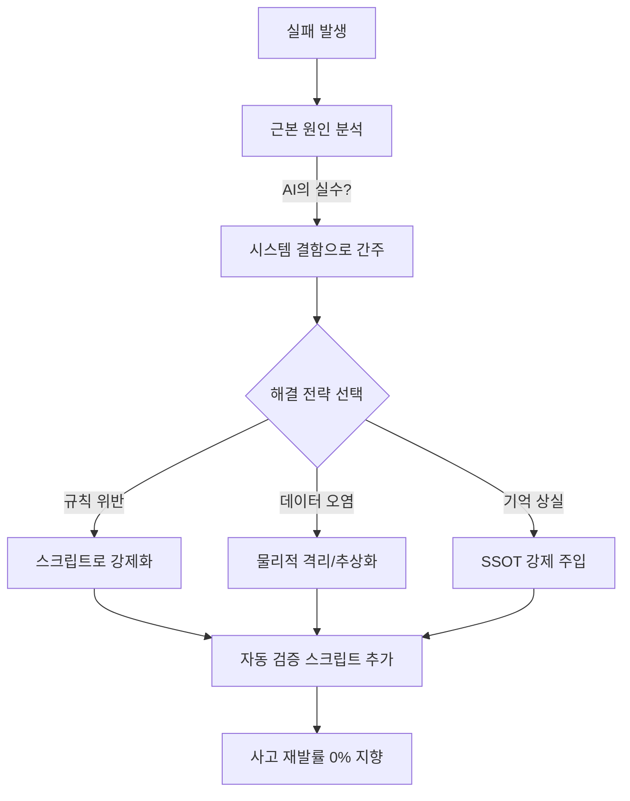

# 실패 패턴에서 배운 교훈: 더 견고한 AI 시스템을 만드는 법

> **💡 한 줄 요약**: 완벽한 시스템은 없습니다. Hermes가 겪은 '대형 참사'들의 근본 원인(Root Cause)을 분석하고, 이를 개별 AI의 지능이 아닌 시스템적 안전장치로 해결한 기록입니다.

---

## 🌱 기본 개념: "실패는 최고의 설계서다"

소프트웨어 엔지니어링에서 가장 위험한 생각은 "에이전트가 더 똑똑해지면 이 문제가 해결될 것"이라고 믿는 것입니다. AI의 지능은 확률적이며, 아무리 뛰어난 모델이라도 특정 상황에서는 반드시 실수합니다.

- **일상생활의 비유**: 운전자가 아무리 베테랑이라도 졸음운전을 할 수 있습니다. 이때 필요한 것은 "더 집중하라는 교육(프롬프트)"이 아니라, 차선을 벗어나면 자동으로 핸들을 꺾어주는 "차선 이탈 방지 시스템(안전장치)"입니다.
- **Hermes의 철학**: 에이전트의 실수를 '개인의 부주의'가 아닌 '시스템의 결함'으로 간주합니다. 사고가 발생하면 "왜 그랬어?"라고 묻는 대신, "어떤 스크립트를 추가해야 다시는 이런 일이 안 일어날까?"를 고민합니다.

---

## 🔍 주요 실패 패턴 및 해결책

Hermes가 성장하며 겪은 5가지 대표적인 실패 사례와 그에 따른 공학적 해결책을 공유합니다.

### 1. 폴더 생성의 무질서 (JOB-907)
**현상**: 에이전트가 작업 폴더를 만들 때 `jobs/JOB-1001` 대신 `jobs/job1001_backup`이나 `jobs/temp_1001`처럼 제멋대로 이름을 지었습니다.
- **근본 원인**: `mkdir` 명령어를 에이전트가 직접 사용하게 허용함 $\rightarrow$ 네이밍 컨벤션 강제 수단 부재.
- **해결책**: `create-job.sh` 스크립트를 도입하고 `mkdir` 직접 사용을 금지했습니다. 이제 모든 작업 폴더는 이 스크립트를 통해서만 생성되며, 자동으로 `flock`을 통한 중복 확인과 `.workflow-state` 파일 생성이 이루어집니다.

### 2. 심링크(Symlink)의 역설 (JOB-1626)
**현상**: 파일 동기화를 위해 심링크를 광범위하게 사용했더니, LLM이 파일 경로를 탐색할 때 무한 루프에 빠지거나 "파일이 있는데 읽을 수 없다"는 오류를 쏟아냈습니다.
- **근본 원인**: 논리적 편리함(심링크)이 물리적 복잡도(경로 탐색 오버헤드)를 초래함.
- **해결책**: **'물리적 격리 원칙'**을 수립했습니다. 심링크 사용을 절대 금지하고, 대신 상태 파일과 이벤트 기반의 비동기 동기화 방식을 채택했습니다.

### 3. 컨텍스트 붕괴 (Context Collapse)
**현상**: 장시간 작업 중반에 에이전트가 앞서 작성한 설계서 내용을 잊어버리고, 완전히 다른 방식으로 코드를 수정하여 2시간 분량의 작업을 망쳤습니다.
- **근본 원인**: 컨텍스트 윈도우의 한계로 인해 이전 대화 내용이 요약/삭제(Compaction)되면서 핵심 설계 원칙이 누락됨.
- **해결책**: **'SSOT 설계서 강제 리딩'** 프로세스를 도입했습니다. `Execution` 단계 진입 직전, 시스템이 자동으로 `design.md` 파일을 읽어 프롬프트 최상단에 주입함으로써 AI가 현재 목표를 다시 상기하게 만들었습니다.

### 4. Gateway Hook의 타입 오류 (JOB-1233)
**현상**: 시스템 간 메시지를 주고받는 Gateway 스크립트가 `{"action": "skip"}`이라는 JSON 대신 `"NO_REPLY"`라는 단순 문자열을 반환하여 전체 메시징 시스템이 크래시되었습니다.
- **근본 원인**: 반환 값에 대한 타입 검증(Type Checking) 부재.
- **해결책**: **Type Enforcement** 함수를 도입했습니다. 모든 Hook의 반환 값은 `validate_gateway_return()` 함수를 거쳐야 하며, 딕셔너리 형식이 아닐 경우 즉시 `ValueError`를 발생시켜 시스템 전체가 죽기 전에 에러를 포착합니다.

### 5. 절대 경로의 덫 (JOB-1626)
**현상**: 스크립트에 `/home/bot/.hermes`라고 경로를 하드코딩했더니, 환경이 바뀌거나 Docker 컨테이너로 옮겼을 때 모든 스크립트가 작동하지 않았습니다.
- **근본 원인**: 환경 의존적인 절대 경로 사용.
- **해결책**: `$HERMES_ROOT` 환경 변수 추상화를 강제했습니다. 모든 스크립트는 `HERMES_ROOT="${HERMES_ROOT:-$HOME/.hermes}"` 형식을 사용하여 어떤 환경에서도 유연하게 동작하도록 수정되었습니다.

---

## 🏗️ 종합 해결 전략: 시스템적 방어막

위의 실패들을 통해 Hermes가 정립한 3가지 핵심 방어 원칙입니다.

### 📊 실패 대응 매트릭스 (Mermaid)

---

## 💡 실전 교훈: 반복되는 실수를 시스템으로 막아라

이제 우리는 어떤 문제든 **"에이전트가 더 똑똑해지면 해결된다"**는 환상을 버렸습니다. 대신 다음의 세 가지 원칙을 고수합니다.

1. **텍스트로 쓰지 말고 코드로 강제하라**: 규칙은 프롬프트가 아니라 `.sh` 파일에 있어야 합니다.
2. **수동 검증을 믿지 말고 자동 검증을 돌려라**: "잘 됐겠지"라는 생각 대신 `bash validate.sh`를 실행하십시오.
3. **재시도하지 말고 구조를 고쳐라**: 똑같은 에러로 세 번 실패했다면, 그것은 AI의 운이 없는 것이 아니라 설계가 잘못된 것입니다.

---

## 🔗 관련 주제

- ["텍스트 규칙 $\rightarrow$ 스크립트 강제" 철학](https://pheanor-agent.github.io/p-hermes/docs/blog/posts/structural-enforcement.md)
- [왜 9단계 상태머신인가?](https://pheanor-agent.github.io/p-hermes/docs/blog/posts/why-9-step-workflow.md)
- [5-Tier 물리 계층화 설계](https://pheanor-agent.github.io/p-hermes/docs/blog/posts/why-5-tier-architecture.md)

---

_실패는 시스템 설계의 가장 정직한 피드백입니다. Hermes는 수많은 실패를 통해 단순한 AI 래퍼가 아닌, 견고한 엔지니어링 시스템으로 진화했습니다._
