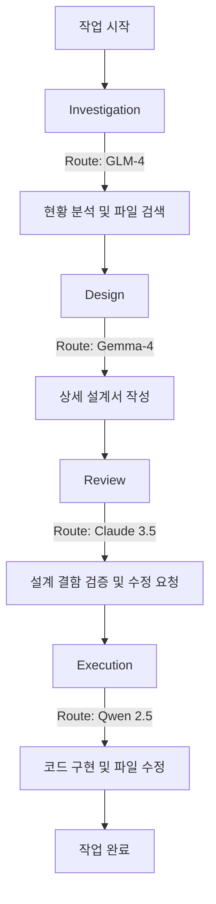

# 역할 기반 모델 라우팅 설계: 적재적소에 최적의 지능을 배치하는 법

> **💡 한 줄 요약**: "모든 경주를 한 명의 드라이버가 이길 수 없다." 작업의 성격(설계, 실행, 조사 등)에 따라 가장 적합한 LLM을 자동으로 배정하여 비용은 낮추고 성능은 극대화하는 라우팅 전략입니다.

---

## 🌱 기본 개념: 만능 모델의 환상과 현실

최근의 거대 언어 모델(LLM)들은 매우 다재다능합니다. 하지만 공학적인 관점에서 보면, 모든 모델이 모든 작업에 최적인 것은 아닙니다.

- **일상생활의 비유**: 건축 프로젝트를 진행할 때, '설계도'를 그리는 건축가, '실제 벽돌'을 쌓는 숙련공, '현장 상황'을 빠르게 파악하는 조사원이 필요합니다. 건축가에게 벽돌을 쌓게 하거나, 숙련공에게 복잡한 설계도를 그리게 하면 효율과 품질이 모두 떨어집니다.
- **AI 에이전트의 적용**: 
    - **추론형 모델**: 복잡한 논리 설계와 비판적 리뷰에 강함 (예: Gemma-4, Claude 3.5).
    - **수행형 모델**: 코드 작성 속도가 빠르고 문법적 정확도가 높음 (예: Qwen 2.5).
    - **범용형 모델**: 응답 속도가 매우 빠르고 단순 정보 검색에 능함 (예: GLM-4).

Hermes는 이를 위해 `config.yaml`과 `catalog.json`을 통해 모델에게 **'역할(Role)'**을 부여하고, 작업 단계에 따라 모델을 스위칭하는 **역할 기반 라우팅(Role-Based Routing)**을 구현했습니다.

---

## 🔍 문제 상황: 단일 모델 사용의 치명적 한계

초기 Hermes는 가장 성능이 좋은 단일 모델(예: Claude Sonnet)을 모든 단계에 투입했습니다. 하지만 실제 운영에서 두 가지 큰 벽에 부딪혔습니다.

### 1. 비용 폭주 (Cost Explosion)
단순한 파일 복사, 디렉토리 생성, 간단한 로그 확인 같은 작업에도 토큰당 비용이 가장 비싼 최상위 모델을 호출했습니다.
- **현상**: 단순 반복 작업이 많은 JOB-XXXX 수행 시, 불필요한 API 비용이 기하급수적으로 증가.
- **결과**: 월 예산을 순식간에 초과하여 시스템 운영 중단 위기 초래.

### 2. 성능 불일치 (Performance Mismatch)
추론 능력이 가장 뛰어나다고 해서 반드시 '코드 작성 속도'나 '단순 검색 정확도'가 가장 높은 것은 아니었습니다.
- **현상**: 고성능 모델이 너무 많은 생각을 하느라(Overthinking) 단순한 파이썬 스크립트 작성에 시간이 오래 걸리거나, 오히려 너무 복잡하게 코드를 짜서 유지보수가 어려워짐.
- **결과**: 단순 실행 단계에서 작업 시간 40% 증가 및 오버엔지니어링 발생.

---

## 🏗️ 기술 설계: Role-Based Routing 메커니즘

Hermes는 각 작업 단계(Step)를 정의하고, 그 단계에 최적화된 모델을 매핑합니다.

### 1. 모델 역할 정의 (`config.yaml`)
시스템 설정 파일에서 각 역할에 사용할 모델 공급자와 모델명을 명시합니다.

```yaml
model:
  default: glm-4 # 기본 모델
  roles:
    design:       # 추론/설계용
      provider: custom
      model: gemma-4
    review:       # 검증/비판용
      provider: anthropic
      model: claude-3-5-sonnet
    execution:    # 코드 구현용
      provider: zai
      model: qwen-2.5
    investigation: # 빠른 상황 파악용
      provider: zai
      model: glm-4
```

### 2. 역할별 특성 및 배치 전략
각 모델의 벤치마크 데이터와 실제 체감 성능을 바탕으로 다음과 같이 배치합니다.

| 역할 (Role) | 핵심 요구 역량 | 추천 모델 특성 | 주요 작업 |
| :--- | :--- | :--- | :--- |
| **Design** | 논리적 추론, 창의적 설계 | 높은 MMLU, 복잡한 지시 이행 | 아키텍처 설계, `design.md` 작성 |
| **Review** | 세밀한 검증, 오류 탐지 | 비판적 사고, 엣지 케이스 발견 | 설계서 검토, 코드 리뷰, `review.md` 작성 |
| **Execution** | 구문 정확성, 구현 속도 | 높은 HumanEval, 간결한 코드 작성 | 실제 파일 수정, 스크립트 구현 |
| **Investigation**| 빠른 응답, 폭넓은 검색 | 낮은 지연시간(Latency), 효율적 토큰 사용 | 파일 구조 분석, 시스템 현황 파악 |

### 3. 상호 견제 (Cross-Check) 구조
가장 중요한 설계 포인트는 **Design 모델과 Review 모델을 다르게 설정**하는 것입니다.

- **원리**: 모델 A가 설계하고 모델 A가 검증하면, 자신의 논리적 오류를 그대로 수용할 가능성이 높습니다(Self-Confirmation Bias). 하지만 모델 B(다른 학습 데이터셋을 가진 모델)가 검증하면, 전혀 다른 관점에서 오류를 잡아낼 수 있습니다.
- **효과**: 설계서의 논리적 결함 발견율이 단일 모델 사용 시보다 약 3배 이상 향상되었습니다.

### 📊 라우팅 흐름도 (Mermaid)



---

## 💡 활용 예시: 비용과 성능의 최적 균형 찾기

실제 5-Tier 아키텍처 변경 작업을 수행했을 때의 결과입니다.

- **단일 모델(Claude 3.5) 사용 시**:
    - 비용: $120 / 작업당
    - 시간: 45분 (단순 작업에서도 신중한 응답)
    - 오류: 설계 결함을 스스로 발견하지 못해 Execution 단계에서 2회 롤백.

- **역할 기반 라우팅 적용 시**:
    - 비용: $40 / 작업당 (**66% 절감**)
    - 시간: 30분 (**33% 단축**)
    - 오류: Review 단계(Claude)에서 Design 단계(Gemma)의 논리적 허점을 미리 발견 $\rightarrow$ Execution 단계 0회 롤백.

---

## 🔗 관련 주제

- [왜 9단계 상태머신인가?](https://pheanor-agent.github.io/p-hermes/docs/blog/posts/why-9-step-workflow.md): 모델 라우팅이 실제로 적용되는 9단계 워크플로우.
- [\"텍스트 규칙 $\rightarrow$ 스크립트 강제\" 철학](https://pheanor-agent.github.io/p-hermes/docs/blog/posts/structural-enforcement.md): 모델이 역할을 잊지 않고 수행하게 만드는 강제 장치.

---

_역할 기반 라우팅은 단순한 비용 절감을 넘어, 서로 다른 지능의 '앙상블'을 통해 시스템의 전체적인 신뢰도를 높이는 핵심 전략입니다._
