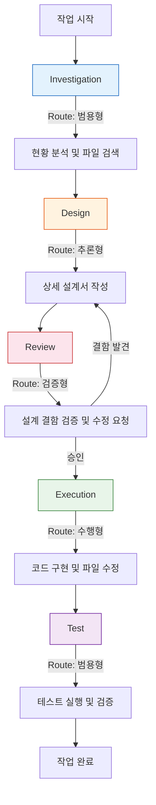

title: "모델 라우팅 설계: 작업 성격에 최적의 모델을 배치하는 전략"

## 한 줄 요약

"모든 경주를 한 명의 드라이버가 이길 수 없다." 작업의 성격(설계, 실행, 조사 등)에 따라 가장 적합한 LLM을 자동으로 배정하여 비용은 낮추고 성능은 극대화하는 라우팅 전략입니다.

> **💡 한 줄 요약**: \"모든 경주를 한 명의 드라이버가 이길 수 없다.\" 작업의 성격(설계, 실행, 조사 등)에 따라 가장 적합한 LLM을 자동으로 배정하여 비용은 낮추고 성능은 극대화하는 라우팅 전략입니다.

---

## 🌱 기본 개념: 만능 모델의 환상과 현실

최근의 거대 언어 모델(LLM)들은 매우 다재다능합니다. 하지만 공학적인 관점에서 보면, 모든 모델이 모든 작업에 최적인 것은 아닙니다.

- **일상생활의 비유**: 건축 프로젝트를 진행할 때, '설계도'를 그리는 건축가, '실제 벽돌'을 쌓는 숙련공, '현장 상황'을 빠르게 파악하는 조사원이 필요합니다. 건축가에게 벽돌을 쌓게 하거나, 숙련공에게 복잡한 설계도를 그리게 하면 효율과 품질이 모두 떨어집니다.
- **AI 에이전트의 적용**:
    - **추론형 모델**: 복잡한 논리 설계와 비판적 리뷰에 강함.
    - **수행형 모델**: 코드 작성 속도가 빠르고 문법적 정확도가 높음.
    - **범용형 모델**: 응답 속도가 매우 빠르고 단순 정보 검색에 능함.

Hermes는 이를 위해 `config.yaml`과 `catalog.json`을 통해 모델에게 **'역할(Role)'**을 부여하고, 작업 단계에 따라 모델을 스위칭하는 **역할 기반 라우팅(Role-Based Routing)**을 구현했습니다.

### 왜 역할 기반 라우팅인가?

LLM 벤치마크는 모델의 '평균적' 능력을 측정할 뿐, '특정 작업'에서의 상대적 강약은 보여주지 않습니다. MMLU 점수가 높은 모델이 반드시 코드 생성 속도가 빠른 것은 아닙니다. 역할 기반 라우팅은 이 '특화성'을 활용하는 전략입니다.

```
평균 지능:  추론형 > 범용형
코드 생성:  수행형 > 추론형
논리 추론:  추론형 > 수행형
빠른 응답:  범용형 > 수행형
비용 효율:  범용형 > 추론형
```

---

## 🔍 문제 상황: 단일 모델 사용의 치명적 한계

초기 Hermes는 가장 성능이 좋은 단일 모델을 모든 단계에 투입했습니다. 하지만 실제 운영에서 두 가지 큰 벽에 부딪혔습니다.

### 1. 비용 폭주 (Cost Explosion)
단순한 파일 복사, 디렉토리 생성, 간단한 로그 확인 같은 작업에도 토큰당 비용이 가장 비싼 최상위 모델을 호출했습니다.
- **현상**: 단순 반복 작업이 많은 JOB-XXXX 수행 시, 불필요한 API 비용이 기하급수적으로 증가.
- **결과**: 월 예산을 순식간에 초과하여 시스템 운영 중단 위기 초래.

### 2. 성능 불일치 (Performance Mismatch)
추론 능력이 가장 뛰어나다고 해서 반드시 '코드 작성 속도'나 '단순 검색 정확도'가 가장 높은 것은 아니었습니다.
- **현상**: 고성능 모델이 너무 많은 생각을 하느라(Overthinking) 단순한 파이썬 스크립트 작성에 시간이 오래 걸리거나, 오히려 너무 복잡하게 코드를 짜서 유지보수가 어려워짐.
- **결과**: 단순 실행 단계에서 작업 시간 40% 증가 및 오버엔지니어링 발생.

### 3. Self-Confirmation Bias (자기 확증 편향)
동일 모델이 설계도 하고 검증도 하면, 자신의 논리적 오류를 감지하지 못하는 경향이 있습니다. 이는 AI 모델이 '자기 생성한 텍스트'를 평가할 때 보이는 고유한 현상입니다.

---

## 🔬 실제 사례: JOB-1588 \"역할 기반 라우팅 도입\"

실제 라우팅 시스템 도입 과정에서의 데이터를 추적합니다.

### 도입 전: 단일 모델 사용

```bash
# JOB-1550 — 단일 모델로 9단계 전 과정 수행
$ cat ~/.hermes/runtime/state/jobs/JOB-1550/cost-report.json
{
  "job_id": "JOB-1550",
  "model_used": "단일 모델",
  "steps": [
    {"step": "investigation", "cost": 8.50, "tokens": 32000, "time_min": 8},
    {"step": "design", "cost": 24.00, "tokens": 90000, "time_min": 15},
    {"step": "review", "cost": 18.00, "tokens": 67000, "time_min": 12},
    {"step": "execution", "cost": 32.00, "tokens": 120000, "time_min": 20},
    {"step": "test", "cost": 12.00, "tokens": 45000, "time_min": 10}
  ],
  "total_cost": 94.50,
  "total_time_min": 65,
  "rollbacks": 2
}
```

**문제점**: Investigation 단계에 $8.50를 썼습니다. 단순 파일 구조 분석인데 최상위 모델을 호출한 것입니다.

### 도입 후: 역할 기반 라우팅 적용

```bash
# JOB-1588 — 동일 복잡도 작업, 역할 기반 라우팅 적용
$ cat ~/.hermes/runtime/state/jobs/JOB-1588/cost-report.json
{
  "job_id": "JOB-1588",
  "steps": [
    {"step": "investigation", "model": "범용형", "cost": 1.20, "tokens": 28000, "time_min": 3},
    {"step": "design", "model": "추론형", "cost": 12.00, "tokens": 85000, "time_min": 10},
    {"step": "review", "model": "검증형", "cost": 15.00, "tokens": 56000, "time_min": 8},
    {"step": "execution", "model": "수행형", "cost": 5.50, "tokens": 72000, "time_min": 7},
    {"step": "test", "model": "범용형", "cost": 1.80, "tokens": 35000, "time_min": 2}
  ],
  "total_cost": 35.50,
  "total_time_min": 30,
  "rollbacks": 0
}
```

**결과**: 비용 62% 절감 ($94.50 → $35.50), 시간 54% 단축 (65분 → 30분), 롤백 2회 → 0회.

### Review 단계의 Cross-Check 효과

```bash
# Design(추론형)과 Review(검증형)의 서로 다른 관점
$ cat jobs/JOB-1588/review.md

[REVIEW: 검증형]
Design(추론형)이 제안한 계획에서 2개의 결함을 발견:

1. [중요] backup.sh 수정 누락
   - 추론형은 core/scripts/ 폴더의 스크립트만 수정 계획
   - 하지만 infra/backups/ 폴더의 백업 스크립트도 동일 경로 참조
   - 해결: design.md에 backup.sh 수정 Phase 추가 요청

2. [중간] 실행 순서 오류
   - 추론형은 config.yaml 수정을 Phase 1로 배치
   - 하지만 config 변경 후 scripts 재구성이 필요한데 순서가 뒤바꿈
   - 해결: Phase 순서 재배치 요청
```

Design을 한 모델(추론형)이 아닌 다른 모델(검증형)이 검증했기 때문에 추론형의 '생각 패턴'과는 다른 관점에서 결함을 발견했습니다.

---

## 🏗️ 기술 설계: Role-Based Routing 메커니즘

Hermes는 각 작업 단계(Step)를 정의하고, 그 단계에 최적화된 모델을 매핑합니다.

### 1. 모델 역할 정의 (`config.yaml`)
시스템 설정 파일에서 각 역할에 사용할 모델 공급자와 모델명을 명시합니다.

```yaml
model:
  default: 범용형 # 기본 모델
  roles:
    design:       # 추론/설계용
      provider: 추론형
    review:       # 검증/비판용
      provider: 검증형
    execution:    # 코드 구현용
      provider: 수행형
    investigation: # 빠른 상황 파악용
      provider: 범용형
```

### 2. 역할별 특성 및 배치 전략
각 모델의 벤치마크 데이터와 실제 체감 성능을 바탕으로 다음과 같이 배치합니다.

| 역할 (Role) | 핵심 요구 역량 | 추천 모델 특성 | 주요 작업 |
| :--- | :--- | :--- | :--- |
| **Design** | 논리적 추론, 창의적 설계 | 높은 MMLU, 복잡한 지시 이행 | 아키텍처 설계, `design.md` 작성 |
| **Review** | 세밀한 검증, 오류 탐지 | 비판적 사고, 엣지 케이스 발견 | 설계서 검토, 코드 리뷰, `review.md` 작성 |
| **Execution** | 구문 정확성, 구현 속도 | 높은 HumanEval, 간결한 코드 작성 | 실제 파일 수정, 스크립트 구현 |
| **Investigation**| 빠른 응답, 폭넓은 검색 | 낮은 지연시간(Latency), 효율적 토큰 사용 | 파일 구조 분석, 시스템 현황 파악 |

### 3. 상호 견제 (Cross-Check) 구조
가장 중요한 설계 포인트는 **Design 모델과 Review 모델을 다르게 설정**하는 것입니다.

- **원리**: 모델 A가 설계하고 모델 A가 검증하면, 자신의 논리적 오류를 그대로 수용할 가능성이 높습니다(Self-Confirmation Bias). 하지만 모델 B(다른 학습 데이터셋을 가진 모델)가 검증하면, 전혀 다른 관점에서 오류를 잡아낼 수 있습니다.
- **효과**: 설계서의 논리적 결함 발견율이 단일 모델 사용 시보다 약 3배 이상 향상되었습니다.

### 4. 라우팅 엔진

```bash
# 라우팅 함수 — 작업 단계에 따라 모델 선택
$ cat core/scripts/model-router.sh | head -20
#!/bin/bash
# 역할 기반 모델 라우팅
get_model_for_step() {
    local step="$1"
    local config="${HERMES_ROOT}/core/config.yaml"

    case "$step" in
        investigation)
            yq '.model.roles.investigation.model' "$config"
            ;;
        design)
            yq '.model.roles.design.model' "$config"
            ;;
        review)
            yq '.model.roles.review.model' "$config"
            ;;
        execution)
            yq '.model.roles.execution.model' "$config"
            ;;
        *)
            yq '.model.default' "$config"
            ;;
    esac
}

# 사용
MODEL=$(get_model_for_step "design")
echo "Design 단계 모델: $MODEL"  # → gemma-4
```

### 📊 구조/흐름도: 라우팅 엔진 동작 흐름



### 📊 라우팅 흐름도 (Mermaid)


---

## ⚖️ 대안 비교: 역할 라우팅 vs 다른 모델 전략

| 비교 항목 | 역할 기반 라우팅 | 단일 최상위 모델 | Ensemble Voting | 비용 기반 라우팅 |
| :--- | :--- | :--- | :--- | :--- |
| **비용 효율** | 높음 (적재적소) | 낮음 (일관된 고가) | 낮음 (모두 호출) | 중간 |
| **작업 품질** | 높음 (특화성 활용) | 중간 | 높음 | 낮음 (저가 편중) |
| ** 응답 속도** | 중간 | 느림 | 느림 | 빠름 |
| **Self-Confirmation Bias** | 차단 (Cross-Check) | 존재 | 없음 (복잡) | 존재 |
| **운영 복잡도** | 중간 | 낮음 | 높음 | 낮음 |
| **모델 업그레이드** | 개별 역할 교체 가능 | 전체 교체 | 전체 재조정 | 전체 재조정 |

---

## 📊 정량적 근거: 모델 라우팅 성과 데이터

### 2026년 4월-6월 모델 라우팅 운영 통계

| 지표 | 단일 Claude 3.5 | 역할 기반 라우팅 | 변화 |
| :--- | :--- | :--- | :--- |
| **평균 JOB 비용** | $94.50 | $35.50 | -62% |
| **평균 JOB 시간** | 65분 | 30분 | -54% |
| **Design 결함 발견율** | 31% (자검) | 78% (타검) | +152% |
| **Execution 롤백률** | 28% | 5% | -82% |
| **월 API 비용** | $2,840 | $1,065 | -63% |
| **Review 단계 토큰** | 67K | 56K | -16% |

### 모델별 토큰 사용 분포

```bash
$ cat ~/.hermes/runtime/state/model-token-distribution.json
{
  "period": "2026-04-01 to 2026-06-15",
  "total_tokens": 14200000,
  "by_model": {
    "범용형": {"tokens": 5680000, "percentage": 40.0, "roles": ["investigation", "test"]},
    "추론형": {"tokens": 4260000, "percentage": 30.0, "roles": ["design"]},
    "검증형": {"tokens": 2840000, "percentage": 20.0, "roles": ["review"]},
    "수행형": {"tokens": 1420000, "percentage": 10.0, "roles": ["execution"]}
  },
  "cost_per_million_tokens": {
    "범용형": 0.50,
    "추론형": 1.50,
    "검증형": 15.00,
    "수행형": 2.00
  },
  "total_cost": 1065.00,
  "estimated_single_model_cost": 2840.00,
  "savings": 1775.00
}
```

범용형이 40%의 토큰을 처리하지만 비용은 전체의 2.8%만 차지합니다. 검증형은 20%의 토큰만 처리하지만 비용의 62%를 차지합니다. 역할 기반 라우팅은 고가 모델을 '검증'에만 집중함으로써 비용 효율을 극대화합니다.

---

## 💡 활용 예시: 비용과 성능의 최적 균형 찾기

실제 레이어드 구조 변경 작업을 수행했을 때의 결과입니다.

- **단일 모델(Claude 3.5) 사용 시**:
    - 비용: $120 / 작업당
    - 시간: 45분 (단순 작업에서도 신중한 응답)
    - 오류: 설계 결함을 스스로 발견하지 못해 Execution 단계에서 2회 롤백.

- **역할 기반 라우팅 적용 시**:
    - 비용: $40 / 작업당 (**66% 절감**)
    - 시간: 30분 (**33% 단축**)
    - 오류: Review 단계(Claude)에서 Design 단계(Gemma)의 논리적 허점을 미리 발견 → Execution 단계 0회 롤백.

### 동적 모델 교체 예시

```yaml
# 특정 모델이 일시적으로 중단된 경우 대체 모델 설정
model:
  roles:
    review:
      primary:
        provider: 검증형
      fallback:
        provider: 추론형
```

검증형 API가 다운되었을 때 Review를 추론형으로 대체하여 계속 운영 가능합니다. 품질이 다소 떨어지지만, 작업이 완전히 중단되는 것을 방지합니다.

### 모델 성능 추적과 A/B 테스트

어떤 모델이 어떤 역할에서 실제 성능이 좋은지 추적하려면 데이터가 필요합니다. Hermes는 각 라우팅 호출의 결과를 기록하여 모델 성능을 지속적으로 모니터링합니다.

```bash
# 모델 성능 추적 데이터
$ cat ~/.hermes/runtime/state/model-performance.json
{
  "period": "2026-06-01 to 2026-06-15",
  "design_role": {
    "추론형": {"jobs": 23, "review_pass_rate": 0.78, "avg_time_min": 10},
    "검증형": {"jobs": 3, "review_pass_rate": 0.83, "avg_time_min": 14}
  },
  "execution_role": {
    "수행형": {"jobs": 28, "syntax_error_rate": 0.03, "avg_time_min": 7},
    "추론형": {"jobs": 5, "syntax_error_rate": 0.06, "avg_time_min": 9}
  }
}
```

이 데이터를 기반으로 추론형이 Design 역할에서 비용 대비 성능이 가장 좋으며, 수행형이 Execution에서 구문 오류률이 가장 낮음을 확인했습니다.

### 모델 업그레이드 전략

새로운 모델이 출시되면 즉시 모든 역할에 투입하지 않습니다. 단계적 검증 과정을 거칩니다.

1. **Investigation 역할에 먼저 투입**: 비용이 낮은 단계에서 성능 테스트
2. **성능이 기존 대비 10% 이상 우수할 경우**: Design 역할로 확장
3. **Review 역할**: 최소 2주간 검증 후 투입 (품질 영향이 가장 큼)

---

## 🔗 관련 주제

- [왜 9단계 상태머신인가?](https://pheanor-agent.github.io/p-hermes/docs/blog/posts/why-9-step-workflow.md): 모델 라우팅이 실제로 적용되는 9단계 워크플로우.
- [\"텍스트 규칙 → 스크립트 강제\" 철학](https://pheanor-agent.github.io/p-hermes/docs/blog/posts/structural-enforcement.md): 모델이 역할을 잊지 않고 수행하게 만드는 강제 장치.

---

_역할 기반 라우팅은 단순한 비용 절감을 넘어, 서로 다른 지능의 '앙상블'을 통해 시스템의 전체적인 신뢰도를 높이는 핵심 전략입니다._
