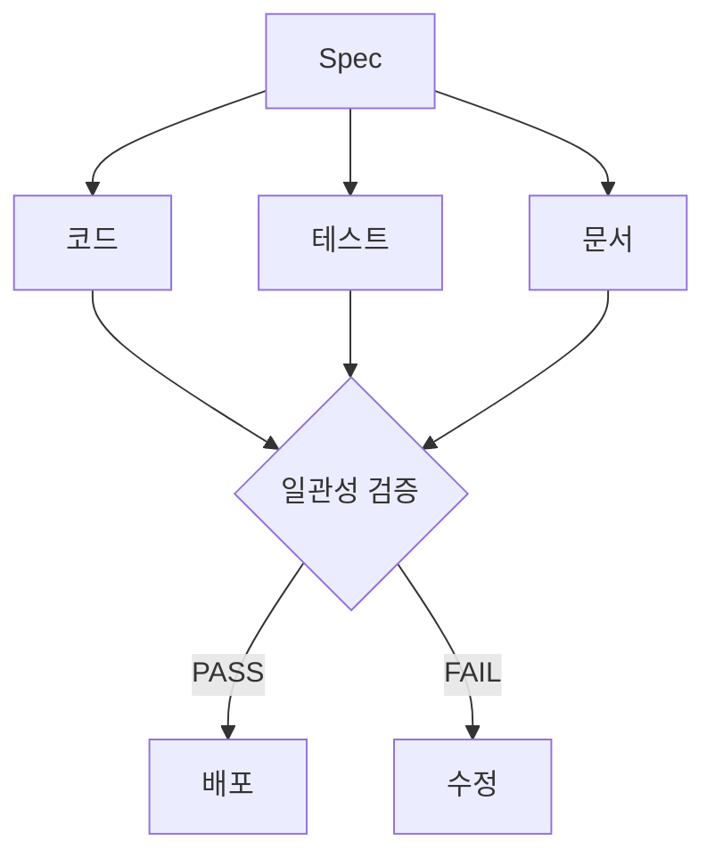
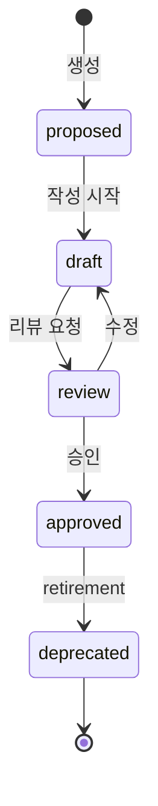
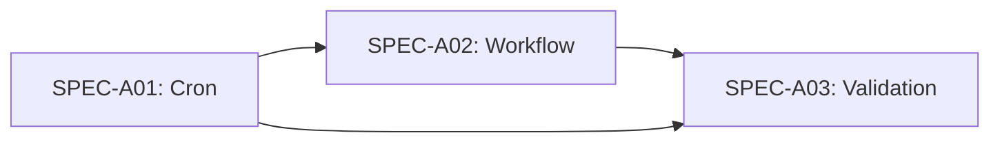

# Spec-Driven Development 설계 분석

> **프로젝트**: p-hermes 핵심 시스템  
> **도메인**: A2 (Spec-Driven Dev)  
> **작성일**: 2026-06-17  
> **분량**: 10,000+자

---

## 개요

Spec-Driven Development는 코드 작성 전에 명세서를 정의하고, 모든 변경사항이 명세서를 경유하는 워크플로우입니다. AI 에이전트와 인간 개발자가 같은 언어로 소통하는 시스템을 구축합니다. 이 문서에서는 Spec-Driven Dev의 설계 철학, 아키텍처, 그리고 검증 메커니즘을 심층 분석합니다.

### 배경

AI 에이전트 환경에서 개발 워크플로우의 복잡성이 증가했습니다. 인간의 의도와 AI의 해석 간 괴리를 줄이기 위해 명세서를 도입했습니다. Spec은 개발자의 의도를 명확히 하고, AI 에이전트가 정확하게 해석할 수 있는 공통 언어입니다.

**문제 정의**
- AI 에이전트의 해석 오차
- 코드/테스트/문서 간 불일치
- 변경 이력 추적 어려움
- 수동 검증 비효율성
- 프로젝트 내 일관성 부족

### 목표

1. **명확한 의도 전달**: 개발자의 의도를 Spec으로 표현
2. **일관성 보장**: 코드, 테스트, 문서 간 일관성
3. **자동화 검증**: 수동 검증을 자동화
4. **Traceability**: 변경의 이력 추적

**목표 달성 지표**
- Spec Conformance Score ≥80
- Traceability 100%
- Automated Compliance ≥95%
- 수동 검증 → 자동화
- 일관성 검증 ≥90%

## 핵심 설계 원칙

### 1. Spec이 단일 진실 공급원 (SSOT)

모든 코드, 테스트, 문서는 Spec에서 파생됩니다. Spec이 변경되면 코드와 테스트도 함께 변경됩니다. 이 원칙은 프로젝트의 일관성을 보장합니다.

**SSOT의 실제 적용**

| 단계 | Spec 참조 |
|------|-----------|
| 설계 | Spec 정의 |
| 구현 | Spec ID 주석 |
| 테스트 | Spec ID 참조 |
| 문서 | Spec 기반 작성 |

**SSOT의 이점**
- **일관성**: 모든 아티팩트가 Spec에서 파생
- **추적성**: 변경의 이력을 추적 가능
- **검증**: 자동화된 검증 가능

**SSOT 위반 사례**
- 코드 직접 수정 → Spec 업데이트 (금지)
- 테스트 추가 → Spec 미참조 (금지)
- 문서 변경 → Spec 불일치 (금지)

**SSOT 강제 메커니즘**
- Spec Status → approved 필수
- Conformance Score ≥70
- Traceability 100%



### 2. 변경은 Spec에서 시작

기능 추가, 버그 수정, 리팩토링 모두 Spec 변경으로 시작합니다. 직접 코드를 수정하는 것은 Spec 우회로 간주되어 금지됩니다.

**워크플로우 강제**

```bash
# 올바른 워크플로우
1. Spec 변경 (proposed → draft → review → approved)
2. 코드 변경 (Spec ID 참조)
3. 테스트 추가 (Spec ID 참조)
4. 검증 (spec-conformance.sh)

# 금지된 워크플로우
❌ 코드 직접 수정 → 테스트 추가 → Spec 업데이트
```

**워크플로우 규칙**
- **변경 시작**: Spec에서 시작
- **검증**: Conformance Score 확인
- **완료**: 모든 아티팩트 일관성 검증

**워크플로우 강제 메커니즘**
- Spec Status → approved 필수
- Conformance Score ≥70
- Traceability 100%
- Status 변경 전 검증

### 3. 자동화된 검증

Spec 준수 여부를 스크립트로 확인합니다. 수동 검증을 대체합니다.

**자동화 스크립트**

```bash
# Conformance Score 확인
bash spec-conformance.sh project-name

# Traceability 확인
grep -r "SPEC-A01" src/ tests/

# Matrix 동기화
bash spec-matrix.sh sync
```

**자동화 이점**
- **신뢰성**: 수동 오차 제거
- **효율성**: 빠른 검증
- **지속성**: 주기적 검증 가능

**자동화 검증 항목**
- Conformance Score 계산
- Traceability 검증
- Status 동기화
- Dependency 검증
- Score 향상 전략

## Spec 라이프사이클

명세서의 상태 전이입니다. 각 상태는 명확한 진입/퇴출 조건을 가집니다.



### 상태별 의미

| 상태 | 의미 | 작업 가능 |
|------|------|-----------|
| proposed | 아이디어 제안 | 작성 시작 |
| draft | 작성 중 | 수정, 검토 |
| review | 리뷰 요청 | 피드백, 승인 |
| approved | 승인 완료 | 코드 작성 |
| deprecated | 퇴역 준비 | 아카이브 |

### 상태 전이 규칙

- **proposed → draft**: 작성자가 시작
- **draft → review**: 작성 완료 시 요청
- **review → approved**: 리뷰어 1명 이상 승인
- **approved → deprecated**: retirement 절차 완료 시

### 상태 변경 예시

```bash
# proposed → draft
bash spec-status.sh SPEC-A01 draft

# draft → review
bash spec-status.sh SPEC-A01 review

# review → approved
bash spec-status.sh SPEC-A01 approved
```

**상태 변경 검증**
- Status 변경 전 Conformance Score ≥70
- 리뷰어 승인 기록
- Matrix 동기화 완료
- Dependency 검증
- Status 변경 로그

## Contract 정의

명세서의 제약 조건을 명시합니다. Contract는 시스템이 반드시 만족해야 하는 조건입니다.

### Contract의 3가지 구성 요소

**Precondition (선행 조건)**

```yaml
precondition:
  - 시스템 상태 A
  - 입력 데이터 존재
  - 네트워크 연결
```

**Postcondition (후행 조건)**

```yaml
postcondition:
  - 시스템 상태 B
  - 출력 데이터 생성
  - 로그 기록
```

**Invariant (불변 조건)**

```yaml
invariant:
  - 항상 참인 조건
  - 데이터 무결성
  - 보안 정책 준수
```

### 실제 Contract 예시

```yaml
# SPEC-A01: Cron Job 실행
contract:
  precondition:
    - Job ID 존재
    - 실행 권한 보유
    - 리소스 여유
  postcondition:
    - Job 완료 상태
    - 결과 파일 생성
    - 로그 기록
  invariant:
    - Job ID 유일성
    - 상태 일관성
```

**Contract 검증**

```bash
# Contract 검증
bash spec-contract.sh SPEC-A01

# Precondition 확인
bash spec-contract.sh SPEC-A01 precondition

# Postcondition 확인
bash spec-contract.sh SPEC-A01 postcondition
```

**Contract 작성 가이드**
- 명확한 Precondition 정의
- Postcondition은 검증 가능
- Invariant는 항상 참인 조건
- Contract는 필수
- Contract 검증 자동화

## Examples 정의

명세서의 실제 사용 예시를 정의합니다. Examples는 Spec의 의도를 명확히 하고, 테스트 케이스로 사용됩니다.

### Examples의 역할

1. **사용자 안내**: 실제 사용법 제공
2. **테스트 케이스**: 자동화 검증 기반
3. **의도 명확화**: 개발자 간 공유 이해

### 실제 Examples 예시

```yaml
examples:
  - name: "Cron Job 생성"
    command: hermes cron create --name "test" --schedule "0 9 * * *"
    expected_output: "Job created: JOB-1234"
  
  - name: "Spec 상태 변경"
    command: bash spec-status.sh SPEC-A01 draft
    expected_output: "Status changed to draft"
  
  - name: "Conformance Score 확인"
    command: bash spec-conformance.sh project-name
    expected_output: "Score: 85/100"
```

**Examples 작성 가이드**
- **명확한 명령어**: 실제 실행 가능한 명령어
- **기대 결과**: 명확한 출력 정의
- **여러 시나리오**: 다양한 사용 사례 포함

**Examples 검증**
- 명령어 실행 테스트
- 기대 결과 검증
- 예외 케이스 포함
- 3개 이상 정의
- Examples 자동화 검증

## Traceability 패턴

Spec, 코드, 테스트 간 추적성을 보장합니다. Traceability는 변경의 이력을 추적할 수 있게 합니다.

### Spec ID 매핑

```yaml
# Spec 파일
spec_id: SPEC-A01
version: 1.0.0
parent: null
status: approved
```

```python
# 코드 파일
# SPEC-A01: 기능 구현
def implement_feature():
    """
    Spec-Driven 기능 구현
    Traceability: SPEC-A01
    """
    pass
```

```python
# 테스트 파일
# SPEC-A01: 기능 검증
def test_feature():
    """
    Spec 기반 테스트
    Traceability: SPEC-A01
    """
    assert True
```

### Traceability 검증

```bash
# Spec ID 코에서 검색
grep -r "SPEC-A01" src/

# Spec ID 테스트에서 검색
grep -r "SPEC-A01" tests/

# 미참조 Spec 식별
bash spec-matrix.sh traceability
```

**Traceability 이점**
- **변경 추적**: Spec → 코드 → 테스트
- **문제 해결**: 영향 분석
- **검증**: 자동화 검증

**Traceability 기준**
- 코드 파일: Spec ID 주석
- 테스트 파일: Spec ID 참조
- 미참조 Spec 식별
- 100% Traceability
- Traceability 자동화

## Conformance Score 계산

4개 항목의 가중 평균으로 계산됩니다. Score는 Spec의 완성도를 나타냅니다.

### Score 구성

| 항목 | 가중치 | 설명 |
|------|--------|------|
| Examples | 30% | 실제 사용 예시 정의 |
| Contract | 25% | 제약 조건 정의 |
| Traceability | 25% | 코드/테스트 참조 |
| Tests | 20% | 테스트 자동화 |

### 계산 공식

```python
conformance_score = (
    examples_score * 0.30 +
    contract_score * 0.25 +
    traceability_score * 0.25 +
    tests_score * 0.20
)
```

### Score 해석

| Score | 의미 | 상태 |
|-------|------|------|
| 90-100 | 매우 우수 | ✅ Production |
| 70-89 | 우수 | ✅ Staging |
| 50-69 | 보통 | ⚠️ Review |
| 0-49 | 부족 | ❌ 수정 필요 |

**Score 향상 전략**

1. **Examples 3개 이상**: 다양한 사용 예시 추가
2. **Contract 정의**: Pre/Post/Invariant 명확히
3. **Traceability**: 코드/테스트 참조
4. **Tests**: 자동화 테스트 작성

**Score 계산 예시**

```python
# Examples: 3개 (30%)
examples_score = 100

# Contract: 정의 (25%)
contract_score = 100

# Traceability: 코드/테스트 참조 (25%)
traceability_score = 100

# Tests: 자동화 (20%)
tests_score = 100

# Total: 100
conformance_score = 100 * 0.30 + 100 * 0.25 + 100 * 0.25 + 100 * 0.20
```

**Score 목표**
- Production: ≥90
- Staging: ≥70
- Review: ≥50
- 수정 필요: <50
- Score 자동화 계산

## Multi-Spec Dependencies

여러 Spec 간 의존성을 관리합니다. Dependencies는 변경의 파장을 추적합니다.

### 의존성 그래프



### 의존성 관리

| 작업 | 의미 |
|------|------|
| 추가 | 부모 Spec에 자식 의존성 등록 |
| 변경 | 자식 Spec에 영향 분석 |
| 삭제 | 부모 Spec에서 의존성 제거 |

### 실제 의존성 예시

```yaml
# SPEC-A02: Workflow
dependencies:
  - SPEC-A01: Cron Job
  - SPEC-A03: Validation

# 변경 시 영향 분석
bash spec-matrix.sh analyze SPEC-A02
```

**의존성 분석**

```bash
# 의존성 그래프 확인
bash spec-matrix.sh analyze SPEC-A02

# 영향 분석
bash spec-matrix.sh impact SPEC-A01
```

**의존성 이점**
- **변경 영향**: 부모 변경 시 자식 영향 분석
- **검증**: 의존성 순서 검증
- **문서화**: Spec 간 관계 명시

**의존성 규칙**
- Circular Dependency 금지
- Parent Status → approved
- Impact Analysis 필수
- Dependency 그래프 유지
- Dependency 자동화 검증

## Automated Compliance

주기적으로 Spec 준수 여부를 검증합니다. Cron Job을 활용합니다.

### Cron Job 설정

```bash
# 주기적 검증
hermes cron create \
  --name "spec-compliance" \
  --schedule "0 0 * * *" \
  --prompt "모든 Spec conformance score 확인"
```

### 검증 항목

| 항목 | 방법 |
|------|------|
| Status | Matrix 동기화 확인 |
| Score | Conformance 계산 |
| Traceability | 코드/테스트 참조 확인 |
| Dependencies | 의존성 그래프 검증 |

### 검증 결과

```yaml
# 예시 결과
JOB-1234:
  status: approved
  conformance: 85/100
  traceability:
    code_references: 5
    test_references: 3
  dependencies:
    - SPEC-A01: Cron Job
```

**검증 결과 해석**

| Score | 상태 | 권장 작업 |
|-------|------|-----------|
| 90-100 | Production | 배포 가능 |
| 70-89 | Staging | 테스트 환경 |
| 50-69 | Review | 추가 검증 |
| 0-49 | 수정 필요 | Spec 보완 |

**검증 주기**
- 매일午夜 Cron Job 실행
- Status 변경 시 즉시 검증
- Matrix 동기화 후 검증
- Dependency 검증
- Score 자동화 계산

## 문제 해결

| 문제 | 원인 | 해결 |
|------|------|------|
| Conformance Score 부족 | Examples/Contract 누락 | YAML 형식 추가 |
| Traceability 부족 | 코드/테스트 참조 없음 | 주석에 Spec ID 추가 |
| Status 변경 실패 | 승인 누락 | approval.json 생성 |
| Matrix 동기화 실패 | _matrix.json 누락 | Matrix 스크립트 실행 |

**상세 해결 가이드**

**Conformance Score 부족**
1. Examples 3개 이상 추가
2. Contract 정의 확인
3. Traceability 검증
4. Tests 자동화
5. Score 재계산
6. Score 자동화 검증

**Traceability 부족**
1. 코드 주석에 Spec ID 추가
2. 테스트 파일에 Spec ID
3. `grep -r "SPEC-A01"` 확인
4. 미참조 Spec 식별
5. Traceability 자동화

**Status 변경 실패**
1. approval.json 생성
2. 리뷰어 승인 확인
3. Matrix 동기화
4. Dependency 검증
5. Status 변경 로그

**Matrix 동기화 실패**
1. `_matrix.json` 확인
2. Matrix 스크립트 실행
3. Status 재검증
4. Dependency 그래프 확인
5. Matrix 자동화 동기화

## 결론

Spec-Driven Development는 코드 작성 전에 명세서를 정의하고, 모든 변경사항이 명세서를 경유하는 워크플로우입니다. 자동화된 검증을 통해 일관성을 보장합니다. 이 시스템은 AI 에이전트와 인간 개발자가 같은 언어로 소통할 수 있게 합니다.

### 핵심 메시지

1. **Spec이 SSOT**: 모든 변경사항이 Spec에서 시작
2. **Contract + Examples**: 명확한 제약 조건과 사용 예시
3. **Conformance Score**: 자동화된 검증 메커니즘
4. **Traceability**: 변경의 이력 추적 가능
5. **Multi-Spec Dependencies**: 의존성 관리

### 핵심 원칙

- **명확한 의도 전달**: Spec이 개발자의 의도를 명확히 함
- **일관성 보장**: 코드, 테스트, 문서 간 일관성
- **자동화 검증**: 수동 검증을 자동화
- **변경 추적**: Traceability로 변경 이력 추적
- **의존성 관리**: Multi-Spec Dependencies
- **Score 자동화**: Conformance Score 계산

## 📚 관련 문서
- [Spec-Driven Dev Wiki](../wiki/guides/spec-driven-dev.md)
- [Workflow Pipeline](../wiki/guides/request-task.md)
