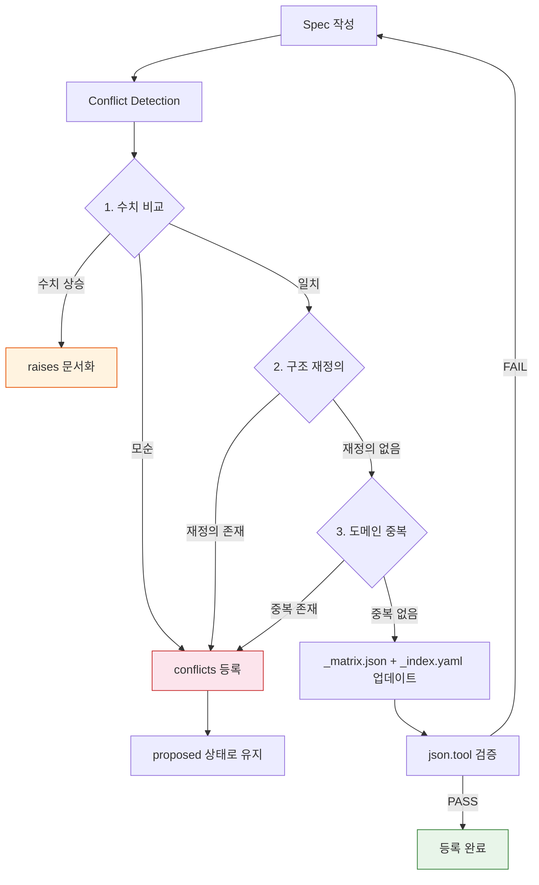
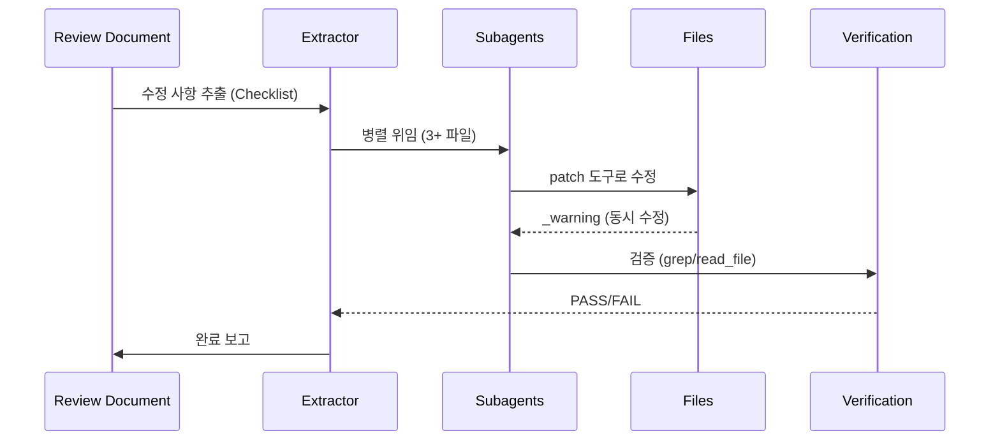

# Spec-Driven Development: 명세서가 코드보다 빠른 이유

> **주제**: #spec-driven-dev #dependencies #conflict-detection
> **작성일**: 2026-06-17

## 한 줄 요약

명세서(Spec)를 단일 진실 공급원으로 설정하고, 3단계 Conflict Detection으로 Spec 간 충돌을 사전에 차단하는 개발 프로세스입니다.

## 기본 개념

AI 에이전트 시대에는 여러 에이전트가 자율적으로 작업을 수행하므로 "무엇을 해야 하는가"에 대한 명확한 기준이 필수적입니다. Spec-Driven Development는 명세서를 시스템의 권위 있는 정의(SSOT)로 설정하고, 모든 변경사항이 Spec을 경유하여 추적·검증되도록 합니다. 의존성 추적(extends, raises, conflicts), 3단계 Conflict Detection, Batch Modification이 세 가지 핵심 메커니즘입니다.

## 기술 설계

Spec 시스템은 `specs/active/SPEC-*.md`(활성 명세서), `specs/_index.yaml`(인간 판독형 카탈로그), `specs/_matrix.json`(기계 판독형 의존성 그래프) 세 가지 파일로 구현됩니다. 의존성 타입은 `extends`(부모 확장), `raises`(수치 상승 — 승인 시 부모 업데이트), `conflicts`(충돌 — 승인 차단)로 구분됩니다. 신규 Spec 등록 시 3단계 검증(수치 비교 → 구조 재정의 → 도메인 중복)을 실행하며, Batch Modification 워크플로우로 여러 Spec을 병렬로 수정할 수 있습니다.

## 구조/흐름도



---

## 서론: AI 에이전트 시대의 명세서

챗봇 시대가 종식되고 자율 AI 에이전트 시대가 도래했습니다. 인간이 직접 명령을 내리는 것이 아니라, AI 에이전트가 자율적으로 작업을 수행하는 환경입니다.

이러한 환경에서 가장 중요한 것은 **명세서 (Spec)** 입니다.

명세서가 없는 작업은 혼란을 야기합니다. "무엇을 해야 하는가"에 대한 기준이 명확하지 않으면 각기 다른 방향으로 작업이 진행됩니다.

명세서가 있는 곳에 효율이 있습니다. 이 문서에서는 Spec-Driven Development의 설계 철학, 의존성 추적 메커니즘, Conflict Detection 절차 및 Batch Modification 워크플로우에 대해 기술합니다.

---

## 의존성 추적: 왜 3종으로 구분했는가

명세서 간 관계를 정의하는 의존성 타입은 3가지로 구분됩니다. `extends`, `raises`, `conflicts`입니다.

### 1. extends: 부모 확장

`extends`는 부모 명세서를 상세화하여 확장하는 관계를 의미합니다. 부모가 정의한 구조를 기반으로 자식이 더 상세한 요구사항을 추가합니다.

**예시**: SPEC-D01이 문서 구조를 정의하면, SPEC-D04가 각 트랙별 구체적인 파일명 매핑과 분량 기준을 정의합니다.

`extends` 타입은 별도 동작이 필요하지 않습니다. 부모가 권위 있는 정의 (SSOT) 역할을 유지하며, 자식은 상세한 요구사항을 보완합니다.

### 2. raises: 수치적 기준 상승

`raises`는 부모 명세서의 수치적 기준을 상승시키는 관계를 의미합니다. 분량 기준, 성능 지표, 테스트 커버리지 등 수치로 표현되는 요구사항이 상승합니다.

**예시**: SPEC-D03에서 Wiki 분량 기준을 1,500자로 정의했습니다. SPEC-D04에서 이를 3,500자로 상승시켰습니다.

`raises` 타입은 **승인 시 부모 Spec 업데이트**가 필요합니다. 부모 명세서가 자식이 상승시킨 기준을 반영하지 않으면, 두 명세서 간 수치 불일치가 발생합니다.

**핵심**: `raises`는 충돌이 아닙니다. 의도적인 요구사항 상승입니다. delta를 문서화하고, 승인이 되면 부모를 업데이트합니다.

### 3. conflicts: 충돌

`conflicts`는 부모 명세서와 자식 명세서 간 모순이 존재함을 의미합니다.

**예시**: 부모가 "Wiki는 `wiki/guides/`에 위치"라고 정의하면, 자식이 "Wiki는 `docs/wiki/`에 위치"라고 재정의합니다.

`conflicts` 타입은 **승인 차단**됩니다. 충돌이 해결되기 전까지 자식 명세서는 `proposed` 상태로 유지됩니다.

### 의존성 타입 비교

| 타입 | 의미 | 승인 | 부모 업데이트 |
|------|------|------|---------------|
| `extends` | 부모 확장 | ✅ 가능 | ❌ 불필요 |
| `raises` | 수치 상승 | ✅ 가능 (delta 문서화) | ✅ 필수 |
| `conflicts` | 충돌 | ❌ 차단 | ❌ 해결 필요 |

---

## Conflict Detection: 3단계 검증 철학

새로운 명세서를 등록하기 전에 반드시 3단계 검증을 실행합니다. 이 절차는 명세서 간 충돌을 사전에 방지합니다.

### 1. Quantitative Conflicts (수치 비교)

명세서 내에 정의된 모든 수치적 기준을 비교합니다.

```bash
# 분량/라인 수 비교
grep -n "분량\|자\|chars\|words\|lines" specs/active/SPEC-NEW.md
grep -n "분량\|자\|chars\|words\|lines" specs/active/SPEC-EXISTING.md
```

**검증 로직**:
- 신규 명세서 수치가 기존보다 높으면 → `raises` (delta 문서화)
- 모순되는 수치가 있으면 → `conflicts` (승인 차단)

**실제 사례**: SPEC-D04 등록 시 Wiki 분량 기준이 SPEC-D03의 1,500자에서 3,500자로 상승했습니다. 이는 `raises` 타입으로 문서화되었습니다.

### 2. Structural Conflicts (구조 재정의)

명세서가 폴더 구조, 트랙 아키텍처 또는 파일 경로를 재정의하는지 확인합니다.

```bash
# 폴더/트랙/경로 재정의 확인
grep -n "트랙\|track\|구조\|hierarchy\|folder\|path" specs/active/SPEC-NEW.md
```

**검증 로직**:
- 부모가 정의한 폴더 구조를 재정의 → `conflicts`
- 트랙 아키텍처 변경 시도 → `conflicts`
- 파일 경로 재정의 → `conflicts`

명세서가 정의한 구조를 자식이 임의로 변경하면, 다른 명세서들이 참조하는 경로가 무효화됩니다.

### 3. Domain Overlap (도메인 중복)

동일 도메인의 두 명세서 간 역할 중복을 확인합니다.

**원칙**:
- **부모** = 구조/권위 있는 정의
- **자식** = 부분집합에 대한 상세 요구사항/설계

동일 도메인에서 두 명세서가 동일한 수준의 상세도를 가지면 역할 중복이 발생합니다. 부모는 구조를 정의하고, 자식은 부분을 상세화하는 계층 구조를 유지해야 합니다.

---

## Batch Modification: 병렬 수정의 필요성

리뷰 과정에서 여러 명세서에 대한 수정 사항이 발견됩니다. 일일이 순차적으로 수정하면 비효율적입니다.

### 병렬 수정 워크플로우



### 핵심 규칙

**1. 전체 컨텍스트 공유**
각 서브에이전트는 전체 수정 컨텍스트를 수신합니다. 부분적인 정보만 제공하면 누락이 발생합니다.

**2. `_warning`은 예상대로 발생**
서브에이전트가 동시 수정 시 `_warning: was modified by sibling subagent`가 발생합니다. 이는 오류가 아닌 예상대로의 동작입니다.

**3. patch 도구 사용**
전체 파일 재작성이 아닌, 타겟팅된 수정을 위해 `patch` 도구를 사용합니다.

### 검증 (반드시)

수정 후 반드시 검증을 실행합니다.

```bash
# 잔여 참조 확인
grep -rn "old_value" specs/active/SPEC-*.md

# 변경 수 확인
grep -c "new_value" specs/active/SPEC-*.md
```

검증을 생략하면 잔여 참조가 남거나, 누락된 수정이 발생합니다. 서브에이전트가 "모든 수정 적용 완료"라고 보고해도 반드시 검증합니다.

---

## Pitfalls 분석: 10+ 실제 사례에서 교훈

실제 운영 과정에서 발견된 10개 이상의 Pitfall을 분석합니다.

### 1. Markdown 테이블 파이프 개수 오차

`read_file`이 `LINE_NUM|CONTENT` 형식으로 출력을 반환합니다. Markdown 테이블의 `|`와 혼동하여 파이프 개수를 잘못 계산하면, 테이블 포맷이 손상됩니다.

**교훈**: `LINE_NUM|` 접두사를 제거한 후 파이프를 카운트합니다.

### 2. 동시 서브에이전트 수정 시 stale `_warning`

여러 서브에이전트가 동일한 파일을 수정 시 `read_file` 뷰가 stale 상태가 됩니다.

**교훈**: 패치 전 반드시 `read_file`으로 재확인합니다.

### 3. 다중 패치 후 테이블 포맷 손상

5개 이상의 패치를 적용하면 테이블 포맷이 손상될 수 있습니다.

**교훈**: 최종 `read_file`으로 테이블 검증을 실행합니다.

### 4. Conflict Detection 생략 (JOB-1665)

SPEC-D04 등록 시 Wiki 분량 기준 상승을 Conflict Detection 절차에서 발견하지 못했습니다.

**교훈**: 항상 수치 한계값을 grep한 후 등록합니다.

### 5. `_index.yaml` 또는 `_matrix.json` 누락

두 파일 중 하나만 업데이트하면 도구 체인이 중단됩니다.

**교훈**: 두 파일 모두 업데이트 필수입니다.

### 6. `raises`를 `conflicts`로 오인

`raises`는 의도적인 요구사항 상승입니다. 충돌로 오인하여 승인을 차단하면 잘못된 결과가 발생합니다.

**교훈**: delta를 문서화하고 승인을 진행합니다.

### 7. `conflicts` 타입 Spec 등록

충돌이 해결되지 않은 상태로 `proposed` 상태로 등록하면 승인 시 문제가 발생합니다.

**교훈**: 충돌 해결 전 `proposed` 상태로 유지합니다.

### 8. 부모 Spec이 `proposed` 상태

부모가 `proposed` 상태일 때 자식을 `approved`하면 구조적 무결성이 깨집니다.

**교훈**: 부모가 `approved` 후 자식을 승인합니다.

### 9. `spec-conformance.sh` grep multiline 버그 (JOB-1673)

`grep -r | wc -l`이 다중 디렉토리에서 multiline output을 반환하여 `[[ 0\n0 -gt 0 ]]` 구문 오류를 발생시킵니다.

**교훈**: `grep -rl` 사용 또는 `tr -d '\n'` 적용합니다.

### 10. Spec 파일명 vs 실제 파일명 불일치 (JOB-1678)

SPEC-D04에 정의된 파일명 (`cron-3layer-design.md`, `architecture.html`)과 실제 파일명 (`cron-automation-design.md`, `architecture-layered.html`)이 다릅니다.

**교훈**: `ls docs/*/` 실제 목록과 SPEC 파일명 테이블을 반드시 대조합니다.

### 11. 슬라이드 인덱스 파일 형식 (JOB-1678)

`docs/slides/index.md`가 아닌 `index.html`을 사용해야 합니다. Markdown 파일은 GitHub Pages에서 렌더링되지 않습니다.

**교훈**: `index.html`을 사용하여 다크 테마를 통일합니다.

---

## 향후 전망: Spec 기반 개발의 진화

Spec-Driven Development는 단순한 명세서 작성 프로세스가 아닙니다. AI 에이전트와 시스템이 같은 언어로 소통하는 프레임워크입니다.

미래에는 명세서 간 의존성 추적이 더 정교해지고, Conflict Detection이 더 자동화될 것입니다. 대규모 프로젝트에서 수십 개의 명세서가 상호 작용할 때, 이 시스템의 가치 더욱 커집니다.

명세서가 있는 곳에 효율이 있습니다.

---

_이 문서는 Spec-Driven Development의 설계 철학, 의존성 추적 메커니즘, Conflict Detection 절차 및 Batch Modification 워크플로우를 기술합니다. 실제 운영 경험을 바탕으로 작성되었습니다._
