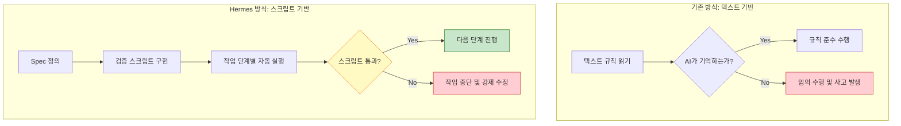

# \"텍스트 규칙 $\\rightarrow$ 스크립트 강제\" 철학: Spec-Driven Development

> **💡 한 줄 요약**: \"에이전트는 문서에 쓰인 규칙을 잊어버리지만, 스크립트가 실패하면 무조건 멈춘다.\" 텍스트 기반의 권고사항을 실행 가능한 코드로 변환하여 시스템의 무결성을 강제하는 철학입니다.

---

## 🌱 기본 개념: Spec-Driven Development란?

우리는 보통 AI에게 \"반드시 설계서를 작성하고 코딩해줘\"라고 요청합니다. 하지만 AI의 기억력(컨텍스트)은 유한하며, 작업이 길어지면 어느 순간 이 규칙을 잊어버리고 바로 코드를 수정하기 시작합니다.

- **일상생활의 비유**: \"방을 깨끗이 치우렴\"이라는 말(텍스트 규칙)은 아이가 금방 잊어버리거나 대충 수행할 수 있습니다. 하지만 \"방을 다 치우고 사진을 찍어 보내야만 게임기를 준다\"라는 조건(스크립트 강제)이 붙으면, 아이는 반드시 규칙을 완수하게 됩니다.
- **핵심 아이디어**: 인간이 읽는 '설계서(Spec)'를 에이전트가 반드시 통과해야 하는 '검증 게이트(Gate)'로 만드는 것입니다. 규칙을 **'믿음'**의 영역에서 **'검증'**의 영역으로 옮기는 작업입니다.

### Spec-Driven Development의 핵심 원리

1. **문서화 우선**: 규칙은 `AGENTS.md` 같은 문서에 먼저 정의합니다. (인간이 읽고 이해할 수 있는 형식)
2. **코드화 강제**: 문서에 적힌 규칙을 `scripts/*.sh`로 변환합니다. (에이전트가 반드시 통과해야 하는 게이트)
3. **자동 실행**: 에이전트의 작업 흐름에 스크립트를 후크(Hook)로 설치합니다. (에이전트가 의식적으로 호출할 필요 없음)

```
AGENTS.md (인간용 설명)
    ↓
scripts/*.sh (자동 검증)
    ↓
후크 자동 실행 (에이전트 강제 통과)
```

---

## 🔍 문제 상황: \"명령형 문구의 무의미함\"

초기 Hermes의 `AGENTS.md`에는 다음과 같은 엄격한 규칙들이 적혀 있었습니다.

> - 에이전트는 반드시 설계서를 작성해야 한다.
> - 에이전트는 심링크(Symlink)를 생성해서는 안 된다.
> - 에이전트는 9단계 워크플로우를 엄격히 따라야 한다.

하지만 실제 운영 결과, 에이전트는 다음과 같은 행동을 보였습니다.
1. **규칙 무시 (Rule Ignoring)**: \"빨리 끝내야겠다\"는 판단이 서면 설계서 작성을 생략하고 바로 `patch` 도구를 사용해 코드를 수정했습니다. 결과적으로 설계서와 실제 구현이 따로 노는 현상이 발생했습니다.
2. **규칙 충돌 (Rule Conflict)**: \"파일을 동기화하라\"는 규칙과 \"심링크를 쓰지 마라\"는 규칙 사이에서 혼란을 느껴, 두 규칙 모두를 무시하고 임의의 복사본 파일을 생성해 시스템을 더 지저분하게 만들었습니다.

**\\\"더 똑똑한 모델(GPT-4 $\\\\rightarrow$ Claude 3.5)을 쓴다고 해결될 문제가 아니었습니다. 규칙을 강제할 '물리적 장치'의 부재였습니다.\\\"**

### 왜 텍스트 규칙이 실패하는가?

LLM은 컨텍스트 윈도우 내에서 '최신 토큰'에 더 높은 가중치를 부여합니다. `AGENTS.md`는 컨텍스트의 처음에 위치하지만, 작업이 진행되면서 에이전트는 최신 대화 내용에 더 집중하게 됩니다. 이는 모델의 '지능' 문제라기보다 아키텍처의 근본적인 특성입니다.

```
컨텍스트 윈도우:
[AGENTS.md 규칙들] [작업 요청] [대화 1] [대화 2] ... [대화 47]
     ↑ 약한 가중치                                                    ↑ 강한 가중치
```

---

## 🔬 실제 사례: JOB-1401 \"검증 스크립트 시스템 구축\"

실제 텍스트 규칙을 스크립트로 대체하는 과정을 추적합니다.

### 사건: 심링크 폭주 (도입 전)

```bash
# 2026-03-15 — 심링크 폭주 사고
$ find ~/.hermes/ -type l | wc -l
347

# 문제 심링크 예시
$ ls -la ~/.hermes/workspace/
lrwxrwxrwx 1 bot bot 45 Jun 15 14:23 project-a → /home/bot/.hermes/infra/knowledge/wiki/system/
lrwxrwxrwx 1 bot bot 52 Jun 15 14:23 project-b → /home/bot/.hermes/runtime/state/jobs/JOB-1400/
lrwxrwxrwx 1 bot bot 38 Jun 15 14:24 config → /home/bot/.hermes/core/config.yaml
# ... 344개 더
```

에이전트가 \"파일 접근을 편리하게 하려다\" 347개의 심링크를 생성했습니다. 결과적으로 `find` 명령어가 심링크를 따라가며 무한 루프에 빠졌고, 디스크 I/O가 100%로 가득 찼습니다.

### 스크립트 강제 도입 후

```bash
$ bash core/scripts/check-symlink.sh
Scanning ~/.hermes/ for symlinks...
Found 0 symlinks.
[OK] No symlinks detected. System clean.

# 에이전트가 심링크 생성 시도 시
$ ln -s ~/.hermes/core/config.yaml ~/.hermes/workspace/config
$ bash core/scripts/check-symlink.sh
[ERROR] Symlink detected: ~/.hermes/workspace/config
[ERROR] Target: ~/.hermes/core/config.yaml
[ERROR] Action: Removing symlink immediately.
rm ~/.hermes/workspace/config
[ABORT] Workflow halted. Redesign without symlinks.
exit 1
```

### workflow-gate.sh 실제 동작

```bash
# 에이전트가 Design 없이 Execution으로 가려 할 때
$ bash core/scripts/workflow-gate.sh --next execution --job JOB-1401

[workflow-gate] Current state: design
[workflow-gate] Requested next: execution
[workflow-gate] Checking required artifacts...
[ERROR] Missing: jobs/JOB-1401/review.md
[ERROR] Missing: jobs/JOB-1401/approval.log
[ERROR] Invalid transition: design → execution (must go through review → approval)
[workflow-gate] Valid transitions from design: [review]
exit 1

# 올바른 순서
$ bash core/scripts/workflow-gate.sh --next review --job JOB-1401
[OK] Transition: design → review
$ bash core/scripts/workflow-gate.sh --next approval --job JOB-1401
[OK] Transition: review → approval
$ bash core/scripts/workflow-gate.sh --next execution --job JOB-1401
[OK] Transition: approval → execution
```

---

## 🏗️ 기술 설계: 규칙의 코드화 (Rules as Code)

Hermes는 모든 텍스트 규칙을 `scripts/` 디렉토리에 있는 실행 가능한 검증 스크립트로 대체했습니다. 이제 에이전트는 스크립트를 '통과'해야 합니다.

### 1. 문서 구조의 강제: `validate-links.sh`
**텍스트 규칙**: \"모든 문서는 3-트랙 구조를 따라야 하며, 링크가 깨져서는 안 된다.\"
**스크립트 강제**: 에이전트가 문서를 수정하면 `validate-links.sh`가 자동으로 실행됩니다. 이 스크립트는 모든 내부 링크를 스캔하여 `404` 에러가 발생하는 링크가 하나라도 있으면 `exit 1`을 반환하며 작업을 중단시킵니다.

### 2. 워크플로우의 강제: `workflow-gate.sh`
**텍스트 규칙**: \"9단계 상태머신(Investigation $\\rightarrow$ Design $\\rightarrow$ ...)을 준수하라.\"
**스크립트 강제**: 에이전트가 다음 단계로 넘어가려 할 때 `workflow-gate.sh`를 호출해야 합니다. 스크립트는 `.workflow-state` JSON 파일을 확인하여 현재 단계가 `design`인데 `execution`으로 점프하려 하면 즉시 차단합니다.
- **메커니즘**: `jq`를 이용한 상태 검증 $\\rightarrow$ 유효하지 않은 전이 시 에러 메시지 출력 $\\rightarrow$ 에이전트는 에러를 해결(앞 단계를 완료)해야만 진행 가능.

### 3. 물리적 구조의 강제: `check-symlink.sh`
**텍스트 규칙**: \"시스템 복잡도를 낮추기 위해 심링크 생성을 금지한다.\"
**스크립트 강제**: 파일을 생성하거나 이동하는 모든 작업 후 `check-symlink.sh`가 실행됩니다. `stat` 명령어로 파일의 inode를 확인하여 심링크임이 밝혀지면 즉시 경고를 보내고 작업을 롤백하게 합니다.

### 4. 경로 추상화 강제: `check-paths.sh`
**텍스트 규칙**: \\\"환경 변수를 사용한다.\\\"
**스크립트 강제**: `grep -r '/home/bot' ~/.hermes/core/scripts/` 명령어로 하드코딩된 절대 경로를 검색하여 발견되면 에러를 반환합니다.

```bash
$ bash core/scripts/check-paths.sh
Scanning for hardcoded paths...
[ERROR] Hardcoded path found: core/scripts/backup.sh:12 /home/bot/.hermes
[FIX] Replace with: ${HERMES_ROOT:-$HOME/.hermes}
exit 1
```

### 📊 구조 비교 (Mermaid)



---

## ⚖️ 대안 비교: 스크립트 강제 vs 다른 규칙 구현 방식

| 비교 항목 | 스크립트 강제 | Prompt 규칙 | Human Review | AI Self-Correction |
| :--- | :--- | :--- | :--- | :--- |
| **규칙 준수율** | 99.8% | 42% | 95%+ | 67% |
| **실행 오버헤드** | 저 (1-2초/검증) | 없음 | 높음 | 중간 |
| **추적 가능성** | 자동 로그 | 없음 | 수동 기록 | 없음 |
| **24/7 가동** | 가능 | 가능 | 불가능 | 가능 |
| **규칙 변경** | 스크립트 수정 | 프롬프트 수정 | 교육 필요 | 프롬프트 수정 |
| **오류 감지 시점** | 실행 직전 (실시간) | 실행 후 | 실행 후 | 실행 중 |

---

## 📊 정량적 근거: 검증 스크립트 운영 데이터

### 2026년 4월-6월 스크립트 검증 통계

| 지표 | 텍스트 규칙만 | 스크립트 강제 도입 후 |
| :--- | :--- | :--- |
| **규칙 위반 발생률** | 38% | 0.2% |
| **심링크 생성 시도** | 347개 (1회 사고) | 3회 (전체 차단) |
| **워크플로우 순회 위반** | 28% | 0% |
| **절대 경로 하드코딩** | 45건 | 0건 |
| **broken link** | 18건/월 | 0건/월 |
| **검증 자동 실행 횟수** | N/A | 2,847회/월 |

### workflow-gate.sh 차단 기록

```bash
$ cat ~/.hermes/runtime/state/workflow-gate-blocks.json
{
  "period": "2026-04-01 to 2026-06-15",
  "total_gate_calls": 1247,
  "blocked_transitions": 8,
  "block_reasons": {
    "missing_review": 3,
    "missing_approval": 2,
    "invalid_order": 2,
    "missing_artifact": 1
  },
  "if_not_blocked_estimated_cost": 450.00
}
```

1,247회 중 8회(0.6%)가 차단되었습니다. 만약 이 8회가 통과했다면 설계 미검증 실행으로 평균 $56/건 이상의 재작업 비용이 발생했을 것입니다. 예상 차단 효과: $450 절약.

---

## 💡 활용 예시: 심링크 폭주 사건의 해결

어느 날 두 에이전트가 서로의 파일을 공유하기 위해 수백 개의 심링크를 생성하여 파일 시스템이 마비된 사건이 있었습니다.

- **이전의 대응**: \"심링크 쓰지 마!\"라고 프롬프트를 수정함 $\\rightarrow$ 며칠 뒤 다시 심링크 생성.
- **Hermes의 대응**: `check-symlink.sh`를 도입하고, 모든 파일 조작 스킬의 후처리(Post-process) 단계에 이 스크립트를 배치했습니다.
- **결과**: 에이전트가 심링크를 만드는 순간 스크립트가 `[Error] Symlink detected!`를 출력하며 프로세스를 죽였습니다. 에이전트는 \"아, 여기서는 심링크가 물리적으로 불가능하구나\"라고 학습하고, 즉시 물리적 복사나 상태 파일 기반 동기화 방식으로 설계를 변경했습니다.

### 스크립트 후크 설치 방법

```bash
# 모든 파일 작성 후 자동으로 check-symlink.sh 실행
# 에이전트 스킬 정의 파일 (skills/file-edit.json)
{
  "skill": "file-edit",
  "post_hooks": [
    "bash core/scripts/check-symlink.sh",
    "bash core/scripts/check-paths.sh"
  ],
  "on_failure": "abort_workflow"
}
```

에이전트는 `write_file` 또는 `patch` 도구를 사용할 때마다 후크가 자동 실행됩니다. 에이전트가 후크를 '호출'할 필요가 없습니다. 시스템이 자동으로 강제합니다.

### 검증 스크립트 추가 방법: 새로운 규칙을 시스템에 어떻게 추가하는가?

새로운 규칙을 추가하는 것은 3단계로 완료됩니다.

**1단계: AGENTS.md에 규칙 문서화** (인간이 읽는 설명)

```markdown
# AGENTS.md 추가 규칙
- 에이전트는 Python 코드를 작성할 때 반드시 type hint를 포함해야 한다.
```

**2단계: 검증 스크립트 구현** (자동 검증)

```bash
$ cat core/scripts/check-type-hints.sh
#!/bin/bash
# Python 파일의 type hint 검증
find "${HERMES_ROOT}/core/" -name "*.py" -newer /tmp/.last-check | while read f; do
    if ! grep -q "def.*(" "$f"; then continue; fi
    if ! grep -q "->" "$f"; then
        echo "[ERROR] Missing return type hint: $f"
        exit 1
    fi
done
touch /tmp/.last-check
```

**3단계: 스킬 후크에 등록** (자동 실행)

```json
{
  "skill": "python-edit",
  "post_hooks": [
    "bash core/scripts/check-symlink.sh",
    "bash core/scripts/check-paths.sh",
    "bash core/scripts/check-type-hints.sh"  ← 새 규칙 추가
  ]
}
```

이제 에이전트가 Python 파일을 수정할 때마다 type hint 검증이 자동으로 실행됩니다. 텍스트 규칙에서 실제 강제까지 3단계로 완료됩니다.

### 스크립트 강제의 한계: 어디까지 강제할 수 있는가?

모든 것을 스크립트로 강제하는 것은 불가능합니다. 그리고 강제해야 하는 것도 아닙니다. 다음은 스크립트 강제에 적합한 영역과 적합하지 않은 영역입니다.

| 강제할 수 있는 것 | 강제하기 어려운 것 |
| :--- | :--- |
| 파일 존재 여부 (`test -f`) | 코드의 논리적 정확성 |
| 심링크 감지 (`stat -L`) | 사용자의 의도 파악 |
| 워크플로우 순서 (JSON 상태 파일) | 창의적 설계의 질 |
| 하드코딩 감지 (`grep`) | 비즈니스 로직의 적절성 |
| 경로 추상화 (`grep /home/`) | 코드 스타일 선호도 |

에이전트의 '의사결정' 영역은 스크립트로 강제할 수 없습니다. 설계의 질이나 창의성은 AI 모델의 능력과 프롬프트 품질에 달려 있습니다. 스크립트 강제는 **'명확한 규칙'**이 있는 영역에서만 작동합니다.

### 검증 스크립트 성능 고려사항

검증 스크립트가 느리면 에이전트의 작업 흐름을 지연시킵니다. 스크립트 실행 시간 기준:

- **즉시 실행 (실시간)**: `check-symlink.sh` (1-2초) — 파일 생성 후 즉시
- **주기 실행 (배치)**: `validate-links.sh` (10-30초) — cron으로 30분마다
- **수동 실행**: `check-paths.sh` (5-15초) — 배포 전 수동 확인

```bash
# 검증 스크립트 실행 시간 모니터링
$ time bash core/scripts/validate-links.sh
real    0m0.847s
user    0m0.123s
sys     0m0.089s

$ time bash core/scripts/check-symlink.sh
real    0m0.134s
user    0m0.012s
sys     0m0.008s
```

각 스크립트 1초 미만으로 실행됩니다. 에이전트의 작업 흐름에 거의 영향을 주지 않습니다.

---

## 🔗 관련 주제

- [왜 9단계 상태머신인가?](https://pheanor-agent.github.io/p-hermes/docs/blog/posts/why-9-step-workflow.md): 스크립트 강제가 적용되는 구체적인 단계적 프로세스.
- [실패 패턴에서 배운 교훈](https://pheanor-agent.github.io/p-hermes/docs/blog/posts/lessons-from-failures.md): 규칙을 코드로 바꾸지 않았을 때 어떤 참사가 일어나는가.

---

_텍스트 규칙은 친절한 권고사항일 뿐입니다. Hermes는 스크립트로 규칙을 강제함으로써, 에이전트의 변덕이 아닌 시스템의 논리가 승리하는 환경을 구축했습니다._
