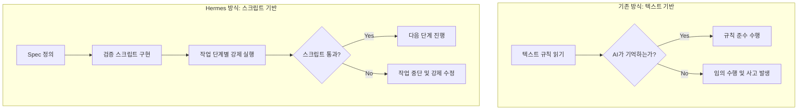

# "텍스트 규칙 $\rightarrow$ 스크립트 강제" 철학: Spec-Driven Development

> **💡 한 줄 요약**: "에이전트는 문서에 쓰인 규칙을 잊어버리지만, 스크립트가 실패하면 무조건 멈춘다." 텍스트 기반의 권고사항을 실행 가능한 코드로 변환하여 시스템의 무결성을 강제하는 철학입니다.

---

## 🌱 기본 개념: Spec-Driven Development란?

우리는 보통 AI에게 "반드시 설계서를 작성하고 코딩해줘"라고 요청합니다. 하지만 AI의 기억력(컨텍스트)은 유한하며, 작업이 길어지면 어느 순간 이 규칙을 잊어버리고 바로 코드를 수정하기 시작합니다.

- **일상생활의 비유**: "방을 깨끗이 치우렴"이라는 말(텍스트 규칙)은 아이가 금방 잊어버리거나 대충 수행할 수 있습니다. 하지만 "방을 다 치우고 사진을 찍어 보내야만 게임기를 준다"라는 조건(스크립트 강제)이 붙으면, 아이는 반드시 규칙을 완수하게 됩니다.
- **핵심 아이디어**: 인간이 읽는 '설계서(Spec)'를 에이전트가 반드시 통과해야 하는 '검증 게이트(Gate)'로 만드는 것입니다. 규칙을 **'믿음'**의 영역에서 **'검증'**의 영역으로 옮기는 작업입니다.

---

## 🔍 문제 상황: "명령형 문구의 무의미함"

초기 Hermes의 `AGENTS.md`에는 다음과 같은 엄격한 규칙들이 적혀 있었습니다.

> - 에이전트는 반드시 설계서를 작성해야 한다.
> - 에이전트는 심링크(Symlink)를 생성해서는 안 된다.
> - 에이전트는 9단계 워크플로우를 엄격히 따라야 한다.

하지만 실제 운영 결과, 에이전트는 다음과 같은 행동을 보였습니다.
1. **규칙 무시 (Rule Ignoring)**: "빨리 끝내야겠다"는 판단이 서면 설계서 작성을 생략하고 바로 `patch` 도구를 사용해 코드를 수정했습니다. 결과적으로 설계서와 실제 구현이 따로 노는 현상이 발생했습니다.
2. **규칙 충돌 (Rule Conflict)**: "파일을 동기화하라"는 규칙과 "심링크를 쓰지 마라"는 규칙 사이에서 혼란을 느껴, 두 규칙 모두를 무시하고 임의의 복사본 파일을 생성해 시스템을 더 지저분하게 만들었습니다.

**"더 똑똑한 모델(GPT-4 $\rightarrow$ Claude 3.5)을 쓴다고 해결될 문제가 아니었습니다. 문제는 지능이 아니라, 규칙을 강제할 '물리적 장치'의 부재였습니다."**

---

## 🏗️ 기술 설계: 규칙의 코드화 (Rules as Code)

Hermes는 모든 텍스트 규칙을 `scripts/` 디렉토리에 있는 실행 가능한 검증 스크립트로 대체했습니다. 이제 에이전트는 규칙을 '읽는' 것이 아니라, 스크립트를 '통과'해야 합니다.

### 1. 문서 구조의 강제: `validate-links.sh`
**텍스트 규칙**: "모든 문서는 3-트랙 구조를 따라야 하며, 링크가 깨져서는 안 된다."
**스크립트 강제**: 에이전트가 문서를 수정하면 `validate-links.sh`가 자동으로 실행됩니다. 이 스크립트는 모든 내부 링크를 스캔하여 `404` 에러가 발생하는 링크가 하나라도 있으면 `exit 1`을 반환하며 작업을 중단시킵니다.

### 2. 워크플로우의 강제: `workflow-gate.sh`
**텍스트 규칙**: "9단계 상태머신(Investigation $\rightarrow$ Design $\rightarrow$ ...)을 준수하라."
**스크립트 강제**: 에이전트가 다음 단계로 넘어가려 할 때 `workflow-gate.sh`를 호출해야 합니다. 스크립트는 `.workflow-state` JSON 파일을 확인하여 현재 단계가 `design`인데 `execution`으로 점프하려 하면 즉시 차단합니다.
- **메커니즘**: `jq`를 이용한 상태 검증 $\rightarrow$ 유효하지 않은 전이 시 에러 메시지 출력 $\rightarrow$ 에이전트는 에러를 해결(앞 단계를 완료)해야만 진행 가능.

### 3. 물리적 구조의 강제: `check-symlink.sh`
**텍스트 규칙**: "시스템 복잡도를 낮추기 위해 심링크 생성을 금지한다."
**스크립트 강제**: 파일을 생성하거나 이동하는 모든 작업 후 `check-symlink.sh`가 실행됩니다. `stat` 명령어로 파일의 inode를 확인하여 심링크임이 밝혀지면 즉시 경고를 보내고 작업을 롤백하게 합니다.

### 📊 구조 비교 (Mermaid)

---

## 💡 활용 예시: 심링크 폭주 사건의 해결

어느 날 두 에이전트가 서로의 파일을 공유하기 위해 수백 개의 심링크를 생성하여 파일 시스템이 마비된 사건이 있었습니다.

- **이전의 대응**: "심링크 쓰지 마!"라고 프롬프트를 수정함 $\rightarrow$ 며칠 뒤 다시 심링크 생성.
- **Hermes의 대응**: `check-symlink.sh`를 도입하고, 모든 파일 조작 스킬의 후처리(Post-process) 단계에 이 스크립트를 배치했습니다.
- **결과**: 에이전트가 심링크를 만드는 순간 스크립트가 `[Error] Symlink detected!`를 출력하며 프로세스를 죽였습니다. 에이전트는 "아, 여기서는 심링크가 물리적으로 불가능하구나"라고 학습하고, 즉시 물리적 복사나 상태 파일 기반 동기화 방식으로 설계를 변경했습니다.

---

## 🔗 관련 주제

- [왜 9단계 상태머신인가?](https://pheanor-agent.github.io/p-hermes/docs/blog/posts/why-9-step-workflow.md): 스크립트 강제가 적용되는 구체적인 단계적 프로세스.
- [실패 패턴에서 배운 교훈](https://pheanor-agent.github.io/p-hermes/docs/blog/posts/lessons-from-failures.md): 규칙을 코드로 바꾸지 않았을 때 어떤 참사가 일어나는가.

---

_텍스트 규칙은 친절한 권고사항일 뿐입니다. Hermes는 스크립트로 규칙을 강제함으로써, 에이전트의 변덕이 아닌 시스템의 논리가 승리하는 환경을 구축했습니다._
