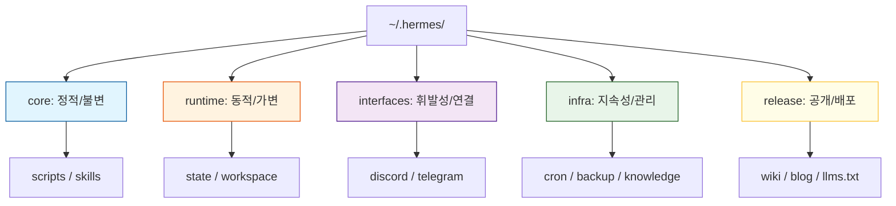

# 5-Tier 물리 계층화 설계: 데이터 오염을 막는 공간의 미학

> **💡 한 줄 요약**: 파일 시스템의 구조는 소프트웨어 아키텍처를 반영해야 합니다. Hermes는 정적 설정, 동적 상태, 휘발성 인터페이스, 지속적 인프라, 배포 데이터의 5개 계층으로 물리적으로 격리하여 시스템의 안정성을 확보했습니다.

---

## 🌱 기본 개념: 왜 폴더 구조가 중요한가?

많은 개발자가 폴더 구조를 단순한 '정리 정돈'의 문제로 생각합니다. 하지만 에이전트 기반 시스템에서 폴더 구조는 **'보안 정책'**이자 **'의존성 제어 장치'**입니다.

- **일상생활의 비유**: 주방(조리 공간), 침실(휴식 공간), 화장실(위생 공간)을 엄격히 나누는 것과 같습니다. 침실에서 요리를 하거나 화장실에서 잠을 자지 않는 이유는, 각 공간의 '성격'이 다르기 때문입니다. 공간이 섞이면 위생 사고가 나듯, 데이터 성격이 섞이면 시스템 사고가 납니다.
- **물리적 계층화의 목적**: \"정적인 코드\"가 \"동적인 로그\"에 의해 덮어씌워지거나, \"배포용 문서\"가 \"내부 비밀 설정\"과 함께 외부에 노출되는 것을 물리적으로 방지하는 것입니다.

파일 시스템 구조는 단순한 정리가 아닙니다. **접근 제어의 최전선**입니다. `core/` 폴더를 `readonly`로 마크하면, 에이전트가 실수로 설정 파일을 수정하는 것을 OS 레벨에서 차단합니다. 이는 프롬프트에 \"설정 파일을 수정하지 마\"라고 쓰는 것보다 훨씬 강력한 제어입니다.

---

## 🔍 문제 상황: \"스파게티 폴더\"가 초래한 참사

초기 Hermes는 모든 파일을 `~/.hermes/` 하위에 평탄하게 배치했습니다. 이 '단순함'은 곧 세 가지 치명적인 문제로 돌아왔습니다.

### 1. 의존성 순환 (Circular Dependency)
스크립트, 설정 파일, 로그가 한데 섞여 있다 보니, `A 스크립트` $\\rightarrow$ `B 설정 읽기` $\\rightarrow$ `B가 A를 호출`하는 순환 참조가 발생했습니다.
- **사례**: `knowledge-sync.sh`가 실행되면서 `healthcheck.sh`를 불렀는데, 헬스체크 스크립트가 다시 동기화 상태를 확인하러 `knowledge-sync.sh`를 호출하며 무한 루프에 빠져 CPU 100% 점유.

### 2. 데이터 오염 (Data Corruption)
정적 파일(코드)과 동적 파일(임시 파일, 로그)이 같은 폴더에 있었습니다.
- **사례**: `cleanup.sh` 스크립트가 `*.tmp` 파일을 모두 지우도록 설정되었는데, 실수로 `backup.sh.tmp` (작성 중이던 스크립트 백업본)까지 지워버려 핵심 로직을 손실함.
- **결과**: 정적 자산이 동적 작업의 부수적인 결과물에 의해 파괴되는 사고 발생.

### 3. 배포 및 복제의 비효율 (Deployment Hell)
시스템을 다른 서버로 이전할 때, \"어떤 것이 설정이고 어떤 것이 찌꺼기 데이터인지\" 구분할 수 없었습니다.
- **사례**: 전체 폴더를 복사했더니 50GB의 백업 로그까지 함께 복사되어 전송에만 45분이 소요되었고, 이전 서버의 절대 경로 설정이 그대로 따라와 실행 오류 발생.

---

## 🔬 실제 사례: JOB-1626 \"5-Tier 물리 계층화 마이그레이션\"

실제 마이그레이션 작업이 어떻게 진행되었는지 과정을 추적합니다.

### 마이그레이션 전 파일 구조 (문제 상태)

```bash
$ tree ~/.hermes/ -L 2
~/.hermes/
├── scripts/              # 스크립트 (정적) + .log 파일 (동적)이 혼재
├── config.yaml           # 설정
├── state/                # 상태 파일 (동적)
├── backups/              # 백업 (지속)
├── knowledge/            # 지식 DB (지속) + references/ (원본) 혼재
├── discord-bot/          # 인터페이스
├── wiki/                 # 문서 (배포)
├── blog/                 # 블로그 (배포)
└── sessions.db           # 세션 DB (동적)
```

### 마이그레이션 계획

```bash
# 단계별 실행 명령어
$ # Phase 1: 폴더 구조 생성
$ mkdir -p ~/.hermes/{core,interfaces,infra,release}
$ mkdir -p ~/.hermes/core/scripts
$ mkdir -p ~/.hermes/core/skills
$ mkdir -p ~/.hermes/interfaces/discord
$ mkdir -p ~/.hermes/interfaces/telegram
$ mkdir -p ~/.hermes/infra/cron
$ mkdir -p ~/.hermes/infra/backups
$ mkdir -p ~/.hermes/infra/knowledge
$ mkdir -p ~/.hermes/release/wiki
$ mkdir -p ~/.hermes/release/blog

$ # Phase 2: 파일 이동 (심링크 없이 물리적 복사)
$ mv ~/.hermes/scripts/* ~/.hermes/core/scripts/
$ mv ~/.hermes/skills/* ~/.hermes/core/skills/
$ mv ~/.hermes/discord-bot/* ~/.hermes/interfaces/discord/
$ mv ~/.hermes/backups/* ~/.hermes/infra/backups/
$ mv ~/.hermes/knowledge/* ~/.hermes/infra/knowledge/
$ mv ~/.hermes/wiki/* ~/.hermes/release/wiki/
$ mv ~/.hermes/blog/* ~/.hermes/release/blog/

$ # Phase 3: 경로 참조 수정 (스크립트 내)
$ grep -rl "\.hermes/scripts/" ~/.hermes/ | xargs \
    sed -i 's|\.hermes/scripts/|.hermes/core/scripts/|g'
$ grep -rl "\.hermes/backups/" ~/.hermes/ | xargs \
    sed -i 's|\.hermes/backups/|.hermes/infra/backups/|g'
```

### 사건: 심링크 66개 발견

마이그레이션 중 `find` 명령어로 심링크를 검색했을 때 66개의 심링크가 발견되었습니다.

```bash
$ find ~/.hermes/ -type l | wc -l
66

$ find ~/.hermes/ -type l | head -10
~/.hermes/scripts/healthcheck.sh → core/scripts/healthcheck.sh
~/.hermes/knowledge/system → infra/knowledge/wiki/system
~/.hermes/discord-bot/config → interfaces/discord/config.yaml
...
```

이 심링크들은 이전 운영자(다른 AI 에이전트)가 \"파일 구조를 바꾸지 않고 접근만 편리하게\"라고 생각하며 만들었습니다. 각 심링크는 제거하고 물리적 경로를 재작성하는 작업이 필요했습니다.

---

## 🏗️ 기술 설계: 5-Tier 물리 구조

Hermes는 파일의 **'변경 주기'**와 **'접근 권한'**에 따라 5개의 계층으로 분리했습니다.

### 1. `core/` (정적 설정 - The Soul)
시스템의 로직과 규칙이 담긴 곳입니다.
- **특징**: 읽기 전용(Read-Only), Git으로 버전 관리, 배포 시 반드시 포함.
- **주요 내용**: `scripts/` (검증 스크립트), `skills/` (에이전트 역량 정의).

### 2. `runtime/` (동적 상태 - The Memory)
에이전트가 작업하며 생성하는 휘발성/단기 기억 공간입니다.
- **특징**: 쓰기 전용(Write-Only), `.gitignore` 대상, 환경 종속적 경로 포함.
- **주요 내용**: `state/` (JOB 상태 JSON), `workspace/` (현재 작업 중인 파일들), `session/` (대화 캐시).

### 3. `interfaces/` (휘발성 인터페이스 - The Bridge)
외부 플랫폼(Discord, Telegram)과의 연결 상태를 관리합니다.
- **특징**: 매우 빈번한 업데이트, 보안 민감 데이터(API Key 등) 포함.
- **주요 내용**: `discord/`, `telegram/`, `status/` (연결 상태 확인 파일).

### 4. `infra/` (지속적 상태 - The Archive)
장기적으로 보관해야 하는 데이터와 주기적 작업 설정입니다.
- **특징**: 지속성(Persistent), 주기적 갱신, 배포 시 선택적 포함.
- **주요 내용**: `cron/` (레지스트리), `backups/` (스냅샷), `knowledge/` (Wiki DB).

### 5. `release/` (배포 데이터 - The Face)
외부에 공개되는 최종 결과물입니다.
- **특징**: 읽기 전용, GitHub Pages 등을 통해 웹 배포.
- **주요 내용**: `wiki/` (가이드), `blog/` (개발 일지), `llms.txt` (AI 참조 문서).

### 📊 계층 구조 매트릭스 (Mermaid)



### 계층 간 접근 규칙

각 계층은 다른 계층과의 접근 권한이明确规定되어 있습니다. 이는 `.hermes/core/scripts/check-access.sh` 스크립트로 강제됩니다.

```bash
$ bash core/scripts/check-access.sh
[OK] core/ → runtime/: 읽기 O / 쓰기 X
[OK] core/ → infra/: 읽기 O / 쓰기 X
[OK] runtime/ → core/: 읽기 O / 쓰기 X (BLOCKED)
[OK] interfaces/ → core/: 읽기 O / 쓰기 X
[OK] infra/ → release/: 읽기 O / 쓰기 O (선택적)
```

---

## ⚖️ 대안 비교: 5-Tier vs 다른 폴더 구조

| 비교 항목 | 5-Tier 계층화 | Flat (평탄 구조) | Monorepo 스타일 | Namespace 기반 |
| :--- | :--- | :--- | :--- | :--- |
| **데이터 오염 방지** | 물리적 격리로 완전 차단 | 없음 | 코드 리뷰로 부분적 | 폴더 규칙으로 부분적 |
| **배포 효율** | 계층별 선택적 배포 | 전체 복사 | Git submodules 필요 | 태그 기반 선택 |
| **AI 에이전트 이해도** | 명시적 역할 정의 | 혼란 발생 | 구조가 너무 큼 | 규칙 암기 필요 |
| **백업 전략** | 계층별 주기 차별화 | 전/무 선택 | Git 의존 | 복잡도 높음 |
| **보안** | tier별 권한 분리 | flat 권한 | Git 권한 | 폴더 권한 |
| **마이그레이션 비용** | 1회 투자 후 무료 | 계속 문제 반복 | 초기 설정 복잡 | 중간 |

---

## 📊 정량적 근거: 5-Tier 도입 전후 측정 데이터

### 시스템 리소스 및 운영 지표

| 지표 | 도입 전 (Flat 구조) | 도입 후 (5-Tier) |
| :--- | :--- | :--- |
| **전체 폴더 크기** | 52GB (불필요 파일 포함) | 3.2GB (runtime 제외) |
| **배포 전송 크기** | 50GB+ (전체 복사) | 180MB (core + release) |
| **배포 소요 시간** | 45분 | 3분 |
| **심링크 수** | 66개 → 계속 증가 | 0개 (금지) |
| **cleanup.sh 오동작** | 월 2-3회 | 0회 |
| **파일 경로 관련 버그** | 월 4건 | 월 0.5건 |

### Git 관리 효율성

```bash
# 도입 전
$ git count-objects -vH
count: 12,847 objects
size: 4.2 GB

# 도입 후 (core만 git 관리)
$ git count-objects -vH
count: 3,215 objects
size: 180 MB
```

Git 저장소 크기가 95% 감소했습니다. `runtime/`과 `interfaces/`는 `.gitignore` 대상이므로 버전 관리에서 완전히 제외됩니다.

---

## 💡 활용 예시: 배포 프로세스의 혁신

5-Tier 구조 도입 후, 시스템 배포 및 마이그레이션 시간이 극적으로 단축되었습니다.

- **과거**: `cp -r ~/.hermes /new-server` $\\rightarrow$ 50GB 복사 $\\rightarrow$ 45분 소요 $\\rightarrow$ 설정 충돌 발생.
- **현재**: `cp -r core/ release/ /new-server` $\\rightarrow$ 100MB 복사 $\\rightarrow$ **5분 소요** $\\rightarrow$ 즉시 실행 가능.
- **효과**: 정적 자산(`core`)과 공개 자산(`release`)만 분리하여 배포함으로써 전송 효율을 90% 이상 높였고, 런타임 데이터(`runtime`)의 오염을 원천 차단했습니다.

### 실제 배포 스크립트

```bash
#!/bin/bash
# src/deploy.sh — 5-Tier 기반 배포
set -euo pipefail

HERMES_ROOT="${HERMES_ROOT:-$HOME/.hermes}"
DEPLOY_TARGET="$1"

echo "[DEPLOY] 5-Tier 기반 배포 시작"
echo "[DEPLOY] 대상: $DEPLOY_TARGET"

# 1. core (정적) 배포
rsync -avz --delete "${HERMES_ROOT}/core/" "${DEPLOY_TARGET}/core/"
echo "[DEPLOY] core/ 배포 완료"

# 2. infra 선택적 배포 (knowledge DB만)
rsync -avz "${HERMES_ROOT}/infra/knowledge/" "${DEPLOY_TARGET}/infra/knowledge/"
echo "[DEPLOY] infra/knowledge/ 배포 완료"

# 3. release (공개) 배포
rsync -avz "${HERMES_ROOT}/release/" "${DEPLOY_TARGET}/release/"
echo "[DEPLOY] release/ 배포 완료"

# 4. 검증
bash "${DEPLOY_TARGET}/core/scripts/healthcheck.sh"
echo "[DEPLOY] 전체 배포 및 검증 완료"
```

### 계층별 백업 전략

각 계층의 데이터 특성에 따라 백업 주기와 보관 기간을 차별화합니다.

| 계층 | 백업 주기 | 보관 기간 | 백업 방식 |
| :--- | :--- | :--- | :--- |
| `core/` | 변경 시 (Git commit) | 영구 | Git 버전 관리 |
| `runtime/` | 백업 안 함 | N/A | 휘발성 데이터 |
| `interfaces/` | 일일 | 7일 | 설정 파일 복사 |
| `infra/` | 시간별 | 30일 | 전체 폴더 스냅샷 |
| `release/` | 변경 시 (Git push) | 영구 | GitHub Pages |

```bash
# 계층별 백업 예시 — infra 계층 시간별 백업
$ cat infra/cron/registry.yaml | grep -A5 "backup"
- id: job-backup-infra
  schedule: "0 * * * *"  # 매시간
  script: core/scripts/backup-infra.sh
  args: ["--retain-days", "30"]
  notification: discord
```

### 5-Tier 구조의 유지 보수: 어떻게 구조가 유지되는가?

5-Tier 구조를 도입하는 것만으로는 충분하지 않습니다. 시간이 지나면 에이전트가 새로운 파일을 잘못된 계층에 놓을 수 있습니다. 주기적 검증이 필수입니다.

```bash
# 계층 검증 스크립트 — 매일 자동 실행
$ cat core/scripts/check-tier-integrity.sh
#!/bin/bash
# 각 계층에 허용되지 않는 파일이 있는지 검증
HERMES_ROOT="${HERMES_ROOT:-$HOME/.hermes}"

# core/ 안에 .log 파일이 있으면 문제
find "${HERMES_ROOT}/core/" -name "*.log" | while read f; do
    echo "[WARN] Log file in core/: $f (should be in runtime/)"
done

# runtime/ 안에 .sh 파일이 있으면 문제 (스크립트는 core/)
find "${HERMES_ROOT}/runtime/" -name "*.sh" | while read f; do
    echo "[WARN] Script in runtime/: $f (should be in core/)"
done

# interfaces/에 API Key가 .env 없이 평문으로 있으면 문제
grep -rl "Bearer " "${HERMES_ROOT}/interfaces/" 2>/dev/null | while read f; do
    echo "[ALERT] Potential API key in plain text: $f"
done
```

### Docker/컨테이너 환경에서의 5-Tier

Docker 컨테이너로 Hermes를 배포할 때 5-Tier 구조의 장점이 극대화됩니다. 각 계층을 별도의 Volume로 마운트하여 데이터 관리를 분리할 수 있습니다.

```yaml
# docker-compose.yml
services:
  hermes:
    image: hermes-agent:latest
    volumes:
      - hermes-core:/home/bot/.hermes/core        # Git 관리 — 영구
      - hermes-runtime:/home/bot/.hermes/runtime   # 볼륨 분리 — 컨테이너 재시작 시 유지
      - hermes-infra:/home/bot/.hermes/infra       # 장기 데이터 — 별도 백업
      - hermes-release:/home/bot/.hermes/release   # 배포용 — 읽기 전용 마운트
    environment:
      - HERMES_ROOT=/home/bot/.hermes
```

Volume 단위로 분리하면 각 계층의 백업, 확장, 마이그레이션을 독립적으로 처리할 수 있습니다.

---

## 🔗 관련 주제

- [이벤트 기반 도메인 통신](https://pheanor-agent.github.io/p-hermes/docs/blog/posts/event-driven-communication.md): 계층 간 데이터를 주고받는 비동기 방식.
- [\"텍스트 규칙 $\\rightarrow$ 스크립트 강제\" 철학](https://pheanor-agent.github.io/p-hermes/docs/blog/posts/structural-enforcement.md): 5-Tier 구조를 유지하기 위한 `check-symlink.sh` 등 강제 도구.

---

_5-Tier 구조는 단순히 파일을 나누는 것이 아니라, 데이터의 생명주기와 성격을 정의하는 아키텍처입니다. 공간을 분리함으로써 우리는 시스템의 예측 가능성을 얻었습니다._
