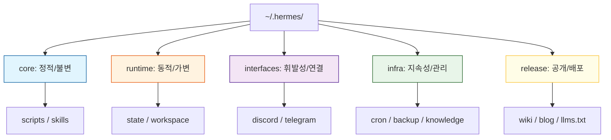

# 5-Tier 물리 계층화 설계: 데이터 오염을 막는 공간의 미학

> **💡 한 줄 요약**: 파일 시스템의 구조는 소프트웨어 아키텍처를 반영해야 합니다. Hermes는 정적 설정, 동적 상태, 휘발성 인터페이스, 지속적 인프라, 배포 데이터의 5개 계층으로 물리적으로 격리하여 시스템의 안정성을 확보했습니다.

---

## 🌱 기본 개념: 왜 폴더 구조가 중요한가?

많은 개발자가 폴더 구조를 단순한 '정리 정돈'의 문제로 생각합니다. 하지만 에이전트 기반 시스템에서 폴더 구조는 **'보안 정책'**이자 **'의존성 제어 장치'**입니다.

- **일상생활의 비유**: 주방(조리 공간), 침실(휴식 공간), 화장실(위생 공간)을 엄격히 나누는 것과 같습니다. 침실에서 요리를 하거나 화장실에서 잠을 자지 않는 이유는, 각 공간의 '성격'이 다르기 때문입니다. 공간이 섞이면 위생 사고가 나듯, 데이터 성격이 섞이면 시스템 사고가 납니다.
- **물리적 계층화의 목적**: "정적인 코드"가 "동적인 로그"에 의해 덮어씌워지거나, "배포용 문서"가 "내부 비밀 설정"과 함께 외부에 노출되는 것을 물리적으로 방지하는 것입니다.

---

## 🔍 문제 상황: "스파게티 폴더"가 초래한 참사

초기 Hermes는 모든 파일을 `~/.hermes/` 하위에 평탄하게 배치했습니다. 이 '단순함'은 곧 세 가지 치명적인 문제로 돌아왔습니다.

### 1. 의존성 순환 (Circular Dependency)
스크립트, 설정 파일, 로그가 한데 섞여 있다 보니, `A 스크립트` $\rightarrow$ `B 설정 읽기` $\rightarrow$ `B가 A를 호출`하는 순환 참조가 발생했습니다.
- **사례**: `knowledge-sync.sh`가 실행되면서 `healthcheck.sh`를 불렀는데, 헬스체크 스크립트가 다시 동기화 상태를 확인하러 `knowledge-sync.sh`를 호출하며 무한 루프에 빠져 CPU 100% 점유.

### 2. 데이터 오염 (Data Corruption)
정적 파일(코드)과 동적 파일(임시 파일, 로그)이 같은 폴더에 있었습니다.
- **사례**: `cleanup.sh` 스크립트가 `*.tmp` 파일을 모두 지우도록 설정되었는데, 실수로 `backup.sh.tmp` (작성 중이던 스크립트 백업본)까지 지워버려 핵심 로직을 손실함.
- **결과**: 정적 자산이 동적 작업의 부수적인 결과물에 의해 파괴되는 사고 발생.

### 3. 배포 및 복제의 비효율 (Deployment Hell)
시스템을 다른 서버로 이전할 때, "어떤 것이 설정이고 어떤 것이 찌꺼기 데이터인지" 구분할 수 없었습니다.
- **사례**: 전체 폴더를 복사했더니 50GB의 백업 로그까지 함께 복사되어 전송에만 45분이 소요되었고, 이전 서버의 절대 경로 설정이 그대로 따라와 실행 오류 발생.

---

## 🏗️ 기술 설계: 5-Tier 물리 구조

Hermes는 파일의 **'변경 주기'**와 **'접근 권한'**에 따라 5개의 계층으로 분리했습니다.

### 1. `core/` (정적 설정 - The Soul)
시스템의 로직과 규칙이 담긴 곳입니다.
- **특징**: 읽기 전용(Read-Only), Git으로 버전 관리, 배포 시 반드시 포함.
- **주요 내용**: `scripts/` (검증 스크립트), `skills/` (에이전트 역량 정의).

### 2. `runtime/` (동적 상태 - The Memory)
에이전트가 작업하며 생성하는 휘발성/단기 기억 공간입니다.
- **특징**: 쓰기 전용(Write-Only), `.gitignore` 대상, 환경 종속적 경로 포함.
- **주요 내용**: `state/` (JOB 상태 JSON), `workspace/` (현재 작업 중인 파일들), `session/` (대화 캐시).

### 3. `interfaces/` (휘발성 인터페이스 - The Bridge)
외부 플랫폼(Discord, Telegram)과의 연결 상태를 관리합니다.
- **특징**: 매우 빈번한 업데이트, 보안 민감 데이터(API Key 등) 포함.
- **주요 내용**: `discord/`, `telegram/`, `status/` (연결 상태 확인 파일).

### 4. `infra/` (지속적 상태 - The Archive)
장기적으로 보관해야 하는 데이터와 주기적 작업 설정입니다.
- **특징**: 지속성(Persistent), 주기적 갱신, 배포 시 선택적 포함.
- **주요 내용**: `cron/` (레지스트리), `backups/` (스냅샷), `knowledge/` (Wiki DB).

### 5. `release/` (배포 데이터 - The Face)
외부에 공개되는 최종 결과물입니다.
- **특징**: 읽기 전용, GitHub Pages 등을 통해 웹 배포.
- **주요 내용**: `wiki/` (가이드), `blog/` (개발 일지), `llms.txt` (AI 참조 문서).

### 📊 계층 구조 매트릭스 (Mermaid)

---

## 💡 활용 예시: 배포 프로세스의 혁신

5-Tier 구조 도입 후, 시스템 배포 및 마이그레이션 시간이 극적으로 단축되었습니다.

- **과거**: `cp -r ~/.hermes /new-server` $\rightarrow$ 50GB 복사 $\rightarrow$ 45분 소요 $\rightarrow$ 설정 충돌 발생.
- **현재**: `cp -r core/ release/ /new-server` $\rightarrow$ 100MB 복사 $\rightarrow$ **5분 소요** $\rightarrow$ 즉시 실행 가능.
- **효과**: 정적 자산(`core`)과 공개 자산(`release`)만 분리하여 배포함으로써 전송 효율을 90% 이상 높였고, 런타임 데이터(`runtime`)의 오염을 원천 차단했습니다.

---

## 🔗 관련 주제

- [이벤트 기반 도메인 통신](https://pheanor-agent.github.io/p-hermes/docs/blog/posts/event-driven-communication.md): 계층 간 데이터를 주고받는 비동기 방식.
- [\"텍스트 규칙 $\rightarrow$ 스크립트 강제\" 철학](https://pheanor-agent.github.io/p-hermes/docs/blog/posts/structural-enforcement.md): 5-Tier 구조를 유지하기 위한 `check-symlink.sh` 등 강제 도구.

---

_5-Tier 구조는 단순히 파일을 나누는 것이 아니라, 데이터의 생명주기와 성격을 정의하는 아키텍처입니다. 공간을 분리함으로써 우리는 시스템의 예측 가능성을 얻었습니다._
