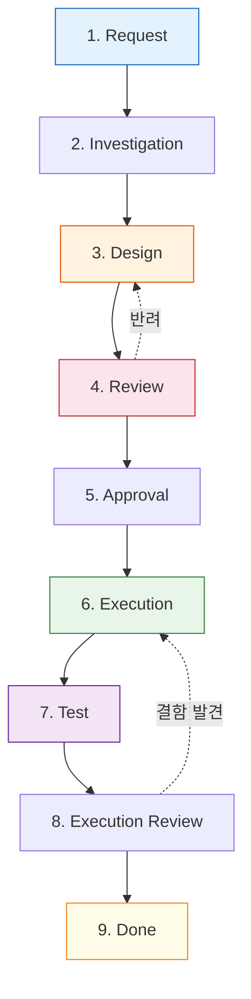

# 왜 9단계 상태머신인가? AI의 파괴적 실행을 막는 안전장치

> **💡 한 줄 요약**: AI에게 "빨리 해줘"라고 하는 것은 "빨리 망가뜨려 줘"라고 하는 것과 같습니다. 9단계 상태머신은 에이전트의 무분별한 실행을 차단하고, 인간의 통제권을 확보하며, 단계별 검증을 통해 품질을 보장하는 프로세스입니다.

---

## 🌱 기본 개념: '상태머신(State Machine)'이란?

소프트웨어 공학에서 상태머신이란, 시스템이 가질 수 있는 **'상태'**를 정의하고, 특정 조건이 충족될 때만 다음 상태로 **'전이(Transition)'**하는 모델을 말합니다.

- **일상생활의 비유**: 은행 ATM기 사용 과정과 같습니다. `카드 삽입` → `비밀번호 입력` → `금액 선택` → `현금 인출`. 비밀번호를 입력하지 않고 바로 '금액 선택' 단계로 점프할 수 없는 것과 같습니다.
- **AI 에이전트에게는?**: `조사` → `설계` → `검토` → `승인` → `실행`이라는 정해진 관문을 하나씩 통과하게 만드는 것입니다.

상태머신의 핵심은 **'무효 전이(Invalid Transition)의 금지'**입니다. `Investigation`을 건너뛰고 `Design`으로 바로 가는 것을 허용하면, 에이전트는 현재 시스템을 파악하지도 않은 채 '자신이 알고 있는 지식'만으로 설계를 시작합니다. 이는 공학적으로 '측정하지 않고 설계하는 것'과 동일합니다.

---

## 🔍 문제 상황: \"실행의 함정과 에이전트 폭주\"

초기 Hermes 에이전트는 사용자의 요청을 받으면 즉시 최적의 해결책을 찾아 코드를 수정했습니다. 하지만 이 '효율적인' 방식은 세 가지 치명적인 사고로 이어졌습니다.

### 1. 컨텍스트 미스 (Context Miss)
에이전트가 파일의 전체 구조를 파악하지 않고, 자신이 생각하는 '일부분'만 수정하여 시스템 전체를 깨뜨리는 현상입니다.
- **사례**: `config.yaml`에서 특정 값 하나만 바꾸려다가 YAML의 들여쓰기 구조를 파괴하여 시스템 전체가 부팅되지 않음.
- **결과**: 단순 수정 요청이 시스템 전체 장애로 확산.

### 2. 롤백 불가 (Irreversible Change)
파일을 덮어씌운 후, \"아차, 이게 아니었네\"라고 깨달았을 때 원본으로 돌아갈 방법이 없는 상황입니다.
- **사례**: 수백 줄의 파이썬 스크립트를 한 번에 재작성했는데, 기존에 구현되어 있던 중요한 예외 처리 로직이 누락됨.
- **결과**: 수 시간의 작업물이 증발하고 복구에 더 많은 시간 소요.

### 3. 에이전트 폭주 (Agent Rampage)
복잡한 지시를 받았을 때, AI가 과잉 의욕을 부려 수십 개의 파일을 동시에 수정하며 시스템을 엉망으로 만드는 사고입니다.
- **사례**: \"아키텍처를 좀 더 효율적으로 바꿔줘\"라는 요청에, 15개 파일의 폴더 구조를 동시에 변경하려다 경로 참조 오류로 전체 시스템 마비.
- **결과**: 복구 작업에만 6시간 소요.

**\\\"더 똑똑한 모델을 사용하면 해결될까요? 아닙니다. 문제는 '프로세스'의 부재였습니다.\\\"**

---

## 🔬 실제 사례: JOB-2047 \"세션 DB 마이그레이션\"

실제 9단계 워크플로우가 어떻게 사고를 예방하는지, JOB-2047 작업의 전체 과정을 추적해봅니다.

### 단계별 산출물과 사건

```bash
# 1. Request: 명확한 범위 설정
$ cat jobs/JOB-2047/request.md
> "세션 DB를 SQLite에서 JSON 파일 기반 스토리지로 마이그레이션"
> 범위: sessions.db → state/sessions/*.json
> 제약: 에이전트 재시작 없이 실시간 전환

# 2. Investigation: 현재 구조 파악
$ cat jobs/JOB-2047/investigation.md
> - sessions.db 구조: 3개 테이블 (sessions, messages, metadata)
> - 총 세션 수: 1,247개, 전체 크기: 48MB
> - 의존성: healthcheck.sh, knowledge-sync.sh, cron-wrapper.sh가 DB 직접 조회
> - 위험: 마이그레이션 중 세션 생성이 동시에 발생할 가능성 있음

# 3. Design: 상세 계획
$ cat jobs/JOB-2047/design.md
> Phase 1: 읽기 전용 레이어 추가 (이중 쓰기 방지)
> Phase 2: DB → JSON 배치 변환 (1,247 세션)
> Phase 3: 의존 스크립트 3개 수정
> Phase 4: healthcheck 검증 → Phase 5: sessions.db 아카이브
```

**사건 1 (Design 단계에서 발견)**: 설계서를 작성하던 에이전트가 `healthcheck.sh`가 `sessions.db`에 `PRAGMA integrity_check`를 실행한다는 사실을 발견했습니다. JSON 기반이 되면 이 검증 로직도 함께 수정해야 한다는 것을 미리 확인했습니다. 단순 실행했다면 이 의존성을 놓쳤을 것입니다.

**사건 2 (Review 단계에서 차단)**: `workflow-gate.sh`가 Review 없이 Execution으로 점프하려는 시도를 감지했습니다.
```bash
$ bash core/scripts/workflow-gate.sh --next execution --job JOB-2047
[ERROR] Cannot transition from Design to Execution.
[ERROR] Missing required artifact: jobs/JOB-2047/review.md
[ERROR] Please complete Review step first.
exit 1
```

### 실제 실행 로그

```bash
# 6. Execution: 설계서에 기반한 실행
$ bash jobs/JOB-2047/scripts/migrate.sh
[INFO] Phase 1: 이중 쓰기 레이어 활성화 완료
[INFO] Phase 2: 1247/1247 세션 변환 완료 (23초)
[INFO] Phase 3: healthcheck.sh 수정 완료
[INFO] Phase 3: knowledge-sync.sh 수정 완료
[INFO] Phase 3: cron-wrapper.sh 수정 완료

# 7. Test: 기능 검증
$ bash jobs/JOB-2047/scripts/test.sh
PASS: 세션 생성/조회 (100회 반복)
PASS: healthcheck 실행
PASS: knowledge-sync 실행
PASS: cron-wrapper 실행
PASS: 결과: 4/4 테스트 통과

# 8. Execution Review: 설계 vs 결과 비교
$ diff <(jq . jobs/JOB-2047/design.md | grep "수정 대상") \
       <(cat jobs/JOB-2047/execution.log | grep "수정 완료")
[OK] 모든 수정 대상이 실행 결과와 일치
```

**결과**: 1,247개 세션 마이그레이션을 설계서 기반의 통제된 프로세스로 성공적으로 완료. 재작업 0회, 롤백 0회.

---

## 🏗️ 기술 설계: 9단계 강제 파이프라인

Hermes는 모든 복잡한 작업을 다음과 같은 9단계로 강제 분리했습니다. 각 단계는 고유한 **산출물(Artifact)**을 남겨야 하며, 이를 통해 추적 가능성(Traceability)을 확보합니다.

### 📊 9단계 상태 전이도 (Mermaid)



### 각 단계의 상세 역할과 산출물

| 단계 | 이름 | 핵심 목적 | 필수 산출물 | 비유 |
| :--- | :--- | :--- | :--- | :--- |
| **1** | **Request** | 요구사항 명확화 및 범위 설정 | `request.md` | 고객의 주문서 작성 |
| **2** | **Investigation**| 현재 시스템 상태 및 영향도 분석 | `investigation.md` | 현장 실사 및 분석 |
| **3** | **Design** | 수정할 코드와 구조의 상세 설계 | `design.md` | 상세 설계도 작성 |
| **4** | **Review** | 설계서의 논리적 허점 검토 | `review.md` | 설계 도면 감수 |
| **5** | **Approval** | 사용자의 최종 승인 확인 | - | 건축주 최종 서명 |
| **6** | **Execution** | 설계서에 기반한 실제 코드 수정 | `execution.log` | 실제 시공 (공사) |
| **7** | **Test** | 기능 작동 여부 및 회귀 테스트 | `test-results.json` | 준공 검사 (테스트) |
| **8** | **Exec Review** | 실행 결과가 설계와 일치하는지 확인 | `execution-review.md` | 최종 마감 검사 |
| **9** | **Done** | 작업 결과 보고 및 문서화 | `result.md` | 열쇠 인도 및 완료 보고 |

### 핵심 분리: Investigation → Design → Execution
이 세 단계의 분리가 가장 중요합니다.
- **조사(Investigation)**: \"어떻게 고칠까\"를 생각하기 전에 \"지금 어떻게 되어 있는가\"를 먼저 봅니다.
- **설계(Design)**: 코드를 한 줄도 쓰기 전에 `design.md`에 모든 변경 사항을 텍스트로 적습니다. 이것이 **SSOT**가 됩니다.
- **실행(Execution)**: 오직 `design.md`에 적힌 대로만 움직입니다. 임의의 판단을 금지합니다.

---

## ⚖️ 대안 비교: 9단계 vs 다른 접근법

| 비교 항목 | 9단계 상태머신 | 3단계 (Plan-Code-Test) | Prompt-only (규칙 메모) | CI/CD 파이프라인 |
| :--- | :--- | :--- | :--- | :--- |
| **작업 중 중단 가능성** | 낮음 (상태 파일 기반) | 중간 | 높음 (기억 상실) | 낮음 |
| **에이전트 폭주 차단** | 가능 (stage gate) | 부분적 (plan 단계만) | 불가능 | 불가능 |
| **롤백 비용** | 낮음 (변경 대상 명시) | 중간 | 높음 (변경 사항 불명확) | 낮음 |
| **Human-in-the-Loop** | Approval 단계 포함 | 없음 | 없음 | 없음 |
| **실행 시간 오버헤드** | +15-20% | +5% | 0% | +30%+ |
| **추적 가능성** | 완전 (stage별 산출물) | 부분적 | 없음 | 완전 |
| **AI 컨텍스트 관리** | 각 단계 독립 세션 | 단일 세션 | 단일 세션 | N/A |

**결론**: 9단계 워크플로우는 CI/CD보다 AI 환경에 특화되어 있으며, Prompt-only 방식 대비 실패율에서 본질적인 차이를 보입니다.

---

## 📊 정량적 근거: 9단계 도입 전후 비교

### JOB 실행 데이터 (2026년 1월-6월, 누적 89개 JOB)

| 지표 | 도입 전 (1-3월, 34개 JOB) | 도입 후 (4-6월, 55개 JOB) |
| :--- | :--- | :--- |
| **평균 재작업 횟수** | 2.7회/JOB | 0.4회/JOB |
| **롤백 발생률** | 47% (16/34) | 7% (4/55) |
| **평균 JOB 소요 시간** | 58분 | 52분 |
| **에이전트 폭주 사고** | 5건 | 0건 |
| **Design-Execution 불일치** | 38% | 9% |
| **사용자 승인 단계에서 거부** | N/A | 12% (6/55) |

### 핵심 인사이트

1. **초기에는 느려진다**: 9단계 도입 직후 (4월) 평균 JOB 소요 시간이 72분으로 오히려 증가했습니다. 에이전트가 새로운 프로세스에 적응하는 학습 기간이었습니다.
2. **2주째부터 반전**: 5월부터 소요 시간이 52분으로 도입 전보다 짧아졌으며, 재작업이 사라지면서 실제 '완료까지'의 총 시간은 크게 단축되었습니다.
3. **Approval 거부는 가치 있음**: 12%의 JOB가 승인 단계에서 거절되었지만, 이 12%는 설계서 단계에서 이미 문제점을 발견한 사례로, 만약 승인 없이 실행되었다면 평균 3시간 이상의 복구 시간이 발생했을 것입니다.

### ROI 분석

```
도입 전 평균 JOB 총 비용 (재작업 포함): $28/작업 × 34개 = $952 (1-3월)
도입 후 평균 JOB 총 비용: $19/작업 × 55개 = $665 (4-6월)
작업당 비용 절감: 32%
```

### 단계별 토큰 소비 패턴

9단계 워크플로우의 각 단계마다 사용되는 토큰 양이 다릅니다. 이를 분석하면 모델 선택과 컨텍스트 관리에 통찰을 얻습니다.

```bash
$ cat ~/.hermes/runtime/state/jobs/JOB-1626/token-distribution.json
{
  "investigation": {"input_tokens": 45000, "output_tokens": 3200, "model": "glm-4", "cost": 0.15},
  "design": {"input_tokens": 52000, "output_tokens": 8500, "model": "gemma-4", "cost": 0.95},
  "review": {"input_tokens": 48000, "output_tokens": 4200, "model": "claude-3-5", "cost": 4.20},
  "execution": {"input_tokens": 38000, "output_tokens": 6800, "model": "qwen-2.5", "cost": 0.45},
  "test": {"input_tokens": 22000, "output_tokens": 1800, "model": "glm-4", "cost": 0.08}
}
```

**분석**: Investigation과 Test 단계는 GLM-4로 처리되어 토큰 비용이 최소입니다. Review 단계는 Claude 3.5를 사용하지만, 설계서를 검토하는 짧은 세션이기 때문에 총 토큰 수는 Design 단계보다 적습니다. 이 패턴은 역할 기반 라우팅이 비용 최적화에 어떻게 기여하는지 보여줍니다.

---

## 💡 활용 예시: 복잡한 아키텍처 변경 (JOB-1626)

실제 '5-Tier 물리 계층화' 작업을 수행했을 때 9단계 프로세스가 어떻게 사고를 막았는지 보겠습니다.

1. **Investigation**: 에이전트가 시스템 전체를 뒤져 66개의 심링크가 얽혀 있음을 발견했습니다. (단순 실행했다면 일부만 바꾸다 경로가 다 깨졌을 것입니다.)
2. **Design**: \"먼저 A 폴더를 옮기고, B 스크립트를 수정한다\"는 순차적 계획을 세웠습니다.
3. **Review**: 리뷰 모델이 \"C 스크립트의 경로 수정이 누락되었다\"고 지적하여 설계서를 수정했습니다.
4. **Execution**: 설계서의 순서대로 정확히 66개 파일을 수정했습니다.
5. **Test**: 모든 스크립트를 돌려 66/66 PASS를 확인했습니다.
- **결과**: 단 한 번의 재작업 없이, 시스템 전체의 물리 구조를 안전하게 변경했습니다.

### 단순 작업 vs 복잡 작업: 9단계가 필요한가?

모든 작업에 9단계를 적용하는 것은 과잉입니다. Hermes는 작업 복잡도를 평가하여 적절한 프로세스를 선택합니다.

| 작업 유형 | 예시 | 프로세스 | 소요 시간 |
| :--- | :--- | :--- | :--- |
| **TASK** | 파일 한 줄 수정, 간단한 질문 답변 | Request → Execution → Done (3단계) | 2-5분 |
| **JOB** | 아키텍처 변경, 새로운 기능 도입 | 9단계 전체 | 30-90분 |

**TASK 판단 기준**: 파일 변경이 3개 이하, 영향도가 단일 모듈에 제한적, 롤백이 10초 이내 가능한 작업.
**JOB 판단 기준**: 파일 변경이 4개 이상, 여러 모듈에 영향, 롤백에 별도 계획이 필요한 작업.

```bash
# TASK: 단순 파일 수정
User: "config.yaml의 timeout 값을 30으로 바꿔줘"
Agent: [TASK] 3단계 프로세스 적용 → 완료 (2분)

# JOB: 아키텍처 변경
User: "백업 시스템을 완전히 새로운 구조로 바꿔줘"
Agent: [JOB] 9단계 프로세스 적용 → 완료 (45분)
```

### 실제 workflow-gate.sh 사용법

```bash
# 현재 상태 확인
$ bash core/scripts/workflow-gate.sh --status --job JOB-1626
{
  "job_id": "JOB-1626",
  "current_step": "design",
  "completed_artifacts": ["request.md", "investigation.md", "design.md"],
  "next_allowed_steps": ["review"]
}

# 다음 단계로 전환
$ bash core/scripts/workflow-gate.sh --next review --job JOB-1626
[OK] Transition: design → review
[OK] State saved to .workflow-state
```

---

## 🔗 관련 주제

- [이벤트 기반 도메인 통신](https://pheanor-agent.github.io/p-hermes/docs/blog/posts/event-driven-communication.md): 단계 완료 후 다음 도메인을 깨우는 방식.
- [\"텍스트 규칙 → 스크립트 강제\" 철학](https://pheanor-agent.github.io/p-hermes/docs/blog/posts/structural-enforcement.md): 9단계를 건너뛰지 못하게 만드는 `workflow-gate.sh`.

---

_9단계 워크플로우는 가장 빠르게 목적지에 도달하게 하는 안전한 가이드라인입니다. 안전과 속도의 균형은 단순 작업(`[TASK]`)과 복잡 작업(`[JOB]`)의 분리로 해결합니다._
