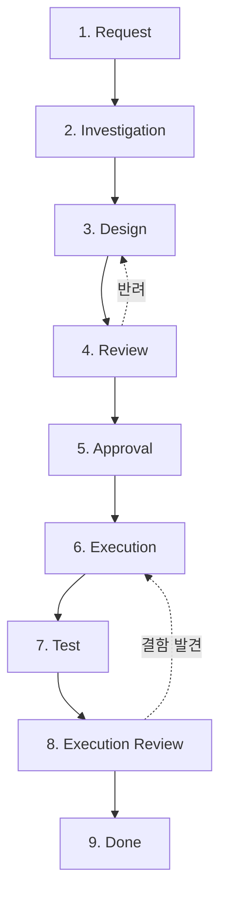

# 왜 9단계 상태머신인가? AI의 파괴적 실행을 막는 안전장치

> **💡 한 줄 요약**: AI에게 "빨리 해줘"라고 하는 것은 "빨리 망가뜨려 줘"라고 하는 것과 같습니다. 9단계 상태머신은 에이전트의 무분별한 실행을 차단하고, 인간의 통제권을 확보하며, 단계별 검증을 통해 품질을 보장하는 프로세스입니다.

---

## 🌱 기본 개념: '상태머신(State Machine)'이란?

소프트웨어 공학에서 상태머신이란, 시스템이 가질 수 있는 **'상태'**를 정의하고, 특정 조건이 충족될 때만 다음 상태로 **'전이(Transition)'**하는 모델을 말합니다.

- **일상생활의 비유**: 은행 ATM기 사용 과정과 같습니다. `카드 삽입` $\rightarrow$ `비밀번호 입력` $\rightarrow$ `금액 선택` $\rightarrow$ `현금 인출`. 비밀번호를 입력하지 않고 바로 '금액 선택' 단계로 점프할 수 없는 것과 같습니다.
- **AI 에이전트에게는?**: 사용자의 요청을 받자마자 코드를 수정하는 것이 아니라, `조사` $\rightarrow$ `설계` $\rightarrow$ `검토` $\rightarrow$ `승인` $\rightarrow$ `실행`이라는 정해진 관문을 하나씩 통과하게 만드는 것입니다.

---

## 🔍 문제 상황: "실행의 함정과 에이전트 폭주"

초기 Hermes 에이전트는 사용자의 요청을 받으면 즉시 최적의 해결책을 찾아 코드를 수정했습니다. 하지만 이 '효율적인' 방식은 세 가지 치명적인 사고로 이어졌습니다.

### 1. 컨텍스트 미스 (Context Miss)
에이전트가 파일의 전체 구조를 파악하지 않고, 자신이 생각하는 '일부분'만 수정하여 시스템 전체를 깨뜨리는 현상입니다.
- **사례**: `config.yaml`에서 특정 값 하나만 바꾸려다가 YAML의 들여쓰기 구조를 파괴하여 시스템 전체가 부팅되지 않음.
- **결과**: 단순 수정 요청이 시스템 전체 장애로 확산.

### 2. 롤백 불가 (Irreversible Change)
파일을 덮어씌운 후, "아차, 이게 아니었네"라고 깨달았을 때 원본으로 돌아갈 방법이 없는 상황입니다.
- **사례**: 수백 줄의 파이썬 스크립트를 한 번에 재작성했는데, 기존에 구현되어 있던 중요한 예외 처리 로직이 누락됨.
- **결과**: 수 시간의 작업물이 증발하고 복구에 더 많은 시간 소요.

### 3. 에이전트 폭주 (Agent Rampage)
복잡한 지시를 받았을 때, AI가 과잉 의욕을 부려 수십 개의 파일을 동시에 수정하며 시스템을 엉망으로 만드는 사고입니다.
- **사례**: "아키텍처를 좀 더 효율적으로 바꿔줘"라는 요청에, 15개 파일의 폴더 구조를 동시에 변경하려다 경로 참조 오류로 전체 시스템 마비.
- **결과**: 복구 작업에만 6시간 소요.

**"더 똑똑한 모델을 사용하면 해결될까요? 아니요. 문제는 지능이 아니라 '프로세스'의 부재였습니다."**

---

## 🏗️ 기술 설계: 9단계 강제 파이프라인

Hermes는 모든 복잡한 작업을 다음과 같은 9단계로 강제 분리했습니다. 각 단계는 고유한 **산출물(Artifact)**을 남겨야 하며, 이를 통해 추적 가능성(Traceability)을 확보합니다.

### 📊 9단계 상태 전이도 (Mermaid)

### 각 단계의 상세 역할과 산출물

| 단계 | 이름 | 핵심 목적 | 필수 산출물 | 비유 |
| :--- | :--- | :--- | :--- | :--- |
| **1** | **Request** | 요구사항 명확화 및 범위 설정 | `request.md` | 고객의 주문서 작성 |
| **2** | **Investigation**| 현재 시스템 상태 및 영향도 분석 | `investigation.md` | 현장 실사 및 분석 |
| **3** | **Design** | 수정할 코드와 구조의 상세 설계 | `design.md` | 상세 설계도 작성 |
| **4** | **Review** | 설계서의 논리적 허점 검토 | `review.md` | 설계 도면 감수 |
| **5** | **Approval** | 사용자의 최종 승인 확인 | - | 건축주 최종 서명 |
| **6** | **Execution** | 설계서에 기반한 실제 코드 수정 | `execution.log` | 실제 시공 (공사) |
| **7** | **Test** | 기능 작동 여부 및 회귀 테스트 | `test-results.json` | 준공 검사 (테스트) |
| **8** | **Exec Review** | 실행 결과가 설계와 일치하는지 확인 | `execution-review.md` | 최종 마감 검사 |
| **9** | **Done** | 작업 결과 보고 및 문서화 | `result.md` | 열쇠 인도 및 완료 보고 |

### 핵심 분리: Investigation $\rightarrow$ Design $\rightarrow$ Execution
이 세 단계의 분리가 가장 중요합니다.
- **조사(Investigation)**: "어떻게 고칠까"를 생각하기 전에 "지금 어떻게 되어 있는가"를 먼저 봅니다.
- **설계(Design)**: 코드를 한 줄도 쓰기 전에 `design.md`에 모든 변경 사항을 텍스트로 적습니다. 이것이 **SSOT**가 됩니다.
- **실행(Execution)**: 오직 `design.md`에 적힌 대로만 움직입니다. 임의의 판단을 금지합니다.

---

## 💡 활용 예시: 복잡한 아키텍처 변경 (JOB-1626)

실제 '5-Tier 물리 계층화' 작업을 수행했을 때 9단계 프로세스가 어떻게 사고를 막았는지 보겠습니다.

1. **Investigation**: 에이전트가 시스템 전체를 뒤져 66개의 심링크가 얽혀 있음을 발견했습니다. (단순 실행했다면 일부만 바꾸다 경로가 다 깨졌을 것입니다.)
2. **Design**: "먼저 A 폴더를 옮기고, B 스크립트를 수정한다"는 순차적 계획을 세웠습니다.
3. **Review**: 리뷰 모델이 "C 스크립트의 경로 수정이 누락되었다"고 지적하여 설계서를 수정했습니다.
4. **Execution**: 설계서의 순서대로 정확히 66개 파일을 수정했습니다.
5. **Test**: 모든 스크립트를 돌려 66/66 PASS를 확인했습니다.
- **결과**: 단 한 번의 재작업 없이, 시스템 전체의 물리 구조를 안전하게 변경했습니다.

---

## 🔗 관련 주제

- [이벤트 기반 도메인 통신](https://pheanor-agent.github.io/p-hermes/docs/blog/posts/event-driven-communication.md): 단계 완료 후 다음 도메인을 깨우는 방식.
- [\"텍스트 규칙 $\rightarrow$ 스크립트 강제\" 철학](https://pheanor-agent.github.io/p-hermes/docs/blog/posts/structural-enforcement.md): 9단계를 건너뛰지 못하게 만드는 `workflow-gate.sh`.

---

_9단계 워크플로우는 속도를 늦추는 장애물이 아니라, 가장 빠르게 목적지에 도달하게 하는 안전한 가이드라인입니다. 안전과 속도의 균형은 단순 작업(`[TASK]`)과 복잡 작업(`[JOB]`)의 분리로 해결합니다._
