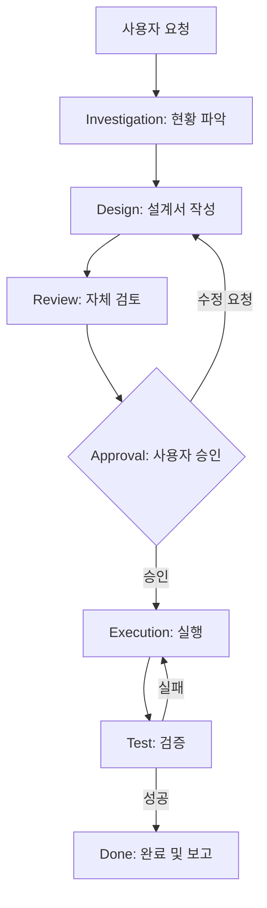

# 첫 번째 작업 요청하기

💡 **Hermes에게 단순한 채팅이 아닌, 추적 가능한 '공식 작업(JOB)'을 요청하고 완수하는 과정에 대한 가이드입니다.**

## 한 줄 요약

## 🌱 기본 개념
대부분의 AI와 대화할 때 우리는 '채팅'을 합니다. 하지만 p-hermes의 핵심은 **'작업(JOB) 기반 협업'**입니다. 

비유하자면, 일반 AI와의 대화가 **'포스트잇에 적어 주는 가벼운 메모'**라면, Hermes의 JOB 시스템은 **'정식 프로젝트 관리 도구(Jira, Linear)에 티켓을 생성하고 진행하는 것'**과 같습니다. 고유한 티켓 번호가 부여되고, 설계서가 작성되며, 검증을 거쳐 최종 결과물이 나오는 '공정 과정'을 갖는 것입니다. 이는 조직의 자산이 되는 '결과물'을 만드는 과정입니다.

## 🔍 문제 상황: 왜 '채팅'만으로는 부족한가?
복잡한 개발이나 분석 작업을 AI에게 맡겼을 때 다음과 같은 전형적인 고통(Pain points)을 겪어보셨을 것입니다:

- **컨텍스트 망각 (Context Drift)**: 대화가 길어지면 AI가 처음에 요청한 제약 조건이나 핵심 목표를 잊어버려, 결과물이 산으로 가는 현상이 발생합니다.
- **블랙박스 공정 (Black-box Process)**: AI가 결과물을 내놓기까지 내부적으로 어떤 논리 단계를 거쳤는지 알 수 없습니다. 틀린 부분이 있어도 어디서부터 논리가 꼬였는지 찾기 어려워 전체를 다시 요청해야 하는 낭비가 발생합니다.
- **재현 불가능성 (Lack of Reproducibility)**: 며칠 뒤에 비슷한 작업을 다시 하려 해도, 당시 어떤 프롬프트를 썼고 어떤 파일을 수정했는지 기록이 없어 동일한 품질의 결과물을 다시 얻기 힘듭니다.

p-hermes는 이를 해결하기 위해 모든 요청을 **고유 ID(예: JOB-1001)**를 가진 독립된 프로젝트 단위로 처리하며, 모든 과정의 '흔적'을 물리적 파일로 남깁니다.

## 💡 활용 예시: 효과적인 요청 방법
단순한 요청보다 **'목표'와 '제약 조건'**이 명확할수록 고품질의 결과물이 나옵니다.

**❌ 부족한 요청:**
> "내 프로젝트 문서 좀 고쳐줘."

**✅ 좋은 요청:**
> "[JOB-1001] 현재 프로젝트의 `docs/wiki/` 폴더 내 모든 `.md` 파일을 분석해서, 깨진 링크(404)를 찾아내고 이를 수정한 뒤 결과 리포트를 작성해줘. 특히 GitHub Pages 절대 URL 형식을 유지해야 해."

**에이전트의 반응 및 상호작용 시나리오:**
1. **요청 접수**: "JOB-1001 작업을 생성했습니다. 먼저 `docs/wiki/` 내 파일 목록을 조사하겠습니다."
2. **설계 제시**: (조사 후) "설계서를 작성했습니다. `validate-links.sh` 스크립트를 사용하여 링크를 검증하고 `patch` 도구로 수정하겠습니다. 진행할까요?" → **여기서 사용자가 "진행해"라고 답해야 합니다.**
3. **완료 보고**: "모든 링크 수정을 완료했습니다. `test-report.md`에 검증 결과를 기록했으며, 최종 결과는 `result.md`에서 확인하실 수 있습니다."

## 🔗 관련 주제
- **[기본 설정 가이드](https://pheanor-agent.github.io/p-hermes/docs/wiki/getting-started/configuration.md)**: 작업 효율을 높이는 모델 라우팅 설정.
- **[작업 요청 및 워크플로우 상세](https://pheanor-agent.github.io/p-hermes/docs/wiki/guides/request-task.md)**: 9단계 워크플로우의 각 단계별 상세 역할.

## 📊 작업 흐름도

