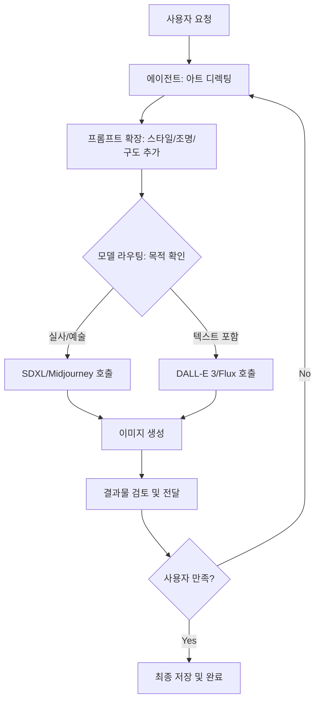

# 이미지 생성 및 관리

💡 **텍스트를 시각적 예술로 변환하는 '이미지 생성 스킬'의 작동 원리와 고품질 결과물을 얻기 위한 전략을 설명합니다.**

## 한 줄 요약

## 기본 개념

## 문제 상황

## 기술 설계

## 구조/흐름도

## 활용 예시

## 🌱 기본 개념
이미지 생성은 일반적인 텍스트 생성과 완전히 다른 메커니즘으로 작동합니다. 텍스트 모델이 '다음 단어'를 예측하는 통계적 추론을 한다면, 이미지 모델은 '무작위 노이즈 속에서 형태'를 찾아내는 디퓨전(Diffusion) 과정을 거칩니다.

비유하자면, p-hermes의 이미지 생성 과정은 **'유능한 아트 디렉터(에이전트)'와 '천재 화가(이미지 모델)'의 협업**과 같습니다. 사용자가 \"숲속의 카페를 그려줘\"라고 하면, 아트 디렉터인 에이전트는 화가가 이해하기 쉬운 구체적인 화풍, 조명, 구도, 질감(상세 프롬프트)을 정교하게 설계하여 전달하고, 화가는 이를 바탕으로 캔버스에 그림을 그려냅니다.

## 🔍 문제 상황: 왜 단순히 프롬프트를 전달하는 것으로는 부족한가?
사용자가 입력한 자연어 요청을 그대로 이미지 모델에 넣으면 다음과 같은 치명적인 문제가 발생합니다:

- **추상성 오류 (Abstraction Error)**: \"분위기 있게 그려줘\"라는 요청은 매우 주관적입니다. 모델마다 '분위기'에 대한 해석이 달라 결과가 제멋대로 나오며, 사용자가 원하는 느낌과 거리가 먼 결과가 나옵니다.
- **구조적 결함 (Structural Artifacts)**: 손가락 개수 오류, 글자 깨짐, 배경 왜곡 등 생성 AI 특유의 아티팩트가 발생합니다. 이를 제어하기 위한 부정 프롬프트(Negative Prompt)나 정교한 가중치 설정이 필요합니다.
- **일관성 부족 (Lack of Consistency)**: 같은 캐릭터나 배경을 여러 장 그려야 할 때, 매번 모습이 바뀌어 연속성이 깨지는 문제가 발생합니다. 이를 해결하기 위해서는 시드(Seed) 관리나 참조 이미지(Image-to-Image) 전략이 필요합니다.

p-hermes는 **'프롬프트 엔지니어링 스킬'**과 **'역할 기반 모델 라우팅'**을 통해 이 문제를 공학적으로 해결합니다.

## 🏗️ 기술 설계: 이미지 생성 파이프라인
이미지 생성 요청이 들어오면 에이전트는 다음과 같은 내부 공정을 거쳐 최적의 결과물을 만들어냅니다.

### 1. 프롬프트 확장 (Prompt Expansion)
사용자의 간단한 요청을 이미지 모델이 가장 잘 이해하는 **'태그 기반 상세 프롬프트'**로 변환합니다.
- **입력**: \"숲속의 마법 카페\"
- **확장**: `(magic cafe in deep forest:1.2), cinematic lighting, ethereal atmosphere, detailed wood textures, floating lanterns, 8k resolution, masterpiece, artstation style, highly detailed, sharp focus`
- 이 과정에서 에이전트는 `core/skills/creative/image-generation/` 내의 스타일 가이드와 최신 프롬프트 트렌드를 참조하여 최적의 키워드를 조합합니다.

### 2. 역할 기반 모델 라우팅 (Model Routing)
작업의 목적과 필요한 품질에 따라 최적의 모델을 자동으로 선택합니다.
- **실사 및 예술적 표현 (Photorealistic/Artistic)**: Midjourney 또는 SDXL 계열 모델 → 질감, 빛의 굴절, 예술적 화풍 표현에 최적화되어 있습니다.
- **텍스트 포함 이미지 (Text-in-Image)**: DALL-E 3 또는 Flux 모델 → 이미지 내의 철자 정확도가 매우 높으며, 복잡한 구도 지시를 잘 따릅니다.
- **빠른 시안 및 구도 확인 (Fast Draft)**: 경량화된 모델 → 최종본 생성 전, 구도와 배치를 빠르게 확인하기 위한 용도로 사용합니다.

### 3. 결과물 최적화 및 후처리 (Optimization & Post-processing)
생성된 이미지를 사용자의 피드백을 통해 완벽하게 다듬습니다.
- **In-painting (부분 수정)**: 이미지의 전체적인 느낌은 유지한 채, 특정 부분만 수정합니다. (예: \"카페 창문의 색을 파란색으로 바꿔줘\")
- **Up-scaling (해상도 향상)**: 저해상도 시안을 고해상도 최종본으로 변환하여 인쇄나 전시가 가능한 수준으로 품질을 높입니다.

## 📊 이미지 생성 흐름도

## 💡 활용 팁: 고품질 이미지를 얻는 요청법
에이전트에게 **'분위기'**와 **'기술적 제약'**, 그리고 **'참조 대상'**을 함께 제공하세요.

**❌ 단순 요청:**
> \"강아지가 우주복 입고 있는 그림 그려줘.\" (결과물이 매우 일반적이고 심심하게 나옵니다.)

**✅ 전문가급 요청:**
> \"[TASK] 골든 리트리버가 사이버펑크 스타일의 우주복을 입고 화성 표면에 서 있는 이미지를 그려줘. 배경에는 거대한 붉은 태양이 지고 있어야 하고, 조명은 네온 핑크와 블루가 대비되는 시네마틱한 분위기로로 설정해줘. 8k 실사 사진 느낌으로, 렌즈 플레어 효과를 추가해서 부탁해.\"

**수정 요청 팁:**
이미지가 생성된 후, \"전체적으로 좋은데, 강아지의 표정을 좀 더 행복하게 바꿔주고 배경의 행성을 하나 더 추가해줘\"라고 구체적으로 지시하세요. 에이전트는 이전 프롬프트를 유지한 채 해당 부분만 수정하여 시각적 일관성을 유지합니다.

## 🔗 관련 주제
- **[스킬 시스템 활용하기](https://pheanor-agent.github.io/p-hermes/docs/wiki/guides/use-skills.md)**: 이미지 생성에 사용되는 구체적인 스킬 폴더 구조와 스타일 가이드 위치를 확인하세요.
- **[메시징 플랫폼 연동](https://pheanor-agent.github.io/p-hermes/docs/wiki/guides/messaging.md)**: 생성된 고해상도 이미지를 디스코드나 텔레그램으로 즉시 받는 방법.
