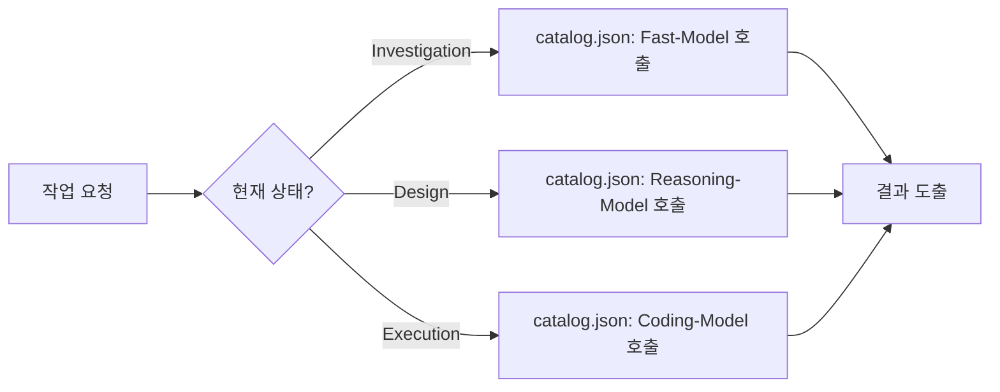

# 기본 설정 가이드

💡 **Hermes Agent의 지능(모델)과 동작 환경을 최적화하여 사용자의 워크플로우에 맞게 튜닝하는 방법입니다.**

## 🌱 기본 개념
에이전트의 설정은 마치 **'전문가의 도구함'**을 구성하는 것과 같습니다. 

모든 작업에 똑같은 최고급 망치(고성능 모델)만 쓰면 비용과 시간이 낭비되고, 가벼운 드라이버(경량 모델)만 쓰면 정밀한 설계가 불가능합니다. p-hermes는 작업의 성격에 따라 가장 적합한 도구를 자동으로 선택하는 **'역할 기반 라우팅'** 시스템을 통해 효율과 품질의 균형을 잡습니다. 이는 마치 숙련된 팀장이 작업의 난이도를 보고 "이건 신입이 해도 돼(Fast-Model)", "이건 내가 직접 설계해야 해(Reasoning-Model)"라고 배분하는 것과 같습니다.

## 🔍 문제 상황: 왜 모델을 나누어 써야 하는가?
단일 모델(Single Model)만 사용할 때 발생하는 전형적인 엔지니어링 문제는 다음과 같습니다:

- **추론 오버헤드 (Inference Overhead)**: 단순한 파일 목록 확인(`Investigation`)이나 파일 읽기 같은 반복 작업에 지나치게 무거운 모델을 쓰면, 응답 속도가 느려지고 토큰 비용이 불필요하게 상승합니다.
- **설계 부실 (Design Failure)**: 코딩은 빠르지만 논리적 추론 능력이 낮은 모델이 `Design` 단계를 맡으면, 겉보기에는 그럴싸하지만 실제로는 엣지 케이스를 고려하지 않은 설계를 내놓습니다. 이는 결국 `Execution` 단계에서 수많은 에러를 발생시키고 무한 롤백 루프에 빠지게 만듭니다.
- **확증 편향 (Confirmation Bias)**: 설계를 한 모델이 검토(`Review`)까지 맡으면, 자신의 논리적 오류를 발견하지 못하고 그대로 통과시키는 경향이 있습니다. 이는 품질 검수 단계가 무력화되는 결과를 초래합니다.

## 🏗️ 기술 설계: 설정의 3대 핵심 축
p-hermes의 설정은 크게 세 가지 파일로 나뉘어 관리되며, 각각 '지능', '정체성', '행동 규칙'을 결정합니다.

### 1. 모델 라우팅 (`catalog.json`)
에이전트가 현재 수행 중인 **상태(State)**에 따라 어떤 모델을 호출할지 결정하는 매핑 테이블입니다. 
- **경로**: `~/.hermes/core/skills/custom/model-catalog/catalog.json`
- **상태별 라우팅 전략**:
    - `investigation` $\rightarrow$ **Fast-Model**: 빠른 응답과 넓은 컨텍스트 윈도우를 가진 모델을 배치하여 빠르게 현황을 파악합니다.
    - `design` $\rightarrow$ **Reasoning-Model**: 복잡한 논리 구조를 설계하고 제약 조건을 분석하는 고성능 모델(예: o1, Claude 3.5 Sonnet)을 배치하여 정밀한 청사진을 작성합니다.
    - `review` $\rightarrow$ **Critic-Model**: 설계서의 허점을 찾는 데 특화된 모델을 배치합니다. 가급적 `design` 모델과 다른 제조사/계열의 모델을 배치하여 **상호 견제(Cross-Check)** 구조를 만듭니다.
    - `execution` $\rightarrow$ **Coding-Model**: 구문 정확도가 높고 도구 호출(Tool-use) 능력이 뛰어난 모델을 배치하여 실제 구현을 수행합니다.

### 2. 에이전트 프로필 (`AGENTS.md`)
에이전트의 정체성과 물리적 활동 범위를 정의하는 명세서입니다.
- **경로**: `~/.hermes/AGENTS.md`
- **핵심 변수**:
    - `skills_path`: 에이전트가 사용할 '전문 지식' 폴더 경로입니다.
    - `knowledge_path`: 에이전트가 참고할 '위키/리퍼런스' 폴더 경로입니다.
    - `workspace`: 작업 결과물이 저장되는 샌드박스 경로입니다. 이 경로 외부의 파일 접근은 기본적으로 제한됩니다.

### 3. 시스템 동작 설정 (`config.yaml`)
에이전트의 행동 규칙과 시스템 파라미터를 제어하는 설정 파일입니다.
- **경로**: `~/.hermes/config.yaml`
- **주요 파라미터**:
    - `workflow.checkpoint_validation`: `true` 설정 시, 각 단계 전이 전 검증 스크립트를 실행하여 데이터 무결성을 확인합니다.
    - `knowledge.update_interval`: 위키 프로세서가 `inbox`의 지식을 정제하여 공식 위키로 옮기는 주기(초)를 설정합니다.
    - `logging.level`: 로그의 상세 수준을 설정하여 트러블슈팅 시 가시성을 확보합니다.

## 📊 설정 적용 흐름도

## 💡 활용 예시: 성능 최적화 레시피
사용자의 환경과 목적에 따라 다음과 같이 설정 조합을 구성해 보세요.

**1. 속도 우선 설정 (Rapid Mode):**
- `investigation`: GPT-4o-mini 또는 Claude Haiku $\rightarrow$ 단순 조사 및 파일 탐색 속도 극대화.
- `execution`: 고속 코딩 특화 모델 $\rightarrow$ 파일 수정 및 적용 시간 단축.

**2. 품질 우선 설정 (High-Fidelity Mode):**
- `design`: o1-preview 또는 Claude 3.5 Sonnet $\rightarrow$ 설계 단계에서 완벽한 엣지 케이스 처리가 포함된 청사진 작성.
- `review`: `design`과 다른 제조사의 고성능 모델 배치 $\rightarrow$ 상호 검증을 통한 설계 오류 0% 지향.

**3. 보안 및 안정성 설정:**
- `config.yaml` 내 API 키는 반드시 `${VARIABLE}` 형식을 사용하여 `.bashrc` 환경변수에서 읽어오도록 설정하십시오. 이는 설정 파일이 유출되어도 API 키가 노출되지 않도록 하는 기본적인 보안 수칙입니다.

## 🔗 관련 주제
- **[첫 번째 작업 요청하기](https://pheanor-agent.github.io/p-hermes/docs/wiki/getting-started/first-job.md)**: 설정 완료 후 실제 작업을 실행하여 설정의 적절성을 검증해 보세요.
- **[스킬 시스템 활용하기](https://pheanor-agent.github.io/p-hermes/docs/wiki/guides/use-skills.md)**: 모델 라우팅 외에 에이전트의 능력을 확장하는 방법.
