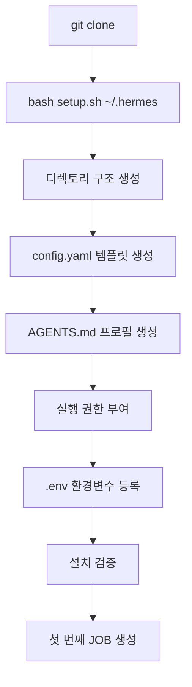

# 설치 및 환경 설정

💡 **p-hermes를 새로운 환경에 구축하여 즉시 작동시키기 위한 단계별 가이드입니다.**

## 🌱 기본 개념

p-hermes 설치는 Hermes Agent 시스템의 디렉토리 구조와 설정 파일을 구축하는 과정입니다. 설치 완료 후 다음 디렉토리 구조가 생성됩니다.

```
~/.hermes/
├── config.yaml          # 전역 설정 (모델, 도구, 보안)
├── AGENTS.md            # 에이전트 행동 규칙
├── skills/              # 스킬 라이브러리
├── workspace/           # 작업 파일 및 상태 기록
├── knowledge/           # 지식 베이스
├── cron/                # 자동화 작업 설정
├── sessions/            # 대화 세션 상태
├── events/              # 이벤트 버스
├── scripts/             # 유틸리티 스크립트
└── ...
```

에이전트는 설치 후 위 디렉토리 구조를 자동으로 인식하며, 각 폴더가 담당하는 역할은 [시스템 아키텍처](https://pheanor-agent.github.io/p-hermes/wiki/system-architecture.md) 문서에서 확인합니다.

## 🚀 빠른 설치

### 1. 레포지토리 클론

```bash
git clone https://github.com/pheanor-agent/p-hermes.git
cd p-hermes
```

### 2. 설치 스크립트 실행

```bash
bash setup.sh ~/.hermes
```

이 명령어 하나로 다음이 자동 완료됩니다:
- Hermes 디렉토리 구조 생성 (skills/, workspace/, knowledge/, cron/ 등)
- `config.yaml` 템플릿 생성 — 모델 라우팅 기본값 포함
- `AGENTS.md` 프로필 생성 — 에이전트 행동 규칙 정의
- 실행 권한 부여 — `workflow.sh`, `workflow-gate.sh` 등 핵심 스크립트 대상

### 3. 환경변수 설정

설치 후 API 키 및 서비스 토큰을 `.env` 파일에 등록합니다:

```bash
# .env 파일 생성 (또는 config 생성 시 자동 템플릿 제공)
cp .env.example ~/.hermes/.env
```

주요 환경변수 목록:

| 변수명 | 용도 | 필수 |
|--------|------|------|
| `OPENROUTER_API_KEY` | OpenRouter 모델 호출용 API 키 | 예 (기본 provider) |
| `ANTHROPIC_API_KEY` | Anthropic Claude 모델 호출용 | 선택 |
| `GITHUB_TOKEN` | 레포지토리 접근 및 GitHub Pages 배포 | 예 |
| `DISCORD_BOT_TOKEN` | Discord 봇 연동 | 선택 |
| `TELEGRAM_BOT_TOKEN` | Telegram 봇 연동 | 선택 |
| `GOOGLE_API_KEY` | 보조 모델(vision, compression) 호출 | 선택 |

민감 정보는 `.bashrc`나 `.zshrc`에 저장하여 메모리 상에서만 로드되도록 관리하는 것이 보안 관점에서 권장됩니다.

```bash
# .bashrc 또는 .zshrc 예시
export OPENROUTER_API_KEY="sk-or-..."
export GITHUB_TOKEN="ghp_..."
```

### 4. 설치 검증

```bash
# 구조 확인
ls -la ~/.hermes/

# config.yaml 기본값 확인
cat ~/.hermes/config.yaml

# 워크플로우 검증 스크립트 테스트
bash tests/validate-links.sh
```

## 📊 설치 흐름도



## 🏗️ 기술 설계: setup.sh 동작 원리

`setup.sh` 스크립트는 다음 순서로 인프라를 구축합니다:

1. **경로 검증**: 대상 디렉토리의 쓰기 권한을 확인하고, 기존 파일과 충돌하는 경우 안전한 덮어쓰기 정책을 적용합니다.
2. **디렉토리 구조 생성**: `skills/`, `workspace/`, `knowledge/`, `cron/` 등 Hermes 기본 디렉토리를 생성합니다. 심링크는 사용하지 않으며, 모든 경로는 절대 경로로 기록됩니다.
3. **설정 템플릿 배포**: `config.yaml.example`을 기반으로 기본 설정 파일을 복사합니다. 모델 라우팅, 도구 활성화 상태, 보안 옵션 등의 초기값이 포함되어 있습니다.
4. **실행 권한 설정**: `chmod +x`를 적용하여 워크플로우 관련 스크립트(`workflow.sh`, `workflow-gate.sh`, `create-job.sh`)에 실행 권한을 부여합니다.
5. **검증 보고서 출력**: 생성된 폴더 수, 설정 파일 경로, 그리고 다음 단계를 안내하는 요약 정보를 터미널에 출력합니다.

## 💡 활용 예시

### 커스텀 설치 경로

```bash
# 기본 경로(~/.hermes) 대신 /opt/hermes에 설치
bash setup.sh /opt/hermes
```

### WSL 환경에서 Windows 디스크 접근 설정

```bash
# Windows 사용자 Desktop에 워크스페이스 연결
mkdir -p ~/.hermes/workspace
# /mnt/c/Users/<username>/Desktop/ 에서 작업 파일 동기화 가능
```

### 보안 설정 팁 (`config.yaml`)

API 키와 같은 민감 정보는 환경변수 참조 형식을 사용하여 `config.yaml`에 직접 값을 적지 않습니다:

```yaml
# config.yaml — 환경변수 참조 방식 (권장)
model:
  default: "anthropic/claude-sonnet-4"
  provider: "openrouter"
  api_key: "${OPENROUTER_API_KEY}"  # .env에서 읽어옴
```

## 🔧 문제 해결 가이드

### 설치 후 에이전트가 시작되지 않음

- `config.yaml` 파일 인코딩이 UTF-8 BOM 포함 형식인 경우, `hermes config edit` 명령어로 BOM 없이 재저장합니다.
- `.env` 파일의 API 키 값이 인용부호(`""`)로 둘러싸여 있는지 확인합니다.

### `bash setup.sh` 실행 시 권한 오류

- `chmod +x setup.sh`를 먼저 실행하여 스크립트에 실행 권한을 부여합니다.
- WSL 환경에서 `/mnt/c/` 경로에 설치하는 경우 Windows 보안 정책이 접근을 차단할 수 있으므로 `~/.hermes` 경로를 사용합니다.

### GitHub Pages 배포 실패

- `GITHUB_TOKEN` 환경변수에 `repo`, `pages` 스코프가 포함되어 있는지 확인합니다.
- `bash tests/validate-links.sh`를 먼저 실행하여 문서 링크 유효성을 검증합니다.

## ❓ FAQ

**Q: 여러 기기에서 동일한 환경을 유지하려면 어떻게 해야 하나요?**
A: `.env` 파일을 각 기기에 별도로 설정하고, `git clone` 후 `bash setup.sh ~/.hermes`를 실행하면 동일한 Hermes 환경이 복원됩니다. `config.yaml`은 레포지토리에 포함되지 않으므로 각 기기에서 `config.yaml.example`을 기반으로 별도로 생성합니다.

**Q: 설치 경로를 변경하려면 어떻게 하나요?**
A: `bash setup.sh /새/경로`를 실행하면 새 경로에 완전한 구조가 복제됩니다. 이전 경로의 데이터는 유지됩니다.

**Q: Docker 또는 원격 서버에서 설치 가능한가요?**
A: 네, Linux 기반 환경에서 `setup.sh`는 동일하게 작동합니다. WSL, Ubuntu, macOS, Docker 컨테이너 모두 지원됩니다. 터미널 백엔드 설정에서 `docker` 또는 `ssh`를 선택하여 원격 실행 환경을 구성합니다.

**Q: `.workflow-state` 파일은 어디서 생성되나요?**
A: `~/.hermes/workspace/jobs/JOB-XXXX/.workflow-state` 경로에 생성됩니다. 각 JOB이 독립적인 상태 파일을 보유하여 동시 실행 시 충돌이 발생하지 않습니다.

**Q: 설치를 다시 하려면 어떻게 하나요?**
A: `rm -rf ~/.hermes` 후 `bash setup.sh ~/.hermes`를 다시 실행합니다. `.env` 파일과 API 키는 별도로 백업해두는 것이 권장됩니다.

## 🔗 관련 주제

- **[첫 번째 작업 요청하기](https://pheanor-agent.github.io/p-hermes/wiki/getting-started/first-job.md)**: 설치 후 에이전트에게 첫 임무를 부여하는 방법.
- **[기본 설정 가이드](https://pheanor-agent.github.io/p-hermes/wiki/getting-started/configuration.md)**: 모델 라우팅 및 세부 튜닝을 통한 성능 최적화.
- **[시스템 아키텍처](https://pheanor-agent.github.io/p-hermes/wiki/system-architecture.md)**: 시스템 구성과 핵심 컴포넌트의 전체적인 설계도.
