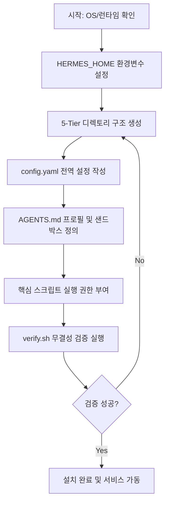

# 설치 및 환경 설정

💡 **p-hermes를 새로운 환경에 구축하여 즉시 작동시키기 위한 단계별 가이드입니다.**

## 🌱 기본 개념
p-hermes 설치는 에이전트가 생각하고 행동할 수 있는 **'물리적 뇌 구조'**를 만드는 과정입니다. 

비유하자면, 새 직원을 채용하고 그 직원에게 **전용 책상(Workspace)**, **사내 규정집(Config)**, 그리고 **업무 매뉴얼 저장소(Knowledge)**를 마련해 주는 것과 같습니다. 직원이 출근했을 때 "내 책상은 어디지?", "회사 규칙은 어디에 적혀 있지?"라고 당황하지 않도록 미리 완벽한 인프라를 갖춰주는 과정이라고 이해하시면 됩니다. 이 구조가 정확히 잡혀 있어야 에이전트가 길을 잃지 않고 필요한 파일을 찾거나 설정을 읽어올 수 있습니다.

## 🔍 문제 상황: 왜 복잡한 폴더 구조가 필요한가?
단순히 실행 파일 하나만 있다면 편하겠지만, AI 에이전트는 수천 개의 파일과 다양한 도구를 동시에 다루는 '디지털 노동자'입니다. 만약 모든 파일이 한 폴더에 섞여 있다면 다음과 같은 치명적인 문제가 발생합니다:

- **컨텍스트 오염 (Context Pollution)**: 에이전트가 설정 파일과 작업 결과물을 구분하지 못해, 시스템 설정을 수정해야 할 때 엉뚱한 결과물 파일을 수정하는 사고가 발생합니다.
- **권한 충돌 및 보안 취약점**: 시스템 핵심 스크립트(Read-only)와 사용자 생성 파일(Read-Write)이 섞여 있으면, 에이전트가 실수로 핵심 로직을 덮어쓰거나 보안상 위험한 경로에 파일을 생성할 수 있습니다.
- **백업 및 복구 효율 저하**: 중요 설정만 백업하고 싶은데 전체 폴더를 백업해야 하는 낭비가 발생하며, 특정 시점의 상태(State)만 복구하는 것이 불가능해집니다.

이를 해결하기 위해 p-hermes는 **5-Tier 물리 계층 구조**를 채택하여 데이터의 '성격'과 '생명 주기'에 따라 엄격하게 분리 관리합니다.

## 🏗️ 기술 설계: 5-Tier 아키텍처
p-hermes의 설치 핵심은 `$HERMES_HOME` (기본값: `~/.hermes`) 아래에 다음과 같은 5개의 계층을 구축하는 것입니다. 이는 운영체제의 커널-유저 공간 분리와 유사한 철학을 가집니다.

### 1. 물리 계층 상세 (Physical Layer)
- **`core/` (The Brain)**: 시스템의 불변하는 핵심 로직이 위치합니다.
    - `skills/`: 에이전트의 전문 지식 정의서.
    - `scripts/`: 쉘 스크립트 기반의 자동화 도구.
    - `hooks/`: 특정 이벤트(파일 생성, 작업 완료 등) 발생 시 트리거되는 로직.
- **`runtime/` (The Workbench)**: 에이전트가 실제로 활동하며 데이터가 생성/변경되는 동적 공간입니다.
    - `workspace/`: 현재 수행 중인 `jobs/`와 `projects/`가 격리되어 저장됩니다.
    - `knowledge/`: `wiki/`와 `references/` 등 에이전트가 상시 참고하는 지식 베이스가 위치합니다.
- **`interfaces/` (The Bridge)**: 외부 플랫폼(Discord, Telegram, API)과 연결되는 접점 설정 및 인증 토큰이 저장됩니다.
- **`infra/` (The Foundation)**: 시스템의 기초 체력을 담당하는 인프라 계층입니다.
    - `cron/`: 정기적인 상태 체크 및 백업 스케줄러.
    - `state/`: 워크플로우 상태를 기록하는 `.workflow-state` JSON 파일들이 저장되어 서버 재시작 후에도 작업을 이어갈 수 있게 합니다.
- **`release/` (The Archive)**: 검증이 완료된 배포 버전 및 시스템 스냅샷이 관리됩니다.

### 2. 핵심 설정 메커니즘
- **`config.yaml`**: 시스템 전역 변수를 제어하는 SSOT(Single Source of Truth) 파일입니다. 특히 `workflow.state_file` 설정은 에이전트가 현재 어떤 단계(예: Investigation $\rightarrow$ Design)에 있는지 기록하는 파일 경로를 지정하여, 비정상 종료 후에도 정확한 지점에서 복구(Recovery)할 수 있는 메커니즘을 제공합니다.
- **`AGENTS.md`**: 에이전트의 '페르소나'와 '권한 범위'를 정의합니다. 여기서 지정한 `workspace` 경로가 에이전트의 활동 반경(Sandbox)이 되며, 이 범위를 벗어난 파일 접근은 시스템 수준에서 차단됩니다.

## 📊 설치 흐름도


## 💡 활용 예시: 빠른 설치 명령어
터미널에 아래 명령어를 복사하여 실행하면 표준 구조가 즉시 생성됩니다. (Linux/macOS 기준)

```bash
# 1. Hermes Home 및 5-Tier 구조 생성
HERMES_HOME="$HOME/.hermes"
mkdir -p "$HERMES_HOME"/{core/{scripts,skills,hooks,plugins},runtime/{workspace/{jobs,projects,novels,reports,research},knowledge/{wiki,references,lessons,news}},interfaces,infra/{cron,backups,state,events/bus},release}

# 2. 초기 위키 인덱스 생성 (에이전트의 첫 지식 포인트)
echo "# Wiki Index" > "$HERMES_HOME/runtime/knowledge/wiki/index.md"

# 3. 실행 권한 부여 (스크립트 배치 후 실행)
chmod +x "$HERMES_HOME"/core/scripts/*.sh
```

**보안 설정 팁 (`config.yaml`):**
API 키와 같은 민감 정보는 절대 파일에 직접 텍스트로 적지 마세요. `${HERMES_API_KEY}`와 같이 환경변수 참조 형식을 사용하고, 실제 값은 `.bashrc`나 `.zshrc`에 저장하여 메모리 상에서만 로드되도록 관리하십시오.

## 🔗 관련 주제
- **[첫 번째 작업 요청하기](https://pheanor-agent.github.io/p-hermes/docs/wiki/getting-started/first-job.md)**: 설치 후 에이전트에게 첫 임무를 부여하는 구체적인 방법.
- **[기본 설정 가이드](https://pheanor-agent.github.io/p-hermes/docs/wiki/getting-started/configuration.md)**: 모델 라우팅 및 세부 튜닝을 통한 성능 최적화 방법.
