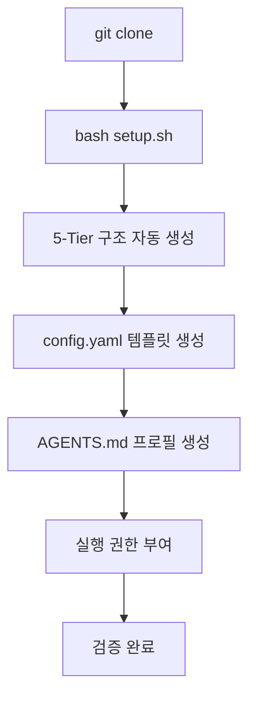

# 설치 및 환경 설정

💡 **p-hermes를 새로운 환경에 구축하여 즉시 작동시키기 위한 단계별 가이드입니다.**

## 🌱 기본 개념

p-hermes 설치는 에이전트가 생각하고 행동할 수 있는 **'물리적 뇌 구조'**를 만드는 과정입니다. 새 직원이 출근했을 때 "내 책상은 어디지?", "회사 규칙은 어디에 적혀 있지?"라고 당황하지 않도록 완벽한 인프라를 갖춰주는 과정입니다.

## 🚀 빠른 설치

1. 레포지토리를 클론합니다:
```bash
git clone https://github.com/pheanor-agent/p-hermes.git
cd p-hermes
```

2. 설치 스크립트를 실행합니다:
```bash
bash setup.sh ~/.hermes
```

이 명령어 하나로 5-Tier 폴더 구조, 설정 파일 템플릿, 실행 권한 부여가 자동 완료됩니다.

## 🔍 문제 상황: 왜 5-Tier 구조인가?

- **컨텍스트 오염 방지**: 설정 파일과 작업 결과물 분리로 실수 수정 사고 차단
- **보안 강화**: 핵심 로직(Read-only)과 사용자 파일(Read-Write) 분리
- **백업 효율**: 중요 설정만 선택적 백업 가능, 특정 시점 상태 복구 지원

자세한 5-Tier 구조는 [아키텍처 문서](https://pheanor-agent.github.io/p-hermes/slides/decks/architecture-5tier.html)에서 확인합니다.

## 📊 설치 흐름도



## 💡 활용 예시: 커스텀 설치 경로

```bash
# 기본 경로 (~/.hermes)가 아닌 다른 경로에 설치
bash setup.sh /opt/hermes
```

**보안 설정 팁 (`config.yaml`):**
API 키와 같은 민감 정보는 환경변수 참조 형식 사용. 실제 값은 `.bashrc`나 `.zshrc`에 저장하여 메모리 상에서만 로드되도록 관리합니다.

## 🔗 관련 주제

- **[첫 번째 작업 요청하기](https://pheanor-agent.github.io/p-hermes/wiki/getting-started/first-job.md)**: 설치 후 에이전트에게 첫 임무를 부여하는 방법.
- **[기본 설정 가이드](https://pheanor-agent.github.io/p-hermes/wiki/getting-started/configuration.md)**: 모델 라우팅 및 세부 튜닝을 통한 성능 최적화.
