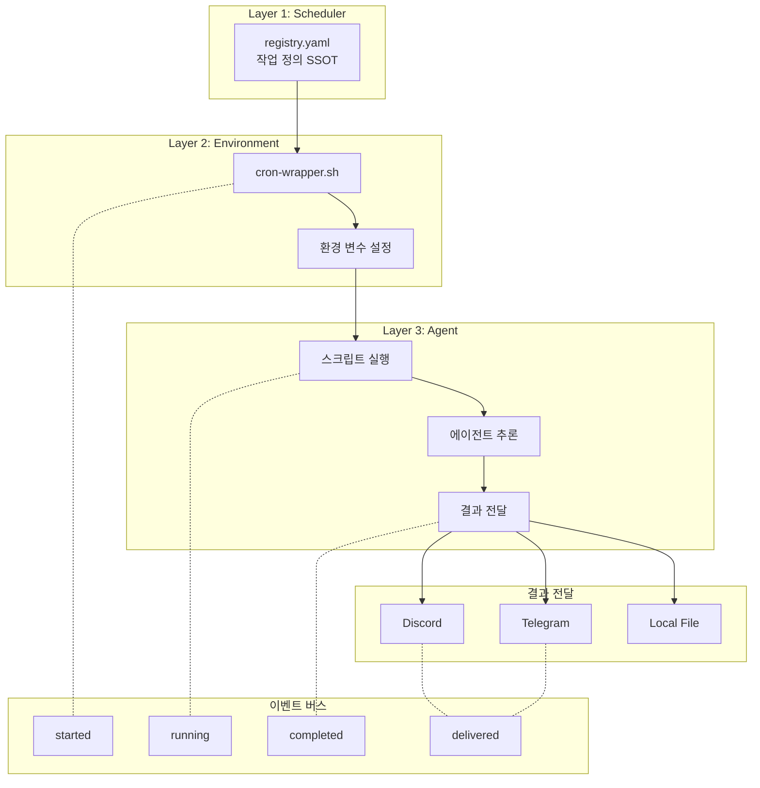
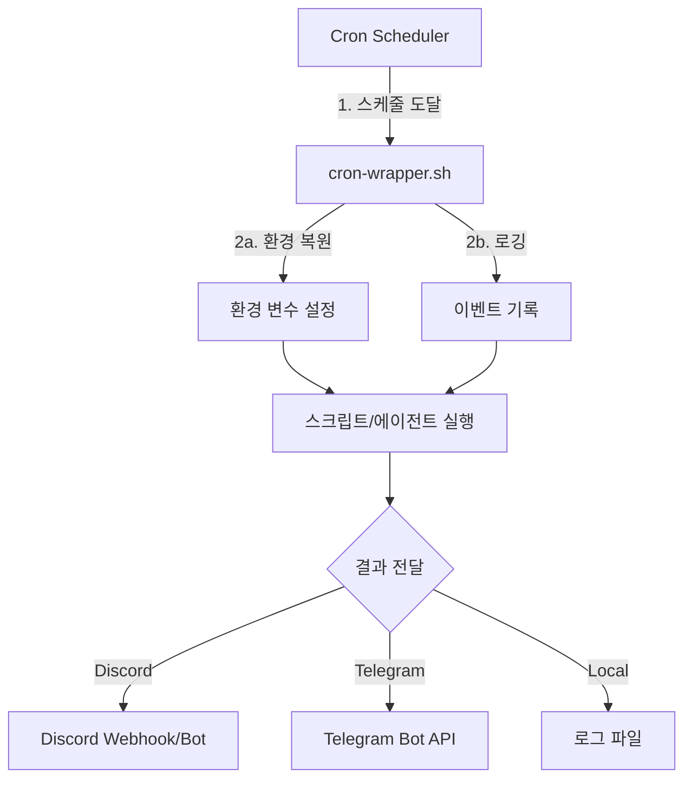
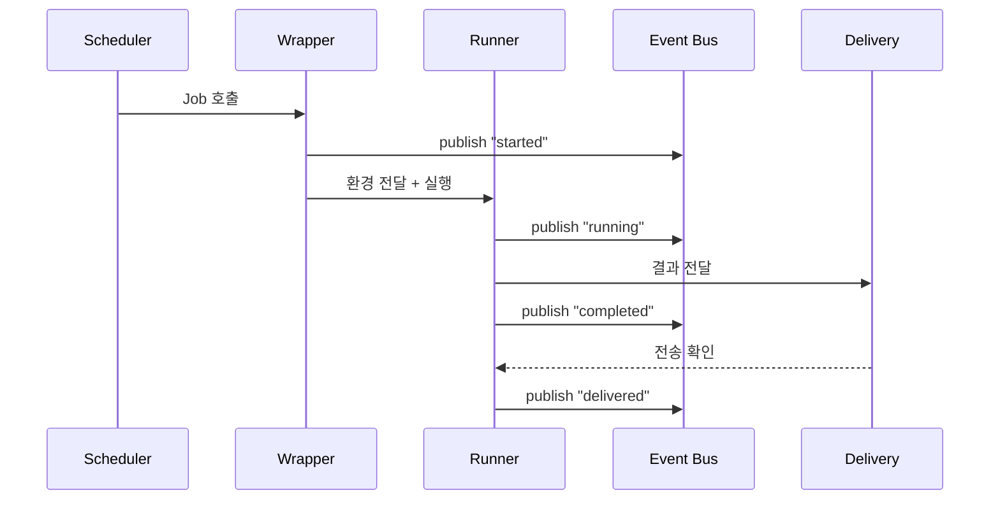

# Cron/자동화 시스템 가이드

💡 **에이전트가 정해진 시간에 자동으로 작업을 수행하고, 결과를 여러 채널에 전달하는 자동화 인프라를 설정하고 운영하는 방법입니다.**

## 한 줄 요약

`registry.yaml`에서 작업을 정의하면 스케줄러가 자동으로 실행하고, 결과를 Discord·Telegram·로컬 파일로 전달하는 자동화 인프라입니다.

## 기본 개념

자동화 시스템은 정해진 주기나 조건에서 에이전트가 스스로 작업을 시작하고 결과를 전달하는 '디지털 루틴'입니다. Registry에서 작업 정의, Wrapper에서 실행 환경 복원, Runner에서 실제 에이전트 추론이 이루어지는 3층 구조로 동작합니다. 이벤트 버스(`event.sh`)를 통해 실행 이력이 기록되고, `system-common` 유틸리티가 원자적 실행을 보장합니다.

## 문제 상황

사용자가 매일 아침 뉴스 요약을 받거나, 주간 시스템 점검을 자동으로 수행하려면 수동으로 에이전트에 요청해야 합니다. 반복적인 작업을 사람이 기억하고 실행하면 누락이 발생하고, 여러 작업을 동시에 관리하면 스케줄이 겹치거나 중복 실행되는 문제가 생깁니다. 또한 작업 실패 시 재시도나 알림이 없어 문제를 놓치기 쉽습니다.

## 기술 설계

자동화 시스템은 Registry → Wrapper → Runner의 3층 아키텍처로 구현됩니다. `cron/registry.yaml`이 모든 작업의 SSOT로 동작하며, 각 작업은 이름(name), 스케줄(schedule), 스크립트 경로(script), 유형(type), 설명(description)을 YAML로 정의합니다. Wrapper는 `.env` 로드, CronWrapper(`cron-wrapper.sh`)를 통한 환경 복원을 담당하고, Runner가 실제 스크립트 또는 에이전트 추론을 수행합니다. `mutex_acquire` 유틸리티가 중복 실행을 차단하며, `silent-on-success` 원칙이 정상 실행 시 알림을 생략합니다.

## 구조/흐름도



## 활용 예시

### 시스템 크론 작업 등록 (registry.yaml)

실제 `registry.yaml`은 `system_crontab` 타입의 작업을 정의합니다.

```yaml
# ~/.hermes/cron/registry.yaml
jobs:
  - name: openclaw-nightly
    schedule: "0 2 * * *"
    script: "/home/pheanor/.openclaw/workspace/scripts/nightly-all.sh"
    type: system_crontab
    description: "OpenClaw 야간 자동화"

  - name: memory-monitor
    schedule: "*/5 * * * *"
    script: "/home/pheanor/.hermes/core/scripts/memory-monitor.sh"
    type: system_crontab
    description: "메모리 사용률 모니터링"

  - name: github-update
    schedule: "0 5 * * *"
    script: "/home/pheanor/.hermes/core/scripts/github-reference-update.py"
    type: system_crontab
    description: "GitHub 리퍼런스 동기화"
```

### CronWrapper를 통한 실행

모든 작업은 `cron-wrapper.sh`를 통해 실행됩니다.

```bash
# crontab 실제 항목 (예시)
0 5 * * * /home/pheanor/.hermes/infra/cron/cron-wrapper.sh \
  --name github-update --type system_crontab -- \
  python3 /home/pheanor/.hermes/core/scripts/github-reference-update.py
```

## 서론

p-hermes의 자동화 시스템은 정해진 주기나 조건에서 에이전트가 스스로 작업을 시작하고 결과를 전달하는 '디지털 루틴' 인프라입니다. 시스템 모니터링, 주간 점검, 데이터 동기화 등 반복적인 작업을 사용자 개입 없이 자동화할 수 있습니다.

시스템은 **Registry → Wrapper → Runner**의 3층 구조를 기반으로 합니다. Registry에서는 '무엇을 언제 실행할지'를 정의하고, Wrapper는 실행 환경을 복원하며, Runner가 실제 작업 수행을 담당합니다.

## registry.yaml — 자동화 작업 등록 파일

`~/.hermes/cron/registry.yaml`은 모든 자동화 작업의 단일 진실 출처(SSOT)입니다. YAML 형식으로 작성하며, 각 작업은 독립적으로 실행됩니다.

### 기본 구조

```yaml
# ~/.hermes/cron/registry.yaml
jobs:
  - name: "job-name"
    schedule: "0 9 * * *"
    script: "path/to/script.sh"
    type: "script"
    description: "설명"
```

### 파라미터 설명

| 필드 | 필수 | 설명 |
|------|------|------|
| `name` | O | 작업 고유 식별자 (영문 소문자, 하이픈 사용 가능) |
| `schedule` | O | 실행 주기 (cron 표현식) |
| `script` | O | 실행할 스크립트 경로 (절대 경로) |
| `type` | O | 작업 유형 (`system_crontab`, `script` 등) |
| `description` | 선택 | 작업 설명 |

### 실제 운영 예시

```yaml
jobs:
  - name: openclaw-nightly
    schedule: "0 2 * * *"
    script: "/home/pheanor/.openclaw/workspace/scripts/nightly-all.sh"
    type: system_crontab
    description: "OpenClaw 야간 자동화"

  - name: image-management
    schedule: "*/5 * * * *"
    script: "/home/pheanor/.openclaw/workspace/scripts/image-all.sh"
    type: system_crontab
    description: "이미지 관리 파이프라인"

  - name: token-monitor
    schedule: "*/10 * * * *"
    script: "/home/pheanor/.openclaw/workspace/scripts/provider-token-check.sh"
    type: system_crontab
    description: "API 토큰 유효성 체크"

  - name: memory-monitor
    schedule: "*/5 * * * *"
    script: "/home/pheanor/.hermes/core/scripts/memory-monitor.sh"
    type: system_crontab
    description: "메모리 사용률 모니터링"

  - name: image-health
    schedule: "0 * * * *"
    script: "/home/pheanor/.hermes/core/scripts/image-gen/health-check.sh"
    type: system_crontab
    description: "ComfyUI 헬스 체크"

  - name: image-cost
    schedule: "0 9 * * *"
    script: "/home/pheanor/.hermes/core/scripts/image-gen/cost-monitor.sh"
    type: system_crontab
    description: "API 비용 모니터링"

  - name: github-update
    schedule: "0 5 * * *"
    script: "/home/pheanor/.hermes/core/scripts/github-reference-update.py"
    type: system_crontab
    description: "GitHub 리퍼런스 동기화"

  - name: Hot Standby 동기화 (JOB-1614)
    schedule: "*/5 * * * *"
    script: "/home/pheanor/.hermes/core/scripts/rsync-to-openclaw.sh"
    type: system_crontab
    description: "Hot Standby 동기화 (JOB-1614)"

  - name: weekly-eval
    schedule: "0 4 * * 0"
    script: "/home/pheanor/.openclaw/workspace/scripts/weekly-all.sh"
    type: system_crontab
    description: "주간 요약 작업"

  - name: sync-all
    schedule: "0 4 * * *"
    script: "/home/pheanor/.hermes/core/scripts/sync-all.sh"
    type: system_crontab
    description: "크로스 시스템 데이터 동기화"

  - name: event-archive-cleanup
    schedule: "0 4 * * 0"
    script: "/home/pheanor/.hermes/core/scripts/cleanup-event-archive.sh"
    type: system_crontab
    description: "이벤트 아카이브 정리 (JOB-1621)"
```

## 스케줄 문법

스케줄은 cron 표현식을 사용합니다.

### Cron 표현식

표준 5자리 cron 표현식을 사용합니다.

| 표현식 | 의미 |
|--------|------|
| `0 9 * * 1` | 매주 월요일 오전 9시 정각 |
| `0 0 */2 * *` | 2일마다 자정 |
| `*/15 * * * *` | 15분마다 |
| `0 23 * * 0` | 매주 일요일 밤 11시 |

### crontab 연동

`registry.yaml`의 작업은 시스템 crontab에 의해 실행됩니다. 모든 작업은 `cron-wrapper.sh`를 통해 래핑되어 실행됩니다.

```bash
# crontab 라인 패턴
*/5 * * * * /home/pheanor/.hermes/infra/cron/cron-wrapper.sh \
  --name <job-name> --type system_crontab -- \
  bash <script-path>
```

## 3층 아키텍처와 실행 흐름



### Layer 1 — Registry (스케줄러)

`registry.yaml`을 읽어 실행 대기 중인 작업을 감지하고, 스케줄이 도래하면 `cron-wrapper.sh` 진입점을 호출합니다. 시스템 수준 크론 스케줄러가 이 역할을 수행합니다.

### Layer 2 — Wrapper (환경 복원)

Wrapper는 스크립트 실행 전 필수 준비 작업을 담당합니다.

- `cron-wrapper.sh`를 통한 환경 변수 복원
- 실행 이력 로깅 (시작/완료/실패)
- 중복 실행 방지 (mutex)

### Layer 3 — Runner (작업 수행)

Runner는 실제 스크립트 또는 에이전트 추론을 수행합니다.

- `script`에 정의된 경로의 스크립트 실행
- `type`에 따라 실행 방식 결정 (system_crontab, script 등)
- 작업 완료 후 결과를 전달 채널로 전송

## 이벤트 버스 (event.sh)

이벤트 버스는 자동화 작업의 실행 이력을 중앙에서 기록하고 조회하는 시스템입니다. JSONL 형식으로 로그를 저장하며, 모든 작업의 시작, 완료, 실패 이벤트가 기록됩니다.

### 명령어

```bash
# 이벤트 기록
event.sh publish "JOB-1234" "completed" '{"result": "success"}'

# 전체 히스토리 조회
event.sh history

# 특정 작업의 이벤트만 조회
event.sh history --job "JOB-1234"

# 최근 10개 이벤트만 조회
event.sh history --limit 10
```

### 이벤트 버스 데이터 흐름



### JSONL 로그 형식

```jsonl
{"ts":"2026-06-17T08:00:01Z","job":"morning-news","event":"started","session":"sess-abc123"}
{"ts":"2026-06-17T08:02:15Z","job":"morning-news","event":"completed","result":"success"}
{"ts":"2026-06-17T08:02:16Z","job":"morning-news","event":"delivered","channel":"discord:123456789"}
```

## system-common 유틸리티

시스템 공통 유틸리티 함수 모음은 자동화 스크립트에서 빈번하게 사용하는 작업을 단순화합니다.

### 주요 유틸리티

| 함수 | 설명 |
|------|------|
| `mkdir_atomic` | 원자적 디렉토리 생성 (경쟁 상태 방지) |
| `mutex_acquire` | 파일 기반 뮤텍스로 중복 실행 차단 |
| `mutex_release` | 뮤텍스 해제 |
| `log_event` | 이벤트 버스에 표준 형식으로 로그 기록 |

### 중복 실행 방지 예시

```bash
# 스크립트 시작 시 뮤텍스 획득
mutex_acquire "morning-news" || exit 0
# ... 작업 실행 ...
mutex_release "morning-news"
```

## silent-on-success 원칙

모니터링 및 점검용 자동화 작업은 정상 실행 시 사용자에게 알림을 전송하지 않습니다. 시스템이 예상대로 작동할 때는 조용히 유지되며, 오직 실패 또는 경고 상태일 때만 결과를 전달합니다. 이 원칙은 알림 피로도를 낮추고 중요한 이벤트를 눈에 띄게 합니다.

## FAQ

**Q: 크론 작업 실행 시간을 어떻게 확인하나요?**
`event.sh history` 명령어로 작업 이력을 조회합니다. JSONL 형식의 로그에 시작 시각과 완료 시각이 포함되어 있습니다.

**Q: 크론 작업이 실패했을 때 재시도 메커니즘은 있나요?**
작업 단위 재시도는 현재 직접 지원되지 않습니다. 실패 시 스크립트 내에서 재시도 로직을 작성하거나, 실패 이벤트를 감지하는 별도 모니터링 작업을 설정합니다.

**Q: 새로운 자동화 작업을 추가하려면 어떻게 하나요?**
`registry.yaml`에 새 작업 항목을 추가하고, `crontab -l`로 확인한 후 `cron-wrapper.sh`를 통해 시스템 crontab에 등록합니다.

## 실제 사용 패턴

### 시스템 모니터링
```bash
# registry.yaml 항목
- name: memory-monitor
  schedule: "*/5 * * * *"
  script: "/home/pheanor/.hermes/core/scripts/memory-monitor.sh"
  type: system_crontab
  description: "메모리 사용률 모니터링"
```

### 데이터 동기화
```bash
- name: github-update
  schedule: "0 5 * * *"
  script: "/home/pheanor/.hermes/core/scripts/github-reference-update.py"
  type: system_crontab
  description: "GitHub 리퍼런스 동기화"
```

### 주기적 정리
```bash
- name: event-archive-cleanup
  schedule: "0 4 * * 0"
  script: "/home/pheanor/.hermes/core/scripts/cleanup-event-archive.sh"
  type: system_crontab
  description: "이벤트 아카이브 정리 (JOB-1621)"
```

---

_마지막 업데이트: 2026-06-17_
