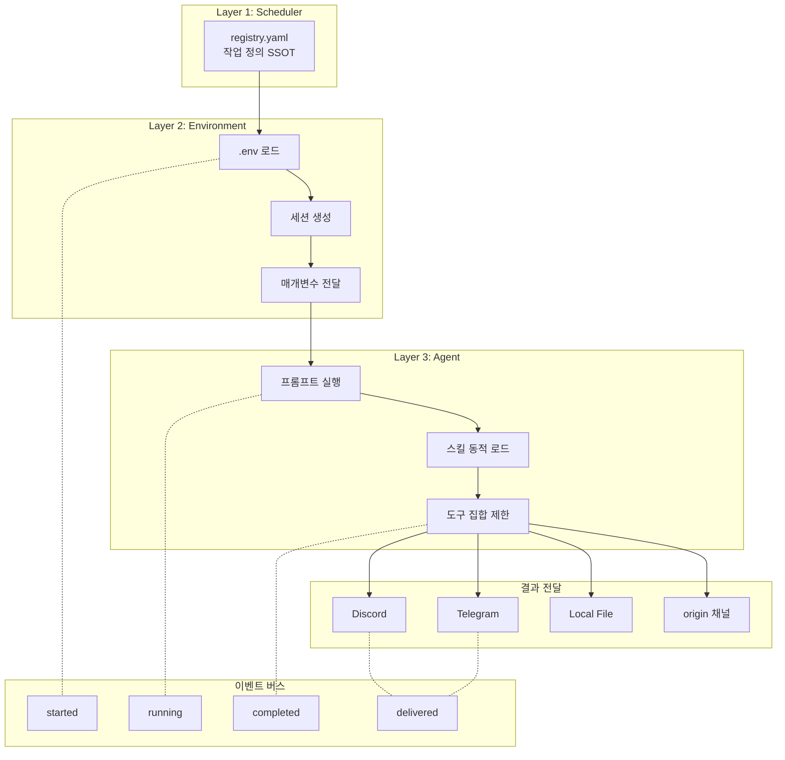
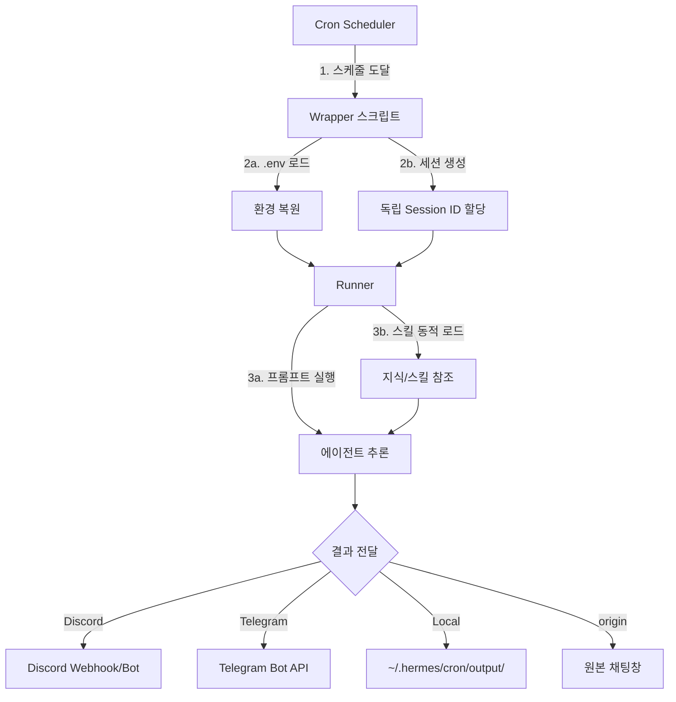
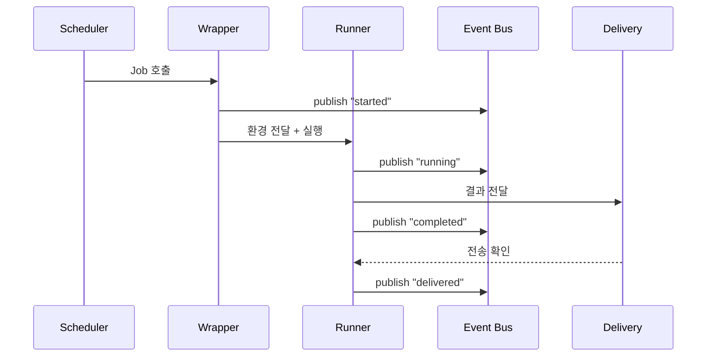

# Cron/자동화 시스템 가이드

💡 **에이전트가 정해진 시간에 자동으로 작업을 수행하고, 결과를 여러 채널에 전달하는 자동화 인프라를 설정하고 운영하는 방법입니다.**

## 한 줄 요약

`registry.yaml`에서 작업을 정의하면 스케줄러가 자동으로 실행하고, 결과를 Discord·Telegram·로컬 파일로 전달하는 자동화 인프라입니다.

## 기본 개념

자동화 시스템은 정해진 주기나 조건에서 에이전트가 스스로 작업을 시작하고 결과를 전달하는 '디지털 루틴'입니다. Registry에서 작업 정의, Wrapper에서 실행 환경 복원, Runner에서 실제 에이전트 추론이 이루어지는 3층 구조로 동작합니다. 이벤트 버스(`event.sh`)를 통해 실행 이력이 기록되고, `system-common` 유틸리티가 원자적 실행을 보장합니다.

## 문제 상황

사용자가 매일 아침 뉴스 요약을 받거나, 주간 시스템 점검을 자동으로 수행하려면 수동으로 에이전트에 요청해야 합니다. 반복적인 작업을 사람이 기억하고 실행하면 누락이 발생하고, 여러 작업을 동시에 관리하면 스케줄이 겹치거나 중복 실행되는 문제가 생깁니다. 또한 작업 실패 시 재시도나 알림이 없어 문제를 놓치기 쉽습니다.

## 기술 설계

자동화 시스템은 Registry → Wrapper → Runner의 3층 아키텍처로 구현됩니다. `cron/registry.yaml`이 모든 작업의 SSOT로 동작하며, 각 작업은 고유 ID, 스케줄 표현식, 프롬프트, 모델 지정, 도구 집합 제한, 결과 전달 채널을 YAML로 정의합니다. Wrapper는 `.env` 로드, 독립 세션 생성, 환경 복원을 담당하고, Runner가 실제 에이전트 추론과 결과 전달을 수행합니다. `mutex_acquire` 유틸리티가 중복 실행을 차단하며, `silent-on-success` 원칙이 정상 실행 시 알림을 생략합니다.

## 구조/흐름도



## 활용 예시

### 매일 아침 뉴스 요약 크론 작업
```yaml
- id: morning-news
  name: "매일 아침 뉴스 요약"
  schedule: "0 8 * * *"
  prompt: |
    오늘 AI/기술 분야 주요 뉴스 5개를 검색하고
    각 항목별로 2문장 이내로 요약해 주세요.
  deliver: "discord:123456789"
  model:
    provider: openrouter
    model: "anthropic/claude-sonnet-4"
  enabled_toolsets: ["web", "terminal"]
```

### 이벤트 기반 자동화 (GitHub PR 리뷰)
```bash
hermes cron create \
  --name "pr-review" \
  --prompt "PR 코드 리뷰 수행" \
  --trigger "github.pr.created" \
  --deliver discord
```

### silent-on-success 모니터링
정상 실행 시 알림을 전송하지 않고 실패 시만 알리는 점검 작업은 `no_agent: true`와 `script`를 함께 사용합니다.

## 서론

p-hermes의 자동화 시스템은 정해진 주기나 조건에서 에이전트가 스스로 작업을 시작하고 결과를 전달하는 '디지털 루틴' 인프라입니다. 매일 아침 뉴스 요약, 주간 시스템 점검, 실시간 모니터링 등 반복적인 작업을 사용자 개입 없이 자동화할 수 있습니다.

시스템은 **Registry → Wrapper → Runner**의 3층 구조를 기반으로 합니다. Registry에서는 '무엇을 언제 실행할지'를 정의하고, Wrapper는 실행 환경과 세션을 복원하며, Runner가 실제 에이전트 추론과 결과 전달을 담당합니다.

## registry.yaml — 자동화 작업 등록 파일

`~/.hermes/cron/registry.yaml`은 모든 자동화 작업의 단일 진실 출처(SSOT)입니다. YAML 형식으로 작성하며, 각 작업은 고유한 `id`를 가지며 독립적으로 실행됩니다.

### 기본 구조

```yaml
- id: morning-news
  name: "매일 아침 뉴스 요약"
  schedule: "0 8 * * *"
  prompt: |
    오늘 AI/기술 분야 주요 뉴스 5개를 검색하고
    각 항목별로 2문장 이내로 요약해 주세요.
  deliver: "discord:123456789"
  model:
    provider: openrouter
    model: "anthropic/claude-sonnet-4"
  enabled_toolsets: ["web", "terminal"]
```

### 파라미터 설명

| 필드 | 필수 | 설명 |
|------|------|------|
| `id` | O | 작업 고유 식별자 (영문 소문자, 하이픈 사용 가능) |
| `name` | O | 인간이 읽기 쉬운 작업명 |
| `schedule` | O | 실행 주기 (cron 표현식 또는 확장 문법) |
| `prompt` | O | 에이전트가 수행할 작업 지시문 |
| `deliver` | 선택 | 결과 전달 대상 (채널명 또는 플랫폼) |
| `model` | 선택 | 작업 전용 모델 지정 (생략 시 기본 모델 사용) |
| `enabled_toolsets` | 선택 | 작업에서 사용할 수 있는 도구 집합 |
| `script` | 선택 | 실행 전 사전 스크립트 경로 |
| `no_agent` | 선택 | `true` 시 LLM 없이 스크립트만 실행 |

## 스케줄 문법

스케줄은 cron 표현식과 확장 문법을 모두 지원합니다.

### Cron 표현식

표준 5자리 cron 표현식을 사용합니다.

| 표현식 | 의미 |
|--------|------|
| `0 9 * * 1` | 매주 월요일 오전 9시 정각 |
| `0 0 */2 * *` | 2일마다 자정 |
| `*/15 * * * *` | 15분마다 |
| `0 23 * * 0` | 매주 일요일 밤 11시 |

### 확장 문법

cron 표현식 대신 직관적인 형식을 사용할 수 있습니다.

| 확장 문법 | 의미 |
|-----------|------|
| `30m` | 30분마다 |
| `every 2h` | 2시간마다 |
| `0 9 * * *` | 매일 오전 9시 (표준 cron과 동일) |
| `2026-07-01T09:00:00` | 특정 시간 단회 실행 (one-shot) |

### One-shot 작업

단 한 번만 실행하는 작업은 ISO 8601 형식의 일시로 `schedule`을 설정합니다.

```yaml
- id: deploy-check
  name: " 배포 후 상태 점검"
  schedule: "2026-07-01T14:30:00"
  prompt: "서버 상태를 확인하고 응답 시간을 기록하세요."
  deliver: "discord:123456789"
```

## Job 속성

### 모델 지정 (`model`)

각 작업은 독립적인 모델을 사용할 수 있습니다. 설계 단계는 창의적 모델, 점검 단계는 경량 모델 등 작업 특성에 맞게 모델을 선택합니다.

```yaml
model:
  provider: openrouter    # 공급자 (openrouter, anthropic, custom:airouter 등)
  model: "qwen/qwen3.6"   # 모델명
```

### 도구 집합 제한 (`enabled_toolsets`)

불필요한 도구를 차단하여 실행 비용을 줄이고 안정성을 높입니다.

```yaml
enabled_toolsets: ["web"]        # 웹 검색만 허용
enabled_toolsets: ["web", "terminal"]  # 웹 검색과 터미널 사용
enabled_toolsets: ["file", "delegation"]  # 파일 작업과 위임만 허용
```

### 결과 전달 (`deliver`)

작업 결과의 전달 대상을 지정합니다.

| 전달 방식 | 형식 | 설명 |
|-----------|------|------|
| 현재 채팅 | 생략 또는 `origin` | 작업이 시작된 대화로 자동 전달 |
| Discord 채널 | `discord:123456789` | Discord 채널로 전송 |
| Discord 스레드 | `discord:123456789:987654321` | 특정 스레드로 전송 |
| Telegram | `telegram:-1001234567890` | Telegram 그룹 또는 채널 |
| Telegram 스레드 | `telegram:-1001234567890:17585` | Telegram 포럼 토픽 |
| 로컬 파일 | `local` | `~/.hermes/cron/output/`에 저장 |
| 다채널 | `origin,all` | 현재 채팅 + 모든 연결 채널 |

## 3층 아키텍처와 실행 흐름



### Layer 1 — Scheduler (스케줄러)

`registry.yaml`을 읽어 실행 대기 중인 작업을 감지하고, 스케줄이 도래하면 Wrapper 진입점을 호출합니다. 시스템 수준 크론 스케줄러가 이 역할을 수행합니다.

### Layer 2 — Wrapper (환경 복원)

Wrapper는 에이전트 실행 전 필수 준비 작업을 담당합니다.

- `.env` 파일 로드와 환경 변수 복원
- 독립 `session_id` 생성으로 자동화 로그를 일반 대화 로그와 격리
- Registry에 정의된 파라미터를 Runner에 전달

### Layer 3 — Runner (지능형 수행)

Runner는 실제 에이전트 추론 엔진입니다.

- Registry의 `prompt`를 실행 컨텍스트로 사용
- `enabled_toolsets`에 정의된 도구만 접근 가능
- 작업 완료 후 `deliver` 설정에 따라 결과를 전송

## 이벤트 버스 (event.sh)

이벤트 버스는 자동화 작업의 실행 이력을 중앙에서 기록하고 조회하는 시스템입니다. JSONL 형식으로 로그를 저장하며, 모든 작업의 시작, 완료, 실패 이벤트가 기록됩니다.

### 명령어

```bash
# 이벤트 기록
event.sh publish "JOB-1234" "completed" '{"result": "success"}'

# 전체 히스토리 조회
event.sh history

# 특정 작업의 이벤트만 조회
event.sh history --job "JOB-1234"

# 최근 10개 이벤트만 조회
event.sh history --limit 10
```

### 이벤트 버스 데이터 흐름



### JSONL 로그 형식

```jsonl
{"ts":"2026-06-17T08:00:01Z","job":"morning-news","event":"started","session":"sess-abc123"}
{"ts":"2026-06-17T08:02:15Z","job":"morning-news","event":"completed","result":"success"}
{"ts":"2026-06-17T08:02:16Z","job":"morning-news","event":"delivered","channel":"discord:123456789"}
```

## system-common 유틸리티

시스템 공통 유틸리티 함수 모음은 자동화 스크립트에서 빈번하게 사용하는 작업을 단순화합니다.

### 주요 유틸리티

| 함수 | 설명 |
|------|------|
| `mkdir_atomic` | 원자적 디렉토리 생성 (경쟁 상태 방지) |
| `mutex_acquire` | 파일 기반 뮤텍스로 중복 실행 차단 |
| `mutex_release` | 뮤텍스 해제 |
| `log_event` | 이벤트 버스에 표준 형식으로 로그 기록 |

### 중복 실행 방지 예시

```bash
# 스크립트 시작 시 뮤텍스 획득
mutex_acquire "morning-news" || exit 0
# ... 작업 실행 ...
mutex_release "morning-news"
```

## silent-on-success 원칙

모니터링 및 점검용 자동화 작업은 정상 실행 시 사용자에게 알림을 전송하지 않습니다. 시스템이 예상대로 작동할 때는 조용히 유지되며, 오직 실패 또는 경고 상태일 때만 결과를 전달합니다. 이 원칙은 알림 피로도를 낮추고 중요한 이벤트를 눈에 띄게 합니다.

`no_agent: true`와 `script`를 함께 사용하면 스크립트 출력에 따라 전송 여부를 결정할 수 있습니다. 표준 출력이 비어 있으면 전송을 생략하고, 출력이 존재할 때만 알림을 생성합니다.

## FAQ

**Q: 크론 작업 실행 시간을 어떻게 확인하나요?**
`event.sh history` 명령어로 작업 이력을 조회합니다. JSONL 형식의 로그에 시작 시각과 완료 시각이 포함되어 있습니다.

**Q: 여러 채널에 동시에 결과를 전달할 수 있나요?**
`deliver` 필드에 `origin,all`을 설정하면 원본 채팅과 모든 연결 채널에 동시 전달이 가능합니다. 또는 특정 채널을 쉼표로 연결하여 명시할 수 있습니다.

**Q: 크론 작업이 실패했을 때 재시도 메커니즘은 있나요?**
작업 단위 재시도는 현재 직접 지원되지 않습니다. 실패 시 스크립트 내에서 재시도 로직을 작성하거나, 실패 이벤트를 감지하는 별도 모니터링 작업을 설정합니다.

## CLI 사용법

### 첫 번째 Cron Job 생성

```bash
hermes cron create \
  --name "daily-briefing" \
  --prompt "오늘의 주요 작업 확인" \
  --schedule "0 9 * * *" \
  --deliver telegram
```

### 이벤트 기반 자동화

```bash
hermes cron create \
  --name "pr-review" \
  --prompt "PR 코드 리뷰 수행" \
  --trigger "github.pr.created" \
  --deliver discord
```

### 스크립트 기반 Job

```bash
hermes cron create \
  --name "wiki-sync" \
  --script "scripts/wiki-sync.sh" \
  --schedule "every 5m"
```

## 하이브리드 패턴

시간 기반과 이벤트 기반을 조합하여 자동화합니다.

| 패턴 | 설명 | 예시 |
|------|------|------|
| 시간 기반 | 고정 시간 간격으로 실행 | 매일 9시 작업 현황 리포트 |
| 이벤트 기반 | 특정 조건 충족 시 실행 | GitHub PR 생성 시 리뷰 요청 |
| 하이브리드 | 시간 + 이벤트 조합 | 매주 월요일 + 이벤트 발생 시 |

---

_마지막 업데이트: 2026-06-17_
