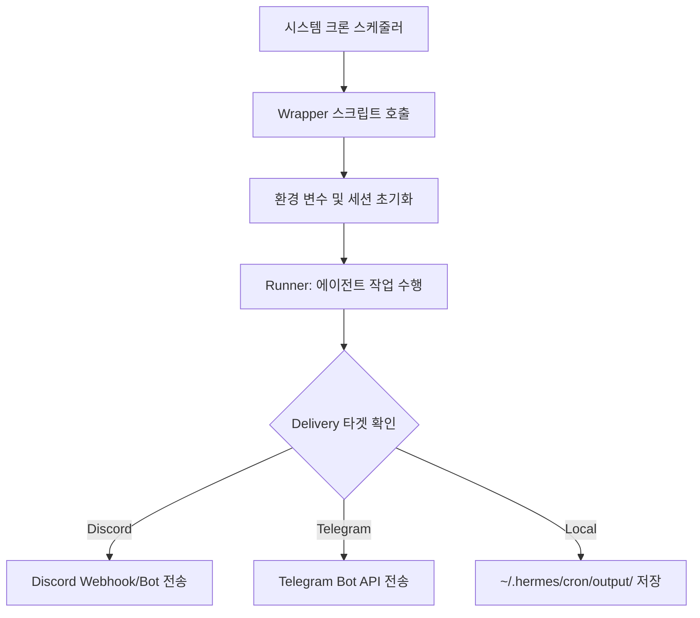

# 자동화(Cron) 설정 가이드

💡 **사용자의 개입 없이도 에이전트가 정해진 시간에 스스로 깨어나 작업을 수행하는 '자율 동작' 시스템을 설정하는 방법입니다.**

## 🌱 기본 개념
우리는 매일 아침 날씨를 확인하거나, 매주 월요일에 보고서를 쓰는 등 반복적인 루틴을 가지고 있습니다. AI 에이전트 역시 이런 **'디지털 루틴'**을 가질 수 있습니다.

비유하자면, p-hermes의 크론(Cron) 시스템은 에이전트에게 **'정밀한 알람 시계'와 '상세한 할 일 목록'**을 주는 것과 같습니다. 사용자가 일일이 \"지금 뉴스 가져와\"라고 말하지 않아도, 에이전트는 설정된 알람이 울리면 목록에서 할 일을 확인하고, 독립적인 세션을 생성하여 작업을 완수한 뒤, 결과만 사용자에게 보고합니다.

## 🔍 문제 상황: 왜 단순한 스크립트 실행보다 크론 시스템이 필요한가?
리눅스의 기본 `crontab`에 쉘 스크립트를 직접 등록하는 방식은 에이전트 환경에서 다음과 같은 치명적인 한계가 있습니다:

- **환경 변수 유실 (Environment Loss)**: 크론탭 실행 환경은 매우 제한적입니다. `.bashrc`나 `.env` 등의 설정이 로드되지 않아 API 키, 라이브러리 경로 설정 오류가 빈번하게 발생합니다.
- **세션 및 컨텍스트 관리 불가 (Context Blindness)**: 단순 스크립트는 실행 후 종료됩니다. 이 작업이 어떤 JOB ID로 기록되었는지, 어떤 대화 맥락에서 수행되었는지 추적하기 어려워 사후 분석이 불가능합니다.
- **유연성 및 관리 효율 저하 (Rigidity)**: 실행 시간이나 프롬프트를 바꾸려면 매번 서버에 SSH로 접속해 크론탭 파일을 직접 수정해야 하며, 이는 실수로 인한 시스템 설정 오류를 유발합니다.

p-hermes는 **'Registry → Wrapper → Runner'**라는 3계층 구조를 통해 이러한 문제를 해결하고, 사용자가 채팅만으로 자동화 설정을 자유롭게 변경할 수 있게 합니다.

## 🏗️ 기술 설계: 크론 시스템의 3계층 아키텍처
신뢰성 있는 자동화를 위해 Hermes는 실행 과정을 세 단계로 엄격히 분리하여 관리합니다.

### 1. Registry (`registry.yaml`) - "무엇을, 언제, 어디로?"
모든 자동화 작업의 SSOT(Single Source of Truth)입니다. 어떤 프롬프트를 사용하여 에이전트를 깨울지, 실행 주기(Cron expression)는 어떻게 되는지, 결과물은 어떤 플랫폼으로 전송할지가 정의됩니다.
- **예**: `schedule: "0 9 * * 1"` → 매주 월요일 오전 9시 정각 실행.
- **장점**: YAML 파일 하나만 수정하면 시스템 재부팅 없이도 자동화 스케줄을 변경할 수 있습니다.

### 2. Wrapper - "환경 및 세션 복원"
크론 스케줄러에 의해 호출되는 진입점(Entry-point) 스크립트입니다.
- **환경 복원**: `.env` 파일을 로드하고, 에이전트 구동에 필요한 모든 쉘 환경 변수를 완벽하게 구성합니다.
- **독립 세션 생성**: 해당 작업만을 위한 임시 세션(`session_id`)을 생성합니다. 이를 통해 자동화 작업의 로그가 일반 대화 로그와 섞이지 않도록 격리하며, 개별 작업의 성공/실패 여부를 정확히 추적할 수 있습니다.

### 3. Runner - "실제 지능형 수행"
실제 에이전트의 추론 로직이 작동하는 단계입니다.
- **프롬프트 실행**: Registry에 정의된 전용 프롬프트를 바탕으로 에이전트가 작업을 수행합니다. 이때 필요하다면 앞서 설명한 '스킬'이나 '지식 시스템'을 동적으로 로드합니다.
- **전달(Delivery)**: 작업이 완료되면 설정된 타겟(Discord, Telegram, Local file 등)의 API를 통해 결과물을 전송합니다.

## 📊 크론 작업 처리 흐름도

## 💡 활용 예시: 실전 자동화 시나리오
채팅창에 다음과 같이 요청하여 즉시 자동화 체계를 구축해 보세요.

**시나리오 A: 매일 아침 기술 트렌드 요약**
> \"[TASK] 매일 오전 8시에 AI 관련 최신 뉴스 5개를 수집해서 요약한 뒤, 내 디스코드 채널(`discord:123456789`)로 보내주는 크론을 만들어줘.\"

**시나리오 B: 시스템 상태 정기 점검**
> \"매주 일요일 밤 11시에 현재 `~/.hermes/` 내의 디스크 사용량과 API 잔액을 체크해서 보고해줘. 결과는 텔레그램으로 보내줘.\"

**시나리오 C: 지식 시스템 자동 정제**
> \"5분마다 `wiki-process-filings.sh`를 실행해서 `inbox`에 쌓인 지식들을 자동으로 분류하고 위키를 업데이트해줘.\"

## 🔗 관련 주제
- **[지식 시스템 검색 및 활용](https://pheanor-agent.github.io/p-hermes/docs/wiki/guides/knowledge-search.md)**: 지식 정제 프로세스는 크론에 의해 자동화되어 시스템의 기억을 항상 최신으로 유지합니다.
- **[백업 및 복구 가이드](https://pheanor-agent.github.io/p-hermes/docs/wiki/guides/backup-restore.md)**: 주기적인 시스템 전체 스냅샷 백업 또한 크론 시스템의 가장 중요한 활용 사례입니다.
