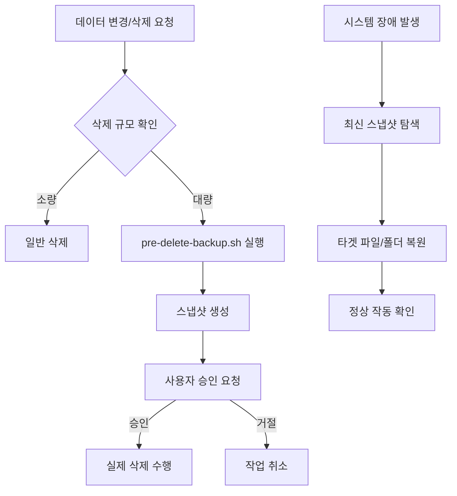

# 백업 및 복구 가이드

💡 **시스템 오류, 실수로 인한 삭제, 환경 이전 등 예상치 못한 데이터 손실로부터 소중한 설정과 지식을 보호하는 전략을 설명합니다.**

## 🌱 기본 개념
시간이 흐를수록 Hermes의 설정 파일, 작업 산출물, 그리고 학습된 지식 베이스는 거대한 자산이 됩니다. 이 데이터들을 보호하는 것은 단순히 파일을 복사하는 것이 아니라, **'시스템의 상태를 특정 시점으로 완벽하게 되돌릴 수 있는 능력(Restore Point)'**을 확보하는 것입니다.

비유하자면, 고난도 게임을 하다가 중요한 분기점 앞에서 **'세이브 파일'**을 만드는 것과 같습니다. 매우 위험한 작업(예: 핵심 코어 로직 수정)에 도전하기 전이나, 대규모 환경 설정 변경을 하기 전에 세이브를 해두면, 실패하더라도 언제든 가장 안전했던 상태로 즉시 돌아가 다시 시작할 수 있습니다.

## 🔍 문제 상황: 왜 단순한 클라우드 동기화로는 부족한가?
Dropbox나 Google Drive 같은 단순 실시간 동기화 방식은 다음과 같은 치명적인 위험이 있습니다:

- **오류의 즉시 전파 (Instant Propagation of Error)**: 설정 파일을 잘못 수정하여 시스템이 부팅되지 않는 상태가 되었을 때, 동기화 서비스는 그 '망가진 상태'를 즉시 모든 백업 기기에 복제합니다. 즉, 백업본조차 망가지게 됩니다.
- **의존성 파괴 (Dependency Breakage)**: `config.yaml`은 백업되었지만, 그 설정이 가리키는 `core/skills/` 내의 특정 실행 스크립트가 삭제된 경우, 설정 파일만으로는 시스템의 기능을 복구할 수 없습니다.
- **버전 관리 부재 (Lack of Versioning)**: \"어제까지는 완벽하게 작동했는데, 오늘 갑자기 왜 안 되지?\"라는 상황에서, 어제의 상태로 정확히 되돌릴 수 있는 타임스탬프 기반의 복구 지점이 없습니다.

p-hermes는 **'스냅샷 기반 백업'**과 **'삭제 전 강제 백업'**이라는 이중 안전장치를 통해 이러한 리스크를 해결합니다.

## 🏗️ 기술 설계: p-hermes의 백업 전략
데이터의 중요도와 변경 빈도에 따라 백업 방식을 다르게 적용하는 계층적 전략을 사용합니다.

### 1. 백업 대상 및 계층 (Backup Hierarchy)
- **L1: 핵심 설정 (Critical)**: `config.yaml`, `AGENTS.md`, `specs/`. 시스템의 뼈대이며, 가장 빈번하게 스냅샷을 찍습니다.
- **L2: 지식 및 산출물 (Important)**: `knowledge/wiki/`, `workspace/jobs/`. 데이터 양은 많지만 개별 파일 단위의 정밀한 복구가 중요합니다.
- **L3: 런타임 데이터 (Ephemeral)**: 로그 파일, 임시 캐시, `.pyc` 파일. 백업 대상에서 제외하여 저장 공간 효율을 높이고 백업 속도를 최적화합니다.

### 2. 스냅샷 메커니즘 (Snapshotting)
`~/.hermes/backups/snapshots/` 폴더에 `YYYYMMDD_HHMM_system_backup.tar.gz` 형태로 저장됩니다.
- **원자적 백업 (Atomic Backup)**: 백업 도중 파일이 수정되어 데이터가 깨지는 것을 막기 위해, 먼저 임시 폴더에 모든 대상 파일을 복사한 후 한 번에 압축합니다.
- **자동 스케줄링**: 크론(Cron) 시스템과 연동되어 매일 새벽, 시스템 전체 상태를 자동으로 저장하여 사용자가 신경 쓰지 않아도 최소 24시간 전 상태로 복구가 가능하게 합니다.

### 3. 삭제 전 안전장치 (Pre-deletion Guard)
Hermes는 대량의 파일을 삭제하기 전, 다음과 같은 엄격한 방어 프로세스를 거칩니다:
1. **심링크 검사**: `check-symlink.sh`를 통해 삭제 대상이 다른 시스템(예: OpenClaw)과 공유되는 링크인지 확인하여, 엉뚱한 곳의 원본 데이터까지 연쇄 삭제되는 것을 방지합니다.
2. **강제 스냅샷**: 10개 이상의 파일이나 폴더를 삭제할 경우, `pre-delete-backup.sh`가 자동으로 실행되어 삭제 직전의 상태를 별도의 '사전 백업' 파일로 저장합니다.
3. **명시적 승인**: 사용자에게 \"X개의 파일이 삭제됩니다. 정말 진행하시겠습니까?\"라고 묻고 명시적인 승인을 받아야만 실제 `rm` 명령어를 수행합니다.

## 📊 백업 및 복구 흐름도

## 💡 활용 예시: 실전 복구 시나리오
데이터를 잃어버렸을 때 당황하지 말고 에이전트에게 다음과 같이 요청하세요.

**시나리오 A: 설정 파일 오작동**
> \"방금 `config.yaml`을 수정했는데 시스템이 안 켜져. 어제 오후 6시쯤의 설정 파일 백업본을 찾아서 복구해줘.\"

**시나리오 B: 작업 산출물 실수 삭제**
> \"JOB-1050 폴더를 실수로 지웠어. `backups/jobs/`에 저장된 최신 복사본이 있는지 확인하고 되살려줘.\"

**시나리오 C: 환경 이전 (Migration)**
> \"새로운 서버로 옮기려고 해. 내 모든 설정, 스킬, 위키가 포함된 전체 스냅샷 파일을 생성해서 `/mnt/c/Users/Desktop/`으로 복사해줘.\"

## 🔗 관련 주제
- **[자동화(Cron) 설정 가이드](https://pheanor-agent.github.io/p-hermes/docs/wiki/guides/automation.md)**: 자동 백업 스케줄을 설정하여 데이터 유실 리스크를 최소화하는 방법.
- **[지식 시스템 검색 및 활용](https://pheanor-agent.github.io/p-hermes/docs/wiki/guides/knowledge-search.md)**: 복구된 지식 데이터가 어떻게 다시 위키 파이프라인을 통해 정제되는지 확인하세요.
