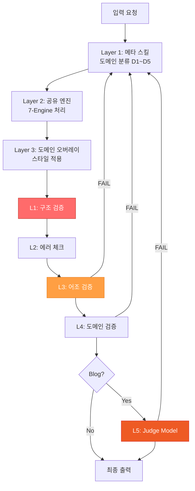
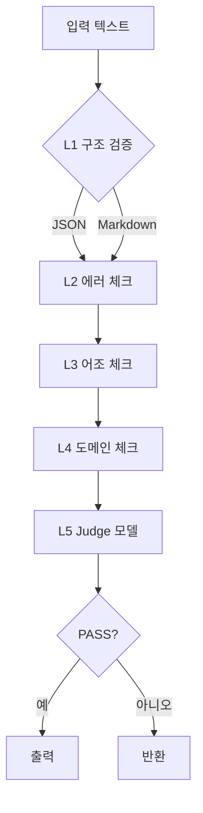
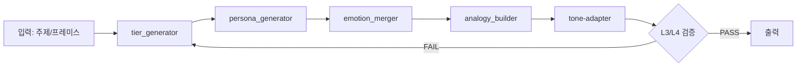
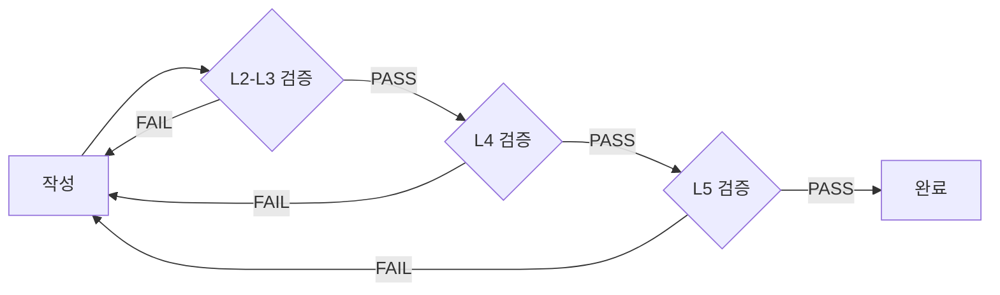

# Content System (콘텐츠 시스템)

💡 **콘텐츠의 품질을 검증하고 자동으로 생성하는 파이프라인입니다. 텍스트를 입력하면 검증을 통과한 고품질 콘텐츠를 출력합니다.**

## 한 줄 요약

L1~L5 5계층 검증 게이트를 통과한 고품질 AI 콘텐츠를 도메인별 엔진이 자동 생성하고 검증하는 파이프라인입니다.

## 기본 개념

Content System은 AI 생성 텍스트의 품질을 보장하기 위해 5계층 검증 게이트(L1 구조 → L2 에러 → L3 어조 → L4 도메인 → L5 Judge)를 통과하는 자동 파이프라인입니다. Anti-Slop 라이브러리가 AI-isms(금지 어휘, 전환어구 중복, 부정-대조 패턴)를 차단하고, 도메인별 검증이 기술·교육·비즈니스·창작 각각의 전문성을 확인합니다. 6개의 생성 엔진(tier_generator, persona_generator, emotion_merger, analogy_builder, template_filler, tone-adapter)이 도메인별 콘텐츠를 생성합니다.

## 문제 상황

AI 모델이 생성하는 텍스트에는 문법적으로 정확하지만 구조적 결함이 숨어 있는 경우가 많습니다. 과도한 수식어, 불필요한 전이 표현, 기계적 병렬 구조 등 AI-isms는 독자에게 인공적인 느낌을 전달합니다. 또한 동일한 AI 모델로 생성된 기술 문서와 교육 콘텐츠가 동일한 톤과 깊이로 작성되면, 독자가 원하는 정보 수준과 실제 제공 내용이 맞지 않습니다. 개별 모델을 수동으로 교정하는 접근은 확장성이 없고 일관성을 보장하지 못합니다.

## 기술 설계

콘텐츠 시스템은 3-Layer 아키텍처로 구성됩니다. Layer 1(메타 스킬)이 요청 진입점에서 도메인(D1~D5) 분류를 수행하고, Layer 2(공유 엔진)가 7가지 엔진(tier_generator, tone_adapter, analogy_builder 등)으로 콘텐츠의 구조와 톤을 결정하며, Layer 3(도메인 오버레이)가 스타일 매트릭스를 적용하여 최종 결과물을 렌더링합니다. 검증 파이프라인은 L1(Struct) → L2(Error) → L3(Voice) → L4(Domain) → L5(Judge) 순으로 동작하며, 각 계층은 독립적으로 통과해야 다음 계층으로 전달됩니다.

## 구조/흐름도



## 활용 예시

### 기술 문서 검증 (D1)
```bash
python3 validator.py l4 "Python 3.11 사용" D1
# 결과: PASS (코드 블록 존재, 버전 명시)
```

### 교육 문서 검증 (D2)
```bash
python3 validator.py l4 "1단계: 설치 → 2단계: 설정 → 3단계: 실행" D2
# 결과: PASS (예시 3개, 단계별 안내)
```

### Blog 포스트 생성 파이프라인
`content: true` 플래그를 포함한 JOB은 `workflow-gate.sh`가 `content-gate.sh`를 자동 호출하고, 도메인별 엔진 조합을 적용한 후 L1~L5 검증을 통과합니다.

## 🎯 핵심 개념

Content System은 5계층 검증 게이트를 통해 콘텐츠 품질을 보장합니다. Anti-Slop 라이브러리가 금지 어휘를 차단하고, 도메인별 검증이 전문성을 확인합니다.

### 핵심 원칙 3가지
1. **검증 게이트**: L1(구조) → L2(에러) → L3(어조) → L4(도메인) → L5(Judge)
2. **Anti-Slop**: AI 생성 콘텐츠의 흔적을 제거
3. **도메인별 검증**: 기술, 교육, 비즈니스에 맞춰 검증

## 🚀 빠른 시작

### 1. 단일 텍스트 검증

```bash
# L2-L5 검증 (L1은 JSON 전용)
python3 validator.py l2 "검증할 텍스트"
python3 validator.py l3 "검증할 텍스트"
python3 validator.py l4 "검증할 텍스트" D1
python3 validator.py l5 "검증할 텍스트"
```

### 2. 디렉토리 전체 검증

```bash
python3 validator.py run_all docs/
```

## ⚙️ 검증 게이트 5단계

각 레이어가 특정 품질 기준을 검증합니다.

### L1: Structured Output (구조 검증)
JSON 형식 텍스트의 유효성을 확인합니다. API 응답, 설정 파일 등에 적용됩니다.

```python
# JSON Schema 검증
validate_l1_schema(text, schema)
```

**검증 항목**
- JSON 유효성
- Schema 준수
- 필드 타입 확인

### L2: Error Strings (에러 토큰 차단)
렌더링 실패 토큰, 보일러플레이트 문장을 차단합니다.

```python
# Denylist 기반 검증
validate_l2_error_strings(text)
```

**차단 토큰**
- `[RENDER_FAILED]`
- `[PLACEHOLDER]`
- `[UNDEFINED]`

### L3: Voice & Constraint (어조 검증)
금지 어휘, 전환어구 중복을 차단합니다.

```python
# 어조 검증
validate_l3_voice_constraint(text)
```

**검증 기준**
- 금지 어휘 존재
- 전환어구 중복 (또한, 그러나, 따라서)
- 문체 일관성

### L4: Domain Gates (도메인 검증)
도메인별 기계적 검증을 수행합니다.

```python
# 도메인별 검증
validate_l4_domain_gates(text, domain)
```

**도메인별 검증 항목**
- **D1 (기술)**: 코드 블록, 버전 명시
- **D2 (교육)**: 예시 3개 이상, 단계별 안내
- **D3 (비즈니스)**: ROI, 투자 회수 기간
- **D4 (창작)**: 감정어, 문체 일관성

### L5: Judge Model (LLM 평가)
경량 LLM을 통해 어조와 뉘앙스를 평가합니다.

```python
# Judge 모델 평가
validate_l5_judge_model(text)
```

**평가 항목**
- 어조 일관성
- 전문성
- 가독성
- 자연스러움

## 🔍 Anti-Slop Library

AI 생성 콘텐츠의 흔적을 제거합니다.

```json
{
  "forbidden_phrases": [
    "마치 ~하는 것처럼",
    "이는 ~임을 의미합니다",
    "중요한 점은"
  ],
  "transition_words_limit": {
    "또한": 3,
    "그러나": 2,
    "따라서": 2
  }
}
```

**사용 예시**

```bash
# 금지 어휘 확인
python3 validator.py l3 "마치 ~하는 것처럼"
# 결과: FAIL (forbidden phrase)
```

## 📐 파이프라인 아키텍처

### 검증 파이프라인



### 생성 엔진

콘텐츠 시스템은 6개의 생성 엔진을 통해 도메인별 콘텐츠를 생성합니다.

| 엔진 | 역할 | 적용 도메인 |
|------|------|-------------|
| `persona_generator` | 페르소나 기반 문체 생성 | D4 창작 |
| `emotion_merger` | 감정어 합성 및 문장 흐름 조절 | D4 창작 |
| `analogy_builder` | 비유 생성 및 유사성 매핑 | D2 교육, D4 창작 |
| `tier_generator` | 계층적 구조 생성 (요약→상세→심화) | D1~D5 전체 |
| `template_filler` | 템플릿 기반 콘텐츠 생성 | D3 프레젠테이션, D5 비즈니스 |
| `tone-adapter` | 톤 적응 및 문체 일관성 유지 | D1~D5 전체 |

### D4 창작 파이프라인

창작물(소설, 시나리오, 에세이) 생성 시 다음 엔진이 순차적으로 동작합니다.



**단계별 동작**

1. **tier_generator**: 주제에서 계층적 구조 (서론→본론→결론) 생성
2. **persona_generator**: 페르소나 기반 문체 적용 (캐릭터 성향, 시대 배경 반영)
3. **emotion_merger**: 감정어 합성 및 문장 흐름 조절
4. **analogy_builder**: 비유 생성으로 표현의 독창성 향상
5. **tone-adapter**: 전체 문체 일관성 유지
6. **검증 게이트**: L3(어조), L4(도메인) 검증 통과 시 최종 출력

## 📐 도메인별 검증 기준

| 도메인 | 검증 항목 | 예시 |
|--------|----------|------|
| D1 기술 | 코드 블록 존재, 버전 명시 | Python 3.11 |
| D2 교육 | 예시 3개 이상, 단계별 안내 | 1단계, 2단계 |
| D3 비즈니스 | ROI, 투자 회수 기간 | 6개월 |
| D4 창작 | 감정어 포함, 문체 일관성 | 시적 표현 |

**도메인별 상세 기준**

**D1: 기술 문서**
- 코드 블록 존재 (≥1)
- 버전 명시 (Python 3.11)
- 명령어 예시 포함

**D2: 교육 문서**
- 예시 3개 이상
- 단계별 안내 (1, 2, 3)
- 연습문제 포함

**D3: 비즈니스 문서**
- ROI 계산
- 투자 회수 기간
- 비교표 포함

**D4: 창작 문서**
- 감정어 포함
- 문체 일관성
- 독창성 평가

## 📐 실제 검증 예시

```bash
# 기술 문서 검증
python3 validator.py l4 "Python 3.11 사용" D1
# 결과: PASS (코드 블록 존재, 버전 명시)

# 교육 문서 검증
python3 validator.py l4 "1단계: 설치 → 2단계: 설정 → 3단계: 실행" D2
# 결과: PASS (예시 3개, 단계별 안내)

# 비즈니스 문서 검증
python3 validator.py l4 "ROI 200%, 6개월 투자 회수" D3
# 결과: PASS (ROI 명시, 투자 회수 기간)

# 창작 문서 검증
python3 validator.py l4 "감정어 포함된 시적 표현" D4
# 결과: PASS (감정어 포함, 문체 일관)
```

## 📐 Troubleshooting

| 증상 | 원인 | 해결 |
|------|------|------|
| L2 FAIL | 에러 토큰 존재 | anti-slop-library.json 확인 |
| L3 FAIL | 전환어구 중복 | 또한, 그러나 사용 횟수 확인 |
| L4 FAIL | 도메인 검증 실패 | 도메인별 기준 확인 |
| L5 FAIL | Judge 모델 실패 | 모델 응답 확인 |

**상세 해결 가이드**

**L2 FAIL 해결**
1. `anti-slop-library.json` 확인
2. 금지 토큰 검색
3. 토큰 제거 또는 대체

**L3 FAIL 해결**
1. 전환어구 사용 횟수 확인
2. "또한" 3회 → 2회로 줄임
3. 문체 일관성 확인

**L4 FAIL 해결**
1. 도메인별 검증 기준 확인
2. 누락 항목 추가
3. 도메인 재설정 (D1, D2, D3, D4)

**L5 FAIL 해결**
1. Judge 모델 응답 확인
2. 어조 일관성 점검
3. 전문성 보완

## 📐 Best Practices

| 패턴 | 용도 | 예시 |
|------|------|------|
| 사전 검증 | 작성 전 에러 방지 | L2-L5 미리 확인 |
| 순차 검증 | 레이어별 분리 검증 | L2 → L3 → L4 → L5 |
| 전체 검증 | 최종 확인 | run_all 사용 |

**검증 워크플로우**



## 📐 Validator 구조

```python
def run_all_validators(text, domain):
    """L1-L5 전체 검증"""
    results = []
    results.append(validate_l1_schema(text))
    results.append(validate_l2_error_strings(text))
    results.append(validate_l3_voice_constraint(text))
    results.append(validate_l4_domain_gates(text, domain))
    results.append(validate_l5_judge_model(text))
    return all(r['passed'] for r in results)
```

**사용 예시**

```python
# 전체 검증
result = run_all_validators("텍스트", "D1")
print(f"검증 결과: {result}")
```

## 📚 관련 문서
- [Content System 설계](../../blog/posts/content-system-design.md)
- [Expression System (GitHub)](https://github.com/pheanor-agent/p-hermes/tree/main/skills/custom/content-system/) — 소스 코드
