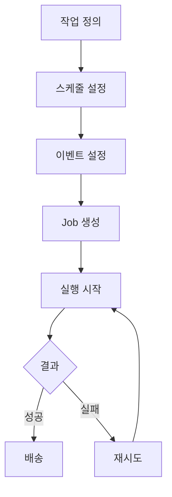
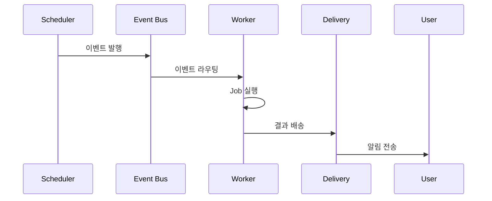
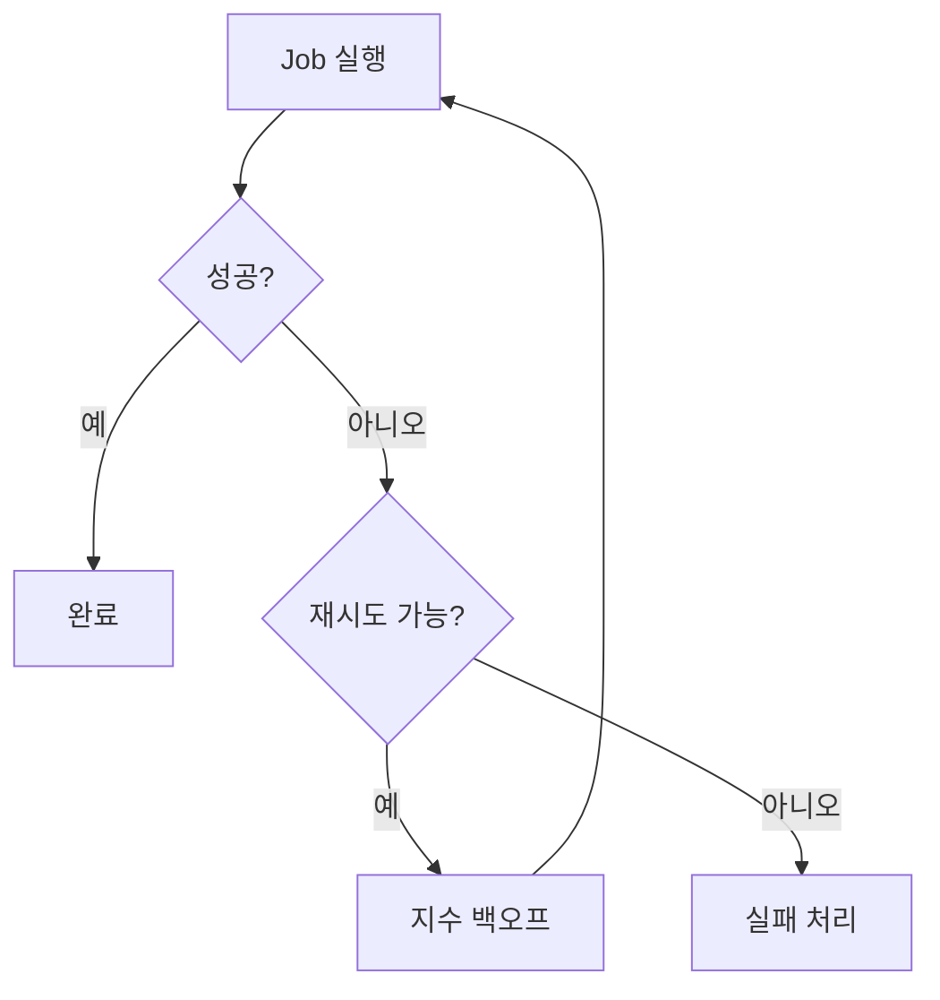
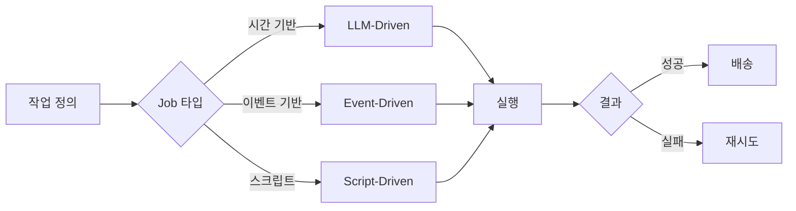

# 스케줄러 및 자동화 (Cron System)

💡 **반복 작업을 정의하고 실행하는 시스템입니다. 단순 시간 기반 스케줄링부터 이벤트 기반 트리거까지, 자동화의 진입점입니다.**

## 🎯 핵심 개념

Cron System은 반복 작업을 정의하고 자동으로 실행하는 시스템입니다. 시간 기반 스케줄링, 이벤트 기반 트리거, 주기적 리포트 생성 등 다양한 자동화 패턴을 지원합니다.

### 핵심 패턴 3가지
1. **시간 기반**: 고정 시간 간격으로 실행 (매일 9시, 30분 간격)
2. **이벤트 기반**: 특정 조건 충족 시 실행 (GitHub PR 생성 시)
3. **하이브리드**: 시간 + 이벤트 조합

## 🚀 빠른 시작

### 1. 첫 번째 Cron Job

```bash
hermes cron create \
  --name "daily-briefing" \
  --prompt "오늘의 주요 작업 확인" \
  --schedule "0 9 * * *" \
  --deliver telegram
```

### 2. 이벤트 기반 자동화

```bash
hermes cron create \
  --name "pr-review" \
  --prompt "PR 코드 리뷰 수행" \
  --trigger "github.pr.created" \
  --deliver discord
```

## ⚙️ 스크립트 기반 Job

스킬이나 스크립트를 연결해 반복 작업을 자동화합니다.

```bash
hermes cron create \
  --name "wiki-sync" \
  --script "scripts/wiki-sync.sh" \
  --schedule "every 5m"
```

## 📐 이벤트 버스

이벤트 기반 자동화를 위한 진입점입니다.

```bash
# 이벤트 발생
event.sh publish system.job.completed "{job_id: 'JOB-1234'}"

# 이벤트 수신
event.sh subscribe system.job.completed

# 이벤트 히스토리
event.sh history system.*
```

**이벤트 스키마**

```json
{
  "event_id": "evt-1234",
  "type": "system.job.completed",
  "payload": {
    "job_id": "JOB-1234",
    "status": "completed",
    "result": "success"
  },
  "timestamp": "2026-06-17T09:00:00Z"
}
```

## 🔍 검증 워크플로우



## 📐 이벤트 버스 아키텍처



## 📐 Cron Registry

모든 Job 정보를 관리합니다.

```yaml
jobs:
  - id: JOB-1234
    name: daily-briefing
    schedule: "0 9 * * *"
    delivery: telegram
    status: active
  - id: JOB-1235
    name: wiki-sync
    schedule: "every 5m"
    script: scripts/wiki-sync.sh
    status: active
```

**Registry 관리**

| 작업 | 명령어 |
|------|--------|
| 조회 | `hermes cron list` |
| 추가 | `hermes cron create` |
| 수정 | `hermes cron update` |
| 삭제 | `hermes cron delete` |

## 📐 Delivery 패턴

결과를 사용자에게 배송합니다.

```yaml
delivery:
  - telegram  # 기본
  - discord   # 대안
  - local     # 파일 저장
```

**Delivery 채널**

| 채널 | 용도 |
|------|------|
| telegram | 모바일 알림 |
| discord | 팀 협업 |
| local | 파일 저장 |

**Delivery 우선순위**

1. **telegram**: 기본 알림
2. **discord**: 팀 공유
3. **local**: 파일 보관

## 📐 재시도 정책

실패한 Job은 자동으로 재시도됩니다.

```yaml
retry:
  max_attempts: 3
  backoff: exponential
  delay: 1s  # 1s → 2s → 4s
```

**재시도 흐름**



## 📐 Job 타입

### 1. LLM-Driven Job

LLM이 Prompt를 실행합니다.

```bash
hermes cron create \
  --name "daily-report" \
  --prompt "오늘의 작업 현황 리포트 작성" \
  --schedule "0 9 * * *"
```

**특징**
- 자연어 지시
- 유연성
- LLM Model 선택

### 2. Script-Driven Job

스크립트를 실행합니다.

```bash
hermes cron create \
  --name "wiki-sync" \
  --script "scripts/wiki-sync.sh" \
  --schedule "every 5m"
```

**특징**
- 스크립트 기반
- 성능
- 확장성

### 3. Event-Driven Job

이벤트 발생 시 실행됩니다.

```bash
hermes cron create \
  --name "pr-review" \
  --trigger "github.pr.created" \
  --prompt "PR 코드 리뷰 수행"
```

**특징**
- 이벤트 반응
- 실시간성
- Decoupling

## 📐 Troubleshooting

| 증상 | 원인 | 해결 |
|------|------|------|
| Job 실행 안됨 | 스케줄러 비활성화 | `hermes cron list` 확인 |
| 결과 미배송 | delivery 설정 누락 | `--deliver` 옵션 확인 |
| 이벤트 미수신 | subscribe 누락 | `event.sh subscribe` 실행 |
| 재시도 과다 | timeout 설정 | `--timeout` 옵션 확인 |

**상세 해결 가이드**

**Job 실행 안됨**
1. `hermes cron list` 확인
2. 스케줄러 상태 확인
3. Job 상태 확인

**결과 미배송**
1. `--deliver` 옵션 확인
2. Delivery 채널 상태
3. Job 설정 확인

**이벤트 미수신**
1. `event.sh subscribe` 실행
2. Listener 상태 확인
3. 이벤트 히스토리 확인

**재시도 과다**
1. `--timeout` 옵션 확인
2. 재시도 정책 점검
3. Job 설정 수정

## 📐 Best Practices

| 패턴 | 용도 | 예시 |
|------|------|------|
| 시간 기반 | 리포트, 백업 | "매일 9시 작업 현황 리포트" |
| 이벤트 기반 | 자동 응답, 알림 | "GitHub PR 생성 시 리뷰 요청" |
| 하이브리드 | 복합 자동화 | "매주 월요일 + 이벤트 발생 시" |

**자동화 워크플로우**



## 📐 실제 예시

```bash
# 매일 9시 작업 리포트
hermes cron create \
  --name "daily-report" \
  --prompt "오늘의 주요 작업 확인" \
  --schedule "0 9 * * *" \
  --deliver telegram

# 5분 간격 Wiki 동기화
hermes cron create \
  --name "wiki-sync" \
  --script "scripts/wiki-sync.sh" \
  --schedule "every 5m" \
  --no-agent true

# GitHub PR 이벤트 기반 리뷰
hermes cron create \
  --name "pr-review" \
  --prompt "PR 코드 리뷰 수행" \
  --trigger "github.pr.created" \
  --deliver discord
```

## 📚 관련 문서
- [Hermes Cron 아키텍처](../../blog/posts/cron-automation-design.md)
- [Workflow Pipeline](request-task.md)
