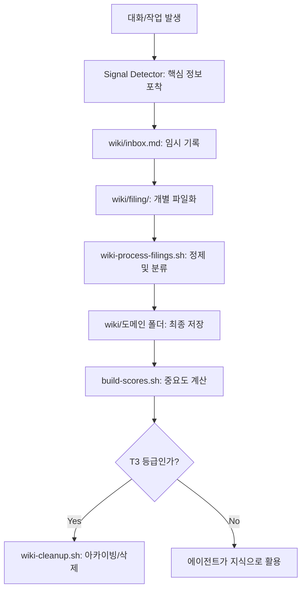

# 지식 시스템 가이드

💡 **p-hermes가 데이터를 수집, 정제, 분류하여 '살아있는 지식 베이스'로 만드는 전 과정의 아키텍처와 운영 원리를 설명합니다.**

## 🌱 기본 개념
단순히 문서를 저장하는 것과 '지식 시스템'을 운영하는 것은 다릅니다. 저장소(Repository)는 데이터를 보관하지만, 지식 시스템(Knowledge System)은 데이터를 **'의미 있는 정보'**로 가공하여 필요할 때 꺼내 쓸 수 있게 합니다.

비유하자면, `inbox`는 매일 쏟아지는 **'가공되지 않은 원석(Raw Data)'**들이 모이는 바구니이고, `wiki-process-filings.sh`는 이 원석을 깎고 다듬어 보석으로 만드는 **'세공사'**입니다. 이렇게 다듬어진 보석들이 도메인별로 전시된 곳이 바로 `wiki/` 폴더입니다. 이는 마치 도서관의 '반납함'에 책이 쌓이면, 사서가 내용을 확인하고 적절한 '분류 번호'를 붙여 서가에 배치하는 과정과 같습니다.

## 🔍 문제 상황: 왜 가공 파이프라인이 필요한가?
에이전트가 대화 내용을 그대로 위키에 저장하면 다음과 같은 문제가 발생합니다:

- **정보 밀도 저하 (Signal-to-Noise Ratio)**: \"네, 알겠습니다\", \"잠시만요\" 같은 대화체 노이즈가 섞여 정작 중요한 핵심 정보(결정 사항, 코드 조각)를 찾는 데 시간이 오래 걸림. 이는 마치 100페이지의 대화록에서 단 한 줄의 설정값을 찾는 것과 같습니다.
- **지식 중복 (Redundancy)**: 동일한 주제에 대해 여러 세션에서 논의했을 때, 똑같은 내용의 페이지가 여러 개 생성되어 어떤 것이 최신 버전인지 알 수 없음. 이는 '정보의 파편화'를 야기합니다.
- **탐색 비용 증가 (Retrieval Cost)**: 파일이 수천 개로 늘어나면 에이전트가 어떤 파일을 읽어야 할지 판단하는 데 너무 많은 토큰을 소모하게 됨. 이는 에이전트의 응답 속도를 늦추고 정확도를 떨어뜨리는 원인이 됩니다.

이를 해결하기 위해 p-hermes는 **'신호 감지 → 임시 저장 → 정제 → 분류'**라는 엄격한 파이프라인을 적용합니다.

## 🏗️ 기술 설계: 지식 관리 아키텍처
지식 시스템은 데이터의 성격과 성숙도에 따라 3개의 핵심 영역으로 나뉩니다.

### 1. 수집 영역 (The Ingestion Layer / Raw Zone)
- **Signal Detector**: 대화 중 URL, 기술적 결정, 에러 해결 방법 등 '지식화 가능성'이 높은 정보를 실시간으로 감지하여 `wiki/inbox.md`에 기록합니다.
- **Filing**: `inbox`에 쌓인 데이터는 주기적으로 `wiki/filing/` 폴더의 개별 파일로 분리되어 대기합니다. 이 단계에서는 아직 가공되지 않은 '초안' 상태입니다.

### 2. 정제 및 분류 영역 (The Processing Layer / Refining Zone)
- **`wiki-process-filings.sh`**: `filing/`에 있는 파일들을 분석하여 기존 위키 내용과 병합하거나, 새로운 도메인 폴더(`system/`, `dev/`, `architecture/` 등)로 분류하여 이동시킵니다. 단순 저장이 아닌 '의미 기반 분류'를 수행합니다.
- **`build-scores.sh`**: 각 지식 페이지의 참조 횟수와 최신성을 계산하여 T1, T2, T3 등급을 부여합니다. 이는 지식의 '가치'를 정량적으로 평가하는 시스템입니다.
    - **T1 (Hot)**: 매우 자주 참조되는 핵심 지식 (예: 프로젝트 핵심 명세) → 최상단 인덱스에 배치.
    - **T2 (Warm)**: 간혹 참조되는 지식 (예: 특정 라이브러리 사용법).
    - **T3 (Cold)**: 오랫동안 참조되지 않은 지식 → 정리 및 아카이빙 대상.

### 3. 서비스 영역 (The Delivery Layer / Gold Zone)
- **`index.md`**: 전체 지식의 지도로, 에이전트가 가장 먼저 읽는 진입점입니다. T1 등급의 지식들이 우선적으로 배치됩니다.
- **Domain Folders**: 도메인별로 격리된 지식 저장소로, 에이전트가 필요한 도메인의 문서를 선택적으로 로드하여 컨텍스트 윈도우를 최적화합니다.

## 📊 지식 생명주기 흐름도

## 💡 활용 예시: 지식 시스템의 효율적 운영
에이전트에게 지식 시스템의 관리를 요청하여 최상의 상태를 유지하세요.

**1. 지식 정제 요청:**
> \"지금 `inbox`에 쌓인 내용이 많은 것 같아. `wiki-process-filings.sh`를 실행해서 최신 지식들을 위키 도메인별로 분류하고 `index.md`를 갱신해줘.\"

**2. 불필요한 지식 정리:**
> \"최근에 사용하지 않는 T3 등급의 지식들이 너무 많아. `build-scores.sh`로 점수를 계산하고, 정말 필요 없는 오래된 문서들은 백업 후 삭제해서 위키를 슬림하게 만들어줘.\"

**3. 지식 연결 요청:**
> \"이번 JOB-2005에서 발견한 'API 타임아웃 해결 방법'을 `wiki/dev/` 폴더의 기존 네트워크 가이드 문서에 통합해서 업데이트해줘.\"

## 🔗 관련 문서
- **[지식 시스템 검색 및 활용](https://pheanor-agent.github.io/p-hermes/docs/wiki/guides/knowledge-search.md)**: 정제된 지식을 실제로 어떻게 검색하고 사용하는지에 대한 가이드.
- **[자동화(Cron) 설정 가이드](https://pheanor-agent.github.io/p-hermes/docs/wiki/guides/automation.md)**: 자동화 작업의 결과를 특정 디스코드 채널이나 텔레그램 그룹으로 전송하는 설정 방법.
