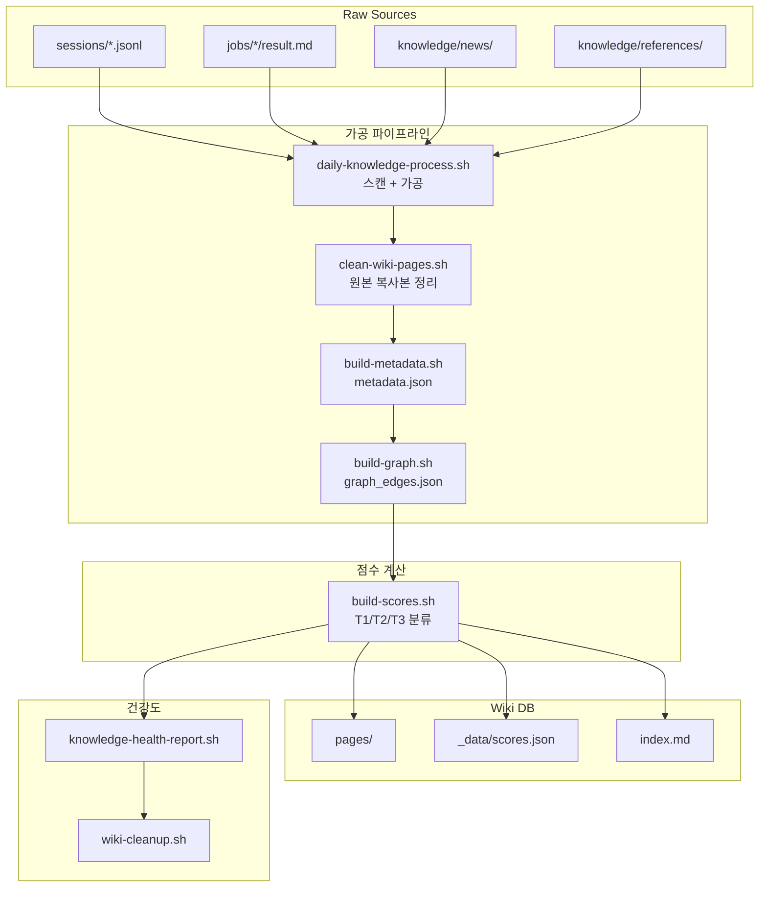
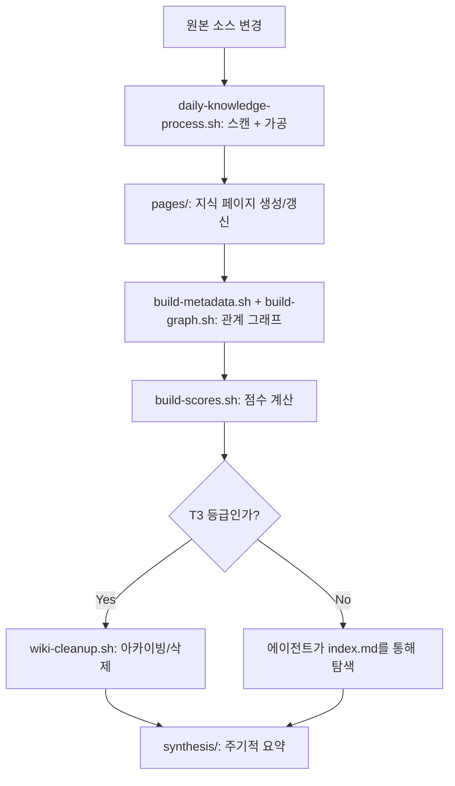

# 지식 시스템 사용 가이드

💡 **세션 이력, JOB 기록, 뉴스 피드 등 여러 원본을 수집·정제·점수화하여 에이전트가 효율적으로 탐색하는 '살아있는 지식 베이스'를 구축하고 운영하는 가이드입니다.**

## 한 줄 요약

Raw 원본을 LLM 파이프라인으로 정제하여 계층적 Wiki DB에 저장하고, 점수 체계로 중요도를 자동 평가하는 지식 관리 시스템입니다.

## 기본 개념

지식 시스템은 Karpathy의 3계층 구조(Raw Sources → Wiki → Schema)를 기반으로 합니다. 원본 데이터는 수정 없이 그대로 보관하고, 가공 파이프라인이 의미 있는 지식으로 변환하며, 점수 체계(T1 Core / T2 Working / T3 Reference)가 중요도를 자동 평가합니다. 에이전트는 `index.md` 카탈로그를 통해 T1 지식을 우선 참조하고, SQLite FTS5 기반 검색으로 정밀 탐색이 가능합니다.

## 문제 상황

방대한 대화 이력과 JOB 산출물, 뉴스 등을 가공 없이 에이전트에게 제공하면 두 가지 문제가 발생합니다. 컨텍스트 오버플로우로 핵심 지시사항이 뒤로 밀려나고, 추론 오염으로 과거의 잘못된 판단이나 노후화된 정보를 '사실'로 착각하여 현재 결정에 반영합니다. Raw Data에서 키워드 검색 시 관련 없는 노이즈가 너무 많아 정확한 결과를 찾지 못하는 문제도 있습니다.

## 기술 설계

지식 시스템은 다음 구성 요소로 구현됩니다. `daily-knowledge-process.sh`가 변경된 원본 파일을 스캔하여 wiki 페이지로 가공하고, `build-metadata.sh`와 `build-graph.sh`가 페이지 간 관계 그래프를 생성하며, `build-scores.sh`가 `score = pw × 0.5 + rs × 0.3 + us × 0.2` 공식으로 점수를 자동 계산합니다. `knowledge-health-report.sh`가 일일 건강도 리포트를 생성하고, `wiki-cleanup.sh`가 T3 지식을 아카이빙합니다. `sources-index.json`이 원본 소스 카탈로그를 관리합니다.

## 구조/흐름도



## 활용 예시

### 전체 파이프라인 수동 실행
```bash
bash ~/.hermes/knowledge/pipeline/daily-knowledge-process.sh
bash ~/.hermes/knowledge/pipeline/build-metadata.sh
bash ~/.hermes/knowledge/pipeline/build-graph.sh
bash ~/.hermes/knowledge/pipeline/build-scores.sh
```

### 점수 결과 확인
```bash
python3 -c "
import json
with open('~/.hermes/knowledge/processed/wiki/_data/scores.json') as f:
    data = json.load(f)
print(f'Total: {data[\"summary\"][\"total\"]}, T1 Core: {data[\"summary\"][\"core\"]}')"
```

## 서론

p-hermes의 지식 시스템은 Karpathy의 3계층 구조(Raw Sources → Wiki → Schema)를 기반으로 합니다. 원본 데이터는 수정 없이 그대로 보관하고, 가공 파이프라인이 의미 있는 지식으로 변환하며, 점수 체계가 중요도를 자동 평가합니다. 이 구조로 에이전트는 필요한 정보를 빠르게 탐색하고, 사용자는 지식의 질을 지속적으로 유지할 수 있습니다.

## 원본 소스

지식 시스템이 수집·가공하는 원본 소스는 화이트리스트 방식으로 정의됩니다. 명시된 소스만 가공 대상이며, 그 외의 파일은 지식 원본으로 인식되지 않습니다.

### 수집 대상

| 소스 | 위치 | 형식 |
|------|------|------|
| Hermes Sessions | `~/.hermes/sessions/` | JSONL |
| JOB 기록 | `~/.hermes/workspace/jobs/` | MD |
| 뉴스 | `~/.hermes/knowledge/news/` | MD |
| 리퍼런스 | `~/.hermes/knowledge/references/` | MD |

### 추가 기능 폴더 (JOB-1573, JOB-1575)

다음 폴더는 별도로 스캔하여 변경 이력을 추적합니다.

| 폴더 | 역할 |
|------|------|
| `~/.hermes/cron/` | 크론 시스템 스크립트 |
| `~/.hermes/scripts/*backup*` | 백업 스크립트 |
| `~/.hermes/hermes-agent/.hermes-local/` | Hermes 로컬 코드 변경점 |
| `~/.hermes/skills/` | 모든 스킬 변경점 (SKILL.md, catalog.json 등) |

### 소스 카운팅 규칙

`daily-knowledge-process.sh`는 변경된 원본 파일을 스캔하여 지식 페이지로 가공합니다. 각 소스별 스캔 패턴이 다르며, 원본 파일을 직접 참조하여 수치를 계산합니다.

```bash
# Hermes 세션 가공 대상 확인
ls ~/.hermes/sessions/*.jsonl | wc -l

# JOB 기록 가공 대상 확인
ls ~/.hermes/workspace/jobs/*/result.md | wc -l
```

## Wiki 트리 구조

가공된 지식은 `~/.hermes/knowledge/processed/wiki/`에 계층적으로 저장됩니다. 단일 페이지 폴더에 모든 지식을 보관하고, 도메인·태그 인덱스를 별도로 관리하여 탐색 경로를 최적화합니다.

### 디렉토리 구조

```
~/.hermes/knowledge/processed/wiki/
├── pages/              # 모든 지식 페이지 (단일 폴더)
├── _data/              # 메타데이터 (JSON 인덱스)
│   ├── metadata.json   # 페이지별 메타 정보
│   ├── graph_edges.json # 페이지 간 관계 그래프
│   ├── scores.json     # 점수화 결과
│   └── usage.json      # 사용량 트래킹
├── index.md            # LLM 카탈로그 (진입점)
├── domain-*.md         # 도메인별 탐색 인덱스
├── tag-*.md            # 태그별 탐색 인덱스
└── SCHEMA.md           # 규칙 정의
```

### 페이지 생성 조건

지식 페이지는 다음 조건 중 하나를 만족할 때 생성됩니다.

- 2개 이상의 소스에서 동일한 주제를 언급할 때
- 단일 핵심 개념이 새롭게 정의될 때
- 페이지가 200줄을 초과할 경우 하위 주제로 분할됨

### 프런트매터 스키마

모든 Wiki 페이지는 YAML 프런트매터를 포함합니다.

```yaml
---
title: 페이지 제목
created: YYYY-MM-DD
updated: YYYY-MM-DD
type: entity | concept | lesson | synthesis | source | report
tags: [tag1, tag2]
domain: agent | system | general | devops
priority: P0 | P1 | P2 | reference
---
```

## 점수 체계 (T1 / T2 / T3)

지식 시스템은 `build-scores.sh`를 통해 각 페이지의 중요도를 자동 계산하고, 3개 계층으로 분류합니다. 분류 결과는 `scores.json`에 저장되며, 에이전트는 이 정보를 기반으로 탐색 우선순위를 결정합니다.

### 계층별 기준

| Tier | 명칭 | 점수 범위 | 노출 전략 |
|------|------|-----------|-----------|
| **T1 Core** | 작업 필수 | ≥ 0.70 | 항상 노출 |
| **T2 Working** | 관련 지식 | 0.40 ~ 0.69 | 도메인 컨텍스트에 따라 |
| **T3 Reference** | 참고용 | < 0.40 | 명시적 요청 시만 |

### 점수 계산 공식

```
score = pw × 0.5 + rs × 0.3 + us × 0.2
```

| 변수 | 설명 | 계산 방식 |
|------|------|-----------|
| `pw` (priority weight) | 우선순위 가중치 | core=1.0, working=0.6, reference=0.2 |
| `rs` (recency score) | 최근성 점수 | 생성일 기반: 0일=1.0, 7일=0.8, 30일=0.5, 90일=0.3 |
| `us` (usage score) | 사용량 점수 | `usage.json` 기반 정규화 (`usage_count / max_usage`) |

### Core Immunity (JOB-1560)

`priority: core`로 지정된 지식은 `rs=1.0` 고정됩니다. 시간이 지나도 핵심적인 지식의 가치가 낮아지지 않도록 recency decay에서 제외됩니다. 효과: core 지식의 score는 0.80 ~ 1.00 범위에서 T1 진입이 보장됩니다.

```bash
# 점수 계산 실행
bash ~/.hermes/knowledge/pipeline/build-scores.sh

# 점수 결과 확인
python3 -c "
import json
with open('~/.hermes/knowledge/processed/wiki/_data/scores.json') as f:
    data = json.load(f)
print(f\"총 페이지: {data['summary']['total']}\")
print(f\"T1 Core: {data['summary']['core']}\")
print(f\"평균 점수: {data['summary']['avg_score']:.2f}\")
"
```

## 자동 갱신 파이프라인

지식 가공 파이프라인은 의존성 순서(`process → graph → priority → health`)로 순차 실행됩니다. Cron 스케줄에 따라 매일 자동 실행되며, 필요 시 수동으로도 호출할 수 있습니다.

### 파이프라인 단계

| 단계 | 스크립트 | 역할 |
|------|----------|------|
| process | `daily-knowledge-process.sh` | 변경된 원본 파일 스캔 → wiki entities/concepts |
| process | `clean-wiki-pages.sh` | pages/에서 원본 복사본 정리 |
| process | `process-job-outputs.py` | 완료 JOB → 구조화 요약 → entities |
| graph | `build-metadata.sh` → `build-graph.sh` | metadata.json + graph_edges.json 생성 |
| priority | `build-scores.sh` | scores.json + index.md 생성 |
| health | `knowledge-health-report.sh` | 일일 건강도 리포트 |

### Cron 스케줄

| 작업 | 스케줄 | 역할 |
|------|--------|------|
| 지식 가공 일일 파이프라인 | 03:00 | 원본 스캔 → wiki 가공 |
| 지식 그래프 동기화 | 03:30 | metadata + graph_edges |
| 지식 우선순위 계산 | 04:00 | scores + index |
| 지식 건강도 체크 | 04:30 | health report |
| 외부 데이터 수집 (fetch) | 06:00, 18:00 | IT 뉴스 등 |
| 지식 수집 | 06:15 | HN, GeekNews, AI Frontier |

### 수동 실행 방법

```bash
# 전체 파이프라인 순차 실행
bash ~/.hermes/knowledge/pipeline/daily-knowledge-process.sh
bash ~/.hermes/knowledge/pipeline/build-metadata.sh
bash ~/.hermes/knowledge/pipeline/build-graph.sh
bash ~/.hermes/knowledge/pipeline/build-scores.sh

# 건강도 리포트만 확인
bash ~/.hermes/knowledge/pipeline/knowledge-health-report.sh
```

## 무결성 규칙

지식 시스템은 다음 원칙을 준수하여 데이터의 신뢰성을 유지합니다.

- **원본 직접 참조**: 원본 파일은 복사·이동·symlink하지 않으며, `source:` 필드에 원본 경로를 직접 기록합니다.
- **LLM 추정 금지**: 지식 페이지는 원본 파일에서 직접 확인한 정보만 기록합니다. 추측 또는 요약 없이 원본을 정확히 참조합니다.
- **append-only 원본**: Raw Sources 계층의 파일은 수정·삭제하지 않습니다. 모든 변경은 Wiki 계층에서만 처리됩니다.

## 예외 처리

- **데이터 가지치기**: `clean-wiki-pages.sh`가 pages/ 폴더에 있는 원본 복사본을 정리합니다. 페이지 수 인플레이션 방지가 목적입니다.
- **T3 아카이빙**: 오랫동안 참조되지 않은 T3 지식은 `wiki-cleanup.sh`로 아카이빙 또는 삭제합니다.
- **소스 인덱스 재생성**: `sources-index-update.sh`를 실행하여 누락된 `sources/index.json`을 재생성합니다.

## FAQ

**Q: 새로운 지식 소스를 추가하려면 어떻게 하나요?**
`sources-index.json`에 소스 정보를 명시적으로 등록합니다. 형식: `{"name": "소스명", "title": "표제", "path": "경로", "type": "소stype", "ingested_at": "ISO8601"}`.

**Q: 특정 지식 페이지의 점수를 수동으로 조정할 수 있나요?**
페이지의 `priority` 필드를 변경하면 `build-scores.sh` 실행 시 점수가 자동 재계산됩니다. `core`로 승격하면 T1 진입이 보장됩니다.

**Q: 건강도 리포트에서 ❌ 표시가 나왔을 때 어떻게 해결하나요?**
`sources/index.json` 또는 `.usage.db`가 누락된 상태입니다. `sources-index-update.sh`를 실행하여 재생성하거나, 스크립트로 SQLite DB를 초기화합니다.

## 지식 생명주기 흐름도



## 관련 문서

- [자동화(Cron) 시스템 가이드](./automation.md) (Wiki) — 지식 가공 파이프라인이 크론 스케줄에 의해 자동화됩니다.
- [작업 요청 및 워크플로우 가이드](./request-task.md) (Wiki) — JOB 완료 시 지식 시스템으로의 동기화 과정을 확인합니다.

---

_마지막 업데이트: 2026-06-17_
