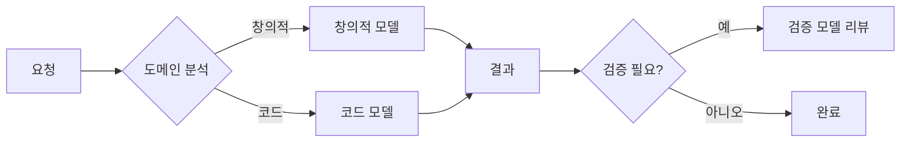
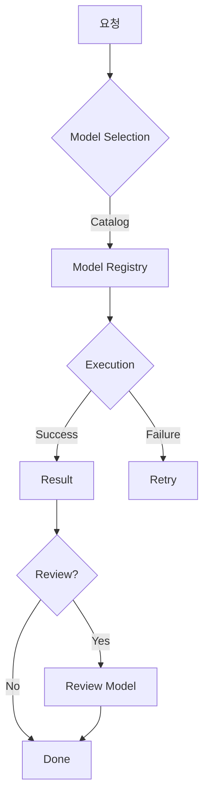
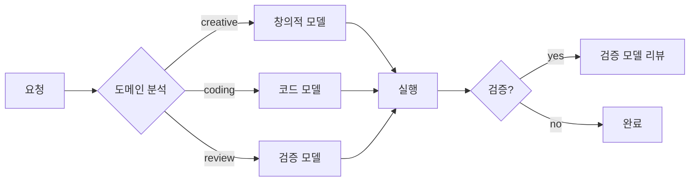

# 모델 라우팅 (Model Routing)

💡 **요청의 특성에 맞는 모델을 선택하고 실행하는 시스템입니다. 하나의 API로 다양한 모델을 유연하게 사용합니다.**

## 🎯 핵심 개념

Model Routing은 사용자의 요청을 분석하고 가장 적합한 모델을 선택하여 실행하는 시스템입니다. 생성 작업에는 창의적인 모델을, 논리 작업에는 추론에 특화된 모델을 선택합니다.

### 라우팅 기준 3가지

1. **도메인**: 창의적, 논리적, 코드, 리뷰
2. **역할**: 도메인별 최적화된 모델이 자동으로 선택됨
3. **교차검증**: 서로 다른 모델이 상호 검증

## 🚀 빠른 시작

### 1. 모델 설정 확인

```bash
hermes model list
```

### 2. 라우팅 규칙

| 도메인 | 기본 모델 | 용도 |
|--------|-----------|------|
| creative | 창의적 모델 | 이미지, 음악, 창작 |
| reasoning | 추론 모델 | 논리, 분석, 연구 |
| coding | 코드 모델 | 코드 작성, 디버깅 |
| review | 검증 모델 | 코드 리뷰, 검증 |

## ⚙️ 모델 카탈로그

모든 사용 가능한 모델 정보를 관리합니다.

```json
{
  "models": [
    {
      "name": "creative-model",
      "provider": "provider-a",
      "role": ["creative", "reasoning"],
      "capabilities": ["text", "vision"]
    },
    {
      "name": "code-model",
      "provider": "provider-b",
      "role": ["coding"],
      "capabilities": ["text", "code"]
    },
    {
      "name": "review-model",
      "provider": "provider-b",
      "role": ["review"],
      "capabilities": ["text"]
    }
  ]
}
```

**카탈로그 관리**

| 작업 | 명령어 |
|------|--------|
| 조회 | `hermes model list` |
| 추가 | `hermes model add` |
| 수정 | `hermes model update` |
| 삭제 | `hermes model delete` |

## 🔍 교차검증 워크플로우

서로 다른 모델이 상호 검증하는 패턴입니다.



**교차검증의 이점**
- **정확성**: 서로 다른 모델이 상호 검증
- **신뢰성**: 다중 검증으로 오차 감소
- **전문성**: 도메인별 최적 모델 활용

## 📐 모델 선택 가이드

| 시나리오 | 권장 모델 | 이유 |
|---------|-----------|------|
| 코드 생성 | 코드 모델 | 코드 이해력 우수 |
| 코드 리뷰 | 검증 모델 | 검증 정확도 높음 |
| 이미지 설명 | 창의적 모델 | 멀티모달 지원 |
| 논리 추론 | 추론 모델 | 추론 능력 우수 |

**도메인별 특성**

**창의적/추론 모델**
- 도메인: creative, reasoning
- 용도: 이미지, 음악, 논리, 분석
- 특징: 멀티모달 지원

**코드 모델**
- 도메인: coding
- 용도: 코드 작성, 디버깅
- 특징: 코드 이해력 우수

**검증 모델**
- 도메인: review
- 용도: 코드 리뷰, 검증
- 특징: 검증 정확도 높음

## 📐 실제 라우팅 예시

```bash
# 모델 명시적 호출
hermes run --model creative-model "이 코드 설명해줘"

# 자동 라우팅
hermes run "이 Python 코드 작성해줘"  # 코드 모델 선택
hermes run "이 디자인 검토해줘"  # 검증 모델 선택
```

**라우팅 결과**

| 요청 | 선택 모델 | 이유 |
|------|-----------|------|
| "이 Python 코드 작성해줘" | 코드 모델 | 코드 도메인 |
| "이 디자인 검토해줘" | 검증 모델 | 리뷰 도메인 |
| "이 이미지 설명해줘" | 창의적 모델 | 창의적 도메인 |

## 📐 Prefix 기반 라우팅

모델명을 prefix로 지정하면 특정 모델을 호출합니다.

```bash
# prefix로 모델 라우팅
hermes run "provider-a/creative-model: 이 이미지 설명해줘"
hermes run "provider-b/code-model: 코드 작성해줘"
```

**Prefix 규칙**
- `provider-a/`: Provider A 제공 모델
- `provider-b/`: Provider B 제공 모델
- `openrouter/`: OpenRouter 제공 모델

## 📐 Lifecycle 관리

모델의 생명주기를 관리합니다.

| 단계 | 설명 |
|------|------|
| catalog | 모델 등록 |
| routing | 요청 라우팅 |
| execution | 모델 실행 |
| review | 결과 검증 |

**Lifecycle 흐름**



## 📐 Cost Optimization

| 모델 유형 | 용도 | 비용 |
|------|------|------|
| 창의적/추론 모델 | 창의적/논리적 | varies |
| 코드 모델 | 코드 | varies |
| 검증 모델 | 리뷰 | varies |

**비용 최적화 전략**

1. **도메인별 모델 선택**: 최적 모델 활용
2. **교차검증**: 정확도 향상
3. **Cost Logging**: 사용량 추적

## 📐 Troubleshooting

| 증상 | 원인 | 해결 |
|------|------|------|
| 모델 선택 안됨 | 라우팅 규칙 누락 | catalog.json 확인 |
| 응답 지연 | 모델 과부하 | 대체 모델 사용 |
| 교차검증 실패 | 모델 불일치 | review 모델 확인 |
| 비용 초과 | quota 설정 | model-roles.yaml 확인 |

**상세 해결 가이드**

**모델 선택 안됨**
1. `catalog.json` 확인
2. 라우팅 규칙 검증
3. 모델 상태 확인

**응답 지연**
1. 모델 과부하 확인
2. 대체 모델 선택
3. timeout 설정

**교차검증 실패**
1. review 모델 확인
2. 모델 간 호환성
3. 검증 기준 점검

**비용 초과**
1. `model-roles.yaml` 확인
2. quota 설정
3. 사용량 모니터링

## 📐 Best Practices

| 패턴 | 용도 | 예시 |
|------|------|------|
| 명시적 호출 | 테스트, 디버깅 | `--model creative-model` |
| 자동 라우팅 | 생산 환경 | 도메인 기반 |
| 교차검증 | 중요 작업 | design + review |

**모델 라우팅 워크플로우**



## 📐 실제 검증 예시

```bash
# 모델 라우팅 테스트
hermes run "provider-a/creative-model: 이 요청 창의적 모델로 처리"
hermes run "provider-b/code-model: 코드 작성 요청"

# 교차검증 예시
hermes run "code-model: 코드 작성" → review-model: 코드 리뷰
```

**검증 결과**

| 테스트 | 모델 | 결과 |
|--------|------|------|
| 이미지 설명 | 창의적 모델 | ✅ PASS |
| 코드 작성 | 코드 모델 | ✅ PASS |
| 코드 리뷰 | 검증 모델 | ✅ PASS |

## 📚 관련 문서
- [Model Routing 설계](../../blog/posts/model-routing-design.md)
- [Catalog.json 스키마](../core/model-catalog/catalog.json)
