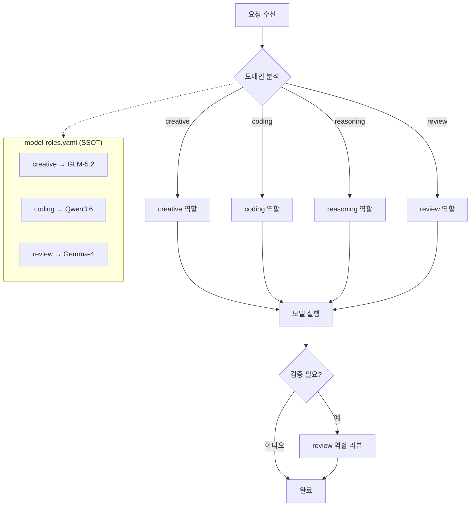
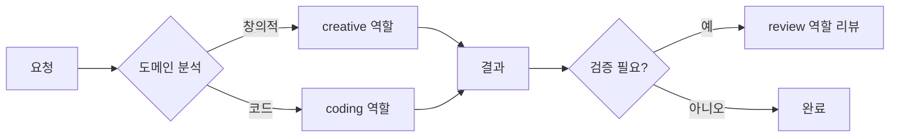
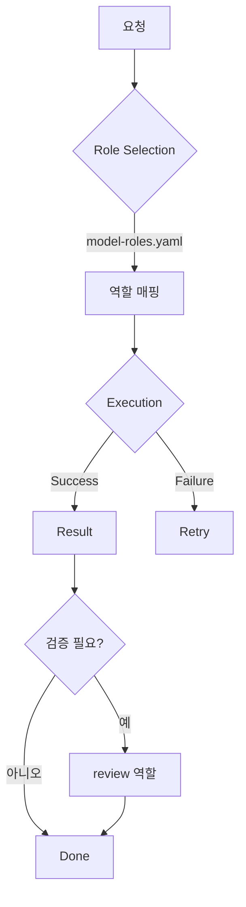

# 모델 라우팅 (Model Routing)

💡 **요청의 특성에 맞는 역할(role) 기반으로 최적의 모델을 자동 선택하여 실행하는 시스템입니다. 모델명을 직접 지정할 필요 없이 작업 성격만으로 라우팅됩니다.**

## 한 줄 요약

작업의 성격(설계, 실행, 조사, 검증)에 따라 최적의 LLM 역할을 자동 배정하여 비용을 낮추고 성능을 극대화하는 역할 기반 라우팅 시스템입니다.

## 기본 개념

모델 라우팅은 사용자의 요청을 분석하고 가장 적합한 모델 역할(role)을 선택하여 실행하는 시스템입니다. 생성 작업에는 creative 역할을, 논리 작업에는 reasoning 역할을 선택하는 도메인별 매핑이 핵심입니다. `config.yaml`에서 모델 제공자(provider)를 정의하고, `model-roles.yaml`(SSOT)에서 역할별 모델 매핑을 관리하며, 라우팅 엔진이 실행 시점에 최적의 역할을 선택합니다. 교차검증 패턴은 서로 다른 역할(예: design과 review)이 상호 검증하여 자기 확증 편향(Self-Confirmation Bias)을 차단합니다.

## 문제 상황

단일 모델로 모든 작업을 수행하면 세 가지 문제가 발생합니다. 첫째, 비용 폭주 — 단순 파일 복사나 로그 확인에도 가장 무거운 모델을 호출하여 API 비용이 기하급수적으로 증가합니다. 둘째, 성능 불일치 — 추론 능력이 뛰어난 모델이 오히려 단순 코드 작성에서 시간을 더 많이 소모하거나 오버엔지니어링을 초래합니다. 셋째, 자기 확증 편향 — 동일 모델이 설계와 검증을 모두 수행하면 자신의 논리적 오류를 감지하지 못합니다.

## 기술 설계

역할 기반 라우팅은 **3계층 구조**로 동작합니다.

### 1계층: config.yaml — 모델 제공자(Provider) 정의

```yaml
# ~/.hermes/config.yaml
model:
  provider: airouter  # 기본 제공자
```

### 2계층: model.provider — 세션별 제공자 오버라이드

```yaml
model:
  provider: airouter   # airouter, zai 중 선택
```

### 3계층: model-roles.yaml — 역할별 모델 매핑 (SSOT)

`core/skills/shared/model-roles.yaml`이 단일 진실 출처(SSOT)입니다. 각 역할에 실제 모델명이 매핑되며, 사용자는 역할 이름으로만 작업을 지시합니다.

```yaml
roles:
  default: airouter/Qwen3.6        # 기본 모델
  creative: zai/glm-5.2             # 설계/창의성
  reasoning: zai/glm-5.2           # 추론/교훈 추출
  coding: airouter/Qwen3.6         # 코드 생성
  review: airouter/Gemma-4         # 교차 검증
  fast: airouter/Qwen3.6           # 빠른 응답
```

핵심 설계 원칙은 Design 역할과 Review 역할을 **서로 다른 모델**로 설정하여 Cross-Check 구조를 만드는 것입니다. 서로 다른 학습 데이터셋을 가진 모델이 검증하면 설계 결함 발견율이 향상됩니다.

### workflow_models — 작업 단계별 역할 매핑

`model-roles.yaml`의 `workflow_models` 섹션은 작업 단계(step)별로 사용할 역할을 정의합니다.

```yaml
workflow_models:
  investigation: default
  design: creative        # creative 역할 사용
  review: review          # review 역할 사용 (design과 교차 검증)
  approval: default
  execution: coding
  test: reasoning
  execution_review: review
  done: reasoning
```

## 구조/흐름도



## 활용 예시

### 역할 기반 실행

```bash
# 역할을 직접 지정하여 실행
hermes run --role creative "이 디자인 검토해줘"

# 역할 생략 시 자동 라우팅
hermes run "이 Python 코드 작성해줘"  # coding 역할 자동 선택
hermes run "이 설계를 검증해줘"       # review 역할 자동 선택
```

### workflow_models 활용

작업 단계에 따라 역할이 자동 매핑됩니다.

| 작업 단계 | 매핑 역할 | 용도 |
|-----------|-----------|------|
| design | creative | 설계, 아키텍처 |
| execution | coding | 코드 작성 |
| review | review | 코드/설계 검증 |
| investigation | default | 조사, 탐색 |

## 🎯 핵심 개념

Model Routing은 사용자의 요청을 분석하고 작업 성격에 최적화된 역할을 자동 선택하여 실행하는 시스템입니다.

### 라우팅 기준 3가지

1. **도메인**: creative, coding, reasoning, review 등 작업 성격
2. **역할**: model-roles.yaml에 정의된 6개 역할(default/creative/coding/reasoning/fast/review)
3. **교차검증**: design=creative ↔ review=review 등 서로 다른 역할로 상호 검증

## 🚀 빠른 시작

### 1. 역할 설정 확인

```bash
# model-roles.yaml 직접 확인
cat ~/.hermes/core/skills/shared/model-roles.yaml
```

### 2. 라우팅 규칙

| 도메인 | 매핑 역할 | 용도 |
|--------|-----------|------|
| creative | creative | 이미지, 음악, 창작 |
| reasoning | reasoning | 논리, 분석, 연구 |
| coding | coding | 코드 작성, 디버깅 |
| review | review | 코드 리뷰, 검증 |
| default | default | 일반 작업 |
| fast | fast | 빠른 응답 필요 작업 |

## ⚙️ model-roles.yaml (SSOT)

모든 역할-모델 매핑의 단일 진실 출처입니다.

```yaml
# core/skills/shared/model-roles.yaml
roles:
  creative: zai/glm-5.2       # 설계/창의성
  reasoning: zai/glm-5.2      # 추론/교훈 추출
  coding: airouter/Qwen3.6    # 코드 생성
  review: airouter/Gemma-4    # 교차 검증
  default: airouter/Qwen3.6   # 기본 모델
  fast: airouter/Qwen3.6      # 빠른 응답

workflow_models:
  design: creative
  review: review
  execution: coding
  investigation: default
  done: reasoning
```

### 역할별 특성

| 역할 | 특성 | 적합 작업 |
|------|------|-----------|
| creative | 창의성 중심, 긴 컨텍스트 | 설계, 아키텍처, 브레인스토밍 |
| reasoning | 추론 최적화 | 분석, 교훈 추출, 복잡한 논리 |
| coding | 코드 정확성 | 코드 생성, 디버깅, 리팩토링 |
| review | 검증 특화 | 코드 리뷰, 설계 검증, 교차 확인 |
| default | 범용 | 일반 대화, 간단 작업 |
| fast | 경량/빠름 | 빠른 응답, 간단한 질문 |

## 🔍 교차검증 워크플로우

서로 다른 역할이 상호 검증하는 패턴입니다.



**교차검증의 이점**
- **정확성**: 서로 다른 역할(design=creative ↔ review)이 상호 검증
- **신뢰성**: 다중 검증으로 오차 감소
- **전문성**: 도메인별 최적 역할 활용

## 📐 역할 선택 가이드

| 시나리오 | 권장 역할 | 이유 |
|---------|-----------|------|
| 코드 생성 | coding | 코드 이해력 우수 |
| 코드 리뷰 | review | 검증 정확도 높음 |
| 설계/아키텍처 | creative | 창의적 사고 최적화 |
| 논리 추론 | reasoning | 추론 능력 우수 |
| 빠른 확인 | fast | 경량 모델로 신속 응답 |

## 📐 Lifecycle 관리

모델 라우팅의 생명주기입니다.

| 단계 | 설명 |
|------|------|
| config | model.provider 설정 |
| mapping | model-roles.yaml 역할 매핑 |
| routing | 요청 → 역할 선택 |
| execution | 모델 실행 |
| review | 교차 검증 |

**Lifecycle 흐름**



## 📐 비용 최적화

| 역할 | 비용 특성 | 권장 사용처 |
|------|-----------|------------|
| creative | 고성능/고비용 | 설계, 아키텍처 |
| reasoning | 고성능/고비용 | 복잡한 분석 |
| coding | 중간 비용 | 코드 작업 |
| review | 중간 비용 | 검증 전용 |
| fast | 저비용 | 빠른 확인, 간단 작업 |

**비용 최적화 전략**

1. **역할별 선택**: 작업 특성에 맞는 역할 사용 (무거운 creative 대신 fast 사용)
2. **교차검증**: 중요한 작업만 review 역할로 검증
3. **config 관리**: model.provider 변경으로 공급자 전환

## 📐 Troubleshooting

| 증상 | 원인 | 해결 |
|------|------|------|
| 역할 선택 안됨 | model-roles.yaml 누락 | core/skills/shared/model-roles.yaml 확인 |
| 응답 지연 | 고성능 역할 사용 | fast 역할로 전환 |
| 교차검증 실패 | 역할 불일치 | workflow_models 매핑 확인 |
| 비용 초과 | provider 설정 | config.yaml model.provider 변경 |

**상세 해결 가이드**

**역할 선택 안됨**
1. `model-roles.yaml` 존재 확인
2. roles 섹션에 역할 정의 확인
3. config.yaml model.provider 설정 확인

**응답 지연**
1. 현재 사용 중인 역할 확인
2. fast 역할로 전환하여 테스트
3. provider 응답 시간 확인

**교차검증 실패**
1. workflow_models 매핑 확인
2. design과 review가 다른 역할인지 확인
3. model-roles.yaml roles 섹션 확인

**비용 초과**
1. 현재 model.provider 확인
2. 역할별 비용 프로파일 검토
3. 불필요한 경우 fast 역할 사용

## 📐 모범 사례

| 패턴 | 용도 | 예시 |
|------|------|------|
| 역할 명시 | 중요 작업 | `--role creative` |
| 자동 라우팅 | 일반 작업 | 역할 생략 |
| 교차검증 | 중요 결과물 | design + review 조합 |

## 📚 관련 문서

- [Model Routing 설계](../../blog/posts/model-routing-design.md)
- [model-roles.yaml (SSOT)](https://github.com/pheanor-agent/p-hermes/blob/main/core/skills/shared/model-roles.yaml) — 역할-모델 매핑 정의
