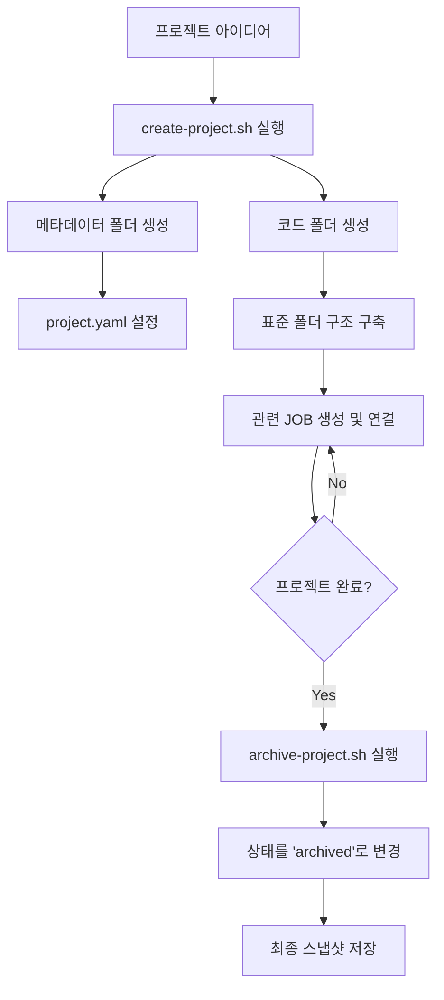

# 개인 프로젝트 생성 및 관리 가이드

💡 **단순한 작업(JOB) 단위를 넘어, 장기적인 목표와 산출물을 관리하는 '프로젝트 시스템'의 구조와 운영 방법을 설명합니다.**

## 🌱 기본 개념
Hermes의 **'프로젝트(Project)'**는 여러 개의 작업(JOB)이 모여 하나의 큰 목표를 이루는 상위 개념입니다.

비유하자면, **JOB이 '오늘 할 일(To-do)'**이라면, **프로젝트는 '이번 달의 목표(Milestone)'**입니다. \"내 집 짓기\"라는 프로젝트 아래에 \"기초 공사(JOB-1)\", \"벽돌 쌓기(JOB-2)\", \"인테리어(JOB-3)\"라는 구체적인 작업들이 연결되는 구조입니다. 이는 마치 회사의 '팀 프로젝트'와 같습니다. 팀원(에이전트)은 개별 태스크를 수행하지만, 모든 태스크는 프로젝트의 '기획서'라는 공통의 목적지를 향해 정렬됩니다. 이를 통해 에이전트는 단기적인 수정뿐만 아니라, 프로젝트 전체의 방향성과 히스토리를 유지하며 작업을 수행할 수 있습니다.

## 🔍 문제 상황: 왜 프로젝트 단위의 관리가 필요한가?
수백 개의 JOB을 처리하다 보면 다음과 같은 관리 한계에 부딪힙니다:

- **맥락 파편화 (Context Fragmentation)**: JOB-101과 JOB-105가 사실 같은 기능을 구현하는 과정이었는데, 두 작업이 서로 다른 폴더에 격리되어 있어 전체 흐름을 한눈에 보기 어려움. 이는 마치 퍼즐 조각은 많지만 전체 그림이 무엇인지 모르는 상태와 같습니다.
- **메타데이터 부재 (Lack of Metadata)**: 이 프로젝트가 언제 시작되었는지, 현재 진행 상태(Active/Paused)는 어떤지, 최종 결과물은 어디에 있는지 일일이 기억해야 함. 프로젝트의 '신분증'과 '건강진단서'가 없는 셈입니다.
- **코드와 기록의 혼재 (Mixed concerns)**: 실제 작동하는 소스 코드와, 그 코드를 짜기 위해 논의했던 기록(Timeline)이 섞여 있어 코드베이스가 지저분해짐. 이는 요리책(레시피)과 실제 완성된 요리가 한 그릇에 담겨 있는 것과 같아 매우 비효율적입니다.

p-hermes는 **'메타데이터(기록)와 코드(실체)의 물리적 분리'** 전략으로 이 문제를 해결합니다.

## 🏗️ 기술 설계: 프로젝트 아키텍처
프로젝트는 관리 효율성을 위해 두 개의 서로 다른 영역으로 나누어 저장됩니다. 이는 '사무실(기록)'과 '공장(실체)'을 분리하는 것과 같은 공학적 설계입니다.

### 1. 메타데이터 영역 (The Record / Management Layer)
**경로**: `~/.hermes/workspace/projects/<slug>/`
이곳에는 프로젝트의 '정체성'과 '역사'만 기록합니다. 에이전트는 작업을 시작하기 전 항상 이 영역을 먼저 읽어 현재 위치를 파악합니다.

- **`project.yaml`**: 프로젝트의 SSOT(Single Source of Truth). 이름, 설명, 상태, 연결된 JOB ID 목록, 태그 등 핵심 명세서입니다. 에이전트는 이 파일의 `status` 필드를 통해 프로젝트의 생명주기를 제어합니다.
- **`timeline.md`**: 프로젝트의 연대기. 어떤 JOB을 통해 어떤 기능이 추가되었고, 어떤 시행착오가 있었는지 날짜별로 기록하여 '결정의 역사'를 보존합니다. 이는 향후 유지보수 시 \"왜 이렇게 짰지?\"라는 질문에 답을 주는 중요한 증거가 됩니다.
- **`README.md`**: 프로젝트의 전체 개요와 사용법. 외부 사용자나 다른 에이전트가 프로젝트를 빠르게 파악하기 위한 진입점입니다.

### 2. 코드 영역 (The Entity / Execution Layer)
**경로**: `~/.shared/code/<slug>/`
이곳에는 실제 작동하는 '물리적 실체'만 저장합니다.

- **`src/`**: 실제 서비스 로직이 담긴 소스 코드.
- **`data/`**: 학습 데이터셋, 모델 가중치, 설정 파일 등.
- **`docs/`**: 프로젝트 내부의 상세 기술 문서 및 API 명세서.
- **`tests/`**: 기능 검증을 위한 테스트 코드 및 스크립트.

**분리하는 이유**: 메타데이터 영역은 Hermes 에이전트의 전용 관리 공간(Private)이며, 코드 영역은 다른 개발 도구(IDE, Git)나 사람이 직접 접근하여 수정하기 편한 표준 구조(Public)를 갖추기 위함입니다. 이를 통해 에이전트의 관리 로직이 코드베이스를 오염시키는 것을 방지합니다.

## 📊 프로젝트 생명주기 흐름도

## 💡 활용 예시: 프로젝트 생성 및 운영
채팅창에 다음과 같이 요청하여 체계적인 프로젝트를 시작해 보세요.

**1. 프로젝트 생성 요청:**
> \"[TASK] 'AI 기반 커널 채팅' 프로젝트를 시작하고 싶어. 슬러그는 `kernel-chat`으로 하고, 목적은 리눅스 커널 로그를 분석해 채팅으로 알려주는 시스템 구축이야. 프로젝트 생성 스크립트를 실행해줘.\"

**2. 작업 연결하기:**
> \"JOB-2001로 `kernel-chat` 프로젝트의 기본 네트워크 통신 모듈을 구현해줘. 이 작업은 `kernel-chat` 프로젝트에 귀속시켜줘.\"
$\rightarrow$ 에이전트는 `project.yaml`의 `job_ids` 리스트에 `JOB-2001`을 추가하여 관계를 형성합니다.

**3. 상태 관리 및 아카이빙:**
> \"이제 `kernel-chat` 프로젝트가 완료되었어. 모든 산출물을 정리하고 상태를 `archived`로 변경해서 아카이브해줘.\"
$\rightarrow$ 에이전트는 `archive-project.sh`를 통해 프로젝트를 공식 종료 처리하고, 최종 결과물을 스냅샷으로 보관합니다.

## 🔗 관련 주제
- **[첫 번째 작업 요청하기](https://pheanor-agent.github.io/p-hermes/docs/wiki/getting-started/first-job.md)**: 프로젝트를 구성하는 기본 단위인 JOB의 생성 방법을 확인하세요.
- **[백업 및 복구 가이드](https://pheanor-agent.github.io/p-hermes/docs/wiki/guides/backup-restore.md)**: 프로젝트 전체를 백업하고 다른 환경으로 이전하는 방법을 알아보세요.
