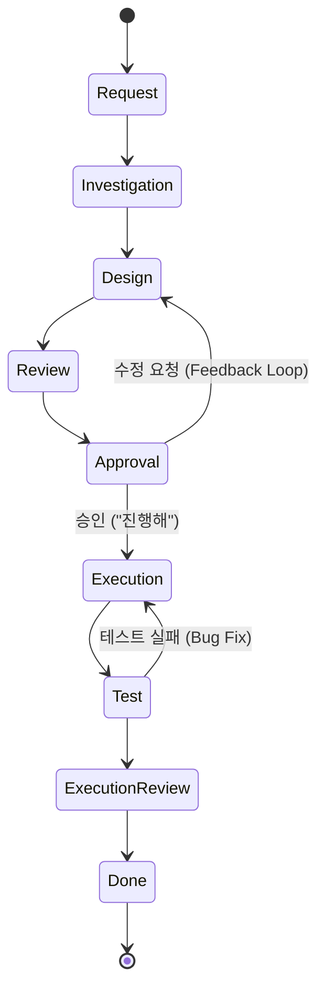
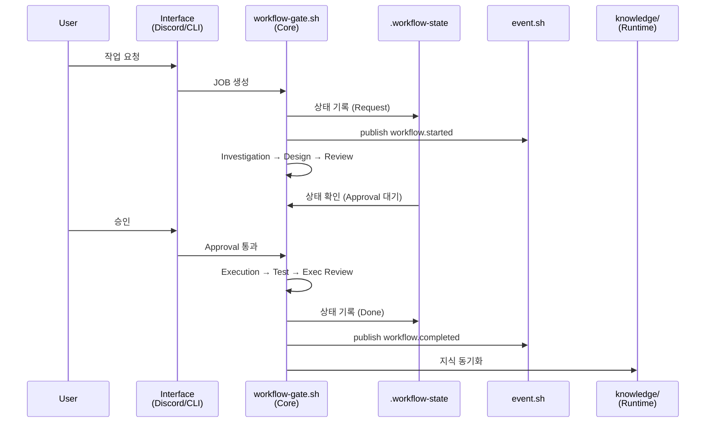

# 작업 요청 및 워크플로우 상세 가이드

💡 **p-hermes의 심장부인 '9단계 상태머신(9-Step Workflow)'의 동작 원리와 사용자의 개입 시점을 상세히 설명합니다.**

## 한 줄 요약

AI 에이전트의 무분별한 실행을 차단하고 단계별 검증을 통해 품질을 보장하는 9단계 상태머신 워크플로우입니다.

## 🌱 기본 개념
에이전트가 요청을 받자마자 코드를 수정하는 것은 매우 위험합니다. 이는 마치 건축가가 설계도 없이 바로 벽돌을 쌓는 것과 같습니다. 갑작스러운 변경은 예상치 못한 시스템 붕괴를 초래할 수 있으며, 복구 비용 또한 막대합니다.

p-hermes는 이를 방지하기 위해 모든 작업을 **'상태 전이 모델(State Transition Model)'**로 관리합니다. 각 단계는 명확한 '입력'과 '출력'이 있으며, 특정 조건을 만족해야만 다음 단계로 넘어갈 수 있는 체크포인트 역할을 합니다. 사용자는 각 설계 단계의 적절성을 판단하는 **'최종 승인권자(Final Approver)'**의 역할을 수행하게 됩니다.

## 🔍 문제 상황: 왜 9단계나 필요한가?
단순한 3단계(요청 → 실행 → 완료) 워크플로우에서 발생하는 치명적인 문제들은 다음과 같습니다:

- **요구사항 오해 (Requirement Misalignment)**: 사용자가 의도한 바를 잘못 이해한 상태로 코드를 수정하여 대규모 롤백이 발생하거나, 엉뚱한 기능을 구현하는 경우입니다.
- **검증 부재 (Lack of Verification)**: 코드가 겉으로는 작동하지만, 기존의 다른 기능을 망가뜨리는 '회귀 버그(Regression Bug)'를 사전에 발견하지 못하는 문제입니다.
- **설명 및 근거 부족 (Lack of Rationale)**: 결과물만 툭 던져주어, 나중에 유지보수할 때 "왜 이런 방식으로 구현했는가?"에 대한 공학적 근거를 알 수 없는 상황입니다.

9단계 워크플로우는 **'조사 → 설계 → 검증 → 실행'**이라는 전문 소프트웨어 공학 프로세스를 AI 에이전트의 행동 양식에 이식하여 이러한 리스크를 체계적으로 제거합니다.

## 🏗️ 기술 설계: 9단계 상태머신 상세
각 단계의 진행 상태는 프로젝트 루트의 `.workflow-state` JSON 파일에 기록됩니다. 에이전트는 매 턴마다 이 파일을 읽어 자신의 현재 위치를 파악하고, 다음 단계로 넘어가기 위해 필요한 'Artifact'가 생성되었는지 확인합니다.

### 1. 분석 및 설계 단계 (The Thinking Phase)
이 단계의 목적은 '정확하게 무엇을 할 것인가'를 정의하는 것입니다.
- **Step 1. Request**: 요청의 모호성을 제거하고 최종 목표(**Definition of Done, DoD**)를 설정합니다.
- **Step 2. Investigation**: `read_file`, `search_files` 등을 사용하여 코드베이스의 현 상태를 파악합니다. 이 과정에서 발견된 의존성, 변수명, 함수 구조 등이 내부 메모리에 수집됩니다.
- **Step 3. Design**: 조사 내용을 바탕으로 `design.md`를 작성합니다. 여기에는 **수정할 파일의 절대 경로, 변경될 구체적인 로직, 예상되는 사이드 이펙트, 테스트 방법**이 포함되어야 합니다.
- **Step 4. Review**: 작성된 `design.md`를 스스로 다시 읽으며 논리적 결함이나 누락된 예외 케이스가 없는지 비판적으로 검토하고 수정합니다.

### 2. 사용자 개입 단계 (The Gate Phase)
- **Step 5. Approval**: **시스템의 가장 핵심적인 안전장치입니다.** 에이전트는 완성된 `design.md`를 사용자에게 제시하며 승인을 요청합니다. 사용자가 **\"진행해\"** 또는 **\"승인\"**이라고 명시적으로 답하기 전까지는 절대 `patch`나 `write_file` 도구를 사용하여 파일을 수정하지 않습니다.

### 3. 실행 및 검증 단계 (The Doing Phase)
- **Step 6. Execution**: 승인된 설계서의 스펙을 1:1로 구현합니다. `patch` 도구를 사용하여 최소 범위의 수정만 진행함으로써 코드 오염을 방지합니다.
- **Step 7. Test**: 설계 단계에서 정의한 테스트 시나리오를 실행합니다. `terminal`을 통해 실제 스크립트를 구동하거나 결과물을 직접 검증합니다.
- **Step 8. Execution Review**: 테스트 결과가 초기 목표(DoD)와 일치하는지 비교합니다. 실패 시 Step 6 또는 Step 3으로 되돌아갑니다.
- **Step 9. Done**: 작업을 최종 종료합니다. 이번 작업에서 얻은 핵심 지식(Lesson Learned)이나 새롭게 정의된 규칙을 위키에 기록하여 시스템의 장기 기억으로 동기화합니다.

## 📊 워크플로우 구조/흐름도

### 상태 전이 흐름

### 시스템 통합 흐름

워크플로우는 시스템 아키텍처의 Core 계층(`workflow-gate.sh`)에서 동작하며, 상태 파일(`.workflow-state`)과 이벤트 버스(`event.sh`)를 통해 Runtime·Interface 계층과 연동합니다.

## 📊 워크플로우 상태 전이도

## 💡 활용 예시: 효율적인 승인(Approval) 방법
`Approval` 단계에서 단순히 \"응\"이라고 하기보다, 설계서를 꼼꼼히 보고 구체적인 피드백을 주면 결과물의 품질이 비약적으로 상승합니다.

**❌ 좋지 않은 예:**
> \"응, 진행해.\" (설계서의 오류를 그대로 방치하여 나중에 수정하는 비용이 발생함)

**✅ 권장되는 예:**
> \"설계서는 전반적으로 좋아. 하지만 `src/utils.py`를 수정할 때, 기존의 `timeout` 전역 변수를 직접 수정하지 말고, 새로운 래퍼 함수를 만들어 주입하는 방식으로 변경해줘. 그렇게 하면 나중에 테스트하기 더 편할 것 같아. 이 점만 반영해서 다시 설계서를 업데이트해주면 바로 승인할게.\"

이렇게 하면 에이전트는 다시 `Design` 단계로 돌아가 설계를 정교화하며, 사용자는 리스크가 완전히 제거된 상태에서 안전하게 실행을 승인할 수 있습니다.

## ❓ 자주 묻는 질문 (FAQ)

**Q: 승인을 거부하면 어떻게 되나요?**
A: 에이전트는 `Review` 단계로 돌아가 피드백을 반영하여 `design.md`를 재작성합니다. 승인 전까지 실제 파일 수정은 절대 이루어지지 않습니다.

**Q: 9단계가 항상 필요한가요?**
A: 단순 작업(예: 파일 1개 복사)은 최소 단계로 진행합니다. 에이전트가 위험도를 판단하여 단계를 조절하지만, 코드 변경이나 시스템 설정 수정은 9단계 완수를 원칙으로 합니다.

**Q: 테스트 실패 시 어떤 단계로 돌아가나요?**
A: `Execution Review`에서 목표 미달 시 `Test` 또는 `Execution` 단계로 복귀합니다. 설계 오류가 발견될 경우 `Design` 단계로 되돌아가 재설계합니다.

---
