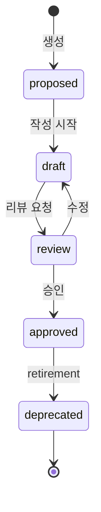
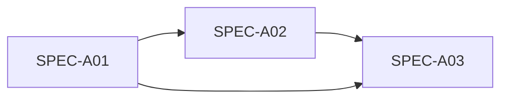
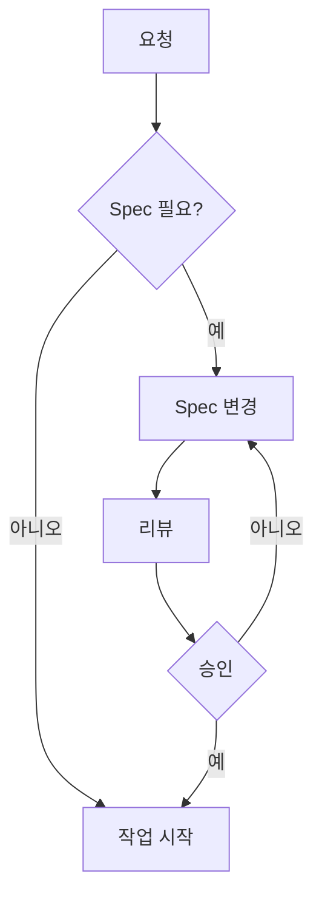

# Spec-Driven Development (명세서 기반 개발)

💡 **코드 작성 전에 명세서를 정의하고, 모든 변경사항이 명세서를 경유하는 워크플로우입니다. AI 에이전트와 인간 개발자가 같은 언어로 소통합니다.**

## 🎯 핵심 개념

Spec-Driven Development는 코드 작성 전에 명세서를 정의하고, 모든 변경사항이 명세서를 경유하는 워크플로우입니다. AI 에이전트와 인간 개발자가 같은 언어로 소통하는 시스템을 구축합니다.

### 핵심 원칙 3가지
1. **Spec이 SSOT**: 모든 코드, 테스트, 문서는 Spec에서 파생
2. **변경은 Spec에서 시작**: 기능 추가, 버그 수정, 리팩토링 모두 Spec 변경으로 시작
3. **자동화된 검증**: Spec 준수 여부를 스크립트로 확인

## 🚀 빠른 시작

### 1. Spec 상태 확인

```bash
# Spec 목록 확인
ls specs/active/
```

### 2. Conformance Score

```bash
# 프로젝트별 검증
bash spec-conformance.sh project-name
```

## ⚙️ Spec 라이프사이클

명세서의 상태 전이입니다.



**상태별 의미**

| 상태 | 의미 | 작업 가능 |
|------|------|-----------|
| proposed | 아이디어 제안 | 작성 시작 |
| draft | 작성 중 | 수정, 검토 |
| review | 리뷰 요청 | 피드백, 승인 |
| approved | 승인 완료 | 코드 작성 |
| deprecated | 퇴역 준비 | 아카이브 |

**상태 전이 규칙**
- **proposed → draft**: 작성자가 시작
- **draft → review**: 작성 완료 시 요청
- **review → approved**: 리뷰어 1명 이상 승인
- **approved → deprecated**: retirement 절차 완료 시

## 🔍 Contract 정의

명세서의 제약 조건을 명시합니다.

```yaml
contract:
  precondition:
    - 시스템 상태 A
    - 입력 데이터 존재
  postcondition:
    - 시스템 상태 B
    - 출력 데이터 생성
  invariant:
    - 항상 참인 조건
```

**Contract의 3가지 구성 요소**

**Precondition (선행 조건)**
- 시스템 상태
- 입력 데이터
- 네트워크 연결

**Postcondition (후행 조건)**
- 시스템 상태 변화
- 출력 데이터 생성
- 로그 기록

**Invariant (불변 조건)**
- 데이터 무결성
- 보안 정책 준수
- 항상 참인 조건

## 📐 Examples 정의

명세서의 실제 사용 예시를 정의합니다.

```yaml
examples:
  - name: 사용 예시 1
    command: 실행 명령어
    expected_output: 기대 결과
  - name: 사용 예시 2
    command: 실행 명령어
    expected_output: 기대 결과
```

**Examples의 역할**
1. **사용자 안내**: 실제 사용법 제공
2. **테스트 케이스**: 자동화 검증 기반
3. **의도 명확화**: 개발자 간 공유 이해

## 📐 Traceability 패턴

Spec, 코드, 테스트 간 추적성을 보장합니다.

```yaml
# Spec 파일
spec_id: SPEC-A01
version: 1.0.0
parent: null
status: approved

# 코드 파일
# SPEC-A01: 기능 구현
def implement_feature():
    pass

# 테스트 파일
# SPEC-A01: 기능 검증
def test_feature():
    assert True
```

**Traceability 검증**

```bash
# Spec ID 코드에서 검색
grep -r "SPEC-A01" src/

# Spec ID 테스트에서 검색
grep -r "SPEC-A01" tests/

# 미참조 Spec 식별
bash spec-matrix.sh traceability
```

## 📐 Conformance Score 계산

4개 항목의 가중 평균으로 계산됩니다.

| 항목 | 가중치 | 설명 |
|------|--------|------|
| Examples | 30% | 실제 사용 예시 정의 |
| Contract | 25% | 제약 조건 정의 |
| Traceability | 25% | 코드/테스트 참조 |
| Tests | 20% | 테스트 자동화 |

**계산 공식**

```python
conformance_score = (
    examples_score * 0.30 +
    contract_score * 0.25 +
    traceability_score * 0.25 +
    tests_score * 0.20
)
```

**Score 해석**

| Score | 의미 | 상태 |
|-------|------|------|
| 90-100 | 매우 우수 | ✅ Production |
| 70-89 | 우수 | ✅ Staging |
| 50-69 | 보통 | ⚠️ Review |
| 0-49 | 부족 | ❌ 수정 필요 |

## 📐 Multi-Spec Dependencies

여러 Spec 간 의존성을 관리합니다.



**의존성 관리**

| 작업 | 의미 |
|------|------|
| 추가 | 부모 Spec에 자식 의존성 등록 |
| 변경 | 자식 Spec에 영향 분석 |
| 삭제 | 부모 Spec에서 의존성 제거 |

**의존성 분석**

```bash
# 의존성 그래프 확인
bash spec-matrix.sh analyze SPEC-A02

# 영향 분석
bash spec-matrix.sh impact SPEC-A01
```

## 📐 Automated Compliance

주기적으로 Spec 준수 여부를 검증합니다.

```bash
# 주기적 검증 Cron Job
hermes cron create \
  --name "spec-compliance" \
  --schedule "0 0 * * *" \
  --prompt "모든 Spec conformance score 확인"
```

**검증 항목**

| 항목 | 방법 |
|------|------|
| Status | Matrix 동기화 확인 |
| Score | Conformance 계산 |
| Traceability | 코드/테스트 참조 확인 |
| Dependencies | 의존성 그래프 검증 |

**검증 결과**

```yaml
# 예시 결과
JOB-1234:
  status: approved
  conformance: 85/100
  traceability:
    code_references: 5
    test_references: 3
  dependencies:
    - SPEC-A01: Cron Job
```

## 📐 워크플로우 연동



**워크플로우 규칙**
1. **Spec 먼저**: 코드 작성 전 Spec 정의
2. **변경은 Spec에서**: 기능 추가/수정 모두 Spec 변경으로 시작
3. **검증**: Conformance Score 확인

## 📐 Troubleshooting

| 증상 | 원인 | 해결 |
|------|------|------|
| Conformance Score 부족 | Examples/Contract 누락 | YAML 형식 추가 |
| Traceability 부족 | 코드/테스트 참조 없음 | 주석에 Spec ID 추가 |
| Status 변경 실패 | 승인 누락 | approval.json 생성 |
| Matrix 동기화 실패 | _matrix.json 누락 | Matrix 스크립트 실행 |

**상세 해결 가이드**

**Conformance Score 부족**
1. Examples 3개 이상 추가
2. Contract 정의 확인
3. Traceability 검증

**Traceability 부족**
1. 코드 주석에 Spec ID 추가
2. 테스트 파일에 Spec ID
3. `grep -r "SPEC-A01"` 확인

**Status 변경 실패**
1. approval.json 생성
2. 리뷰어 승인 확인
3. Matrix 동기화

**Matrix 동기화 실패**
1. `_matrix.json` 확인
2. Matrix 스크립트 실행
3. Status 재검증

## 📐 Best Practices

| 패턴 | 용도 | 예시 |
|------|------|------|
| Spec 먼저 | 설계 단계 | 기능 추가 전 Spec 작성 |
| Traceability | 코드 변경 | 코드 주석에 Spec ID |
| 주기적 검증 | Cron Job | 매일午夜 conformance 확인 |

**Spec 작성 체크리스트**

- [ ] Examples 3개 이상
- [ ] Contract 정의
- [ ] Traceability 매핑
- [ ] Dependencies 확인
- [ ] Conformance Score ≥70

## 📚 관련 문서
- [Spec-Driven Dev 설계](../../blog/posts/spec-driven-dev-design.md)
- [Workflow Pipeline](request-task.md)
