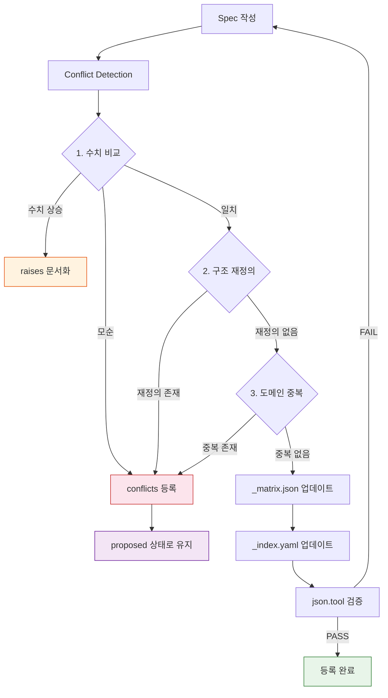
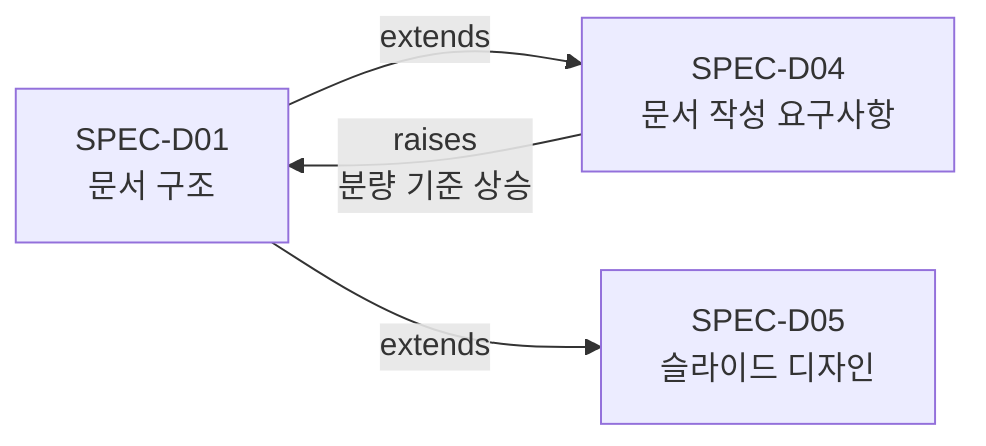
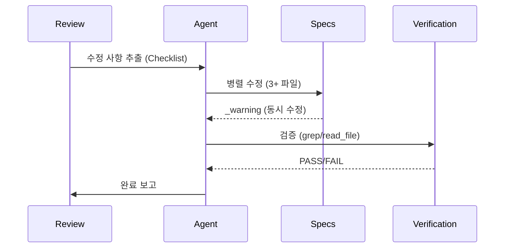

# Spec-Driven Development (명세서 기반 개발)

💡 **명세서가 있는 곳에 협업이 있습니다. 코드 작성 전에 명세서를 정의하고, 모든 변경사항이 명세서를 경유하는 워크플로우입니다.**

## 한 줄 요약

명세서(Spec)를 단일 진실 공급원으로 설정하고, 모든 변경사항이 Spec을 경유하여 추적·검증되는 개발 프로세스입니다.

## 기본 개념

Spec-Driven Development는 AI 에이전트가 자율적으로 작업을 수행할 때 "무엇을 해야 하는가"에 대한 명확한 기준이 필요합니다. 명세서가 없는 상태에서 작업하면 방향이 달라지고 결과물의 일관성이 무너집니다. Spec은 시스템이 요구사항을 정의하는 권위 있는 문서이며, 모든 코드·테스트·문서는 Spec에서 파생됩니다. 변경은 Spec 작성 → 충돌 검증 → 등록의 흐름으로 진행됩니다.

## 문제 상황

여러 AI 에이전트가 동시에 문서를 수정할 때, 서로 다른 기준을 따라 작업하면 명세서 간 충돌이 발생합니다. 예를 들어 부모 Spec이 분량 기준을 1,500자로 정의한 후, 자식 Spec이 이를 3,500자로 상승시키면 수치 불일치가 생깁니다. 또한 폴더 구조나 파일 경로를 재정의하면 다른 Spec이 참조하는 경로가 무효화됩니다. 이러한 충돌을 사전에 발견하지 않으면 승인된 Spec이 시스템과 불일치하는 결과를 초래합니다.

## 기술 설계

Spec 시스템은 다음 구성 요소로 구현됩니다. `specs/active/SPEC-*.md`에 활성 명세서를 저장하고, `specs/_index.yaml`은 인간 판독형 카탈로그를, `specs/_matrix.json`은 기계 판독형 의존성 그래프를 관리합니다. 의존성 타입(`extends`, `raises`, `conflicts`)으로 Spec 간 관계를 정의하며, 신규 Spec 등록 시 3단계 Conflict Detection(수치 비교 → 구조 재정의 → 도메인 중복)을 반드시 실행합니다. `spec-manager.py`가 Spec CRUD와 상태 전환을, `spec-conformance.sh`가 준수도 점수를 자동 계산합니다.

## 구조/흐름도

Spec 생성부터 충돌 검증, 등록까지의 전 과정을 시각화합니다.



## 활용 예시

### 신규 Spec 등록
```bash
# 1. Spec 작성
# specs/active/SPEC-NEW.md 에 명세서 작성

# 2. Conflict Detection 실행
grep -n "분량\|자\|chars" specs/active/SPEC-NEW.md

# 3. 의존성 그래프 업데이트
# specs/_matrix.json 에 의존성 배열 추가

# 4. 카탈로그 업데이트
# specs/_index.yaml 에 항목 추가

# 5. 검증 실행
cat specs/_matrix.json | python3 -m json.tool
```

### Batch Modification (리뷰 기반 병렬 수정)
여러 Spec에 대한 수정 사항이 발견 시, 서브에이전트를 병렬로 위임하여 `patch` 도구로 타겟팅된 수정을 적용합니다. 수정 후 `grep -rn`으로 잔여 참조를 확인합니다.

---

## 🎯 핵심 개념 3가지

1. **Spec이 SSOT**: 모든 코드, 테스트, 문서는 Spec에서 파생
2. **변경은 Spec에서 시작**: 기능 추가, 버그 수정, 리팩토링 모두 Spec 변경으로 시작
3. **자동화된 검증**: Spec 준수 여부를 스크립트로 확인

---

## 📁 핵심 파일 (Core Files)

| 파일 | 역할 |
|------|------|
| `specs/_index.yaml` | 인간 판독형 Spec 카탈로그 (id, title, status, parent, path) |
| `specs/_matrix.json` | 기계 판독형 의존성 그래프 + 충돌 주석 |
| `specs/active/SPEC-*.md` | 활성 사양서 |
| `specs/reviews/*.md` | 리뷰 산출물 (역할 기반 출력) |

---

## 🔗 의존성 타입 (Dependency Types)

`_matrix.json`에서 Spec 간 관계를 3가지 타입으로 정의합니다.

| 타입 | 의미 | 동작 |
|------|------|------|
| `extends` | 부모를 상세화하여 확장 | 별도 동작 불필요 |
| `raises` | 부모의 수치적 기준 상승 (분량, 성능 등) | **승인 시 부모 Spec 업데이트** |
| `conflicts` | 부모와 충돌 | **승인 차단** |

### 의존성 그래프


---

## ⚠️ Conflict Detection (3단계 검증)

새로운 Spec을 등록하기 전에 반드시 3단계 검증을 실행합니다.

### 1. Quantitative Conflicts (수치 비교)

```bash
# 분량/라인 수 비교
grep -n "분량\|자\|chars\|words\|lines" specs/active/SPEC-NEW.md
grep -n "분량\|자\|chars\|words\|lines" specs/active/SPEC-EXISTING.md
```

- **수치 상승** → `raises` 타입 (delta 문서화)
- **모순** → `conflicts` 타입 (승인 차단)

### 2. Structural Conflicts (구조 재정의)

```bash
# 폴더/트랙/경로 재정의 확인
grep -n "트랙\|track\|구조\|hierarchy\|folder\|path" specs/active/SPEC-NEW.md
```

- 부모의 폴더 구조, 트랙 아키텍처 또는 파일 경로 재정의 → `conflicts`

### 3. Domain Overlap (도메인 중복)

동일 도메인의 두 Spec은 명확한 역할을 구분해야 합니다.

- **부모** = 구조/권위 있는 정의
- **자식** = 부분집합에 대한 상세 요구사항/설계

---

## 📋 신규 Spec 등록 체크리스트

| 단계 | 작업 | 도구 |
|------|------|------|
| 1 | Spec 작성 | `specs/active/SPEC-NEW.md` |
| 2 | Conflict Detection | grep 기반 3단계 검증 |
| 3 | `_matrix.json` 업데이트 | 의존성 배열 추가 |
| 4 | `_index.yaml` 업데이트 | 카탈로그 항목 추가 |
| 5 | 충돌 문서화 | `raises` 경우 `note` 필드 추가 |
| 6 | 검증 실행 | `cat specs/_matrix.json \| python3 -m json.tool` |

---

## 🔄 Batch Modification (리뷰 기반 병렬 수정)

리뷰 문서에서 여러 Spec에 대한 수정 사항을 발견 시 병렬로 처리합니다.



### 핵심 규칙
- 각 서브에이전트는 전체 수정 컨텍스트 수신
- `_warning: was modified by sibling subagent`는 예상대로 발생
- `patch` 도구로 타겟팅된 수정, 전체 파일 재작성 금지

### 검증 (반드시)
```bash
# 잔여 참조 확인
grep -rn "old_value" specs/active/SPEC-*.md

# 변경 수 확인
grep -c "new_value" specs/active/SPEC-*.md
```

---

## ⚠️ Pitfalls (10+ 사례)

| # | Pitfall | 교훈 |
|---|---------|------|
| 1 | Markdown 테이블 파이프 개수 오차 | `read_file`에서 `LINE_NUM\|` 접두사 제거 후 파이프 카운트 |
| 2 | 동시 서브에이전트 수정 시 stale `_warning` | 패치 전 `read_file`으로 재확인 |
| 3 | 다중 패치 후 테이블 포맷 손상 | 최종 `read_file`으로 테이블 검증 |
| 4 | Conflict Detection 생략 | 항상 수치 한계값 grep 후 등록 |
| 5 | `_index.yaml` 또는 `_matrix.json` 누락 | 두 파일 모두 업데이트 필수 |
| 6 | `raises`를 `conflicts`로 오인 | raises는 의도적 요구사항 상승 (문서화, 승인 가능) |
| 7 | `conflicts` 타입 Spec 등록 | 충돌 해결 전 `proposed` 상태로 유지 |
| 8 | 부모 Spec이 `proposed` 상태 | 부모 `approved` 후 자식 승인 |
| 9 | `spec-conformance.sh` Line 106/108 grep multiline 버그 | `grep -rl` 사용 또는 `tr -d '\n'` 적용 |
| 10 | Spec 파일명 vs 실제 파일명 불일치 (JOB-1678) | `ls docs/*/` 실제 목록과 SPEC 파일명 테이블 대조 |
| 11 | 슬라이드 인덱스 파일 형식 (JOB-1678) | `index.md`가 아닌 `index.html` 사용 (다크 테마 통일) |

---

## 🛠️ 스크립트

| 스크립트 | 역할 |
|----------|------|
| `spec-manager.py` | Spec CRUD, 상태 전환, 의존성 관리 |
| `spec-conformance.sh` | Spec 준수도 점수 계산 (70점 이상 목표) |

---

## 📚 관련 링크

- [SPEC-D01: 문서 구조 (SSOT)](../../../specs/active/SPEC-D01.md)
- [SPEC-D02: GitHub Pages 자동 배포](../../../specs/active/SPEC-D02.md)
- [Design Blog: Spec-Driven Dev 설계 철학](../../blog/posts/spec-driven-dev-design.md)
- [Slides: Spec-Driven Dev](../../playground/decks/archive/spec-driven-dev.html)

---

_Spec-Driven Development는 모든 변경사항이 명세서를 경유하여 AI 에이전트와 인간 개발자가 같은 언어로 소통하는 시스템을 구축합니다._
